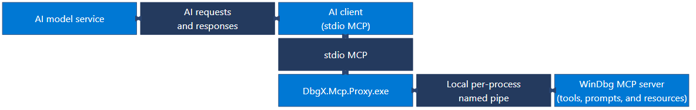

# WinDbg MCP overview

This article helps you understand how WinDbg MCP works and decide whether to use it based on client support and security and privacy considerations. WinDbg MCP uses the Model Context Protocol (MCP) to connect a supported AI client to an active WinDbg session, where the client can use debugger tools and context during analysis.

You can use this connection to investigate a debugging target while reviewing AI-initiated debugger actions in WinDbg. AI-generated findings aren't authoritative. Validate findings, evidence, assumptions, target state, and commands against the output in WinDbg.

## How WinDbg MCP works

WinDbg MCP uses a local proxy between an AI client and the MCP server in WinDbg. The connection has the following architecture:

The diagram uses a compact stepped layout to show the bidirectional connections. The AI model service and AI client exchange AI requests and responses. The AI client and `DbgX.Mcp.Proxy.exe` communicate over stdio MCP. `DbgX.Mcp.Proxy.exe` and the WinDbg MCP server communicate over a local per-process named pipe. The WinDbg MCP server provides tools, prompts, and resources.

Each WinDbg session uses a local, per-process named pipe. `DbgX.Mcp.Proxy.exe` communicates with the AI client over standard input and output and connects the client to one selected WinDbg session.

The AI client can send debugging context to its configured model service as part of AI requests and responses. You remain in control of the debugging session, and you can review AI-initiated debugger actions in WinDbg.

## Client support and session limits

WinDbg MCP supports these AI clients:

- Visual Studio Code with GitHub Copilot
- GitHub Copilot CLI

Other MCP-compatible AI clients might work through custom configuration on a best-effort basis, but WinDbg doesn't officially support them. Use a custom client only after you confirm that its MCP capabilities and security controls meet your organization's requirements.

Only one active MCP client can connect to a WinDbg session at a time. Separate WinDbg sessions use separate local named pipes. In restricted environments, organizational policy can hide or disable the MCP controls.

## WinDbg MCP tools and prompts

WinDbg MCP provides connection tools, debugger tools, and built-in prompts. The **Install MCP** action in WinDbg registers WinDbg as an MCP server with the selected AI client. After the proxy connects to a WinDbg session, the AI client selects the appropriate tools automatically.

Use the following connection tools to find and select a WinDbg session:

| Connection tool | Purpose |
|---|---|
| `list_sessions` | Lists WinDbg sessions with active MCP services and reports whether each session is available. |
| `connect_session` | Connects the proxy to a WinDbg session by process ID. |
| `disconnect_session` | Disconnects the proxy from the current WinDbg session. |

After connection, ask the AI client to use WinDbg MCP to:

- Inspect or control the debugging target.
- Run WinDbg commands.
- Review diagnostics and source code.
- Visualize debugger data.
- Create analysis scripts.

### Use built-in WinDbg MCP prompts

If the AI client supports MCP prompts, select a built-in prompt to start a guided debugging workflow.

| Built-in prompt | Purpose |
|---|---|
| `investigate_symbol_loading_issues` | Diagnose symbol-loading problems. |
| `write_extension` | Create a WinDbg JavaScript extension. |
| `create_graph` | Visualize debugger data as a graph. |
| `configure_ttd` | Configure a Time Travel Debugging workflow. |

## Use WinDbg MCP for debugging

The following prompts provide starting points for supported debugging scenarios:

| Scenario | Example prompt |
|---|---|
| Find the root cause of a crash dump | "Analyze this dump and provide the likely root cause, supporting evidence, and remaining assumptions." |
| Investigate a live target | "Check the target state, break if needed, and inspect the call stack and modules for fault signals." |
| Fix symbol or source loading | "Use logs and command history to identify why symbols or source aren't loading correctly and suggest a fix." |
| Analyze a Time Travel Debugging trace | "Analyze this TTD trace and identify key transitions, evidence, and a likely divergence point." |
| Visualize debugger query results | "Query and visualize this debugger data model output as a tree, grid, or graph." |
| Automate repeatable analysis | "Create and validate a script that automates this analysis workflow." |

Compare the AI client's results with the target state and visible debugger output before you act on them.

## WinDbg MCP security and privacy considerations

Before you use WinDbg MCP, assess the target, its data, the selected AI client, and the configured model service. Apply all of the following guidance:

- **Authorized use:** Use WinDbg MCP only with targets and data that you have permission to inspect. Follow your organization's AI, security, privacy, and data-handling policies.
- **Data sent to AI services:** The AI client can send debugger context to its configured model service. Confirm that your organization approves the target and its data for use with both the selected client and model service.
- **Diagnostic logs:** MCP diagnostic logs can contain debugger commands and target data. Store, share, and retain these logs as sensitive data according to your organization's policies.
- **AI validation:** Treat AI output as a proposal for investigation rather than a definitive result. Validate the output against information visible in WinDbg before you act on it.
- **Administrator controls:** Organizations can disable WinDbg MCP by enabling [WinDbg restricted mode](windbg-restricted-mode-preview.md). Administrators configure restricted mode by setting `EnableRestrictedMode` to `1`. Restart WinDbg after you change this setting. Restricted mode affects other WinDbg features in addition to MCP.

### Secure mode

Secure mode restricts debugger functionality to reduce the risk of loading or executing untrusted code, launching processes, or performing unsafe file operations. It blocks high-risk commands such as `.shell`. By default, secure mode activates when the MCP server starts.

To configure whether the MCP server enables secure mode by default, in WinDbg, select **File** > **Settings** > **MCP service settings**, and then select or clear **Enable Secure Mode for MCP Server**.

The secure-mode behavior depends on whether you select the setting and whether you start the MCP service before or after you connect to a target:

- **Full secure mode:** Start the MCP service before you connect to a target, and leave **Enable secure mode when the MCP server starts** selected.
- **Partial secure mode:** If you already connected to a target when you start the MCP service, WinDbg enters partial secure mode and shows a warning. To get full secure mode, restart WinDbg, start the MCP service, and then connect to the target.
- **Without secure mode:** In the confirmation dialog, clear **Enable secure mode when the MCP server starts**, and then select **Yes** to confirm the selection.

Clearing or selecting the checkbox in the confirmation dialog also updates **File** > **Settings** > **MCP service settings** > **Enable Secure Mode for MCP Server**. The dialog selection therefore becomes the default for future MCP startups.

After secure mode activates, you can't turn it off, and it remains active until you restart WinDbg. Stopping the MCP service doesn't disable it. After you restart WinDbg, clear **Enable secure mode when the MCP server starts** if you want to use MCP without secure mode.

For more information, see [Features of secure mode](/windows-hardware/drivers/debugger/features-of-secure-mode).

> [!WARNING]
> Without secure mode, commands that the AI client runs directly are still restricted, but indirect actions aren't. For example, if the AI client sets a breakpoint that runs a command, that command runs with your full permissions when the breakpoint is hit.

Disabling cross-prompt injection protection doesn't disable secure mode.

### Use scripts and extensions securely

WinDbg MCP can help you create or modify debugging scripts and WinDbg JavaScript extensions. These recommendations apply to all scripts and extensions, whether they're AI-generated, developed by your team, or provided by a third-party vendor. Treat generated or modified code like code from any other untrusted source. Review and approve it before you load or run it, especially when you debug customer environments or sensitive targets.

Before you use any script or extension, apply these recommendations:

1. **Review the code:** Review the code when the source is available. Otherwise, verify the publisher, digital signature, download source, version, dependencies, and documented behavior.
1. **Understand the trust boundary:** WinDbg extensions can run code in the debugger process and access debugging data. Secure mode restricts certain operations, but it doesn't validate, sandbox, or establish trust in an extension.
1. **Test safely:** Test with non-sensitive targets in an isolated environment. Include malformed or unexpected debugger data, failure handling, and resource usage in your testing.
1. **Use least privilege:** Run WinDbg without administrator privileges unless the debugging scenario requires elevation.
1. **Protect customer data:** Confirm that the code doesn't disclose memory, source code, symbols, file paths, diagnostic output, or other sensitive data to unapproved locations.
1. **Control deployment:** Use only extensions from approved sources. For managed or production environments, use reviewed, signed, version-pinned packages delivered through an approved deployment channel. Review and test every update before deployment.

Don't disable secure mode solely to load or run a script or extension. If an extension requires you to disable secure mode, review its behavior, understand which restrictions the change removes, and get approval from your organization's security reviewers. For more information, see [Secure mode](#secure-mode).

### Cross-prompt injection protection

WinDbg classifies certain operations as protected. For a protected operation, WinDbg uses the AI client's configured model service to classify the operation's debugger output for cross-prompt injection attacks (XPIA). WinDbg blocks output that the classification identifies as potentially unsafe.

XPIA protection depends on MCP sampling. The AI client must support and permit MCP sampling so that WinDbg can request classification from the configured model service. If classification can't run, the protected operation fails without returning output.

The **Enable Cross Prompt Injection Mitigation** setting controls XPIA protection. Disable this protection only in a trusted environment, for targets that your organization approves, after your organization's security reviewers approve the decision and other controls address the prompt-injection risk.

## Provide feedback about WinDbg MCP

Your feedback helps Microsoft improve WinDbg MCP and prioritize fixes and features. To report a bug or suggest a feature, create an issue in the [WinDbg Feedback repository](https://github.com/microsoft/WinDbg-Feedback/issues).

## Next steps

- [Set up WinDbg MCP](set-up-windbg-mcp.md#install-and-enable-windbg-mcp)
- [Troubleshoot WinDbg MCP setup and connection issues](troubleshoot-windbg-mcp-setup-connection-issues.md)
