# What is WinDbg?

WinDbg is the latest version of WinDbg with more modern visuals, faster windows, a full-fledged scripting experience, built with the extensible debugger data model front and center.

> [!NOTE]
> Formerly released as *WinDbg Preview* in the Microsoft Store, *WinDbg* leverages the same underlying engine as *WinDbg (Classic)* and supports all the same commands, extensions, and workflows.

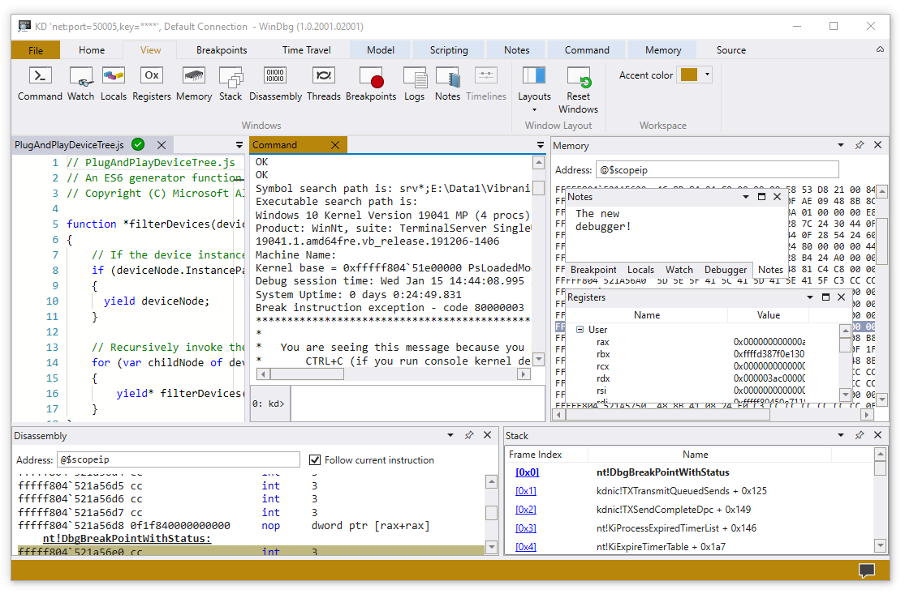

## General features

- **Connection setup and recall** - Recent targets and session configurations are saved. They can be quickly restarted from the file menu.

    

- **Dark theme** - Go to File > Settings to enable the dark theme.

    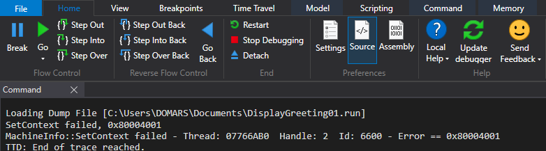

- **Keyboard navigation** - Use Ctrl+Tab to easily navigate between windows with just your keyboard.

    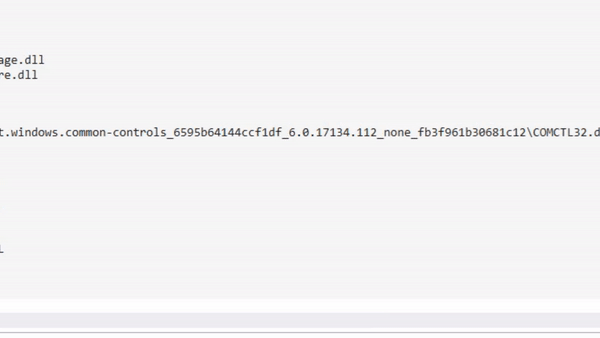

- **Dump file processor detection** - Autodetects processor architecture for easier managed debugging.

- **Performance improvements** - Tool windows load asynchronously and can be canceled. When you run a command, WinDbg can stop the loading of your locals, watch, or other windows.

## Start debugging view

- **Integrated Time Travel Debugging (TTD)** - Use the "Record with Time Travel Debugging" checkbox when launching or attaching to a process. WinDbg will set up TTD, start recording, and open the trace afterwards.

    For more information, see [Time Travel Debugging - Overview](time-travel-debugging-overview.md).

    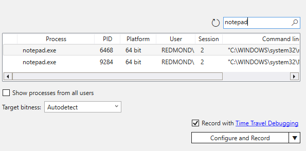

- **Launch App packages** - Debug your universal app or background task in a single click.

    For more information, see [Launch App Package](./windbg-user-mode-preview.md#launch-app-package).

    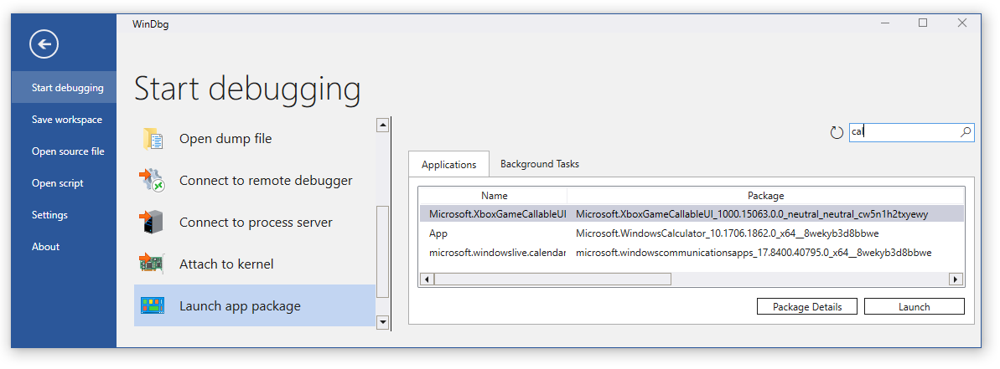

- **Attach to a process** - The new attach view provides a detailed view of running processes, easier configuration, and search support.

    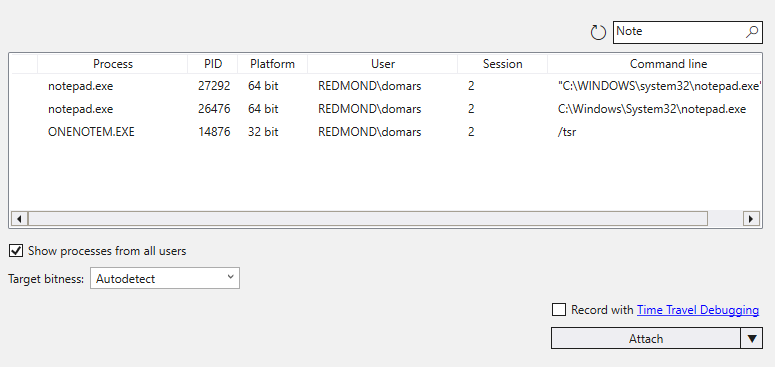

## Improved tool windows

- **Command** - The command window has improved DML support, text highlighting, search (including Regex).

    

- **Source** - The source code window provides syntax highlighting and other general improvements similar to most modern text editors.

    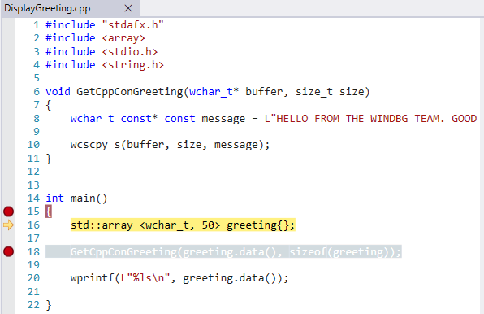

- **Disassembly** - The disassembly window is also improved, the highlight of the current instruction remains where it's when you scroll.

    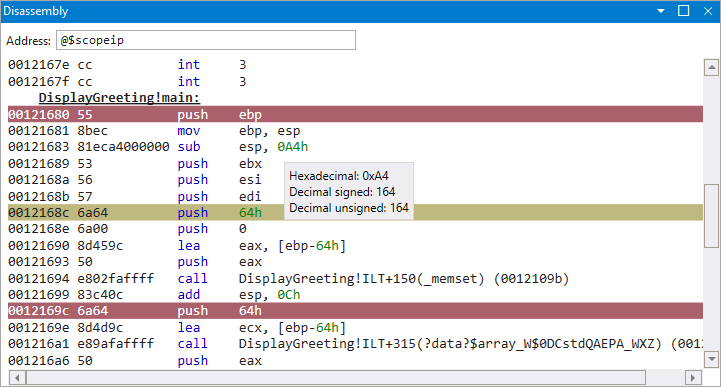

- **Breakpoints** - The breakpoints window shows all your current breakpoints, a one-click toggle, and a hit count.

    For more information, see [Breakpoints](windbg-breakpoints-preview.md).

    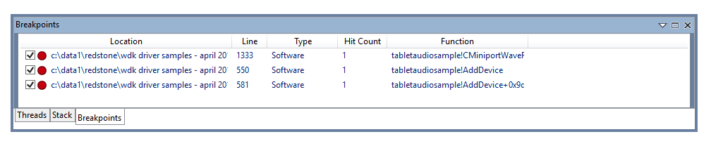

- **Scripting** - The new scripting window makes developing JavaScript and NatVis extensions easier, with error highlighting and IntelliSense.

    For more information, see [WinDbg - Scripting](windbg-scripting-preview.md).

    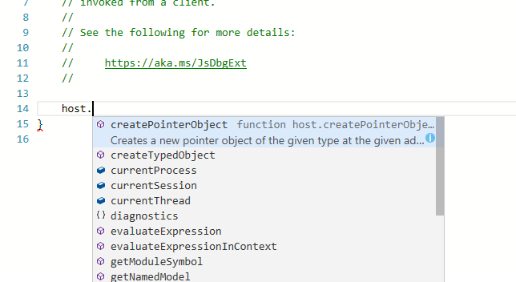

- **Data model** - The model window provides an expandable and browsable version of `dx` and `dx -g`, letting you create powerful tables on-top of your NatVis, JavaScript, and LINQ queries.

    For more information, see [WinDbg - Data model](windbg-data-model-preview.md).

    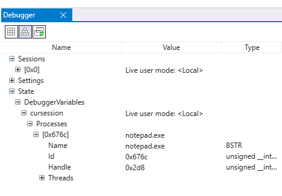

- **Locals and watch** - The locals and watch windows are both based off the data model that is used by the `dx` command. This means they benefit from the same features as other data model windows.

- **Memory** - The memory window has highlighting and improved scrolling.

- **Logs** - This is an under the covers log of the WinDbg internals. It can be viewed for troubleshooting or to monitor long running commands.

## Providing feedback

Your feedback helps our team guide WinDbg's development and prioritize features.

To report any bugs or suggest a new feature, you can follow the feedback button in the ribbon to go to the [GitHub page](https://aka.ms/windbg/feedback) where you can file a new issue.

## Other resources

- For information on what's new in the most recent release, see [Release notes](windbg-release-notes.md).

- Review these topics to install and configure WinDbg:
  - [WinDbg – Command line startup options](windbg-command-line-preview.md)
  - [WinDbg – Settings and workspaces](windbg-setup-preview.md)
  - [WinDbg – Keyboard shortcuts](windbg-keyboard-shortcuts-preview.md)

- These topics describe how to get connected to the environment that you want to debug:
  - [WinDbg – Start a user-mode session](windbg-user-mode-preview.md)
  - [WinDbg – Start a kernel mode session](windbg-kernel-mode-preview.md)

- Watch these episodes of the [Defrag Tools](</shows/defrag-tools/>) show to see WinDbg in action:
  - [Defrag Tools #182](/shows/defrag-tools/182-windbg-preview-part-1) - Tim, Chad, and Andy go over the basics of WinDbg and some of the features.
  - [Defrag Tools #183](/shows/defrag-tools/183-windbg-preview-part-2) - Nick, Tim, and Chad use WinDbg and go over a quick demo.
  - [Defrag Tools #184](/shows/defrag-tools/184-javascript-in-windbg-preview) - Bill and Andrew walk-through the scripting features in WinDbg.
  - [Defrag Tools #185](/shows/defrag-tools/185-time-travel-debugging-introduction) - James and Ivette provide and introduction to Time Travel Debugging.
  - [Defrag Tools #186](/shows/defrag-tools/186-time-travel-debugging-advanced) - James and JCAB covers advanced Time Travel Debugging.

- Additional tips and tricks can be found in the [WinDbg blog archive](/archive/blogs/windbg/).
