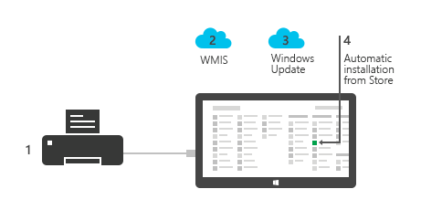

# Automatic installation for Windows Store device apps

In Windows 8.1, device manufacturers can configure their Windows Store device apps to automatically install when the user connects their device to the PC. This topic describes how automatic installation works and how the app, metadata, and drivers can be updated and uninstalled. For more info about device apps, see [Meet Windows Store device apps](meet-windows-store-device-apps.md).

**Note**  It's important to consider that the automatic installation feature does not provide a notification to the user when the app is installed. Some users may find this experience confusing and frustrating, and give your app a bad rating.

 

Automatic installation is enabled when you specify your device app's package details in the **Windows Store device app** portion of the **App Info** page of the **Device Metadata Authoring Wizard**. For more info, see [Step 2: Create device metadata](step-2--create-device-metadata.md).

## Acquisition overview

A Windows Store device app can be acquired by the user in one of three ways:

-   **Automatic installation**: The app is automatically acquired and installed the first time a peripheral device is connected to the PC. This is the most common way a Windows Store device app is installed.
-   **Manual install**: The user finds an app in the Windows Store and installs it from there. This is typically how app updates and other Windows Store apps are installed.
-   **OEM preinstall**: An app for a PC internal device or system component can be preinstalled by an OEM as part of a new PC. For more info, see [Preinstall Apps Using DISM](http://go.microsoft.com/fwlink/p/?LinkId=325524).

**Note**  Windows Store device apps for PC internal devices are not eligible for automatic installation. They can only be acquired through manual install and OEM preinstall.

 

## Requirements

In order for automatic installation to work, the user needs to:

-   Opt in to the **Recommended Settings** during Windows installation.

-   Be signed in to the Windows Store.

-   Be online.

This allows Windows to automatically acquire the metadata, app, and drivers (if needed). If no Internet connection is available, the automatic installation will happen at a later time, when it can access the Internet.

## How automatic installation works

There are four stages to automatic installation:

1.  **Device is connected**: When the device is plugged in or paired with the PC, Windows requests the device metadata from Windows Metadata and Internet Services (WMIS) and, if needed, the device drivers from Windows Update.

2.  **Device metadata is downloaded**: Windows downloads the device metadata from WMIS and parses it to identify the app that's associated with the device. This triggers the download of the app.

3.  **Device drivers are downloaded**: If drivers are needed, Windows downloads them from Windows Update and automatically installs them.

4.  **Device app is installed**: Windows downloads the app and installs it to the **All Apps** screen of the currently logged-in user.

If there's an error during any of these steps, the user will see an error message on the **Devices** page of the **Settings** app.

### If there is no Internet connection

If the PC isn't connected to the Internet or is on a metered connection, Windows will wait to perform the automatic installation. The next time the PC has an unrestricted Internet connection, Windows will automatically try again. The installation is performed silently in the background, without interruption to the user.

### If the user is not logged into the Windows Store

If the user isn't logged in to the Windows Store with a Microsoft account, Windows will wait to perform the automatic installation. The next time the user logs in to the Windows Store with a Microsoft account, Windows will automatically try again. The installation is performed silently in the background, without interruption to the user.

## Updating device drivers

Driver updates are distributed through Windows Update as optional updates, as long as the user has opted in to receiving updates from Windows Update. Driver updates aren't automatically distributed to devices if the user has completed device setup and already has metadata and drivers installed.

Driver updates aren't coupled to app updates, so driver updates should be designed to ensure compatibility with existing apps. If a driver update is distributed through Windows Update, or if the user manually reinstalls or updates the driver, the app should handle this appropriately. If your app uses a custom driver, be sure to maintain compatibility and functional contracts. For more info, see [Windows Store device apps for internal devices](windows-store-device-apps-for-specialized-devices.md).

## Updating device metadata

The metadata that’s distributed by WMIS can be updated to point to a new or different Windows Store device app. About 8 to 15 days after the submission of updated metadata that indicates a new app, new devices that are connected and set up for the first time will get the new app. But a new app indicated in updated metadata isn't automatically distributed to PCs for which the device setup is already complete, because the users have previously received device metadata for the device.

The Windows Store device app is automatically downloaded only once, when the device is initially set up. If the device metadata is updated to point to a different app, the old app should advertise the new one to the user, so that users can acquire it from the Windows Store manually. Eventually, the old app should be removed from the Windows Store. Users can also get to the new app by going to the **Devices** page on the **Settings** app and clicking the **Get app** link for that device.

**Special note for adding privileged access**: If newer metadata grants a Windows Store device app privileged access to a device (when access did not exist before), submit your metadata at least 20 days before you submit your app. The new metadata will be available to new users 8-15 days after it is submitted. Then, publish the app update to the Windows Store. When the user gets the app update, assuming that the user updated any required driver, the app will have privileged access to the device.

## Updating device apps

Windows Store device app updates are manually triggered by users, just like any other Windows Store app updates. The Windows Store shows all available app updates to the user. The user manually chooses to update the app. You should design apps to be compatible with older metadata and drivers. The device metadata or driver might not be up-to-date with the app, since manual installation of a Windows Store device app from the Windows Store doesn’t automatically trigger distribution of metadata or drivers.

## Uninstalling device software

The device driver and device metadata are uninstalled independently of the Windows Store device app. When a user uninstalls a device, only the driver and metadata are automatically uninstalled as part of the device uninstall.

The Windows Store device app must be manually uninstalled by the user. When that's done, the device driver and device metadata are not automatically uninstalled.

 

 

[Send comments about this topic to Microsoft](mailto:wsddocfb@microsoft.com?subject=Documentation%20feedback%20[devapps\devapps]:%20Automatic%20installation%20for%20Windows%20Store%20device%20apps%20%20RELEASE:%20%281/20/2017%29&body=%0A%0APRIVACY%20STATEMENT%0A%0AWe%20use%20your%20feedback%20to%20improve%20the%20documentation.%20We%20don't%20use%20your%20email%20address%20for%20any%20other%20purpose,%20and%20we'll%20remove%20your%20email%20address%20from%20our%20system%20after%20the%20issue%20that%20you're%20reporting%20is%20fixed.%20While%20we're%20working%20to%20fix%20this%20issue,%20we%20might%20send%20you%20an%20email%20message%20to%20ask%20for%20more%20info.%20Later,%20we%20might%20also%20send%20you%20an%20email%20message%20to%20let%20you%20know%20that%20we've%20addressed%20your%20feedback.%0A%0AFor%20more%20info%20about%20Microsoft's%20privacy%20policy,%20see%20http://privacy.microsoft.com/default.aspx. "Send comments about this topic to Microsoft")

