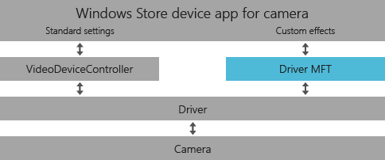
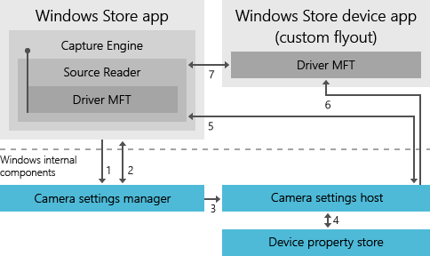

# Creating a camera driver MFT for a UWP device app

> [!IMPORTANT]
> This topic has been deprecated. See the [Device MFT design guide](https://docs.microsoft.com/windows-hardware/drivers/stream/dmft-design) for updated guidance.

UWP device apps let device manufacturers apply custom settings and special effects on the camera's video stream with a camera driver MFT (media foundation transform). This topic introduces driver MFTs and uses the [Driver MFT](http://go.microsoft.com/fwlink/p/?LinkID=251566) sample to show how to create one. To learn more about UWP device apps in general, see [Meet UWP device apps](meet-uwp-device-apps.md).

## The driver MFT

This section describes the Media Foundation Transform (MFT) that you create to apply effects to the media capture stream coming from the camera. This is how you provide transforms for color effects, scheme modes, and face-tracking effects that really distinguish your camera from others. This MFT, known as the driver MFT, is first applied to the connected video stream coming from the camera driver when a UWP app begins video capture. When that app invokes the **Camera options** UI, Windows automatically provides access to any interfaces the driver MFT implements for controlling its custom effects.



A Driver MFT is not required for a UWP device app. A device manufacturer may choose to implement a UWP device app without a driver MFT, simply to provide a differentiated user interface containing branding for their hardware, without applying custom settings and special effects to the video stream.

### How a driver MFT is used

The UWP device app for a camera runs in a different process than the Microsoft Store app that invokes it from the [CameraCaptureUI](http://go.microsoft.com/fwlink/p/?LinkId=317985) API. For the Microsoft Store device app to control a driver MFT, a specific sequence of events across different process spaces must occur.

1. A UWP app wants to capture a photo, so it calls the [CaptureFileAsync](http://go.microsoft.com/fwlink/p/?LinkId=317986) method
2. Windows requests the driver MFT pointer and the camera's device ID
3. The driver MFT pointer is passed to a settings host
4. The host queries device properties for the app ID of the Microsoft Store device app associated with the camera (per device metadata)
5. If no UWP device app is found, the default flyout interacts with the capture engine
6. If a UWP device app is found, it is activated and the settings host passes the driver MFT pointer to it
7. The UWP device app controls the driver MFT using the interface exposed through the pointer



### AvStream driver model requirement

Your camera’s driver must use the AvStream driver model. For more info about the AVStream driver model, see [AVStream Minidrivers Design Guide](http://go.microsoft.com/fwlink/p/?LinkID=228585).

### How the driver MFT is exposed to apps

A driver MFT is registered with Windows as a COM interface so that the transform it implements can be applied to the media stream coming out of a specific device, such as a camera.

**Note**  A driver MFT shouldn’t be registered using the `MFTRegister` function because it is device specific and not a general purpose MFT. For info on the registry key, see the [Installing and registering the driver MFT](#installing) section later in this topic.

When an app initiates a video capture, a Media Foundation Source Reader is instantiated to provide the video stream. This media source reads a registry value from the device registry key. If the CLSID of the driver MFT’s COM class is found in the registry value, the source reader instantiates the driver MFT and inserts it into the media pipeline.

In addition to UWP device apps, the driver MFT functionality can be accessed when the device associated with it is used to capture video using the following APIs:

- HTML5 &lt;video&gt; tags in a UWP app using HTML. Transforms that the driver MFT has enabled will affect video that is being played using the &lt;video&gt; element, as in the following code example:

    ```cpp
    var video = document.getElementById('myvideo');
        video.src = URL.createObjectURL(fileItem);
        video.play();
    ```

- Windows.Media.MediaCapture API in a UWP app using the Windows Runtime. For more info on how this API is used, see the [Media Capture](http://go.microsoft.com/fwlink/p/?LinkId=243997) sample.

- Media Foundation’s Source Reader, for apps processing media data. The driver MFT will be exposed to applications as the first (0th) MFT when calling `IMFSourceReaderEx::GetTransformForStream`. The category that will be returned is `MFT_CATEGORY_VIDEO_EFFECT`.

    

### Multi-pin cameras

If you have a three-pin or other multi-pin camera, see [Considerations for driver MFTs on multi-pin cameras](driver-mfts-on-multi-pin-cameras.md).

## Driver MFT implementation

This section provides information on implementing your driver MFT. For a full example of a driver MFT that works together with a UWP device app, see the [Driver MFT](http://go.microsoft.com/fwlink/p/?LinkID=251566) sample.

### Development tools

Microsoft Visual Studio Professional or Microsoft Visual Studio Ultimate is required.

### Driver MFT characteristics

The driver MFT is instantiated per stream. For each stream the camera supports, an instance of the MFT is instantiated and connected to it. The driver MFT is expected to have a single input stream and a single output stream. The driver MFT may be either a synchronous MFT or an asynchronous MFT.

### Communication between the camera and the driver MFT

To enable two-way communication between the media source and the driver MFT, the pointer to source stream’s attribute store is set on the input stream attribute store of the driver MFT as `MFT_CONNECTED_STREAM_ATTRIBUTE`. This occurs through a handshake process you enable by exposing `MFT_ENUM_HARDWARE_URL_Attribute` in the driver MFT, as in the following example:

```cpp
HRESULT CDriverMft::GetAttributes(IMFAttributes** ppAttributes)
{
    HRESULT hr = S_OK;
    if (NULL == ppAttributes)
    {
       return E_POINTER; 
    };
        if(!m_pGlobalAttributes) {
           MFCreateAttributes(&m_pGlobalAttributes, 1);
           m_pGlobalAttributes-> 
             SetString(MFT_ENUM_HARDWARE_URL_Attribute, L"driverMFT");
        }
        *ppAttributes = m_pGlobalAttributes;
        (*ppAttributes)->AddRef();
        return S_OK;
}
```

In this example, the `MFT_CONNECTED_STREAM_ATTRIBUTE` in the driver MFT’s attribute store is set to point to the device source stream’s attribute store. See [Hardware Handshake Sequence](http://go.microsoft.com/fwlink/p/?LinkId=320139) for further details on how communication between the camera and the MFT is set up.

### How to access device source information

The following code example shows how the driver MFT can get the pointer to the source transform from its input attribute store. The driver MFT can then use the source pointer to get device source info.

```cpp
if(!m_pSourceTransform && m_pInputAttributes) {

          m_pInputAttributes->
              GetUnknown( MFT_CONNECTED_STREAM_ATTRIBUTE,
              IID_PPV_ARGS(&pSourceAttributes));
          pSourceAttributes-> 
              GetUnknown(
              MF_DEVICESTREAM_EXTENSION_PLUGIN_CONNECTION_POINT,            
              IID_PPV_ARGS(&pUnk)));
          pUnk->QueryInterface(__uuidof(IMFTransform), 
              (void**)&m_pSourceTransform));
      }
      if (m_pSourceTransform) {
         // Put code to get device source information here.         
      }
```

### How to implement passthrough mode

To put the driver MFT in passthrough mode, specify the same media type for the input and output stream. `ProcessInput` and `ProcessOutput` calls on the MFT will still be made. It is left up to your driver MFT implementation to determine whether or not any processing occurs in passthrough mode.

### Header files to include

You’ll need to include header files for the `IInspectable` and `IMFTransform` methods that the driver MFT must implement. For a list of header files to include, see **stdafx.h** in the **SampleMFT0** directory of the [UWP device app for camera](http://go.microsoft.com/fwlink/p/?LinkID=227865) sample.

```cpp
// required for IInspectable
#include <inspectable.h>
```

### How to implement IInspectable

A driver MFT that’s intended for use from a camera’s UWP device app must implement the methods of `IInspectable` so that the Microsoft Store device app can access a pointer to the driver MFT when launched. Your driver MFT should implement the methods of `IInspectable` as follows:

- **IInspectable::GetIids** should return null in the *iids* out parameter, and return 0 in the *iidCount* out parameter.

- **IInspectable::GetRuntimeClassName** should return null in the out parameter.

- **IInspectable::GetRuntiGetTrustLevel** should return `TrustLevel::BaseTrust` in the out parameter.

The following code example shows how the `IInspectable` methods are implemented in the sample driver MFT. This code can be found in the **Mft0.cpp** file, in the **SampleMFT0** directory of the sample.

```cpp
// Mft0.cpp
STDMETHODIMP CMft0::GetIids( 
    /* [out] */ __RPC__out ULONG *iidCount,
    /* [size_is][size_is][out] */ __RPC__deref_out_ecount_full_opt(*iidCount) IID **iids)
{
    HRESULT hr = S_OK;
    do {
        CHK_NULL_PTR_BRK(iidCount);
        CHK_NULL_PTR_BRK(iids);
        *iids = NULL;
        *iidCount = 0;
    } while (FALSE);

    return hr;
}

STDMETHODIMP CMft0::GetRuntimeClassName( 
    /* [out] */ __RPC__deref_out_opt HSTRING *className)
{
    HRESULT hr = S_OK;
    do {
        CHK_NULL_PTR_BRK(className);
        *className = NULL;
    } while (FALSE);

    return hr;
}

STDMETHODIMP CMft0::GetTrustLevel( 
    /* [out] */ __RPC__out TrustLevel *trustLevel)
{
    HRESULT hr = S_OK;
    do {
        CHK_NULL_PTR_BRK(trustLevel);
        *trustLevel = TrustLevel::BaseTrust;
    } while (FALSE);

    return hr;
}
```

### COM implementation

Each interface your driver MFT implements should implement and derive from `IUnknown`, in order to be correctly marshaled to the camera’s UWP device app. The following is an example **.idl** file for a driver MFT that demonstrates this.

```cpp
// SampleMft0.idl : IDL source for SampleMft0
//

// This file will be processed by the MIDL tool to
// produce the type library (SampleMft0.tlb) and marshalling code.

import "oaidl.idl";
import "ocidl.idl";
import "Inspectable.idl";
import "mftransform.idl";
[
    object,
    uuid(F5208B72-A37A-457E-A309-AE3060780E21),
    oleautomation,
    nonextensible,
    pointer_default(unique)
]
interface IMft0 : IUnknown{
    [id(1)] HRESULT UpdateDsp([in] UINT32 uiPercentOfScreen);
    [id(2)] HRESULT Enable(void);
    [id(3)] HRESULT Disable(void);
    [id(4)] HRESULT GetDspSetting([out] UINT* puiPercentOfScreen, [out] BOOL* pIsEnabled);
};
[
    uuid(DE05674A-C564-4C0E-9B7C-E1519F7AA767),
    version(1.0),
]
library SampleMft0Lib
{
    importlib("stdole2.tlb");
    [
        uuid(7BB640D9-33A4-4759-B290-F41A31DCF848)      
    ]
    coclass Mft0
    {
        [default] interface IMft0;
        interface IInspectable;
        interface IMFTransform;
    };
};
```

**Note**  The driver MFT is a regular COM class that can be created using `CoCreateInstance`. You should not use the `MFTRegister` function to register it because it is not a general-purpose MFT.

### Creating a proxy

The driver MFT is an out-of-process server. To use it in a UWP device app, you must provide marshaling support in a proxy so that your driver MFT interface can be used across process boundaries. You can find an example of this in the [Driver MFT](http://go.microsoft.com/fwlink/p/?LinkID=251566) sample. The sample uses the MIDL compiler to generate a stubless proxy.

### Exposing the driver MFT to apps

To write a UWP device app in C# or JavaScript that interacts with a driver MFT, you need to create an additional component in the Microsoft Store device app’s Microsoft Visual Studio project. This component is a wrapper that exposes the driver MFT interfaces in a Windows Runtime Component that is visible to the Microsoft Store device app.

The Wrapper subproject in the [UWP device app for camera](http://go.microsoft.com/fwlink/p/?LinkID=227865) sample provides an example of how to expose your driver MFT to the Windows Runtime so that you can use it from a UWP device app implemented in C# or JavaScript. It is designed to work together with the [Driver MFT](http://go.microsoft.com/fwlink/p/?LinkID=251566) sample. See the [Driver MFT](http://go.microsoft.com/fwlink/p/?LinkID=251566) sample page for a step-by-step guide to installing, running, and testing the samples.

## Installing and registering the driver MFT

This section lists steps for installing the driver MFT:

1. The driver MFT DLL must be installed in a subdirectory in the following location:
    - %SystemDrive%\\Program Files\\
2. Your camera installer registers the driver MFT by calling **regsvr32** on your driver MFT DLL, or by providing a driver manifest (.man) file for the DLL that the installer uses for registration.
3. Set the `CameraPostProcessingPluginCLSID` value in the registry key for your camera. Your INF file should specify the CLSID of the Driver MFT in the device class registry key for the device, by setting the `CameraPostProcessingPluginCLSID` value to the CLSID GUID of the driver MFT class. The following is an example from an INF file entry that populates the registry keys for a camera:

    ```cpp
    KSCATEGORY_VIDEO_CAMERA:

    [HKEY_LOCAL_MACHINE\SYSTEM\CurrentControlSet\Control\DeviceClasses\{E5323777-F976-4f5b-9B55-B94699C46E44}\##?#USB#VID_045E&PID_075D&MI_00#8&23C3DB65&0&0000#{E5323777-F976-4f5b-9B55-B94699C46E44}\#GLOBAL\Device Parameters]
    "CLSID"="{17CCA71B-ECD7-11D0-B908-00A0C9223196}"
    "FriendlyName"="USB Video Device"
    "RTCFlags"=dword:00000010
    "CameraPostProcessingPluginCLSID"="{3456A71B-ECD7-11D0-B908-00A0C9223196}" 


KSCATEGORY_CAPTURE:

[HKEY_LOCAL_MACHINE\SYSTEM\CurrentControlSet\Control\DeviceClasses\{ 65E8773D-8F56-11D0-A3B9-00A0C9223196}\##?#USB#VID_045E&PID_075D&MI_00#8&23C3DB65&0&0000#{65E8773D-8F56-11D0-A3B9-00A0C9223196}\#GLOBAL\Device Parameters]
"CLSID"="{17CCA71B-ECD7-11D0-B908-00A0C9223196}"
"FriendlyName"="USB Video Device"
"RTCFlags"=dword:00000010
"CameraPostProcessingPluginCLSID"="{3456A71B-ECD7-11D0-B908-00A0C9223196}"
```

**Note**  `KSCATEGORY_VIDEO_CAMERA` is recommended for cameras. You will normally only need one of the registry keys, depending on how the device is registered.


## Associate your app with the camera

This section contains information on steps required to identify your camera in device metadata and in the Windows registry. This metadata enables you to pair your UWP device app and identifies your app so that it can be downloaded seamlessly the first time the camera is connected.

### Updates

After the first installation of the app, if the user downloads an updated version of the app, then the updates are automatically integrated into the camera capture experience. However, updates are not downloaded automatically. The user must download additional app updates from the Microsoft Store, because the app is [automatically installed](auto-install-for-uwp-device-apps.md) only on first connect. The main page of your UWP device app can provide notifications that updates are available and provide links to download updates.

**Important**  Your updated app should work with any updated drivers distributed through Windows Update.

### Multiple cameras

Multiple camera models can declare the same UWP device app in their device metadata. If a system has more than one internally embedded camera, the cameras must share the same UWP device app. The app includes logic for determining which camera is in use and can show different UI for each camera in its **More options** experience. For more info about customizing that experience, see [How to customize camera options](how-to-customize-camera-options.md).

### Internal cameras

UWP device apps for internal cameras are eligible for [Automatic installation](auto-install-for-uwp-device-apps.md) from the Microsoft Store, but it is recommended that they be pre-installed for the most seamless user experience. There are additional steps required to support internal cameras and associate a UWP device app with them. For more info, see [Identifying the location of internal cameras](identifying-the-location-of-internal-cameras.md).

### Creating the device metadata package

For both internal and external cameras, you need to create a device metadata package. When you submit your camera’s UWP device app to the Microsoft Store (or preinstall it using the OPK, in the case of internal cameras), in addition to the app itself, you’ll need to provide metadata containing the following:

- Application publisher name
- Application package name
- Application element identifier
- Device experience identifier

For more info about how to use device metadata to associate your app with your device, see [Building UWP device apps](the-workflow.md).

## Related topics

[Building UWP device apps](the-workflow.md)

[Automatic installation for UWP device apps](auto-install-for-uwp-device-apps.md)

[Hardware Handshake Sequence (Hardware MFTs)](http://go.microsoft.com/fwlink/p/?LinkId=320139)

[AVStream Minidrivers Design Guide](http://go.microsoft.com/fwlink/p/?LinkID=228585)

[UWP device app for camera sample](http://go.microsoft.com/fwlink/p/?LinkID=227865)

[Driver MFT sample](http://go.microsoft.com/fwlink/p/?LinkID=251566)


