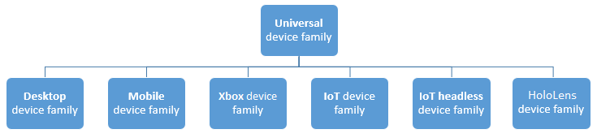
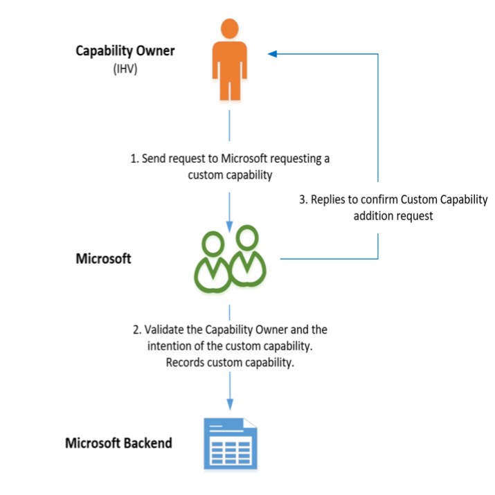

# Custom Capabilities 

Custom capabilities are a new capability class introduced to allow
developers to make better use of the UWP. They are similar to the
previously defined [restricted
capabilities](https://docs.microsoft.com/en-us/windows/uwp/packaging/app-capability-declarations#special-and-restricted-capabilities)
which give access to protected resources. However, there are some key
differences between the two. Unlike restricted resources, 3^rd^ party
partners can define or claim their own capabilities. Custom capabilities
also do not have to be built into Windows at compilation time. They are
different from previous [app
capabilities](https://docs.microsoft.com/en-us/windows/uwp/packaging/app-capability-declarations)
as they do not use the same authorization model and instead, app
authorization to use the capability verifies during the app installation
instead of when uploaded to the store.

For a developer to get access to a custom capability, they must have a
signed custom capability descriptor (SCCD) which allows the authorized
use of one or more custom capabilities. For more information on SCCD’s,
read the section on SCCD’s [here.](#signed-custom-capability-descriptors)

## UWP Apps Getting Access to System Software with Custom Capabilities


A [Universal Windows Platform
(UWP)](https://msdn.microsoft.com/50a5605e-3a91-41db-800a-9180717c1e86)
application can utilize Custom Capabilities to gain access to system
software.

There is a similar function in [Windows Store device apps
(WSDA)](https://msdn.microsoft.com/en-us/windows/hardware/drivers/devapps/index)
which were first introduced in Windows 8 to provide a way for to provide
hardware support services (HSS) for certain devices and peripherals.
However, they do not provide support for all services that HSS typically
need to communicate with, such as Win32 services, device-specific
registry values, and 3rd party APIs. WSDA’s are only available for the
Desktop device family and does not take advantage of the common app
platform offered by the UWP which targets the Universal device family.



*Learn more about device families*
[here](https://docs.microsoft.com/en-us/windows/uwp/get-started/universal-application-platform-guide#device-families)*.*

Unlike a WSDA, a UWP can install on a system for all its users either as
part of the imaging process of the OS when a new device or peripheral is
connected, or manually by the user.

A UWP Developer can deliver on-the-fly updates and new experiences
independent of driver updates. UWP servicing is handled through the
existing app servicing mechanisms and workflows for apps in the Windows
Store. Upon publishing an update, users will receive the update
immediately if an internet connection is available.

## Signed Custom Capability Descriptors

A signed custom capability descriptor (SCCD) contains the name of the
capability or capabilities the SCCD is authorizing, a list of Authorized
Entities that are authorized to use the Custom Capability, and the
catalog containing the signature of the SCCD file itself. An authorized
entity identifies an app by its Package Family Name and the Certificate
Signature Hash of the certificate that signs the app. The hash must be
SHA256 and match the hash of the signing certificate. The hash must
match the hash of the signing certificate. Below is an example of an
SCCD with the Catalog truncated.

**Note:** If the app isn't signed directly with
that certificate it's fine if the certificate specified lies somewhere
in the cert chain that signs the app.
```xml
<?xml version="1.0" encoding="utf-8"?>
<CustomCapabilityDescriptor xmlns="http://schemas.microsoft.com/appx/2016/sccd" xmlns:s="http://schemas.microsoft.com/appx/2016/sccd">
<CustomCapabilities>
    <CustomCapability Name="microsoft.hsaTestCustomCapability_q536wpkpf5cy2"></CustomCapability>
</CustomCapabilities>
<AuthorizedEntities>
    <AuthorizedEntity AppPackageFamilyName="MicrosoftHSATest.Microsoft.SDKSamples.Hsa.CPP_q536wpkpf5cy2" CertificateSignatureHash="ca9fc964db7e0c2938778f4559946833e7a8cfde0f3eaa07650766d4764e86c4"></AuthorizedEntity>
</AuthorizedEntities>
<Catalog>…</Catalog>
</CustomCapabilityDescriptor>
```


## Claiming a Custom Capability


The ability for a UWP to use custom capabilities is currently only
available to known, trusted hardware vendors. Apps should only talk to
the drivers, or software installed with a driver package, for which the
driver author has access granted.

For a capability owner to claim a custom capability, they must do the
following steps:

1.  Send a request to Microsoft Hardware Support Apps Review
    (<HSAReview@microsoft.com>) requesting a custom capability. The
    request should include the following information:
    -   Contact information for the PM

    -   Contact information for the developer

    -   The Company Name

    -   The name of the capability (The name of the capability must be
        unique and have some associated with the organization of the
        party that is claiming the capability)

    -   What resources does capability need to access?

    -   Any security or privacy concerns that drive the introduction of
        this capability

    -   Does your capability provide access to data that has privacy
        concerns?

    -   Include the Windows Store App Publisher ID. You can get this by
        creating a skeleton app entry on the Windows Store page. This
        [MSDN
        article](https://msdn.microsoft.com/en-us/windows/uwp/publish/create-your-app-by-reserving-a-name)
        walks you through the process of reserving your App PFN on the
        store page

Microsoft then validates the Capability Owner and the intention of the
custom capability.

Reply to confirm Custom capability addition request.

Once approved, the custom capability a unique custom capability string
name in the format **CompanyName.capabilityName\_PublisherID** is
recorded and emailed back to the Capability Owner



*Claiming a Custom Capability*

## Authoring and Signing an SCCD as a Capability Owner

After being given the information from an app developer from a request
for access to a custom capability, it is up to the Capability Owner
whether the app developer should get granted this Capability. A
Capability owner must make sure that the certificate hash provided by
app developer can be trusted.


*Getting an SCCD signed*

After the Capability owner completes the SCCD, it is sent to Microsoft
for signing and returned signed to the Capability Owner. The Capability
Owner then sends it back to the app developer.

### Limiting an SCCD’s scope

It is also possible for the owner of a Custom capability to create a
scoped SCCD; for example, a Capability owner may not have completely
vetted an App Developer but would still like to let a developer develop
an UWP. To create such an SCCD, the Custom capability owner can limit
the scope of use of the SCCD by putting *“DeveloperModeOnly”* in the
SCCD file before getting it signed by Microsoft.  A scoped SCCD will
ONLY work on devices in Developer Mode.
```xml
<xs:complexType name="CT_CustomCapabilityDescriptor">
    <xs:sequence>
    <xs:element ref="CustomCapabilities" minOccurs="1" maxOccurs="1"/>
    <xs:element ref="AuthorizedEntities" minOccurs="1" maxOccurs="1"/>
    <xs:element ref="DeveloperModeOnly" minOccurs="0" maxOccurs="1"/>
    <xs:element ref="Catalog" minOccurs="1" maxOccurs="1"/>
    <xs:any minOccurs="0"/>
    </xs:sequence>
</xs:complexType>

<xs:element name="DeveloperModeOnly">
    <xs:complexType>
    <xs:attribute name="Value" type="xs:boolean" use="required"/>
    </xs:complexType>
</xs:element>
```

