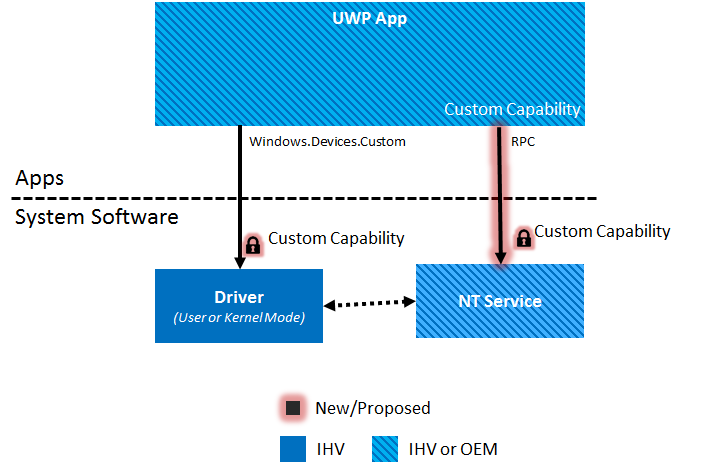
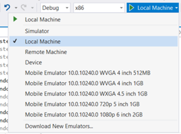

# Developing a Universal Windows Platform app with Custom Capabilities

## Configure Machine

Before you can begin creating an UWP app, you need to install the latest
version of Visual Studio and create an UWP app project. If you
haven't done that yet, you can [download the tools
here](http://go.microsoft.com/fwlink/p/?LinkId=302196). To get started
with Microsoft Visual Studio, see[ Develop Windows Store apps using
Visual Studio](https://developer.microsoft.com/en-us/windows/apps/develop).

### Create a Windows Store account

A developer account on the Windows Store is required. Hardware partners
will need a Windows Store account that will be different from their
Hardware partner account. You’ll need the publisher name when you author
the app manifest and the device metadata in later steps. You can also
reserve a name for your app once you've created a store profile.

To create a Windows Store account, go to the [Windows Store apps sign up
page](http://go.microsoft.com/fwlink/p/?LinkId=302197) and click Sign up
now. For more information on how to Create a Windows Store developer
account, see [Opening a developer
account](https://docs.microsoft.com/windows/uwp/publish/opening-a-developer-account).

## Contacting the Custom Capability Owner

For an App Developer to develop UWP Apps with Custom Capabilities, they
must request access to a Custom Capability from a Capability Owner. The
request should have the following:

-   App PFN (Package Family Name) acquired from the Windows Store
-   The name of the Custom Capability
-   Signature Hash of the app signing cert which can be generated from
    your .cer file using certutil.exe. The certificate must be SHA-256.

To generate the Signature Hash run:
```bat
C:\Windows\System32\certutil.exe -dump CertificateName.cer
```
Look for the signature hash near the bottom and ensure it’s SHA256. If
it’s not, you’ll need to use a SHA256 cert to sign your app. It should
look something like the following example hash below.
```
Signature Hash:
ca9fc964db7e0c2938778f4559946833e7a8cfde0f3eaa07650766d4764e86c4
```
The Capability owner reviews the app developer request and chooses to
either approve the request or not. Once approved, the Capability Owner
generates a [Signed Custom Capability Descriptor](custom-capabilities-for-universal-windows-platform-apps.md#signed-custom-capability-descriptors) with the provided
information and signs it; it is returned to the app developer once
properly signed.

## Writing an SCCD as Developer

An app developer can continue developing their apps with Custom
capabilities in "developer mode" while waiting for the Capability owner
to approve their request. Ignore the following in the SCCD on a desktop
PC in developer mode:

-   Catalog entry in the SCCD. This is set to FFFF.

    ```xml
    <Catalog>FFFF</Catalog>
    ```
-   Certificate Signature Hash in the authorized entity entry in the SCCD. While it is
    neither enforced nor validated, please put a 64-char sequence.

    ```xml
    <AuthorizedEntity AppPackageFamilyName="MicrosoftHSATest.Microsoft.SDKSamples.Hsa.CPP_q536wpkpf5cy2" CertificateSignatureHash="ca9fc964db7e0c2938778f4559946833e7a8cfde0f3eaa07650766d4764e86c4"></AuthorizedEntity>
    ```

## Granting Custom Capability Access to System Software

Currently, there are two types of system software that you can grant
access to a UWP app with Custom Capabilities: [RPC (Remote Procedure Call)](https://msdn.microsoft.com/en-us/library/windows/desktop/aa378651) Endpoints (from within an NT
Service) and Drivers.



*Custom Capability Architecture Diagram*

### Granting Custom Capability access to an RPC Endpoint

When an UWP declares a Custom Capability in its app manifest, it will at
a later point contain the SID [Security Identifier](https://msdn.microsoft.com/en-us/library/windows/desktop/aa379571) form of the Custom Capability in its
process token at runtime. By default, a RPC endpoint doesn't allow UWP’s
(AppContainer processes) to connect to them. A UWP app must have the appropriate Custom
capabilities for access. The following steps are taken to do so:

1.  Convert the Custom Capability name to a SID

2.  Create a Security Descriptor to the SID of the Custom Capability along
with all other needed SID's. For more information on creating a Security
Descriptor follow the example [here](https://msdn.microsoft.com/en-us/library/windows/desktop/aa446595(v=vs.85).aspx).

3.  Create an RPC endpoint with the information from the Security Descriptor above.

### Granting Custom Capability Access to a Driver 

To allow a UWP app to communicate with a custom driver, you must use
**Windows.Devices.Custom**. You’ll need to have the Driver itself (or
driver INF file) set the property
**DEVPKEY\_DeviceInterface\_UnrestrictedAppCapabilities** of type
*DEVPKEY\_STRING\_LIST* on the Device Interface to grant your custom
capability access. In this property, you can specify one or more custom
capabilities.

There are two methods for granting Custom Capability access to a driver
either via INF or with just the driver code as seen below.

<span style="font-variant:small-caps;">*INF Method*</span>
```
[WDMPNPB003_Device.NT.Interfaces] 
AddInterface= {B0823231-61F1-4685-85CA-8DF9DDDEBF6E},,AddInterfaceSection 
 
[AddInterfaceSection] 
AddProperty= AddInterfaceSection.AddProps 
 
[AddInterfaceSection.AddProps] 
; DEVPKEY_DeviceInterface_UnrestrictedAppCapabilities 
{026e516e-b814-414b-83cd-856d6fef4822}, 8, 0x2012,, “CompanyName.myCustomCapabilityNameTBD_YourStorePubId”
```
<span style="font-variant:small-caps;">*Driver Method*</span>
```c++
WDF_DEVICE_INTERFACE_PROPERTY_DATA PropertyData = {}; 
WCHAR customCapabilities[] = L”CompanyName.yourCustomCapabilityNameTBD_YourStorePubId\0”; 
 
WDF_DEVICE_INTERFACE_PROPERTY_DATA_INIT( 
   &PropertyData, 
   &m_VendorDefinedSubType, 
   &DEVPKEY_DeviceInterface_UnrestrictedAppCapabilities); 
 
Status = WdfDeviceAssignInterfaceProperty( 
    m_FxDevice, 
    &PropertyData, 
    DEVPROP_TYPE_STRING_LIST, 
    ARRAYSIZE(customCapabilities), 
    reinterpret_cast<PVOID>(customCapabilities)); 

```

## Adding a Custom Capability to App Package Manifest

Capabilities must be declared in your Universal Windows Platform (UWP)
app's [package
manifest](https://msdn.microsoft.com/library/windows/apps/BR211474) to
access APIs or resources protected with capabilities. An app package
manifest is an XML document that contains information needed by the
system to deploy, display, and update a UWP. Inside an app package
manifest, an app must contain information such as package identity,
dependencies, required capabilities, visual elements, and extensibility
points. Every app package must include one package manifest.

The app developer must modify the app package manifest to include a
capabilities attribute that declares the Custom Capabilities similarly to below.
```xml
<Capabilities>
	<uap4:CustomCapability Name=”CompanyName.customCapabilityName_Publisher ID” />
</Capabilities>

```
Afterward, the App developer includes the SCCD file from the previous
steps into the appx package. The Signed Custom Capability Descriptor
(SCCD) is a signed XML file that goes in the package root of the appx
package. It has the file extension of ".sccd." They can do this by copying the SCCD file to the root of an app project folder. Once
located in the root, go through Visual Studio’s solution explorer,
right-click on “project-&gt; Add -&gt; Existing Item…” to add the SCCD
to your project; you may also use the shortcut (Shift + Alt + A).


*Adding an SCCD file into the appx package*

Now you can create your appx package using your preferred method. If
using VS, right-click the project, select Store, then Create App
Packages. At installation time, every capability declared in an app
manifest is checked if it also is defined the SCCD by the Operating
System.

## Deploying and debugging UWPs

Microsoft Visual Studio allows you to deploy and debug your apps on a
variety of Windows 10 devices.

You can enable a device for development, or just for sideloading.
*Windows Store apps* are the default setting. If you aren't development
apps or using special internal apps issued by your company, keep this
setting active.

-   *Developer mode* lets you sideload apps, and run apps from Visual
    Studio in debug mode.

-   *Sideloading* is installing and then running or testing an app that
    has not been certified by the Windows Store. For example, an app
    that is internal to your company only.

By default, you can only install Universal Windows Platform (UWP) apps
from the Windows Store. Changing these settings to use developer
features can change the level of security of your device. You should not
install apps from unverified sources.

### Picking a deployment target

To pick a target, go to the debug target drop-down next to the **Start
Debugging** button and choose which target to deploy your app to. After
the target is selected, select **Start Debugging (F5)** to deploy and
debug on that target, or select **Ctrl+F5** to just deploy to that
target.



**Note**: At the current time there is no support
for UWP’s with Custom Capabilities on mobile platforms.

### Sideload an UWP with Custom Capabilities

Typically, companies or schools that need to install custom apps on
managed devices without going through the Windows Store use the Sideload
apps setting. In this case, it's common for the organization to enforce
a policy that disables the *Windows Store apps* setting, as shown
previously in the image of the settings page. The organization also
provides the required certificate and install location to sideload apps.
For more info, see the TechNet articles [Sideload apps in Windows
10](https://technet.microsoft.com/library/mt269549.aspx) and [Get
started with app deployment in Microsoft
Intune](https://technet.microsoft.com/library/dn646955.aspx).

UWP Users will be able to side-load and install a properly signed UWP
onto on a system if it passes the Trust Model check at install time.
