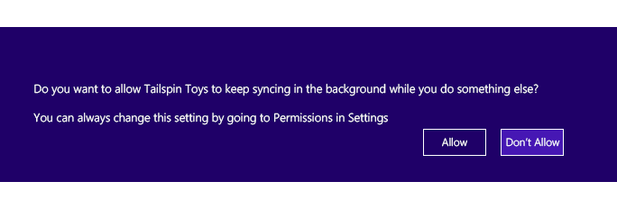
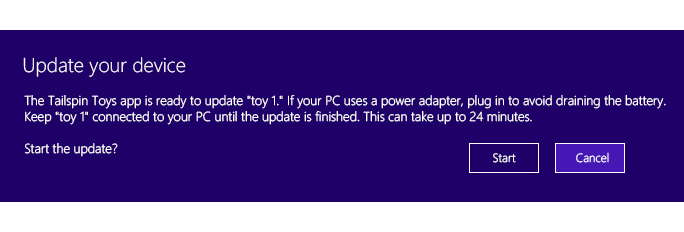

# Device sync and update for Store device apps in Windows 8.1

In Windows 8.1, your UWP app can use a device background task to synchronize data on your peripheral device. If your app is associated with device metadata, that UWP device app can also use a device background agent to perform device updates, such as firmware updates. Device background agents are subject to policies that ensure user consent and help preserve battery life while devices are being synced and updated.

To perform device sync and update operations, create a device background task that uses the [DeviceUseTrigger](/uwp/api/Windows.ApplicationModel.Background.DeviceUseTrigger) and [DeviceServicingTrigger](/uwp/api/Windows.ApplicationModel.Background.DeviceServicingTrigger), respectively. To learn how this is done with the [Custom USB device sample](https://github.com/Microsoft/Windows-universal-samples/tree/main/Samples/CustomUsbDeviceAccess), see [Creating a device background task](how-to-create-a-device-background-task.md).

> [!NOTE]
> Windows Runtime device APIs don't require device metadata. That means your app doesn't need to be a UWP device app to use them. UWP apps can use these APIs to access USB, Human Interface Devices (HID), Bluetooth devices, and more. For more info, see [Integrating devices](/previous-versions/windows/apps/dn263141(v=win.10)).

## Device background task overview

When users move your UWP app off-screen, Windows suspends your app in-memory. This lets another app have the foreground. When an app is suspended, it is resident in-memory and Windows has stopped it from running. When this happens, without the help of a device background task, any ongoing device operations like syncing and updating will be interrupted. Windows 8.1 provides two new background task triggers that let your app perform long running sync and update operations on your peripheral device safely in the background, even if your app is suspended: DeviceUseTrigger and DeviceServicingTrigger. For more info about app suspension, see [Launching, resuming, and multitasking](/previous-versions/windows/apps/hh770837(v=win.10)).

| Background task trigger | Requires device metadata | Description |
|--|--|--|
| [DeviceUseTrigger](/uwp/api/Windows.ApplicationModel.Background.DeviceUseTrigger) | No | Enables long running sync operations to or from your peripheral device while your app is suspended. Syncing your device in the background requires that your user has approved background syncing by your app. Your device must also be connected to or paired with the PC, with active I/O, and is allowed a maximum of 10 minutes of background activity. More detail on policy enforcement is described later in this topic. |
| [DeviceServicingTrigger](/uwp/api/Windows.ApplicationModel.Background.DeviceServicingTrigger) | Yes | nables long running device updates, for example settings transfers or firmware updates, while your app is suspended. Updating your device in the background requires user approval each time the background task is used. Unlike the DeviceUseTrigger background task, the DeviceServicingTrigger background task allows for device reboot and disconnect and allows a maximum of 30 minutes of background activity. More detail on policy enforcement is described later in this topic. |

DeviceServicingTrigger requires device metadata because the app must be specified as a privileged app in order to perform device update operations.

### App privilege

Some critical device operations, such as long running device updates, can be performed only by a privileged app. A *privileged app* is the app that the device manufacturer has authorized to perform those operations. The device metadata specifies which app, if any, has been designated as the privileged app for a device.

When creating your device metadata with the device metadata wizard, specify your app on the **Specify UWP device app information** page. For more info, see [Step 2: Create device metadata for your UWP device app](step-2--create-device-metadata.md).

## Supported protocols

Device background tasks that use DeviceUseTrigger and DeviceServicingTrigger let your app communicate with peripheral devices over protocols that aren't supported by the system-triggered tasks typically used by UWP apps.

| Protocol | DeviceServicingTrigger | DeviceUseTrigger | System triggers |
|--|--|--|--|
| USB |  |  |  |
| HID |  |  |  |
| Bluetooth RFCOMM |  |  |  |
| Bluetooth GATT |  |  |  |
| MTP |  |  |  |
| Network wired |  |  |  |
| Network Wi-Fi |  |  |  |
| IDeviceIOControl |  |  |  |

## Registering background tasks in the app package manifest

Your app will perform sync and update operations in code that runs as part of a background task. This code is embedded in a Windows Runtime class that implements IBackgroundTask (or in a dedicated JavaScript page for JavaScript apps). To use a device background task, your app must declare it in the app manifest file of a foreground app, like it does for system-triggered background tasks.

In this example of an app package manifest file, **DeviceLibrary.SyncContent** and **DeviceLibrary.UpdateFirmware** are entry points from the foreground app. **DeviceLibrary.SyncContent** is the entry point for the background task that uses the [DeviceUseTrigger](/uwp/api/Windows.ApplicationModel.Background.DeviceUseTrigger). **DeviceLibrary.UpdateFirmware** is the entry point for the background task that uses the [DeviceServicingTrigger](/uwp/api/Windows.ApplicationModel.Background.DeviceServicingTrigger).

```xml
<Extensions>
  <Extension Category="windows.backgroundTasks" EntryPoint="DeviceLibrary.SyncContent">
    <BackgroundTasks>
      <m2:Task Type="deviceUse" /> 
    </BackgroundTasks>
  </Extension>
  <Extension Category="windows.backgroundTasks" EntryPoint="DeviceLibrary.UpdateFirmware">
    <BackgroundTasks>
      <m2:Task Type="deviceServicing" /> 
    </BackgroundTasks>
  </Extension>
</Extensions>
```

## Using your device with device background tasks

To develop your app to take advantage of the DeviceUseTrigger and DeviceServicingTrigger background tasks, you follow this basic set of steps. For more info about background tasks, see [Supporting your app with background tasks](/previous-versions/windows/apps/hh977056(v=win.10)).

1. Your app registers its background task in the app manifest and embeds the background task code in a Windows Runtime class that implements IBackgroundTask or in a dedicated JavaScript page for JavaScript apps.

1. When your app starts, it will create and configure a device trigger object of the appropriate type, either DeviceUseTrigger or DeviceServicingTrigger, and store the trigger instance for future use.

1. Your app checks whether the background task has been previously registered and, if not, registers it against the device trigger. Note that your app isn't allowed to set conditions on the task associated with this trigger.

1. When your app needs to trigger the background task, it calls the RequestAsync activation method on the device trigger object.

1. Your background task isn't throttled like other system background tasks (there's no CPU time quota) but will run with reduced priority to keep foreground apps responsive.

1. Windows will then validate, based on the trigger type, that the necessary policies have been met, including requesting user consent for the operation before starting the background task.

1. Windows monitors system conditions and task runtime and, if necessary, cancels the task if the required conditions are no longer met.

1. When the background tasks reports progress or completion, your app will receive these events through progress and completed events on the registered task.

### Important points to consider when using the device background tasks

- The ability to programmatically trigger background tasks that use the DeviceUseTrigger and DeviceServicingTrigger was introduced in Windows 8.1 and is limited to device background tasks only.

- Certain policies are enforced by Windows to ensure user consent when updating their peripheral devices. Additional polices are enforced to preserve user battery life when syncing and updating peripheral devices.

- Background tasks that use DeviceUseTrigger and DeviceServicingTrigger might be canceled by Windows when certain policy requirements are no longer met, including a maximum amount of background time (wall clock time). It's important to consider these policy requirements when using these background tasks to interact with your peripheral device.

> [!TIP]
> To see how these background tasks work, download a sample. The [Custom USB device sample](https://github.com/Microsoft/Windows-universal-samples/tree/main/Samples/CustomUsbDeviceAccess) demonstrates a background task that performs device sync with DeviceUseTrigger.

## User consent

When using DeviceUseTrigger or DeviceServicingTrigger, Windows 8.1 enforces policies to ensure that the user has given your app permission to access their device in the background for syncing and updating content. Policies are also enforced to help preserve user battery life when syncing and updating peripheral devices.

### Device sync user consent

A background task that uses DeviceUseTrigger requires a one-time user consent allowing your app to sync in the background. This consent is stored per-app and per-device model. The user consents to let the app access the device in the background just like they consent to let the app access the device when the app is in the foreground.

In the following example, an app named Tailspin Toys is getting user permission to sync in the background.



If users change their minds later, they can revoke permissions in Settings.


### Device update user consent

Unlike those that use DeviceUseTrigger, background tasks that use the DeviceServicingTrigger background task require user consent each time the background task is triggered. And this consent is not stored like it is for DeviceUseTrigger. This is because of the higher-risk operations involved with device firmware updates and the longer amount of time needed for device updates. In addition to obtaining user consent, Windows will provide users with information about device updates , like a warning to keep the device connected throughout the update and ensure that the PC is charged, and the approximate running time of the operation (if your app provides it).



## Frequency and foreground restrictions

There is no restriction on the frequency with which your app can initiate operations, but your app can run only one DeviceUseTrigger or DeviceServicingTrigger background task operation at a time (this does not affect other types of background tasks), and can initiate a background task only while your app is in the foreground. When your app isn't in the foreground, it is unable to initiate a background task with DeviceUseTrigger or DeviceServicingTrigger. Your app can't initiate a second device background task before the first background task has completed.

## Device background task policies

Windows enforces policies when your app uses a device background task. If these policies aren't met, the background task using DeviceUseTrigger or DeviceServicingTrigger might be canceled. It's important to consider these policy requirements when using device background tasks to interact with your peripheral device.

### Task initiation policies

This table indicates which task initiation policies apply to each background task trigger.

| Policy | DeviceServicingTrigger | DeviceUseTrigger |
|--|--|--|
| Your UWP app is in the foreground when triggering the background task. |  |  |
| Your device is attached to the system (or in range for a wireless device). |  |  |
| Your background task consumes 400ms of CPU time (assuming a 1GHz CPU) every minute when the screen is locked, or every 5 minutes when the screen is not locked. Failure to meet this policy can result in cancellation of your task. |  |  |
| Your device is accessible to the app using the device peripheral APIs (the Windows Runtime APIs for USB, HID, Bluetooth, and so on). If your app can't access the device, access to the background tasks is denied. |  |  |
| Background task entry point provided by the app is registered in the app package manifest. |  |  |
| The user has given the task permission to continue. | Every time. | First time, then controlled by app permissions. |
| Time estimate provided by the app is less than 30 minutes. |  |  |
| The app is specified as the privileged app for the device. (There must be a full app ID match against the privileged app list in the device container's device metadata.) |  |  |
| Computer has greater than 33% battery capacity remaining or is on AC power. |  |  |
| Only one device background task is running per operation type. |  |  |

### Runtime policy checks

Windows enforces the following runtime policy requirements while your task is running in the background. If any of the runtime requirements stops being true, Windows will cancel your device background task.

This table indicates which runtime policies apply to each background task trigger.

| Policy check | DeviceServicingTrigger | DeviceUseTrigger |
|--|--|--|
| Wall-clock time limit – the total amount of time your app's task can run in the background. | 30 minutes | 10 minutes |
| Your device is attached to the system (or in range for a wireless device). |  |  |
| Task is performing regular I/O to the device (1 I/O every 5 seconds). |  |  |
| App has not canceled the task. |  |  |
| App has not exited. |  |  |

## Best practices

The following are best practices for UWP device apps that use the device background tasks.

### Device background task programming model

Using the DeviceUseTrigger or DeviceServicingTrigger background tasks from your app ensures that any sync or device update operations started from your foreground app continue to run in the background if your users switch apps and your foreground app is suspended by Windows. We recommend that you follow this overall model for registering, triggering, and unregistering your background tasks:

1. Register the background task before requesting the trigger.

1. Connect progress and completion event handlers to your trigger. When your app returns from suspension, Windows will provide your app with any queued progress or completion events that can be used to determine the status of your background tasks.

1. Close any open device objects when you trigger your DeviceUseTrigger or DeviceServicingTrigger background tasks so that those devices are free to be opened and used by your background task.

1. Register the trigger.

1. When a task completes, unregister the background task. When your background task completes, you can unregister the background tasks and reopen the device and use it regularly from your UWP app.

1. Register for cancellation events from your background task class. Registering for cancellation events will allow your background task code to cleanly stop your running background task when canceled by Windows or your foreground app.

1. On app exit (not suspension), unregister and cancel any running tasks.

    - When your app exits, unregister and cancel any running tasks.

    - When your app exits, your background tasks will be canceled and any existing event handlers will be disconnected from your existing background tasks. This prevents you from determining the state of your background tasks. Unregistering and canceling the background task will allow your cancellation code to cleanly stop your background tasks.

> [!TIP]
> For detailed description of how this is done with the [Custom USB device sample](https://github.com/Microsoft/Windows-universal-samples/tree/main/Samples/CustomUsbDeviceAccess), see [Creating a device background task](how-to-create-a-device-background-task.md).

### Cancelling a background task

To cancel a task running in the background from your foreground app, use the Unregister method on the BackgroundTaskRegistration object you use in your app to register either the [DeviceUseTrigger](/uwp/api/Windows.ApplicationModel.Background.DeviceUseTrigger) or [DeviceServicingTrigger](/uwp/api/Windows.ApplicationModel.Background.DeviceServicingTrigger) background task. Unregistering your background task by using the Unregister method on BackgroundTaskRegistration will cause the background task infrastructure to cancel your background task.

The Unregister method additionally takes a Boolean true or false value to indicate if currently running instances of your background task should be canceled without allowing them to finish. For more info, see the API reference for [BackgroundTaskRegistration.Unregister](/uwp/api/Windows.ApplicationModel.Background.BackgroundTaskRegistration).

## Related topics

[Creating a device background task](how-to-create-a-device-background-task.md)

[Custom USB device sample](https://github.com/Microsoft/Windows-universal-samples/tree/main/Samples/CustomUsbDeviceAccess)

[Launching, resuming, and multitasking](/previous-versions/windows/apps/hh770837(v=win.10))

[Supporting your app with background tasks](/previous-versions/windows/apps/hh977056(v=win.10))
