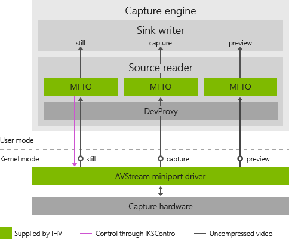
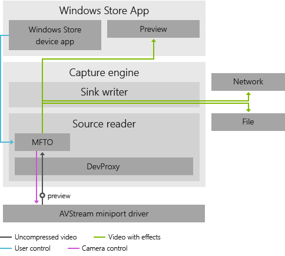
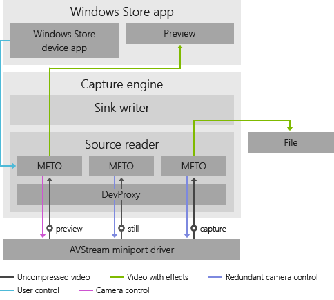
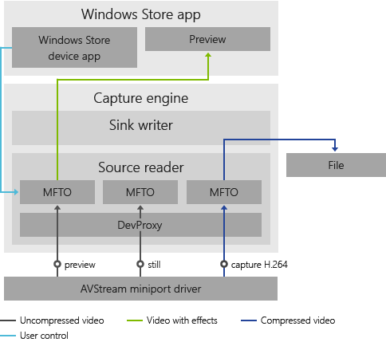

# Considerations for Driver MFTs on multi-pin cameras (UWP device apps)

Windows 8.1 offers IHVs and system OEMs the ability to create video processing plug-ins in the form of a Media Foundation Transform (MFT), known as the camera driver MFT. Once installed, these driver MFTs can be used by UWP device apps to enable special video effects. Some cameras provide separate pins for preview, capture, and stills. These multi-pin cameras pose unique challenges to developers. This topic covers some points to consider when developing a camera driver MFT on a multi-pin camera. For more info about creating a driver MFT, see [Creating a camera driver MFT](creating-a-camera-driver-mft.md).

## Introduction

The driver MFT is also referred to as MFT0 to indicate that it's the first MFT to operate in the source reader. A separate instance of MFT0 is attached to every pin on the capture source. For some system OEMs, the AVStream capture driver must support a preview pin, a capture pin, and a still pin. This means that there may be three instances of MFT0. This diagram shows this architecture, with three copies of the IHV Plug-in MFT, one for each stream.

Typical scenarios for MFT0 may present challenges. Two popular functions for MFT0 are:

-   Analyzing the video stream to provide feedback to the camera for improved capture (such as host-based auto focus and auto exposure)

-   Adding video effects

## One-pin webcam

Historically, cameras have been exposed to Windows as a single capture pin. This diagram represents the way a one-pin webcam works:

In this case, both camera control and video effects work as designed because the preview and stills are tee’d from the capture pin after camera control and video effects are applied. The result is that the saved file or the user’s chat buddy will see the same video effects that the user sees in their preview, and that there is only one instance of the camera control feature. If there is an associated UWP device app, the app is connected to the MFT0 on the capture pin, so the MFT0 obtains the control messages from the app (that is, the user).

## Three-pin webcam

A three-pin camera may have as many as three instances of MFT0, depending on the application needs. This diagram represents the way a three-pin camera works:

This situation presents several challenges. First, in the case of a host-based auto-exposure solution, which requires direct control of the camera sensor and ISP settings, three MFT0s may be trying to control the camera at the same time. This breaks the control system.

Second, there are potentially three instances of video effects. Beyond incurring the cost of three times the calculations, the three instances of the MFT0 must now communicate in a way that ensures each video frame always has the same effect in the exact same state. Otherwise what the user sees will not be what is saved or shared.

Additionally, there are two final compounding factors:

-   Each instance of the MFT0 may be created or shut down at any time

-   The UWP device app is only connected to one instance of the MFT0

## Compressed video

A webcam or system OEM may choose to compress the video before it is presented on the capture pin (that is, on the webcam itself). Offloading the compression to a webcam allows lower powered PCs to save and share HD video. This compressed video stream generally cannot be analyzed to support camera control, nor can video effects be applied. This presents the challenge of making all instances of MFT0 (and the Microsoft Store device app, if it is there) aware that no effects will be applied to the capture stream. This diagram represents compressed video:

If a user applies a video effect to the preview stream, it cannot be applied to the capture stream or the still pin. Therefore, the user sees a video effect that is not applied to the saved or streamed video. If the preview stream is halted, the Microsoft Store device app will then try to connect to the capture stream. When a user is streaming compressed video, this does not allow for many features.

## Communication between MFT0 instances

If the three instances of the MFT0 can communicate with each other, this may solve most issues. How these instances discover each other is up to the IHV. Once all MFT0s can communicate, the instance of the MFT0 connected to the Microsoft Store device app can let other instances know which effect is being applied and its current state. Also, the three instances can determine which instance applies camera control. Finally, the preview pin can determine if the capture pin is streaming encoded video. The preview pin can then disable video effects.

Although communication between instances of the MFT0 solves the major user experience issues, three instances of video effects must still be running concurrently. Some video effects can use most available CPU resources, particularly when full screen video is being previewed and captured at the same time. These are serious issues. For performance reasons, each ISV should consider what processing may be performed once, such as face detection, and shared with all instances of MFT0.

 

 

