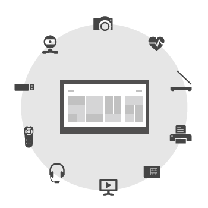

# Getting started with UWP device apps

Start here to begin building UWP device apps.

Device manufacturers can create a UWP device app that serves as a companion to their device. UWP device apps have more capabilities than regular UWP apps and can perform privileged operations, such as firmware updates. Also, UWP device apps can start from AutoPlay (on more devices than other apps can), automatically install the first time a device is connected, and extend the printer and camera experiences built into Windows.

> [!NOTE]
> Windows Runtime device APIs don't require device metadata. That means your app doesn't need to be a UWP device app to use them. UWP apps can use these APIs to access USB, Human Interface Devices (HID), Bluetooth devices, and more. For more info, see [Integrating devices](/previous-versions/windows/apps/dn263141(v=win.10)).

If you're looking for info about UWP mobile broadband apps, see [Mobile Broadband](../mobilebroadband/index.md).

## 1. Get set up

To develop a UWP device app: you need Microsoft Visual Studio, for developing UWP apps, and the Device Metadata Authoring Wizard, for developing device metadata.

> [!NOTE]
> To develop UWP device apps in Windows 10, download Microsoft Visual Studio 2017 and Windows Driver Kit (WDK) 10. [Become a Windows Insider to get kits and tools](https://insider.windows.com)

### If you're also developing drivers

If you're developing Windows drivers in addition to UWP device apps, use Microsoft Visual Studio Professional or Microsoft Visual Studio Ultimate to create UWP device apps. These editions include the new Device Metadata Authoring Wizard and are also required by the Windows Driver Kit (WDK) 8.1.

1. [Download Visual Studio Professional or Visual Studio Ultimate](https://developer.microsoft.com/windows/hardware/)

1. [Download the WDK 8.1](https://developer.microsoft.com/windows/hardware/)

### If you're not going to be developing drivers

If you don't need to develop drivers, you can use Microsoft Visual Studio Express 2015 for Windows to create UWP device apps. But this version of Visual Studio installs a version of the SDK that doesn't include the Device Metadata Authoring Wizard. To get the new Device Metadata Authoring Wizard, you must also download the standalone Windows 8.1 SDK.

1. [Download Visual Studio Express 2015 for Windows 10](https://visualstudio.microsoft.com/vs/express/)

1. [Download the standalone Windows 8.1 SDK](https://developer.microsoft.com/windows/hardware/)

## 2. Build some regular UWP apps

A UWP device app is a special kind of UWP app. So, before you develop your first UWP device app, get set up to build some regular UWP apps.

- [Sign up - register for a Microsoft Store developer account](https://developer.microsoft.com/microsoft-store/register/)

- [Get started with Microsoft Visual Studio](/previous-versions/windows/apps/br211384(v=win.10))

- See the [Microsoft Store design principles](/windows/uwp/design/)

## 3. Learn what makes UWP device apps special

Learn about the special things that you can do with a UWP device app and what it takes to build one.

- [Meet UWP device apps](meet-uwp-device-apps.md)

- [Building a UWP device app](the-workflow.md)

## 4. Download samples

You can find device-related samples with the [Devices and sensors](/samples/browse/) keyword in the sample gallery. Learn how APIs are used in the context of a full sample. You can tell a UWP device app because it includes a StoreManifest.xml file that associates it with device metadata. Those samples are tagged with the [UWP device app](/samples/browse/) keyword.

## 5. Build your own UWP device app

To begin, see [Build a UWP device app step-by-step](build-a-uwp-device-app-step-by-step.md).
