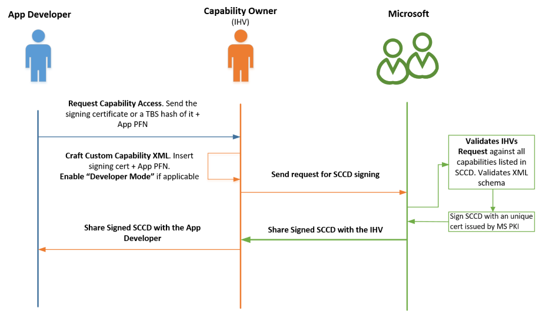

# Hardware Support App (HSA): Steps for Driver Developers

A Hardware Support App (HSA) is a device-specific app that is paired with a specific driver or [RPC (Remote Procedure Call)](https://msdn.microsoft.com/library/windows/desktop/aa378651) endpoint.

To associate a Store app with a driver, first reserve a special value called a custom capability. Then permit access to apps that advertise the capability and provide the capability to the app developer.  This page describes these steps for the driver developer.

The steps for the app developer are described in [Hardware Support App (HSA): Steps for App Developers](hardware-support-app--hsa--steps-for-app-developers.md).

HSA is one of the four ("DCHU") design principles of [Universal Windows drivers](../develop/getting-started-with-universal-drivers.md).

## Reserving a custom capability

First, reserve a custom capability:

1.  Email Microsoft Hardware Support Apps Review (<HSAReview@microsoft.com>) with the following information:

    * Contact information
    * Company name
    * Name of the capability (must be unique and reference the owner)
    * What resources does capability need to access?
    * Any security or privacy concerns
    * What data does your capability provide access to?
    * Include the Microsoft Store App Publisher ID.  To get one, create a skeleton app entry on the Microsoft Store page. For more info on reserving your App PFN, see [Create your app by reserving a name](https://msdn.microsoft.com/windows/uwp/publish/create-your-app-by-reserving-a-name).

2.  If the request is approved, Microsoft emails back a unique custom capability string name in the format **CompanyName.capabilityName\_PublisherID**.

Now you can use the custom capability to allow access to either an RPC endpoint or a driver.

## Allowing access to an RPC endpoint to a UWP app using the custom capability

To allow access to an RPC endpoint to a UWP app that has the custom capability, follow these steps:

1.  Call [**DeriveCapabilitySidsFromName**](https://msdn.microsoft.com/library/windows/desktop/mt803273) to convert the custom capability name to a security ID (SID).
2.  Add the SID to your access allowed ACE along with any other SIDs that are needed for the security descriptor of your RPC endpoint.
3.  Create an RPC endpoint using the information from the Security Descriptor.

You can see an implementation of the above in the [RPC server code](https://github.com/Microsoft/Windows-universal-samples/blob/master/Samples/CustomCapability/Service/Server/RpcServer.cpp) in the [Custom Capability sample](https://github.com/Microsoft/Windows-universal-samples/tree/master/Samples/CustomCapability).

## Allowing access to a driver to a UWP app using the custom capability

To allow access to a driver to a UWP app with the custom capability, add a few lines to either the INF file or the driver source.

In the INF file, specify your custom capability as follows:

```cpp
[WDMPNPB003_Device.NT.Interfaces] 
AddInterface= {zzzzzzzz-zzzz-zzzz-zzzz-zzzzzzzzzzzz},,AddInterfaceSection 
 
[AddInterfaceSection] 
AddProperty= AddInterfaceSection.AddProps 
 
[AddInterfaceSection.AddProps] 
; DEVPKEY_DeviceInterface_UnrestrictedAppCapabilities 
{026e516e-b814-414b-83cd-856d6fef4822}, 8, 0x2012,, "CompanyName.myCustomCapabilityNameTBD_MyStorePubId"
```

Or, do the following in the driver:

```c++
WDF_DEVICE_INTERFACE_PROPERTY_DATA PropertyData = {}; 
WCHAR customCapabilities[] = L”CompanyName.myCustomCapabilityNameTBD_MyStorePubId\0”; 
 
WDF_DEVICE_INTERFACE_PROPERTY_DATA_INIT( 
   &PropertyData, 
   &m_VendorDefinedSubType, 
   &DEVPKEY_DeviceInterface_UnrestrictedAppCapabilities); 
 
Status = WdfDeviceAssignInterfaceProperty( 
    m_FxDevice, 
    &PropertyData, 
    DEVPROP_TYPE_STRING_LIST, 
    ARRAYSIZE(customCapabilities), 
    reinterpret_cast<PVOID>(customCapabilities)); 

```

Replace `zzzzzzzz-zzzz-zzzz-zzzz-zzzzzzzzzzzz` with the GUID for the interface to expose.  Replace *CompanyName* with your company name, *myCustomCapabilityNameTBD* with a name that is unique within your company, and *MyStorePubId* with your publisher store ID. 

For an example of the driver code shown immediately above, see the [Driver package installation toolkit for universal drivers](https://github.com/Microsoft/Windows-driver-samples/tree/master/general/DCHU).

## Preparing the Signed Custom Capability Descriptor (SCCD) file

A Signed Custom Capability Descriptor (SCCD) file is a signed XML file authorizing the use of one or more custom capabilities.  The owner of the driver or RPC endpoint grants the custom capability to the app developer by providing this file.

To prepare the SCCD file, first update the custom capability string.  Use the following example as a starting point:

```xml
<?xml version="1.0" encoding="utf-8"?>
<CustomCapabilityDescriptor xmlns="http://schemas.microsoft.com/appx/2016/sccd" xmlns:s="http://schemas.microsoft.com/appx/2016/sccd">
<CustomCapabilities>
    <CustomCapability Name="microsoft.hsaTestCustomCapability_q536wpkpf5cy2"></CustomCapability>
</CustomCapabilities>
<AuthorizedEntities>
    <AuthorizedEntity AppPackageFamilyName="MicrosoftHSATest.Microsoft.SDKSamples.Hsa.CPP_q536wpkpf5cy2" CertificateSignatureHash="ca9fc964db7e0c2938778f4559946833e7a8cfde0f3eaa07650766d4764e86c4"></AuthorizedEntity>
</AuthorizedEntities>
<Catalog>0000</Catalog>
</CustomCapabilityDescriptor>
```

Next, the custom capability owner obtains the Package Family Name (PFN) and the signature hash from the app developer and updates those strings in the SCCD file.

**Note:**  The app does not have to be signed directly with the certificate, but the specified certificate must be part of the cert chain that signs the app.

After completing the SCCD, the capability owner emails it to Microsoft for signing.  Microsoft returns the signed SCCD to the capability owner.

The capability owner then sends the SCCD to the app developer.  The app developer includes the signed SCCD in the app manifest.  To learn what the app developer needs to do, see [Hardware Support App (HSA): Steps for App Developers](hardware-support-app--hsa--steps-for-app-developers.md).

## Limiting the scope of an SCCD

For testing purposes, a custom capability owner can restrict installation of a hardware support app to computers in developer mode.

To do so, before getting the SCCD signed by Microsoft, add **DeveloperModeOnly**:

```xml
<?xml version="1.0" encoding="utf-8"?>
<CustomCapabilityDescriptor xmlns="http://schemas.microsoft.com/appx/2016/sccd" xmlns:s="http://schemas.microsoft.com/appx/2016/sccd">
<CustomCapabilities>
    <CustomCapability Name="microsoft.hsaTestCustomCapability_q536wpkpf5cy2"></CustomCapability>
</CustomCapabilities>
<AuthorizedEntities>
    <AuthorizedEntity AppPackageFamilyName="MicrosoftHSATest.Microsoft.SDKSamples.Hsa.CPP_q536wpkpf5cy2" CertificateSignatureHash="ca9fc964db7e0c2938778f4559946833e7a8cfde0f3eaa07650766d4764e86c4"></AuthorizedEntity>
</AuthorizedEntities>
<Catalog>0000</Catalog>
<DeveloperModeOnly Value="true" />
</CustomCapabilityDescriptor>
```

The resulting signed SCCD works only on devices in [Developer Mode](https://docs.microsoft.com/windows/uwp/get-started/enable-your-device-for-development). 

## Allowing any app to use a custom capability

We recommend specifying authorized entities (apps) that can use a custom capability. In some cases, however, you might want to permit any app to include an SCCD.  Starting in Windows 10 version 1809, you can do this by adding **AllowAny** to the AuthorizedEntities element. Because the best practice is to declare authorized entities in the SCCD file, please provide a justification for using **AllowAny** when submitting your SCCD to be signed by Microsoft.

```xml
<?xml version="1.0" encoding="utf-8"?>
<CustomCapabilityDescriptor xmlns="http://schemas.microsoft.com/appx/2018/sccd" xmlns:s="http://schemas.microsoft.com/appx/2018/sccd">
<CustomCapabilities>
    <CustomCapability Name="microsoft.hsaTestCustomCapability_q536wpkpf5cy2"></CustomCapability>
</CustomCapabilities>
<AuthorizedEntities AllowAny="true"/>
<Catalog>0000</Catalog>
</CustomCapabilityDescriptor>
```

The resulting signed SCCD will validate in any app package. 

## Multiple SCCDs

Starting in Windows 10 version 1803, apps can declare custom capabilities from one or more SCCD files. Place the SCCD files in the root of the app package.

## Summary

The following diagram summarizes the sequence described above:



## See Also

* [Getting Started with Universal Windows drivers](../develop/getting-started-with-universal-drivers.md)
* [Intro to the Universal Windows Platform](https://docs.microsoft.com/windows/uwp/get-started/universal-application-platform-guide)
* [Universal Windows Platform (UWP)](https://docs.microsoft.com/windows/uwp/design/basics/design-and-ui-intro)
* [App capabilities](https://docs.microsoft.com/windows/uwp/packaging/app-capability-declarations)
* [Develop UWP apps using Visual Studio](https://developer.microsoft.com/windows/apps/develop)
* [Pairing a driver with a Universal Windows Platform (UWP) app](../install/pairing-app-and-driver-versions.md)
* [Develop UWP apps](https://developer.microsoft.com/windows/apps/develop)
* [Package an app using the Desktop App Converter (Desktop Bridge)](https://docs.microsoft.com/windows/uwp/porting/desktop-to-uwp-run-desktop-app-converter)
* [Custom Capability Sample App](http://go.microsoft.com/fwlink/p/?LinkId=846904)
* [Custom Capability Driver Sample](https://aka.ms/customcapabilitydriversample )
* [Sideload apps in Windows 10](https://technet.microsoft.com/library/mt269549.aspx)
* [FAQ on Custom Capabilities](FAQ-on-custom-capabilities.md)

## SCCD XML Schema

The following is the formal XML XSD schema for an SCCD file.  Use this schema to validate your SCCD before submitting it for review.  See [Schema Cache](https://docs.microsoft.com/visualstudio/xml-tools/schema-cache) and [XML Document validation](https://docs.microsoft.com/visualstudio/xml-tools/xml-document-validation) for info on importing a schema and validating with IntelliSense.

```xml
<?xml version="1.0" encoding="UTF-8"?>
<xs:schema attributeFormDefault="unqualified" elementFormDefault="qualified"
  xmlns:xs="http://www.w3.org/2001/XMLSchema"
  targetNamespace="http://schemas.microsoft.com/appx/2016/sccd"
  xmlns:s="http://schemas.microsoft.com/appx/2016/sccd"
  xmlns="http://schemas.microsoft.com/appx/2016/sccd">

  <xs:element name="CustomCapabilityDescriptor" type="CT_CustomCapabilityDescriptor">
    <xs:unique name="Unique_CustomCapability_Name">
      <xs:selector xpath="s:CustomCapabilities/s:CustomCapability"/>
      <xs:field xpath="@Name"/>
    </xs:unique>
  </xs:element>

  <xs:complexType name="CT_CustomCapabilityDescriptor">
    <xs:sequence>
      <xs:element ref="CustomCapabilities" minOccurs="1" maxOccurs="1"/>
      <xs:element ref="AuthorizedEntities" minOccurs="1" maxOccurs="1"/>
      <xs:element ref="DeveloperModeOnly" minOccurs="0" maxOccurs="1"/>
      <xs:element ref="Catalog" minOccurs="1" maxOccurs="1"/>
      <xs:any minOccurs="0"/>
    </xs:sequence>
  </xs:complexType>

  <xs:element name="CustomCapabilities" type="CT_CustomCapabilities" />

  <xs:complexType name="CT_CustomCapabilities">
    <xs:sequence>
      <xs:element ref="CustomCapability" minOccurs="1" maxOccurs="unbounded"/>
    </xs:sequence>
  </xs:complexType>

  <xs:element name="CustomCapability">
    <xs:complexType>
      <xs:attribute name="Name" type="ST_CustomCapability" use="required"/>
    </xs:complexType>
  </xs:element>

  <xs:simpleType name="ST_NonEmptyString">
    <xs:restriction base="xs:string">
      <xs:minLength value="1"/>
      <xs:maxLength value="32767"/>
      <xs:pattern value="[^\s]|([^\s].*[^\s])"/>
    </xs:restriction>
  </xs:simpleType>

  <xs:simpleType name="ST_CustomCapability">
    <xs:annotation>
      <xs:documentation>Custom capabilities should be a string in the form of Company.capabilityName_PublisherId</xs:documentation>
    </xs:annotation>
    <xs:restriction base="ST_NonEmptyString">
      <xs:pattern value="[A-Za-z0-9][-_.A-Za-z0-9]*_[a-hjkmnp-z0-9]{13}"/>
      <xs:minLength value="15"/>
      <xs:maxLength value="255"/>
    </xs:restriction>
  </xs:simpleType>

  <xs:element name="AuthorizedEntities" type="CT_AuthorizedEntities" />

  <xs:complexType name="CT_AuthorizedEntities">
    <xs:sequence>
      <xs:element ref="AuthorizedEntity" minOccurs="1" maxOccurs="unbounded"/>
    </xs:sequence>
  </xs:complexType>

  <xs:element name="AuthorizedEntity" type="CT_AuthorizedEntity" />

  <xs:complexType name="CT_AuthorizedEntity">
    <xs:attribute name="CertificateSignatureHash" type="ST_CertificateSignatureHash" use="required"/>
    <xs:attribute name="AppPackageFamilyName" type="ST_NonEmptyString" use="required"/>
  </xs:complexType>

  <xs:simpleType name="ST_CertificateSignatureHash">
    <xs:restriction base="ST_NonEmptyString">
      <xs:pattern value="[A-Fa-f0-9]+"/>
      <xs:minLength value="64"/>
      <xs:maxLength value="64"/>
    </xs:restriction>
  </xs:simpleType>

  <xs:element name="DeveloperModeOnly">
    <xs:complexType>
      <xs:attribute name="Value" type="xs:boolean" use="required"/>
    </xs:complexType>
  </xs:element>

  <xs:element name="Catalog" type="ST_Catalog" />

  <xs:simpleType name="ST_Catalog">
    <xs:restriction base="xs:string">
      <xs:pattern value="[A-Za-z0-9\+\/\=]+"/>
      <xs:minLength value="4"/>
    </xs:restriction>
  </xs:simpleType>

</xs:schema>
```

The following schema is also valid as of Windows 10, version 1809.  It enables a SCCD to declare any app package to be an authorized entity. 

```xml
<?xml version="1.0" encoding="UTF-8"?>
<xs:schema attributeFormDefault="unqualified" elementFormDefault="qualified"
  xmlns:xs="http://www.w3.org/2001/XMLSchema"
  targetNamespace="http://schemas.microsoft.com/appx/2018/sccd"
  xmlns:s="http://schemas.microsoft.com/appx/2018/sccd"
  xmlns="http://schemas.microsoft.com/appx/2018/sccd">

  <xs:element name="CustomCapabilityDescriptor" type="CT_CustomCapabilityDescriptor">
    <xs:unique name="Unique_CustomCapability_Name">
      <xs:selector xpath="s:CustomCapabilities/s:CustomCapability"/>
      <xs:field xpath="@Name"/>
    </xs:unique>
  </xs:element>

  <xs:complexType name="CT_CustomCapabilityDescriptor">
    <xs:sequence>
      <xs:element ref="CustomCapabilities" minOccurs="1" maxOccurs="1"/>
      <xs:element ref="AuthorizedEntities" minOccurs="1" maxOccurs="1"/>
      <xs:element ref="DeveloperModeOnly" minOccurs="0" maxOccurs="1"/>
      <xs:element ref="Catalog" minOccurs="1" maxOccurs="1"/>
      <xs:any minOccurs="0"/>
    </xs:sequence>
  </xs:complexType>
  
  <xs:element name="CustomCapabilities" type="CT_CustomCapabilities" />

  <xs:complexType name="CT_CustomCapabilities">
    <xs:sequence>
      <xs:element ref="CustomCapability" minOccurs="1" maxOccurs="unbounded"/>
    </xs:sequence>
  </xs:complexType>

  <xs:element name="CustomCapability">
    <xs:complexType>
      <xs:attribute name="Name" type="ST_CustomCapability" use="required"/>
    </xs:complexType>
  </xs:element>

  <xs:simpleType name="ST_NonEmptyString">
    <xs:restriction base="xs:string">
      <xs:minLength value="1"/>
      <xs:maxLength value="32767"/>
      <xs:pattern value="[^\s]|([^\s].*[^\s])"/>
    </xs:restriction>
  </xs:simpleType>

  <xs:simpleType name="ST_CustomCapability">
    <xs:annotation>
      <xs:documentation>Custom capabilities should be a string in the form of Company.capabilityName_PublisherId</xs:documentation>
    </xs:annotation>
    <xs:restriction base="ST_NonEmptyString">
      <xs:pattern value="[A-Za-z0-9][-_.A-Za-z0-9]*_[a-hjkmnp-z0-9]{13}"/>
      <xs:minLength value="15"/>
      <xs:maxLength value="255"/>
    </xs:restriction>
  </xs:simpleType>

  <xs:element name="AuthorizedEntities" type="CT_AuthorizedEntities" />

  <xs:complexType name="CT_AuthorizedEntities">
    <xs:sequence>
      <xs:element ref="AuthorizedEntity" minOccurs="0" maxOccurs="unbounded"/>
    </xs:sequence>
    <xs:attribute name="AllowAny" type="xs:boolean" use="optional"/>
  </xs:complexType>
  
  <xs:element name="AuthorizedEntity" type="CT_AuthorizedEntity" />
  
  <xs:complexType name="CT_AuthorizedEntity">
    <xs:attribute name="CertificateSignatureHash" type="ST_CertificateSignatureHash" use="required"/>
    <xs:attribute name="AppPackageFamilyName" type="ST_NonEmptyString" use="required"/>
  </xs:complexType>

  <xs:simpleType name="ST_CertificateSignatureHash">
    <xs:restriction base="ST_NonEmptyString">
      <xs:pattern value="[A-Fa-f0-9]+"/>
      <xs:minLength value="64"/>
      <xs:maxLength value="64"/>
    </xs:restriction>
  </xs:simpleType>

  <xs:element name="DeveloperModeOnly">
    <xs:complexType>
      <xs:attribute name="Value" type="xs:boolean" use="required"/>
    </xs:complexType>
  </xs:element>

  <xs:element name="Catalog" type="ST_Catalog" />

  <xs:simpleType name="ST_Catalog">
    <xs:restriction base="xs:string">
      <xs:pattern value="[A-Za-z0-9\+\/\=]+"/>
      <xs:minLength value="4"/>
    </xs:restriction>
  </xs:simpleType>
  
</xs:schema>
```
