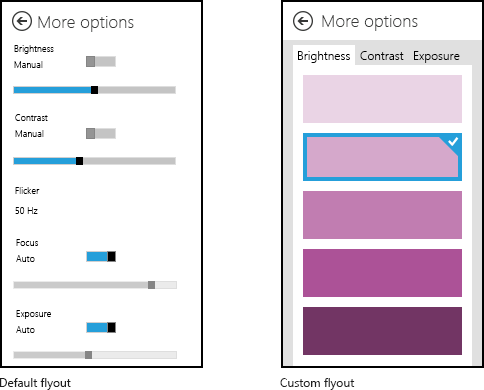
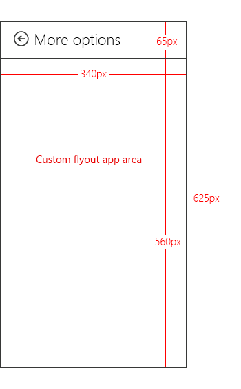

# How to customize camera options with a UWP device app


In Windows 8.1, UWP device apps let device manufacturers customize the flyout that displays more camera options in some camera apps. This topic introduces the **More options** flyout that's displayed by the CameraCatureUI API, and shows how the C# version of the [UWP device app for camera](http://go.microsoft.com/fwlink/p/?LinkID=227865) sample replaces the default flyout with a custom flyout. To learn more about UWP device apps in general, see [Meet UWP device apps](meet-uwp-device-apps.md).

**Note**  In Windows 8.1, the built-in camera app does not display a **More options** button and therefore can't display a UWP device app to show more camera options. However, the [CameraCaptureUI class](http://go.microsoft.com/fwlink/p/?LinkId=317985), that's available to all UWP apps, does have a **More options** button and can display UWP device apps from it.


The C# version of the [UWP device app for camera](http://go.microsoft.com/fwlink/p/?LinkID=227865) sample uses the **DeviceAppPage.xaml** page to demonstrate the UI of a custom flyout for more camera options. The sample also applies camera effects using a camera driver MFT (media foundation transform). For more info about that, see [Creating a camera driver MFT](creating-a-camera-driver-mft.md).

**Note**  The code examples shown in this topic are based on the C# version of the [UWP device app for camera](http://go.microsoft.com/fwlink/p/?LinkID=227865) sample. This sample is also available in JavaScript and C++. Download the samples to see the latest versions of the code.


## <span id="More_options_for_cameras"></span><span id="more_options_for_cameras"></span><span id="MORE_OPTIONS_FOR_CAMERAS"></span>More options for cameras


The more camera options experience is the functionality that a UWP device app provides when another app, a UWP app, captures or previews video from the camera by using the [CameraCaptureUI](http://go.microsoft.com/fwlink/p/?LinkId=317985) API. It is accessible through the **More options** link in the Camera options window. It is not full-screen, but displays within a flyout, which is a control for displaying a lightweight, contextual user interface that is dismissed when a user clicks or taps outside of it.

This experience can be used to highlight differentiated features for your camera, such as the ability to apply custom video effects.

When a UWP device app is not installed for a camera, Windows provides a default more camera options experience. If Windows detects that a UWP device app is installed for your camera, and that the app has opted-in to the `windows.cameraSettings` extension, your app replaces the default experience provided by Windows.

To invoke the flyout for more camera options:

1.  Open a UWP app that uses the [CameraCaptureUI](http://go.microsoft.com/fwlink/p/?LinkId=317985) API (the [CameraCaptureUI sample](http://go.microsoft.com/fwlink/p/?linkid=228589), for example)
2.  Tap the **Options** button in the UI
3.  This opens a **Camera options** flyout that shows basic options for setting resolution and video stabilization
4.  On the **Camera options** flyout, tap **More options**
5.  The **More options** flyout opens
    -   The *default flyout* appears when no UWP device app for the camera is installed
    -   A *custom flyout* appears when a UWP device app for the camera is installed



This image shows the default flyout for more camera options beside an example of a custom flyout.

## <span id="Prerequisites"></span><span id="prerequisites"></span><span id="PREREQUISITES"></span>Prerequisites


Before you get started:

1.  Get your development PC set up. See [Getting started](getting-started.md) for info about downloading the tools and creating a developer account.
2.  Associate your app with the store. See [Create a UWP device app](step-1--create-a-uwp-device-app.md) for info about that.
3.  Create device metadata for your printer that associates it with your app. See [Create device metadata](step-2--create-device-metadata.md) for more about that.
4.  Build the UI for the main page of your app. All UWP device apps can be launched from Start, where they'll be displayed full-screen. Use the Start experience to highlight your product or services in a way that matches the specific branding and features of your devices. There are no special restrictions on the type of UI controls it can use. To get started with the design of the full-screen experience, see the [Microsoft Store design principles](http://go.microsoft.com/fwlink/p/?LinkID=299845).

## <span id="Step_1__Register_the_extension"></span><span id="step_1__register_the_extension"></span><span id="STEP_1__REGISTER_THE_EXTENSION"></span>Step 1: Register the extension


In order for Windows to recognize that the app can supply a custom flyout for more camera options, it must register the camera settings extension. This extension is declared in an `Extension` element, with a `Category` attribute set to a value of `windows.cameraSettings`. In the C# and C++ samples, the `Executable` attribute is set to `DeviceAppForWebcam.exe` and the `EntryPoint` attribute is set to `DeviceAppForWebcam.App`.

You can add the camera settings extension on the **Declarations** tab of the Manifest Designer in Microsoft Visual Studio. You can also edit the app package manifest XML manually, using the XML (Text) Editor. Right-click the **Package.appxmanifest** file in **Solution Explorer** for editing options.

This example shows the camera settings extension in the `Extension` element, as it appears in the app package manifest file, **Package.appxmanifest**.

```XML
<?xml version="1.0" encoding="utf-8"?>
<Package xmlns="http://schemas.microsoft.com/appx/2010/manifest">
  <Identity Name="Microsoft.SDKSamples.DeviceAppForWebcam.CPP" Publisher="CN=Microsoft Corporation, O=Microsoft Corporation, L=Redmond, S=Washington, C=US" Version="1.0.0.0" />
  <Properties>
    <DisplayName>DeviceAppForWebcam CPP sample</DisplayName>
    <PublisherDisplayName>Microsoft Corporation</PublisherDisplayName>
    <Logo>Assets\storeLogo-sdk.png</Logo>
  </Properties>
  <Prerequisites>
    <OSMinVersion>6.3.0</OSMinVersion>
    <OSMaxVersionTested>6.3.0</OSMaxVersionTested>
  </Prerequisites>
  <Resources>
    <Resource Language="x-generate" />
  </Resources>
  <Applications>
    <Application Id="DeviceAppForWebcam.App" Executable="$targetnametoken$.exe" EntryPoint="DeviceAppForWebcam.App">
      <VisualElements DisplayName="DeviceAppForWebcam CPP sample" Logo="Assets\squareTile-sdk.png" SmallLogo="Assets\smallTile-sdk.png" Description="DeviceAppForWebcam CPP sample" ForegroundText="light" BackgroundColor="#00b2f0">
        <DefaultTile ShortName="DeviceApp CPP" ShowName="allLogos" />
        <SplashScreen Image="Assets\splash-sdk.png" BackgroundColor="#00b2f0" />
      </VisualElements>
      <Extensions>
        <Extension Category="windows.cameraSettings" Executable="DeviceAppForWebcam.exe" EntryPoint="DeviceAppForWebcam.App" />
      </Extensions>
    </Application>
  </Applications>
</Package>
```

## <span id="Step_2__Build_the_UI"></span><span id="step_2__build_the_ui"></span><span id="STEP_2__BUILD_THE_UI"></span>Step 2: Build the UI


Before building your app, you should work with your designers and your marketing team to design the user experience. The user experience should project the branding aspects of your company and help you build a connection with your users.

### <span id="Design_guidelines"></span><span id="design_guidelines"></span><span id="DESIGN_GUIDELINES"></span>Design guidelines

It's important to review the [UWP app flyout guidelines](http://go.microsoft.com/fwlink/p/?LinkId=317078) before designing your custom flyout. The guidelines help ensure that your flyout provides an intuitive experience that is consistent with other UWP apps.

For the main page of your app, keep in mind that Windows 8.1 can display multiple apps in various sizes on a single monitor. See the following guidelines to learn more about how your app can reflow gracefully between screen sizes, window sizes, and orientations.

-   [Guidelines for window sizes and scaling to screens](http://go.microsoft.com/fwlink/p/?LinkId=311830)
-   [Guidelines for resizing windows to tall and narrow layouts](http://go.microsoft.com/fwlink/p/?LinkId=311831)

### <span id="Flyout_dimensions"></span><span id="flyout_dimensions"></span><span id="FLYOUT_DIMENSIONS"></span>Flyout dimensions

The flyout that displays more camera options is 625 pixels high and 340 pixels wide. The area containing the **More options** text at the top is provided by Windows and is approximately 65 pixels high, leaving 560 pixels for the viewable area of the custom flyout. A custom flyout should not exceed 340 pixels in width.



**Note**  If your custom flyout is more than 560 pixels in height, the user may slide or scroll to view parts of the flyout that are above or below the viewable area.


### <span id="Suggested_effects"></span><span id="suggested_effects"></span><span id="SUGGESTED_EFFECTS"></span>Suggested effects

-   Color effects. For example, grayscale, sepia tone, or solarizing the entire picture.
-   Face-tracking effects. Where a face is identified in the picture and an overlay, such as a hat or a pair of glasses, is added on top of it.
-   Scene modes. These are preset exposure and focus modes for different lighting conditions.

### <span id="Suggested_settings"></span><span id="suggested_settings"></span><span id="SUGGESTED_SETTINGS"></span>Suggested settings

-   Your UWP device app's custom flyout can provide a switch to enable hardware-implemented settings, such as manufacturer-provided color correction schemes.
-   Implement basic properties that supplement the other settings exposed by your UWP device app. For example, many devices may expose controls for adjusting brightness, contrast, flicker, focus, and exposure, but a device that implements TrueColor to automatically adjust the brightness and contrast may not need to provide these settings.

### <span id="Restrictions"></span><span id="restrictions"></span><span id="RESTRICTIONS"></span>Restrictions

-   Do not open your UWP device app's custom flyout from your main app (by calling the `CameraOptionsUI.Show` method) when the app is not streaming or capturing.

-   Do not provide a preview or otherwise take ownership of the video stream from inside your UWP device app’s custom flyout. The custom flyout is meant to function as a companion to another app that captures video. The capture app has ownership of the video stream. You shouldn’t try to access the video stream using low-level APIs. This may cause unexpected behavior, in which the capture app loses access to the stream.

-   Do not adjust resolution in the custom flyout.

-   Do not attempt to display pop-ups, notifications, or dialogs outside of the area intended for the custom flyout. These types of dialogs are not permitted.

-   Do not initiate audio or video capture inside the custom flyout. The custom flyout is meant to extend another app that is capturing video, rather than initiate the capture itself. Additionally, capturing audio or video may trigger a system dialog, and pop-up dialogs are not permitted inside the custom flyout.

## <span id="step3"></span><span id="STEP3"></span>Step 3: Handle activation


If your app has declared the camera settings extension, it must implement an `OnActivated` method to handle the app Activation event. This event is triggered when a UWP app, using the [CameraCaptureUI](http://go.microsoft.com/fwlink/p/?LinkId=317985) class, calls the [CameraOptionsUI.Show](http://go.microsoft.com/fwlink/p/?LinkId=317995) method. App activation is when your app can choose which page will launch as the app starts. For apps that have declared the camera settings extension, Windows passes the video device in the Activated event arguments: Windows.ApplicationModel.Activation.IActivatedEventArgs.

A UWP device app can determine that the activation is intended for camera settings (that someone just tapped **More options** on the **Camera options** dialog) when the event argument's `kind` property is equal to Windows.ApplicationModel.Activation.ActivationKind.CameraSettings.

This example shows the activation event handler in the `OnActivated` method, as it appears in the **App.xaml.cs** file. The event arguments are then cast as Windows.ApplicationModel.Activation.CameraSettingsActivatedEventArgs and sent to the `Initialize` method of the custom flyout (**DeviceAppPage.xaml.cs**).

```CSharp
protected override void OnActivated(IActivatedEventArgs args)
{
    if (args.Kind == ActivationKind.CameraSettings)
    {
        base.OnActivated(args);
        DeviceAppPage page = new DeviceAppPage();
        Window.Current.Content = page;
        page.Initialize((CameraSettingsActivatedEventArgs)args);

        Window.Current.Activate();
    }
}
```

## <span id="Step_4__Control_settings_and_effects"></span><span id="step_4__control_settings_and_effects"></span><span id="STEP_4__CONTROL_SETTINGS_AND_EFFECTS"></span>Step 4: Control settings and effects


When the `Initialize` method of the custom flyout (**DeviceAppPage.xaml.cs**) is called, the video device is passed to the flyout through the event arguments. These arguments expose properties for controlling the camera:

-   The **args.VideoDeviceController** property provides an object of type Windows.Media.Devices.VideoDeviceController. This object provides methods for adjusting standard settings.
-   The **args.VideoDeviceExtension** property is a pointer to the camera driver MFT. This property will be null if no Driver MFT interfaces are exposed. For more info about camera driver MFTs, see [Creating a camera driver MFT](creating-a-camera-driver-mft.md).

This example shows a portion of the `Initialize` method, as it appears in the **DeviceAppPage.xaml.cs** file. Here, the video device controller (videoDevController object) and the camera driver MFT (lcWrapper object) are created and the flyout is populated with the current camera settings.

```CSharp
public void Initialize(CameraSettingsActivatedEventArgs args)
{
    videoDevController = (VideoDeviceController)args.VideoDeviceController;

    if (args.VideoDeviceExtension != null)
    {
        lcWrapper = new WinRTComponent();
        lcWrapper.Initialize(args.VideoDeviceExtension);
    }

    bool bAuto = false;
    double value = 0.0;

    if (videoDevController.Brightness.Capabilities.Step != 0)
    {
        slBrt.Minimum = videoDevController.Brightness.Capabilities.Min;
        slBrt.Maximum = videoDevController.Brightness.Capabilities.Max;
        slBrt.StepFrequency = videoDevController.Brightness.Capabilities.Step;
        videoDevController.Brightness.TryGetValue(out value);
        slBrt.Value = value;
    }
    else
    {
        slBrt.IsEnabled = false;
    }
    if (videoDevController.Brightness.Capabilities.AutoModeSupported)
    {
        videoDevController.Brightness.TryGetAuto(out bAuto);
        tsBrtAuto.IsOn = bAuto;
    }
    else
    {
        tsBrtAuto.IsOn = false;
        tsBrtAuto.IsEnabled = false;
    }

    if (videoDevController.Contrast.Capabilities.Step != 0)
    {
        slCrt.Minimum = videoDevController.Contrast.Capabilities.Min;
        slCrt.Maximum = videoDevController.Contrast.Capabilities.Max;
        slCrt.StepFrequency = videoDevController.Contrast.Capabilities.Step;
        videoDevController.Contrast.TryGetValue(out value);
        slCrt.Value = value;
    }
    else
    {
        slCrt.IsEnabled = false;
    }
    // . . .
    // . . .
    // . . .
```

The camera driver MFT is demonstrated in the [Driver MFT](http://go.microsoft.com/fwlink/p/?LinkID=251566) sample. For more info about camera driver MFTs, see [Creating a camera driver MFT](creating-a-camera-driver-mft.md).

## <span id="Step_5__Apply_changes"></span><span id="step_5__apply_changes"></span><span id="STEP_5__APPLY_CHANGES"></span>Step 5: Apply changes


When changes are made to the controls on the flyout, the Changed event of the corresponding control is used to apply the changes to the video device controller (videoDevController object) and the camera driver MFT (lcWrapper object).

This example shows the Changed methods that apply changes to the video device controller and the camera driver MFT, as they appear in the **DeviceAppPage.xaml.cs** file.

```CSharp
protected void OnBrtAutoToggleChanged(object sender, RoutedEventArgs e)
{
    videoDevController.Brightness.TrySetAuto(tsBrtAuto.IsOn);
    slBrt.IsEnabled = !tsBrtAuto.IsOn;
}

protected void OnBrtSliderValueChanged(object sender, RoutedEventArgs e)
{
    videoDevController.Brightness.TrySetValue(slBrt.Value);
}

protected void OnCrtAutoToggleChanged(object sender, RoutedEventArgs e)
{
    videoDevController.Contrast.TrySetAuto(tsCrtAuto.IsOn);
    slCrt.IsEnabled = !tsCrtAuto.IsOn;
}

protected void OnCrtSliderValueChanged(object sender, RoutedEventArgs e)
{
    videoDevController.Contrast.TrySetValue(slCrt.Value);
}

protected void OnFocusAutoToggleChanged(object sender, RoutedEventArgs e)
{
    videoDevController.Focus.TrySetAuto(tsFocusAuto.IsOn);
    slFocus.IsEnabled = !tsFocusAuto.IsOn;
}

protected void OnFocusSliderValueChanged(object sender, RoutedEventArgs e)
{
    videoDevController.Focus.TrySetValue(slFocus.Value);
}

protected void OnExpAutoToggleChanged(object sender, RoutedEventArgs e)
{
    videoDevController.Exposure.TrySetAuto(tsExpAuto.IsOn);
    slExp.IsEnabled = !tsExpAuto.IsOn;
}

protected void OnExpSliderValueChanged(object sender, RoutedEventArgs e)
{
    videoDevController.Exposure.TrySetValue(slExp.Value);
}

protected void OnEffectEnabledToggleChanged(object sender, RoutedEventArgs e)
{
    if (tsEffectEnabled.IsOn)
    {
        lcWrapper.Enable();
    }
    else
    {
        lcWrapper.Disable();
    }
    slEffect.IsEnabled = tsEffectEnabled.IsOn;
}

protected void OnEffectSliderValueChanged(object sender, RoutedEventArgs e)
{
    lcWrapper.UpdateDsp(Convert.ToInt32(slEffect.Value));
}
```

## <span id="Testing_your_app"></span><span id="testing_your_app"></span><span id="TESTING_YOUR_APP"></span>Testing your app


This section describes how to install a UWP device app that provides a custom flyout for **More options** of a camera, as demonstrated in the [UWP device app for camera](http://go.microsoft.com/fwlink/p/?LinkID=227865) sample.

Before you can test your UWP device app, it must be linked to your camera using device metadata.

-   You need a copy of the device metadata package for your printer, to add the device app info to it. If you don’t have device metadata, you can build it using the **Device Metadata Authoring Wizard** as described in the topic [Create device metadata for your UWP device app](http://go.microsoft.com/fwlink/p/?LinkId=313644).

    **Note**  To use the **Device Metadata Authoring Wizard**, you must install Microsoft Visual Studio Professional, Microsoft Visual Studio Ultimate, or the [standalone SDK for Windows 8.1](http://go.microsoft.com/fwlink/p/?linkid=309209), before completing the steps in this topic. Installing Microsoft Visual Studio Express for Windows installs a version of the SDK that doesn't include the wizard.


The following steps build your app and install the device metadata.

1.  Enable test signing.
    1.  Start the **Device Metadata Authoring Wizard** from *%ProgramFiles(x86)%*\\Windows Kits\\8.1\\bin\\x86, by double-clicking **DeviceMetadataWizard.exe**
    2.  From the **Tools** menu, select **Enable Test Signing**.

2.  Reboot the computer
3.  Build the solution by opening the solution (.sln) file. Press F7 or go to **Build-&gt;Build Solution** from the top menu after the sample has loaded.

4.  Disconnect and uninstall the printer. This step is required so that Windows will read the updated device metadata the next time the device is detected.
5.  Edit and save device metadata. To link the device app to your device, you must associate the device app with your device.
    **Note**  If you haven't created your device metadata yet, see [Create device metadata for your UWP device app](http://go.microsoft.com/fwlink/p/?LinkId=313644).


    1.  If the **Device Metadata Authoring Wizard** is not open yet, start it from *%ProgramFiles(x86)%*\\Windows Kits\\8.1\\bin\\x86, by double-clicking **DeviceMetadataWizard.exe**.
    2.  Click **Edit Device Metadata**. This will let you edit your existing device metadata package.
    3.  In the **Open** dialog box, locate the device metadata package associated with your UWP device app. (It has a **devicemetadata-ms** file extension.)
    4.  On the **Specify UWP device app information** page, enter the Microsoft Store app info in the **UWP device app** box. Click on **Import UWP app manifest file** to automatically enter the **Package name**, **Publisher name**, and **UWP app ID**.
    5.  When you're done, click **Next** until you get to the **Finish** page.
    6.  On the **Review the device metadata package** page, make sure that all of the settings are correct and select the **Copy the device metadata package to the metadata store on the local computer** check box. Then click **Save**.

6.  Reconnect your device so that Windows reads the updated device metadata when the device is connected.
    -   If you have an external camera, simply connect the camera.
    -   If you have an internal camera, refresh the PC in the Devices and Printers folder. Use Device Manager to scan for hardware changes. Windows should read the updated metadata when the device is detected.

**Note**  For info about installing a camera driver MFT, see the Testing section in [Creating a camera driver MFT](creating-a-camera-driver-mft.md).


## <span id="Testing_the_samples"></span><span id="testing_the_samples"></span><span id="TESTING_THE_SAMPLES"></span>Testing the samples


To test the camera options experience, first download these samples:

-   [UWP device app for camera sample](http://go.microsoft.com/fwlink/p/?LinkID=227865)
-   [Camera Capture UI sample](http://go.microsoft.com/fwlink/p/?linkid=228589)
-   [Driver MFT sample](http://go.microsoft.com/fwlink/p/?LinkID=251566)

Then, follow the sample testing instructions provided on the [Driver MFT sample](http://go.microsoft.com/fwlink/p/?LinkID=251566) page.


