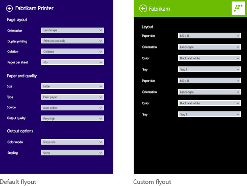

# How to customize print settings (UWP device apps)


In Windows 8.1, UWP device apps let printer manufacturers customize the flyout that displays advanced print settings. This topic introduces the advanced print settings flyout, and shows how the C# version of the [Print settings and print notifications](http://go.microsoft.com/fwlink/p/?LinkID=242862) sample replaces the default flyout with a custom flyout. To learn more about UWP device apps in general, see [Meet UWP device apps](meet-uwp-device-apps.md).

The C# version of the [Print settings and print notifications](http://go.microsoft.com/fwlink/p/?LinkID=242862) sample uses the **Preferences.xaml** page to demonstrate the UI of a custom flyout for advanced print settings. A print helper class is used to create a device context (IPrinterExtensionContext) and perform the device queries. The **PrinterHelperClass.cs** file is in the **DeviceAppForPrintersLibrary** project and uses APIs defined in the **PrinterExtensionLibrary** project. The printer extension library provides a convenient way to access the printer extension interfaces of the v4 print driver. For more info, see the [Printer extension library overview](printer-extension-library-overview.md).

**Note**  The code examples shown in this topic are based on the C# version of the [Print settings and print notifications](http://go.microsoft.com/fwlink/p/?LinkID=242862) sample. This sample is also available in JavaScript and C++. Note that because C++ can access COM directly, the C++ version of the sample does not include code library projects. Download the samples to see the latest versions of the code.

 

## <span id="Advanced_print_settings"></span><span id="advanced_print_settings"></span><span id="ADVANCED_PRINT_SETTINGS"></span>Advanced print settings


The advanced print settings experience is the functionality that a printer offers when a user wants to select print settings that are not offered in the Print window. It is accessible through the **More settings** link in the Print window. It is not a full-screen experience, but displays within a flyout, which is a control for displaying a lightweight, contextual user interface that is dismissed when a user clicks or taps outside of it.

This experience can be used to highlight differentiated features for your printer such as the ability to apply watermarks to a document page, offer secure printing options, or image enhancement options.

When a UWP device app is not installed for a printer, Windows provides a default print settings experience. If Windows detects that a UWP device app is installed for your printer, and that the app has opted-in to the `windows.printTaskSettings` extension, your app replaces the default experience provided by Windows.

To invoke the flyout for advanced print settings:

1.  Open a UWP app that supports printing
2.  Access the charms by swiping on the right side of the screen (or by using the Windows Logo Key + C)
3.  Tap the **Devices** charm
4.  Tap **Print**
5.  Tap a printer
6.  The **Print** window opens
7.  Click the **More settings** link on the **Print** window
8.  The advanced print settings flyout opens
    -   The *default flyout* appears when no UWP device app for the printer is installed
    -   A *custom flyout* appears when a UWP device app for the printer is installed



## <span id="Prerequisites"></span><span id="prerequisites"></span><span id="PREREQUISITES"></span>Prerequisites


Before you get started:

1.  Make sure your printer is installed using a v4 print driver. For more info, see [Developing v4 print drivers](http://go.microsoft.com/fwlink/p/?LinkId=314231).
2.  Get your development PC set up. See [Getting started](getting-started.md) for info about downloading the tools and creating a developer account.
3.  Associate your app with the store. See [Create a UWP device app](step-1--create-a-uwp-device-app.md) for info about that.
4.  Create device metadata for your printer that associates it with your app. See [Create device metadata](step-2--create-device-metadata.md) for more about that.
5.  Build the UI for the main page of your app. All UWP device apps can be launched from Start, where they'll be displayed full-screen. Use the Start experience to highlight your product or services in a way that matches the specific branding and features of your devices. There are no special restrictions on the type of UI controls it can use. To get started with the design of the full-screen experience, see the [Microsoft Store design principles](http://go.microsoft.com/fwlink/p/?LinkID=299845).
6.  If you're writing you're writing your app with C# or JavaScript, add the **PrinterExtensionLibrary** and **DeviceAppForPrintersLibrary** projects to your UWP device app solution. You can find each of these projects in the [Print settings and print notifications](http://go.microsoft.com/fwlink/p/?LinkID=242862) sample.
    **Note**  Because C++ can access COM directly, C++ apps do not require a separate library to work with the COM-based printer device context.

     

## <span id="Step_1__Register_the_extension"></span><span id="step_1__register_the_extension"></span><span id="STEP_1__REGISTER_THE_EXTENSION"></span>Step 1: Register the extension


In order for Windows to recognize that the app can supply a custom flyout for advanced print settings, it must register the print task settings extension. This extension is declared in an `Extension` element, with a `Category` attribute set to a value of `windows.printTaskSettings`. In the C# and C++ samples, the `Executable` attribute is set to `$targetnametoken$.exe` and the `EntryPoint` attribute is set to `DeviceAppForPrinters.App`.

You can add the print task settings extension on the **Declarations** tab of the Manifest Designer in Microsoft Visual Studio. You can also edit the app package manifest XML manually, using the XML (Text) Editor. Right-click the **Package.appxmanifest** file in **Solution Explorer** for editing options.

This example shows the print task settings extension in the `Extension` element, as it appears in the app package manifest file, **Package.appxmanifest**.

```XML
<?xml version="1.0" encoding="utf-8"?>
<Package xmlns="http://schemas.microsoft.com/appx/2010/manifest">
  <Identity Name="Microsoft.SDKSamples.DeviceAppForPrinters.CS" Publisher="CN=Microsoft Corporation, O=Microsoft Corporation, L=Redmond, S=Washington, C=US" Version="1.0.0.0" />
  <Properties>
    <DisplayName>Device App For Printers C# sample</DisplayName>
    <PublisherDisplayName>Microsoft Corporation</PublisherDisplayName>
    <Logo>Assets\storeLogo-sdk.png</Logo>
  </Properties>
  <Prerequisites>
    <OSMinVersion>6.3.0</OSMinVersion>
    <OSMaxVersionTested>6.3.0</OSMaxVersionTested>
  </Prerequisites>
  <Resources>
    <Resource Language="x-generate" />
  </Resources>
  <Applications>
    <Application Id="DeviceAppForPrinters" Executable="$targetnametoken$.exe" EntryPoint="DeviceAppForPrinters.App">
      <VisualElements DisplayName="Device App For Printers C# sample" Logo="Assets\squareTile-sdk.png" SmallLogo="Assets\smallTile-sdk.png" Description="DeviceAppForPrinters C# sample" ForegroundText="light" BackgroundColor="#00b2f0" ToastCapable="true">
<DefaultTile ShowName="allLogos" ShortName="App4PrinterCS" WideLogo="Assets\tile-sdk.png" />
<SplashScreen Image="Assets\splash-sdk.png" BackgroundColor="#00b2f0" />
      </VisualElements>
      <Extensions>
<Extension Category="windows.backgroundTasks" EntryPoint="BackgroundTask.PrintBackgroundTask">
  <BackgroundTasks>
    <Task Type="systemEvent" />
  </BackgroundTasks>
</Extension>
<Extension Category="windows.printTaskSettings" Executable="$targetnametoken$.exe" EntryPoint="DeviceAppForPrinters.App" />
      </Extensions>
    </Application>
  </Applications>
</Package>
```

## <span id="Step_2__Build_the_UI"></span><span id="step_2__build_the_ui"></span><span id="STEP_2__BUILD_THE_UI"></span>Step 2: Build the UI


Before building your app, you should work with your designers and your marketing team to design the user experience. The user experience should project the branding aspects of your company and help you build a connection with your users.

### <span id="Design_guidelines"></span><span id="design_guidelines"></span><span id="DESIGN_GUIDELINES"></span>Design guidelines

It's important to review the [UWP app flyout guidelines](http://go.microsoft.com/fwlink/p/?LinkId=317078) before designing your custom flyout. The guidelines help ensure that your flyout provides an intuitive experience that is consistent with other UWP apps.

For the main page of your app, keep in mind that Windows 8.1 can display multiple apps in various sizes on a single monitor. See the following guidelines to learn more about how your app can reflow gracefully between screen sizes, window sizes, and orientations.

-   [Guidelines for window sizes and scaling to screens](http://go.microsoft.com/fwlink/p/?LinkId=311830)
-   [Guidelines for resizing windows to tall and narrow layouts](http://go.microsoft.com/fwlink/p/?LinkId=311831)

### <span id="Flyout_dimensions"></span><span id="flyout_dimensions"></span><span id="FLYOUT_DIMENSIONS"></span>Flyout dimensions

The flyout that displays advanced print settings is 646 pixels wide and at least 768 pixels high (the actual height depends on the resolution of the user's screen). The Back button in the title area of the flyout is provided by Windows. “App Title” text is the app title from the app manifest. The title area is 80 pixels high, leaving 688 pixels for the viewable area of the custom flyout.


**Note**  If your custom flyout is more than 688 pixels in height, the user may slide or scroll to view parts of the flyout that are above or below the viewable area.

 

### <span id="Defining_the_app_title_color_and_icon"></span><span id="defining_the_app_title_color_and_icon"></span><span id="DEFINING_THE_APP_TITLE_COLOR_AND_ICON"></span>Defining the app title color and icon

Title, background color, text color, and the small logo on the custom flyout is taken from the `VisualElements` element in the app package manifest file.

This example shows the title and icon, as defined in the `VisualElements` element, in the app package manifest file (**Package.appxmanifest**).

```XML
      <VisualElements DisplayName="Device App For Printers C# sample" Logo="Assets\squareTile-sdk.png" SmallLogo="Assets\smallTile-sdk.png" Description="DeviceAppForPrinters C# sample" ForegroundText="light" BackgroundColor="#00b2f0" ToastCapable="true">
        <DefaultTile ShowName="allLogos" ShortName="App4PrinterCS" WideLogo="Assets\tile-sdk.png" />
        <SplashScreen Image="Assets\splash-sdk.png" BackgroundColor="#00b2f0" />
      </VisualElements>
```

### <span id="Best_practices"></span><span id="best_practices"></span><span id="BEST_PRACTICES"></span>Best practices

-   **Keep the same look and feel.** Align your custom flyout with the design for your Start experience (the Main page of your app), including elements such as fonts, colors, and controls. The app should feel familiar to people regardless of where they invoke it from.

-   **Keep interactions simple.** Avoid time-consuming or complex interactions. In most cases, actions like setting up a printer, viewing status, ordering ink, and troubleshooting are best done inside the Start experience.

-   **Keep navigation to a minimum.** Avoid making your users navigate back and forth between multiple pages in your custom flyout. Instead, use vertical scrolling or inline controls, such as progressive disclosure controls, drop downs, and inline error messages.

-   **Don't use light dismiss flyouts.** The print experience already uses a light dismiss flyout. Including another light dismiss element in your custom flyout can confuse your users.

-   **Disable links that lead users away from the print experience.** When a user is printing content, you should take steps to ensure they remain in the print context. For example, if your app has links that lead to other areas of your app (such as to a home page or to a page for purchasing ink), you should disable them so the user doesn't leave the advanced print settings experience accidentally.

## <span id="step3"></span><span id="STEP3"></span>Step 3: Handle activation


If your app has declared the print task settings extension, it must implement an `OnActivated` method to handle the app Activation event. App activation is when your app can choose which page will launch as the app starts. For apps that have declared the print task settings extension, Windows passes the print task extension context in the Activated event arguments: Windows.ApplicationModel.Activation.IActivatedEventArgs.

A UWP device app can determine that the activation is intended for advanced print settings (that someone just tapped **More options** on the print settings dialog) when the event argument's `kind` property is equal to Windows.ApplicationModel.Activation.ActivationKind.printTaskSettings.

**Note**  In some cases, if the user dismisses the app immediately after it launches, an exception may be thrown inside the activation handler. To avoid this, make sure your activation handler completes efficiently and doesn’t do resource-intensive processing.

 

This example shows the activation event handler in the `OnActivated` method, as it appears in the **Constants.cs** file. The event arguments are then cast as Windows.ApplicationModel.Activation.PrintTaskSettingsActivatedEventArgs. Although the sample includes this code in the **Constants.cs** file, it's actually part of the App class that is also defined in the **App.xaml.cs** file.

```CSharp
partial class App : Application
{
    protected override void OnActivated(IActivatedEventArgs args)
    {
        if (args.Kind == ActivationKind.PrintTaskSettings)
        {
            Frame rootFrame = new Frame();
            if (null == Window.Current.Content)
            {
                rootFrame.Navigate(typeof(MainPage));
                Window.Current.Content = rootFrame;
            }
            Window.Current.Activate();

            MainPage mainPage = (MainPage)rootFrame.Content;

            // Load advanced printer preferences scenario
            mainPage.LoadAdvancedPrintSettingsContext((PrintTaskSettingsActivatedEventArgs)args);
        }
    }
}
```

## <span id="Step_4__Display_settings"></span><span id="step_4__display_settings"></span><span id="STEP_4__DISPLAY_SETTINGS"></span>Step 4: Display settings


When the `LoadAdvancedPrintSettingsContext` method is called, the print task configuration context is assigned to variables of the MainPage class. This will allow the custom flyout to access the print settings when it is launched.

The event arguments that are passed to the `LoadAdvancedPrintSettingsContext` method, expose properties for accessing and controlling the printer:

-   The **args.configuration** property provides an object of type Windows.Devices.Printers.Extensions.PrintTaskConfiguration. This object provides access to the print task extension context, and also allows you to add an event handler to update the print ticket.
-   The **args.configuration.printerExtensionContext** property provides an object of type Windows.Devices.Printers.Extensions.PrinterExtensionContext. This object is a pointer to the PrinterExtensionLibrary interfaces for Print Schema, PrintTicket, and print queue information. It will be null if no interfaces are exposed. For more info, see [Printer extension library overview](printer-extension-library-overview.md).

This example shows the `LoadAdvancedPrintSettingsContext` method, as it appears in the **Constants.cs** file.

```CSharp
public PrintTaskConfiguration Config;
public Object Context;

public void LoadAdvancedPrintSettingsContext(PrintTaskSettingsActivatedEventArgs args)
{
    Config = args.Configuration;
    Context = Config.PrinterExtensionContext;
    LoadScenario(typeof(DeviceAppForPrinters.Preferences));
}
```

On the custom flyout page, **Preferences.xaml.cs**, a class named `rootPage` acts as a pointer to the MainPage class so that the print task extension context and the printer device context can be accessed from the flyout.

This example shows the pointer in a portion of `Preferences` class, from the **Preferences.xaml.cs** file. Download the [Print settings and print notifications](http://go.microsoft.com/fwlink/p/?LinkID=242862) sample to see the full code.

```CSharp
public sealed partial class Preferences : SDKTemplate.Common.LayoutAwarePage
{
    // A pointer back to the main page.  
    MainPage rootPage = MainPage.Current;

    // To listen for save requests.
    PrintTaskConfiguration configuration;

    // To create the printer device context.
    Object printerExtensionContext;
    PrintHelperClass printHelper;

    // The features in this sample were chosen because they&#39;re available on a wide range of printer drivers.
    private string[] features = { "PageOrientation", "PageOutputColor", "PageMediaSize", "PageMediaType" };
    private string[] selections = { null, null, null, null };

    // . . .
    // . . .
    // . . .
```

When the page constructor for **Preferences.xaml.cs** is called, objects are created for the print task extension context (a `PrintTaskConfiguraton` object named `configuration`) and the printer device context (a `PrintHelperClass` object named `printHelper`).

After those objects are created, the printer device context is used in the `DisplaySettings` method to load TextBlocks and ComboBoxs. Note that unlike JavaScript, changes in selection are not fired on the same thread as the rest of the app. You have to maintain a local cache of user selections to use for later.

This example shows the custom flyout page constructor, `DisplaySettings`, and other helper methods in the **Preferences.xaml.cs** file.

```CSharp
public Preferences()
{
    this.InitializeComponent();

    configuration = rootPage.Config;
    printerExtensionContext = rootPage.Context;
    printHelper = new PrintHelperClass(printerExtensionContext);

    // Disable scenario navigation by hiding the scenario list UI elements
    ((UIElement)rootPage.FindName("Scenarios")).Visibility = Windows.UI.Xaml.Visibility.Collapsed;
    ((UIElement)rootPage.FindName("ScenarioListLabel")).Visibility = Windows.UI.Xaml.Visibility.Collapsed;
    ((UIElement)rootPage.FindName("DescriptionText")).Visibility = Windows.UI.Xaml.Visibility.Collapsed;

    DisplaySettings();
}


private void DisplaySettings(bool constraints=false)
{
    PrintOptions.Visibility = Windows.UI.Xaml.Visibility.Visible;
    WaitPanel.Visibility = Windows.UI.Xaml.Visibility.Collapsed;

    // Fill in the drop-down select controls for some common printing features.
    TextBlock[] featureLabels = { PageOrientationLabel, PageOutputColorLabel, PageMediaSizeLabel, PageMediaTypeLabel };
    ComboBox[] featureBoxes = { PageOrientationBox, PageOutputColorBox, PageMediaSizeBox, PageMediaTypeBox };

    for (int i = 0; i < features.Length; i++)
    {
        // Only display a feature if it exists
        featureLabels[i].Visibility = Windows.UI.Xaml.Visibility.Collapsed;
        featureBoxes[i].Visibility = Windows.UI.Xaml.Visibility.Collapsed;

        string feature = features[i];

        // Check whether the currently selected printer&#39;s capabilities include this feature.
        if (!printHelper.FeatureExists(feature))
        {
            continue;
        }

        // Fill in the labels so that they display the display name of each feature.
        featureLabels[i].Text = printHelper.GetFeatureDisplayName(feature);
        string[] index = printHelper.GetOptionInfo(feature, "Index");
        string[] displayName = printHelper.GetOptionInfo(feature, "DisplayName");
        string selectedOption = printHelper.GetSelectedOptionIndex(feature);

        // Unless specified, do not get constraints
        bool[] constrainedList = constraints ? printHelper.GetOptionConstraints(feature) : new bool[index.Length];

        // Populate the combo box with the options for the current feature.
        PopulateBox(featureBoxes[i], index, displayName, selectedOption, constrainedList);
        selections[i] = selectedOption;

        // Everytime the selection for a feature changes, we update our local cached set of selections.
        featureBoxes[i].SelectionChanged += OnFeatureOptionsChanged;

        // Show existing features
        featureLabels[i].Visibility = Windows.UI.Xaml.Visibility.Visible;
        featureBoxes[i].Visibility = Windows.UI.Xaml.Visibility.Visible;
    }
}

void PopulateBox(ComboBox box, string[] index, string[] displayName, string selectedOption, bool[] constrainedList)
{
    // Clear the combobox of any options from previous UI refresh before repopulating it.
    box.SelectionChanged -= OnFeatureOptionsChanged;
    box.Items.Clear();
    // There should be only one displayName for each possible option.
    if (index.Length == displayName.Length)
    {
        for (int i = 0; i < index.Length; i++)
        {
            // Create a new DisplayItem so the user will see the friendly displayName instead of the index.
            ComboBoxItem newItem = new ComboBoxItem();
            newItem.Content = displayName[i];
            newItem.DataContext = index[i];
            newItem.Foreground = constrainedList[i] ? new SolidColorBrush(Colors.Red) : new SolidColorBrush(Colors.Black);
            box.Items.Add(newItem);

            // Display current selected option as selected in the combo box.
            if (selectedOption == index[i])
            {
                box.SelectedIndex = i;
                box.Foreground = newItem.Foreground;
            }
        }
    }
}

private void OnFeatureOptionsChanged(object sender, SelectionChangedEventArgs args)
{
    ComboBox comboBox = sender as ComboBox;

    for (int i = 0; i < features.Length; i++)
    {
        if (features[i] + "Box" == comboBox.Name)
        {
            selections[i] = (comboBox.SelectedItem as ComboBoxItem).DataContext as string;
        }
    }
}
```

## <span id="Step_5__Save_settings"></span><span id="step_5__save_settings"></span><span id="STEP_5__SAVE_SETTINGS"></span>Step 5: Save settings


When the user has finished setting advanced print settings, the Microsoft Store device app needs to save the changes before the user goes back to the **Print** window. To do that, the app needs to listen for when the user taps the **Back** button (from the custom flyout page). When that happens, the `SaveRequested` event of the print task extension context (the `configuration` object) is triggered.

This example shows the event listener for `SaveRequested`, being added in the `OnNavigatedTo` event handler of the custom flyout, in the **Preferences.xaml.cs** file. When the `SaveRequested` event is triggered, the `OnSaveRequested` method will be invoked (that method is also in the **Preferences.xaml.cs** file).

```CSharp
protected override void OnNavigatedTo(NavigationEventArgs e)
{
    if (null == configuration)
    {
        rootPage.NotifyUser("Configuration arguments cannot be null", NotifyType.ErrorMessage);
        return;
    }

    // Add an event listener for saverequested (the back button of the flyout is pressed).
    configuration.SaveRequested += OnSaveRequested;
}
```

In the `OnSaveRequested` method, the app first uses the `printHelper` object to set the currently selected options for each feature on the printer extension context. Then it calls the `Save` method on the `request` object that is passed in as an argument to the `OnSaveRequested` method. The `Save` method, from the Windows.Devices.Printers.Extensions.PrintTaskConfigurationSaveRequest class, uses the printer extension context to validate the print ticket and save the print task configuration.

**Important**  If the print ticket is invalid in any way, the `Save` method throws an exception that the app must handle. If the app doesn't handle the exception, the flow is stopped, forcing the user to light dismiss the flyout and restart the print flow.

 

This example shows the `OnSaveRequested` method in the **Preferences.xaml.cs** file. Because the `SaveRequested` event is not raised on the UI thread, it needs to use a Windows.UI.Core.CoreDispatcher to post messages to the UI thread to display the appropriate messages while validating and saving the ticket.

```CSharp
async private void OnSaveRequested(object sender, PrintTaskConfigurationSaveRequestedEventArgs args)
{
    if (null == printHelper || null == printerExtensionContext || null == args)
    {
        await Dispatcher.RunAsync(Windows.UI.Core.CoreDispatcherPriority.Normal, () =>
        {
            rootPage.NotifyUser("onSaveRequested: args, printHelper, and context cannot be null", NotifyType.ErrorMessage);
        });
        return;
    }

    // Get the request object, which has the save method that allows saving updated print settings.
    PrintTaskConfigurationSaveRequest request = args.Request;

    if (null == request)
    {
        await Dispatcher.RunAsync(Windows.UI.Core.CoreDispatcherPriority.Normal, () =>
        {
            rootPage.NotifyUser("onSaveRequested: request cannot be null", NotifyType.ErrorMessage);
        });
        return;
    }

    PrintTaskConfigurationSaveRequestedDeferral deferral = request.GetDeferral();

    // Two separate messages are dispatched to:
    // 1) put up a popup panel,
    // 2) set the each options to the print ticket and attempt to save it,
    // 3) tear down the popup panel if the print ticket could not be saved.
    await Dispatcher.RunAsync(Windows.UI.Core.CoreDispatcherPriority.Normal, () =>
    {
        PrintOptions.Visibility = Windows.UI.Xaml.Visibility.Collapsed;
        WaitPanel.Visibility = Windows.UI.Xaml.Visibility.Visible;
    });

    // Go through all the feature select elements, look up the selected
    // option name, and update the context
    // for each feature
    for (var i = 0; i < features.Length; i++)
    {
        // Set the feature&#39;s selected option in the context&#39;s print ticket.
        // The printerExtensionContext object is updated with each iteration of this loop
        printHelper.SetFeatureOption(features[i], selections[i]);
    }
    
    bool ticketSaved;
    try
    {
        // This save request will throw an exception if ticket validation fails.
        // When the exception is thrown, the app flyout will remain.
        // If you want the flyout to remain regardless of outcome, you can call
        // request.Cancel(). This should be used sparingly, however, as it could
        // disrupt the entire the print flow and will force the user to 
        // light dismiss to restart the entire experience.
        request.Save(printerExtensionContext);

        if (configuration != null)
        {
            configuration.SaveRequested -= OnSaveRequested;
        }
        ticketSaved = true;
    }
    catch (Exception exp)
    {
        // Check if the HResult from the exception is from an invalid ticket, otherwise rethrow the exception
        if (exp.HResult.Equals(unchecked((int)0x8007000D))) // E_INVALID_DATA
        {
            ticketSaved = false;
        }
        else
        {
            throw;
        }
    }

    // If ticket isn&#39;t saved, refresh UI and notify user
    if (!ticketSaved)
    {
        await Dispatcher.RunAsync(Windows.UI.Core.CoreDispatcherPriority.Normal, () =>
        {
            rootPage.NotifyUser("Failed to save the print ticket", NotifyType.ErrorMessage);
            DisplaySettings(true);
        });
    }
    deferral.Complete();
}
```

### <span id="Saving_options_that_require_user_input"></span><span id="saving_options_that_require_user_input"></span><span id="SAVING_OPTIONS_THAT_REQUIRE_USER_INPUT"></span>Saving options that require user input

The [Print settings and print notifications](http://go.microsoft.com/fwlink/p/?LinkID=242862) sample demonstrates how to set defined features, which covers most print options. However, some options require a custom UI to get a user-specified value. For example, if an app used the advanced print settings to specify a custom page size, it would take these steps to save the user-specified value:

1.  Retrieve the print ticket during app activation. App activation for print settings is described earlier in [Step 3: Handle activation](#step3).

2.  Check if the page size option is specified. In a C# or JS app, the print helper class can check for this option. In a C++ app, call QueryInterface on IPrintSchemaOption to retrieve IPrintSchemaPageMediaSizeOption.

    This example shows a method in a print helper class that checks if the page size option is specified.

    ```CSharp
    public bool ShouldShowCustomUI(string index)
    {
        if (null != index)
        {
            string feature = "PageMediaSize";
            int i = int.Parse(index);
            IPrintSchemaOption selectedOption = GetCachedFeatureOptions(feature)[i];
            if (selectedOption.Name.Equals("CustomMediaSize", StringComparison.CurrentCulture) 
                || selectedOption.Name.Equals("PSCustomMediaSize", StringComparison.CurrentCulture))
            {
                return true;
            }
        }
        return false;
    }
    ```

3.  In the custom flyout, display a custom UI that asks the user for the page height and width, and retrieve the user-specified height and width from IPrintSchemaPageMediaSizeOption.

    This example shows a method for a custom flyout that asks the user for page height and width.

    ```CSharp
    private void ShowCustomPageMediaSizeUI(string index, bool keepValue)
    {
        //Hide custom media size UI unless needed
        if (IsCustomSizeSelected(index))
        {
           if (keepValue && (!customWidth.Equals("")) && (!customHeight.Equals("")))
           {
                        CustomWidthBox.Text = customWidth;
                        CustomHeightBox.Text = customHeight;
           }
           else
           {
              // Use a helper function from the WinRT helper component
              CustomWidthBox.Text = printHelper.GetCustomWidth(index);
              CustomHeightBox.Text = printHelper.GetCustomHeight(index);
           }
           CustomUIPanel.Visibility = Windows.UI.Xaml.Visibility.Visible;
           CustomWidthBox.KeyDown += OnCustomValueEntered;
           CustomHeightBox.KeyDown += OnCustomValueEntered;
        }
        else
        {
           CustomUIPanel.Visibility = Windows.UI.Xaml.Visibility.Collapsed;
           CustomWidthBox.KeyDown -= OnCustomValueEntered;
           CustomHeightBox.KeyDown -= OnCustomValueEntered;
        }
    }
    ```

4.  Update the `IPrintSchemaPageMediaSizeOption` object with the user-specified values and validate that the height and width matches the user-specified values.

    This example is a helper method for updating the `IPrintSchemaPageMediaSizeOption` object in a printer helper class. The `OnSaveRequested` handler in the custom flyout would call this function if it determines that a custom page size option was requested.

    ```CSharp
    public void SetCustomMediaSizeDimensions(string width, string height)
    {
      if ((null == width) && (null == height) && (null == Capabilities))
      {
                    return;
      }
      try
      {
                    CheckSizeValidity(width, height);
      }
      catch (FormatException e)
      {
                    throw new ArgumentException(e.Message);
      }
      catch (OverflowException e)
      {
                    throw new ArgumentException(e.Message);
      }

      // The context is retrieved during app activation.
      IPrintSchemaTicket ticket = context.Ticket;

      //
      // Input XML as Stream
      //
      XElement ticketRootXElement = null;
      using (Stream ticketReadStream = ticket.GetReadStream())
      {
         ticketRootXElement = XElement.Load(ticketReadStream);
      }

      XNamespace psfNs = PrintSchemaConstants.FrameworkNamespaceUri;
      XNamespace pskNs = PrintSchemaConstants.KeywordsNamespaceUri;
      string pskPrefix = ticketRootXElement.GetPrefixOfNamespace(pskNs);

      // Modify the MediaSizeHeight and MediaSizeWidth
      IEnumerable<XElement> parameterInitCollection = 
        from c in ticketRootXElement.Elements(psfNs + "ParameterInit")
                                                                
      select c;

      foreach (XElement parameterInit in parameterInitCollection)
      {
        if (0 == String.Compare((string)parameterInit.Attribute("name"), pskPrefix + ":PageMediaSizePSWidth"))
        {
          IEnumerable<XElement> valueCollection = from c in parameterInit.Elements(psfNs + "Value")
          select c;
          valueCollection.ElementAt(0).Value = width;
        }

         else if (0 == String.Compare((string)parameterInit.Attribute("name"), pskPrefix + ":PageMediaSizePSHeight"))
        {
          IEnumerable<XElement> valueCollection = from c in parameterInit.Elements(psfNs + "Value")
          select c;
          valueCollection.ElementAt(0).Value = height;
         }
      }

      //
      // Write XLinq changes back to DOM
      //
       using (Stream ticketWriteStream = ticket.GetWriteStream())
       {
         ticketRootXElement.Save(ticketWriteStream);
       }
    }
    ```

## <span id="Testing"></span><span id="testing"></span><span id="TESTING"></span>Testing


Before you can test your UWP device app, it must be linked to your printer using device metadata.

-   You need a copy of the device metadata package for your printer, to add the device app info to it. If you don’t have device metadata, you can build it using the **Device Metadata Authoring Wizard** as described in the topic [Create device metadata for your UWP device app](http://go.microsoft.com/fwlink/p/?LinkId=313644).

    **Note**  To use the **Device Metadata Authoring Wizard**, you must install Microsoft Visual Studio Professional, Microsoft Visual Studio Ultimate, or the [standalone SDK for Windows 8.1](http://go.microsoft.com/fwlink/p/?linkid=309209), before completing the steps in this topic. Installing Microsoft Visual Studio Express for Windows installs a version of the SDK that doesn't include the wizard.

     

The following steps build your app and install the device metadata.

1.  Enable test signing.
    1.  Start the **Device Metadata Authoring Wizard** from *%ProgramFiles(x86)%*\\Windows Kits\\8.1\\bin\\x86, by double-clicking **DeviceMetadataWizard.exe**
    2.  From the **Tools** menu, select **Enable Test Signing**.

2.  Reboot the computer
3.  Build the solution by opening the solution (.sln) file. Press F7 or go to **Build-&gt;Build Solution** from the top menu after the sample has loaded.

4.  Disconnect and uninstall the printer. This step is required so that Windows will read the updated device metadata the next time the device is detected.
5.  Edit and save device metadata. To link the device app to your device, you must associate the device app with your device
    **Note**  If you haven't created your device metadata yet, see [Create device metadata for your UWP device app](http://go.microsoft.com/fwlink/p/?LinkId=313644).

     

    1.  If the **Device Metadata Authoring Wizard** is not open yet, start it from *%ProgramFiles(x86)%*\\Windows Kits\\8.1\\bin\\x86, by double-clicking **DeviceMetadataWizard.exe**.
    2.  Click **Edit Device Metadata**. This will let you edit your existing device metadata package.
    3.  In the **Open** dialog box, locate the device metadata package associated with your UWP device app. (It has a **devicemetadata-ms** file extension.)
    4.  On the **Specify UWP device app information** page, enter the Microsoft Store app info in the **UWP device app** box. Click on **Import UWP app manifest file** to automatically enter the **Package name**, **Publisher name**, and **UWP app ID**.
    5.  If your app is registering for printer notifications, fill out the **Notification handlers** box. In **Event ID**, enter the name of the print event handler. In **Event Asset**, enter the name of the file where that code resides.

    6.  When you're done, click **Next** until you get to the **Finish** page.
    7.  On the **Review the device metadata package** page, make sure that all of the settings are correct and select the **Copy the device metadata package to the metadata store on the local computer** check box. Then click **Save**.

6.  Reconnect your printer so that Windows reads the updated device metadata when the device is connected.

## <span id="Troubleshooting"></span><span id="troubleshooting"></span><span id="TROUBLESHOOTING"></span>Troubleshooting


### <span id="Issue__Advanced_print_settings_shows_default_flyout_instead_of_custom_flyout"></span><span id="issue__advanced_print_settings_shows_default_flyout_instead_of_custom_flyout"></span><span id="ISSUE__ADVANCED_PRINT_SETTINGS_SHOWS_DEFAULT_FLYOUT_INSTEAD_OF_CUSTOM_FLYOUT"></span>Issue: Advanced print settings shows default flyout instead of custom flyout

If the advanced print settings flyout shows the default flyout instead of than the custom flyout that your app implements...

-   **Possible cause:** Test signing is not turned on. See the Debugging section in this topic for info about turning it on.

-   **Possible cause:** The app is not querying for the right Package Family Name. Check the Package Family Name in your code. Open up **package.appxmanifest** in Visual Studio and make sure that the package family name you are querying for matches the one in the **Packaging** tab, in the Package Family Name field.

-   **Possible cause:** The device metadata is not associated with the Package Family Name. Use the **Device Metadata Authoring Wizard** to open the device metadata and check the package family name. Start the wizard from *%ProgramFiles(x86)%*\\Windows Kits\\8.1\\bin\\x86, by double-clicking **DeviceMetadataWizard.exe**.

### <span id="Issue__App_is_launched_in_flyout_then_is_immediately_dismissed"></span><span id="issue__app_is_launched_in_flyout_then_is_immediately_dismissed"></span><span id="ISSUE__APP_IS_LAUNCHED_IN_FLYOUT_THEN_IS_IMMEDIATELY_DISMISSED"></span>Issue: App is launched in flyout then is immediately dismissed

If your custom flyout for advanced print settings disappears immediately after it is launched...

-   **Possible cause:** In Windows 8, there is a known issue that within a flyout, UWP apps will be dismissed under the debugger. Turn off debugging once you know that activation works. If you need to debug saving the print ticket, attach the debugger after activation.

## <span id="related_topics"></span>Related topics


[Developing v4 print drivers](http://go.microsoft.com/fwlink/p/?LinkId=314231)

[Printer Extension Interfaces (v4 Print Driver)](http://go.microsoft.com/fwlink/p/?LinkID=299887)

[Bidirectional Communications](http://go.microsoft.com/fwlink/p/?LinkId=317192)

[Getting started with UWP apps](getting-started.md)

[Create a UWP device app (step-by-step guide)](step-1--create-a-uwp-device-app.md)

[Create device metadata for a UWP device app (step-by-step guide)](step-2--create-device-metadata.md)

 

 


