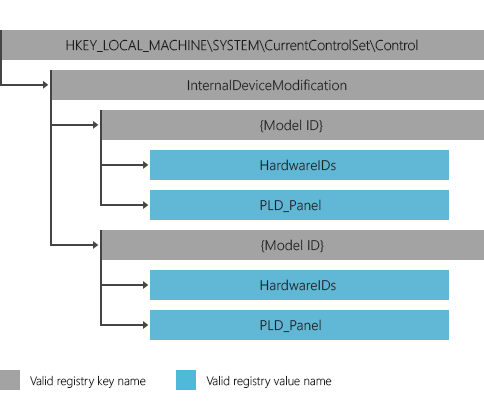

# Identifying the location of internal cameras (UWP device apps)


This topic provides info about supporting internal cameras on systems in Windows 8.1. It describes how to identify the physical location of built-in cameras so that they work correctly with UWP apps. It also describes how to set the Model ID so that the camera works with UWP device apps. To learn more about UWP device apps in general, see [Meet UWP device apps](meet-uwp-device-apps.md).

## <span id="Providing_physical_location"></span><span id="providing_physical_location"></span><span id="PROVIDING_PHYSICAL_LOCATION"></span>Providing physical location


Systems with built-in cameras with mechanically fixed direction must report the physical location of the cameras. This physical location info indicates which direction the camera is facing, such as front or back, so that apps for using the camera in Windows 8.1 function correctly.

The following two [Windows Hardware Certification Requirements](http://go.microsoft.com/fwlink/p/?LinkId=320504), which allow Windows to recognize a camera’s location, are required:

-   **System.Client.PCContainer.PCAppearsAsSingleObject**. The camera must be grouped into the computer’s device container, which contains the device functions located physically inside the computer. A camera must be grouped into the computer’s device container to expose its physical location to apps, because devices external to the computer container aren’t assumed to have a mechanically fixed direction.

-   **System.Client.Webcam.PhysicalLocation**. The firmware must provide physical location info, by using the \_PLD information in ACPI tables to indicate the location and orientation of the camera.

### <span id="Why_does_Windows_need_the_physical_location_cameras_"></span><span id="why_does_windows_need_the_physical_location_cameras_"></span><span id="WHY_DOES_WINDOWS_NEED_THE_PHYSICAL_LOCATION_CAMERAS_"></span>Why does Windows need the physical location cameras?

Windows needs to know the physical location of internal cameras for the following reasons:

-   UWP apps use the physical location to determine which camera to use if multiple cameras are present. For example, a chat application will default to using the front camera that faces the user when the app starts up.
-   UWP apps use the physical location to determine how to mirror or rotate the video preview.
-   If the camera is facing the user, the preview should look as if the user is looking into a mirror. To do this, the app will flip the left and right sides of the preview, so that the preview mirrors the video. If the camera is facing away from the user, the app does not need to mirror the video.
-   If the app rotates the preview, the degree of rotation differs depending on the position of the camera.

### <span id="How_to_group_the_camera_into_the_computers_device_container"></span><span id="how_to_group_the_camera_into_the_computers_device_container"></span><span id="HOW_TO_GROUP_THE_CAMERA_INTO_THE_COMPUTERS_DEVICE_CONTAINER"></span>How to group the camera into the computers device container

In accordance with certification requirement **System.Client.PCContainer.PCAppearsAsSingleObject**, also known as SYSFUND-0200, the internal camera device nodes must be grouped under the PC device container. In other words, the internal camera should not be displayed in **Devices and Printers** and must be consolidated into the PC container.

The way to implement this requirement depends on the bus type of the internal camera. If the device can expose information on the physical device location in ACPI tables, the correct grouping can be specified in the ACPI layer by including \_PLD information in the tables and modifying the UserVisible flag in the ACPI table, as described in [Multifunction Device Support and Device Container Groupings](http://go.microsoft.com/fwlink/p/?LinkId=320505). Otherwise, override the removable flag by using the DeviceOverrides registry key. For more info, see [DeviceOverrides Registry Key](http://go.microsoft.com/fwlink/p/?LinkId=320506).

### <span id="How_to_provide_physical_location_using__PLD_info_in_the_ACPI_table"></span><span id="how_to_provide_physical_location_using__pld_info_in_the_acpi_table"></span><span id="HOW_TO_PROVIDE_PHYSICAL_LOCATION_USING__PLD_INFO_IN_THE_ACPI_TABLE"></span>How to provide physical location using \_PLD info in the ACPI table

In accordance with certification requirement **System.Client.Webcam.PhysicalLocation**, the \_PLD value that indicates the camera’s location must be provided in the ACPI (Advanced Configuration and Power Interface) table. This applies to any camera device that is built into the chassis of the system and has mechanically fixed direction. The firmware must provide the \_PLD method and set the Panel field (bits\[69:67\]) to the appropriate value for the panel on which the camera is mounted. For example, Front indicates the camera faces the user (webcam), while Back indicates that the camera faces away from the end user (still or video camera).

| Value of bits \[69:67\] | Panel   |
|-------------------------|---------|
| 0                       | Top     |
| 1                       | Bottom  |
| 2                       | Left    |
| 3                       | Right   |
| 4                       | Front   |
| 5                       | Back    |
| 6                       | Unknown |

 

In addition, bit 143:128 (Vertical Offset), and bits 159:144 (Horizontal Offset) must provide the relative location of the camera with respect to the display. This origin is relative to the native pixel addressing in the display component and should match the present display orientation of landscape or portrait. The origin is the lower left hand corner of the display, where positive Horizontal and Vertical Offset values are to the right and up, respectively.

For a USB-connected internal camera, the device node for the USB device would be created in the ACPI table under a USB Port device node.

To specify the address (\_ADR), follow these steps.

1.  Install Windows to the target PC
2.  Go to **Device Manager**
3.  Right-click your target webacm and select **Properties**
4.  Open the **Details** tab and select **Address** in the **Property** menu
5.  The value in the **Value** box is the address that your device is located at
6.  Set the value in \_ADR in the ACPI table
7.  Set the \_PLD value based on the ACPI spec and the design of PC

This example is an ACPI table for a USB-connected camera. In this example, the value is 0x1. The ninth byte contains the panel code for the location (bits\[69:67\]). Note that if the device is a USB composite device, PLD must be on the video FUNCTION. This means an additional Device() entry would be needed.

```Text
Device(PRTD)
{
     Name(_ADR, 0x6)
     Name(_UPC, Package(0x4)
     {
            ....
     }
     Name(_PLD, Buffer(0x10)
     {
            ....
     }
     Device(WCAM)
     {
           Name(_ADR, 0x6)
           Name(_PLD, Buffer(0x10) {
           0x81, 0x00, 0x00, 0x00, 0x00, 0x00, 0x00, 0x00,
           0x20, 0x1C, 0x00, 0x00, 0x00, 0x00, 0x00, 0x00})
     }
}
```

Refer to the ACPI specification for more detailed information for \_PLD.

For nodes downstream of USBCCGP, the address value is calculated by adding the port number to the first interface number of the camera function. If USBCCGP isn’t loaded for the device, then the address is simply the port number. If you need to predict the address number without installing Windows, please use this formula to calculate it. If the target device is a single function device (without using the USB composite style device), the address value is calculated using only the port number.

## <span id="Providing_Model_ID"></span><span id="providing_model_id"></span><span id="PROVIDING_MODEL_ID"></span>Providing Model ID


The Windows device metadata system is able to query for an internally embedded camera’s device metadata package only if the camera’s device node has a **Model ID** property and the device category is `Imaging.Webcam`. To make an internal camera’s metadata discoverable by Windows so that the device metadata package is correctly associated with the device and the camera-specific UWP device app, an OEM needs to do the following:

-   Set the **Model ID** in the device node, by using the `InternalDeviceModification` flag in the device registry key

### <span id="How_to_set_the_Model_ID_for_the_internal_camera_s_device_node"></span><span id="how_to_set_the_model_id_for_the_internal_camera_s_device_node"></span><span id="HOW_TO_SET_THE_MODEL_ID_FOR_THE_INTERNAL_CAMERA_S_DEVICE_NODE"></span>How to set the Model ID for the internal camera's device node

For internal cameras, the OEM creates a GUID to use for the Model ID and creates a registry key for it. The **Model ID** property is added to the device node by using the InternalDeviceModification mechanism, which is a registry-based lookup table (LUT) that consists of registry keys that map to specific devices. This InternalDeviceModification table is maintained under the following registry key:

-   `HKEY_LOCAL_MACHINE\SYSTEM\CurrentControlSet\Control\InternalDeviceModification`

The subkey entry to create under the InternalDeviceModification registry key is the OEM-supplied GUID for ModelID. The presence of this key adds the Model ID to the camera’s device node, based on the device hardware ID and the location information indicated by the \_PLD value in the ACPI table.



### <span id="InternalDeviceModification_registry_key"></span><span id="internaldevicemodification_registry_key"></span><span id="INTERNALDEVICEMODIFICATION_REGISTRY_KEY"></span>InternalDeviceModification registry key

The InternalDeviceModification registry key indicates that at least one camera uses the ModelID.

|                     |                                                                                  |
|---------------------|----------------------------------------------------------------------------------|
| Registry key name   | `InternalDeviceModification`                                                     |
| Required/optional   | Required                                                                         |
| Path                | `HKEY_LOCAL_MACHINE\SYSTEM\CurrentControlSet\Control`                            |
| Format requirements | None                                                                             |
| Valid subkeys       | Model ID registry key (see the following subkey format requirements and examles) |

 

### <span id="Model_ID_registry_key"></span><span id="model_id_registry_key"></span><span id="MODEL_ID_REGISTRY_KEY"></span>Model ID registry key

|                     |                                                                                            |
|---------------------|--------------------------------------------------------------------------------------------|
| Registry key name   | Model ID (exact model ID value is the key name)                                            |
| Required/optional   | Required                                                                                   |
| Format requirements | The key name is a GUID created by the OEM. It must have both opening and closing brackets. |
| Valid values        | Hardware ID registry values or `PLD_Panel`                                                 |
| Examples            | `{43922620-DAD9-4C05-BE3F-F65B089D84D8}`                                                   |

 

### <span id="Hardware_ID_registry_value"></span><span id="hardware_id_registry_value"></span><span id="HARDWARE_ID_REGISTRY_VALUE"></span>Hardware ID registry value

<table>
<colgroup>
<col width="50%" />
<col width="50%" />
</colgroup>
<tbody>
<tr class="odd">
<td align="left">Registry value name</td>
<td align="left">HardwareIDs</td>
</tr>
<tr class="even">
<td align="left">Required/optional</td>
<td align="left">Required</td>
</tr>
<tr class="odd">
<td align="left">Type</td>
<td align="left">Multi-string</td>
</tr>
<tr class="even">
<td align="left">Format requirements</td>
<td align="left">Must include the bus prefix of the Hardware ID. All &quot;&amp;quot; characters must be replaced with a &quot;#&quot;.</td>
</tr>
<tr class="odd">
<td align="left">Examples</td>
<td align="left"><p><code>USB#VID_1234&amp;PID_ABCD&amp;REV_0001</code></p>
<p><code>PCI#VEN_ABCD&amp;DEV_1234&amp;SUBSYS_000</code></p></td>
</tr>
<tr class="even">
<td align="left">Comment</td>
<td align="left">Multiple hardware ID values can be provided. When any of the hardware IDs occur in the list more than once, the system sets the Model ID of the device node based on the hardware ID.</td>
</tr>
</tbody>
</table>

 

### <span id="PLD_Panel_registry_value"></span><span id="pld_panel_registry_value"></span><span id="PLD_PANEL_REGISTRY_VALUE"></span>PLD\_Panel registry value

|                     |                                                                                                  |
|---------------------|--------------------------------------------------------------------------------------------------|
| Registry value name | `PLD_Panel`                                                                                      |
| Required/optional   | Optional                                                                                         |
| Type                | DWORD                                                                                            |
| Format requirements | Must include the bus prefix of the HardwareID. All "\\" characters must be replaced with a "\#". |
| Examples            | 4,5                                                                                              |

 

### <span id="PLD_Panel_Details"></span><span id="pld_panel_details"></span><span id="PLD_PANEL_DETAILS"></span>PLD\_Panel Details

The PLD\_Panel value provided in ACPI tables enables cameras to be distinguished from each other when a system has two identical camera devices and both have identical hardware IDs. To create different Model IDs, the combination of hardware IDs and PLD\_Panel value is used.

**Note**  The PLD\_Panel setting in the registry key is optional. Windows determines the camera’s physical location by the settings in the ACPI table.

 

The PLD\_Panel registry value is defined as \_PLD (Physical Device Location) in the ACPI specification. This value, which indicates the camera’s physical location in its enclosure, must be one of the following.

| Value | Description                                                         |
|-------|---------------------------------------------------------------------|
| 0     | Top                                                                 |
| 1     | Bottom                                                              |
| 2     | Left                                                                |
| 3     | Right                                                               |
| 4     | Front                                                               |
| 5     | Back                                                                |
| 6     | Unknown (Vertical position and Horizontal position will be ignored) |

 

### <span id="InternalDeviceModification_registry_key_examples"></span><span id="internaldevicemodification_registry_key_examples"></span><span id="INTERNALDEVICEMODIFICATION_REGISTRY_KEY_EXAMPLES"></span>InternalDeviceModification registry key examples

The following examples demonstrate the format of the InternalDeviceModification registry key.

```Text
{00001111-2222-3333-4444-555566667777} 
      HardwareIDs (Multi sz) = 
      “USB#VID_1234&PID_ABCD&REV_0001”,“USB#VID_1234&PID_ABCD"
      PLD_Panel (DWORD) = 4
{88889999-aaaa-bbbb-cccc-ddddeeeeffff} 
      HardwareIDs (multi sz) = “USB#VID_5678&PID_WXYZ&REV_0001”
      PLD_Panel (DWORD) = 5        
Windows Registry Editor Version 5.00

[HKEY_LOCAL_MACHINE\SYSTEM\CurrentControlSet\Control\InternalDeviceModification]

[HKEY_LOCAL_MACHINE\SYSTEM\CurrentControlSet\Control\InternalDeviceModification\{BBBF38D6-9866-493D-B86F-986E339E096D}]
"PLD_Panel"=dword:00000004
"HardwareIDs"=hex(7):55,00,53,00,42,00,23,00,56,00,49,00,44,00,5f,00,30,00,34,\
  00,35,00,45,00,26,00,50,00,49,00,44,00,5f,00,30,00,30,00,31,00,30,00,23,00,\
  52,00,45,00,56,00,5f,00,30,00,30,00,30,00,31,00,00,00,55,00,53,00,42,00,23,\
  00,56,00,49,00,44,00,5f,00,30,00,34,00,35,00,45,00,26,00,50,00,49,00,44,00,\
  5f,00,30,00,30,00,31,00,30,00,00,00,00,00
```

### <span id="Metadata_structure"></span><span id="metadata_structure"></span><span id="METADATA_STRUCTURE"></span>Metadata structure

The device metadata package for an internal camera has the same structure as the device metadata package for any other device. The MetadataKey in **packageinfo.xml** within the device metadata package is the Model ID defined by using the InternalDeviceModification registry key. The Windows metadata system downloads the device metadata package based on the Model ID. The hardware ID of the internal camera is not used.

For more info about creating device metadata for your UWP device app, see [Building UWP device apps](the-workflow.md).

### <span id="Pre-installation"></span><span id="pre-installation"></span><span id="PRE-INSTALLATION"></span>Pre-installation

Both the Microsoft Store device app and the device metadata package can be preinstalled on the device using the OEM Preinstallation Kit (OPK).

## <span id="related_topics"></span>Related topics


[UWP device apps for internal devices](uwp-device-apps-for-specialized-devices.md)

 

 


