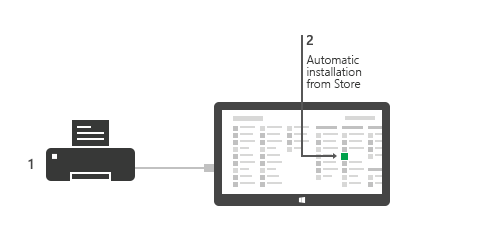

# Meet Windows Store device apps

Device manufacturers can create a Windows Store device app that serves as a companion to their device. Device apps are able to use the full range of functionality of a peripheral or internal device and can perform privileged operations, such as firmware updates. This topic provides an overview of the features and capabilities that make a Windows Store device app uniquely different from a regular Windows Store app.

**Note**  Each of these features is optional. A single device app doesn't need to use all of them. All of these features require device metadata.

 

For more info about what a Windows Store device app is and how to create one, see [Building Windows Store device apps](the-workflow.md).

##  Device update

When specified as a privileged app in device metadata, Windows Store device apps can perform multistep device operations in a device background task. This special type of background task can run to completion even if the app is moved to the background and suspended. This is necessary to allow reliable device servicing, like changes to persistent settings or firmware, without requiring the user to sit and watch a progress bar.

To create a background task for device servicing (device updates), use the [DeviceServicingTrigger](http://go.microsoft.com/fwlink/p/?LinkID=308965) trigger. A similar trigger, [DeviceUseTrigger](http://go.microsoft.com/fwlink/p/?LinkID=308967), which allows for reliable content synchronization, is available for all Windows Store apps . For more info, see [Device sync and update for Windows Store device apps](device-sync-and-update-for-windows-store-device-apps.md).

**Note**  Device background tasks constrain the amount of time the app can run in the background and are not intended to allow indefinite operation or infinite synchronization.

 

## AutoPlay

You can configure any Windows Store app, including your Windows Store device app, to automatically start when your AutoPlay-supported device is connected to the PC. However, that app must support the AutoPlay handler and specify the experience ID in the app manifest. You can also choose to let additional Windows Store apps act as AutoPlay handlers for your device.

For more info about AutoPlay and which device classes are supported in Windows 8.1, see [AutoPlay for Windows Store device apps](autoplay-for-windows-store-device-apps.md).

## Device apps for printers

Windows Store device apps can highlight the special features of printers through customized print settings flyouts and notifications support. Windows Store device apps can also display printer status, manage print jobs, and perform printer maintenance.

For info, see these topics:

-   [How to display printer status](how-to-display-printer-status.md)
-   [How to customize print settings](how-to-customize-print-settings.md)
-   [Working with print notifications](working-with-print-notifications.md)
-   [How to manage print jobs](how-to-manage-print-jobs.md)
-   [How to do printer maintenance](how-to-do-printer-maintenance.md)
-   [Printer extension library overview](printer-extension-library-overview.md)

## Device apps for cameras

Windows Store device apps can also highlight the special features of cameras through customized camera settings and special camera effects.

For more info, see these topics:

-   [How to customize camera options](how-to-customize-camera-options.md)
-   [Creating a camera driver MFT](creating-a-camera-driver-mft.md)
-   [Considerations for driver MFTs on multi-pin cameras](driver-mfts-on-multi-pin-cameras.md)
-   [Identifying the location of internal cameras](identifying-the-location-of-internal-cameras.md)

## Device apps for internal devices

OEMs and component suppliers can develop Windows Store device apps for devices that are internal to the PC. To access a device that is associated with the system container, an app must be specified as a privileged app in device metadata. Apps for internal devices are typically preinstalled on the PC and can be downloaded from the Windows Store. For more info, see [Windows Store device apps for internal devices](windows-store-device-apps-for-specialized-devices.md).

## Automatic installation

Windows Store device apps can automatically install when a user connects the device to their PC. If a connection to the Internet isn't available, Windows will try again later. Device apps are installed to **All Apps**.

**Warning**  It's important to consider that the automatic installation feature does not provide a notification to the user when the app is installed. Some users may find this experience confusing and frustrating, and give your app a bad rating.

 

For more info about automatic installation, see [Automatic installation for printers and cameras](auto-install-for-windows-store-device-apps.md).

## Related topics

[Building Windows Store device apps](the-workflow.md)

[Automatic installation for Windows Store device apps](auto-install-for-windows-store-device-apps.md)

[AutoPlay for Windows Store device apps](autoplay-for-windows-store-device-apps.md)

[Device sync and update for Windows Store device apps](device-sync-and-update-for-windows-store-device-apps.md)

 

 

[Send comments about this topic to Microsoft](mailto:wsddocfb@microsoft.com?subject=Documentation%20feedback%20[devapps\devapps]:%20Meet%20Windows%20Store%20device%20apps%20%20RELEASE:%20%281/20/2017%29&body=%0A%0APRIVACY%20STATEMENT%0A%0AWe%20use%20your%20feedback%20to%20improve%20the%20documentation.%20We%20don't%20use%20your%20email%20address%20for%20any%20other%20purpose,%20and%20we'll%20remove%20your%20email%20address%20from%20our%20system%20after%20the%20issue%20that%20you're%20reporting%20is%20fixed.%20While%20we're%20working%20to%20fix%20this%20issue,%20we%20might%20send%20you%20an%20email%20message%20to%20ask%20for%20more%20info.%20Later,%20we%20might%20also%20send%20you%20an%20email%20message%20to%20let%20you%20know%20that%20we've%20addressed%20your%20feedback.%0A%0AFor%20more%20info%20about%20Microsoft's%20privacy%20policy,%20see%20http://privacy.microsoft.com/default.aspx. "Send comments about this topic to Microsoft")

