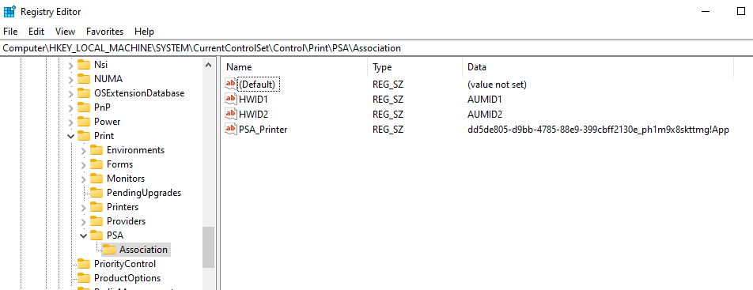
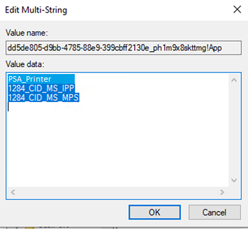

# Print support app association

> [!IMPORTANT]
> Some information relates to prerelease product that may be substantially modified before it's released. Microsoft makes no warranties, express or implied, with respect to the information provided here.

Follow the guidance in this article to setup and associate a print support app with a printer.

> [!IMPORTANT]
> Starting with the release of Windows 11 SDK (22000.1), Print Support Apps (PSA) are the recommended method of developing UWP apps for printers. To develop a Print Support App for your print device, download and install the [Windows 11 SDK (22000.1)](https://go.microsoft.com/fwlink/?linkid=2166460).

This article discusses the following tasks:

- Find a Hardware Id or a Compatible Id for your printer

- Prepare a psa.inf extension INF file

- Install the psa.inf extension INF file on a Windows 10 PC

- PSA association override for enterprise and business customers

- Use PSA with Universal Print

## Set up printers and find the Hardware Id or Compatible Id

A print support app (PSA) is associated with a printer queue, using a Hardware Id or a Compatible Id.

To find out the Hardware Id and Compatible Id for your printer, follow these steps:

1. Connect an IPP printer to the Windows 10 PC.

1. From **Control Panel**, select **View Devices and Printers**.

1. Right-click on your printer and select **Properties** from the context menu.

1. On the **Hardware** tab, select **Microsoft IPP Class Driver** in the list of **Device Functions** and select the **Properties** button.

1. In the **Properties** dialog, select **Details**, then select **Hardware Ids** (or Compatible Id).

1. Copy the Hardware ID string (it starts with "PSA\_"). You need this for extension INF, or alternatively, the Compatible Id (which doesn't start with "PSA\_").

### Prepare the PSA extension INF file

A PSA is associated with a printer by using an [extension INF](../install/using-an-extension-inf-file.md) file.

The following steps create and test an extension INF file:

1. Copy the psa.inf sample extension INF shown below as a starting point for your INF file.

1. Update **PrinterHardwareId** in psa.inf file with your Hardware Id or Compatible Id.

1. Update the **PackageFamilyName** and **AUMID** (AppUserModeId) for your PSA application.

1. Create a [catalog file](../devtest/inf2cat.md).

1. Sign the psa.cat file sample extension INF.

#### psa.inf sample extension INF file

```inf
[Version]
Signature = "$WINDOWS NT$"
Class = Extension
ClassGuid = {e2f84ce7-8efa-411c-aa69-97454ca4cb57}
Provider = %ManufacturerName%
ExtensionId = {D4D9196A-105B-4B76-B693-84BD33A7A703}
CatalogFile = psa.cat
DriverVer = 05/19/2020,16.35.13.542
PnpLockdown = 1

[Manufacturer]
%ManufacturerName% = Microsoft, NTamd64.6.3

[Microsoft.NTamd64.6.3]
%Device.ExtensionDesc% = PSA-Install, %PrinterHardwareId%
%Device.ExtensionDesc% = PSA-Install, %PrinterHardwareId2%
%Device.ExtensionDesc% = PSA-Install, %PrinterHardwareId3%

[PSA-Install.NT]
AddProperty = Add-PSA-Property

[PSA-Install.NT.Software]
AddSoftware = %SoftwareName%,, Microsoft-PSA-SoftwareInstall

[Microsoft-PSA-SoftwareInstall]
SoftwareType = %MicrosoftStoreType%
SoftwareID = pfn://%PackageFamilyName%

[Add-PSA-Property]
{A925764B-88E0-426D-AFC5-B39768BE59EB}, 1, 0x12,, %AUMID%

[Strings]
ManufacturerName = "Microsoft"
SoftwareName = "Microsoft Print Support App"
Device.ExtensionDesc = "Print Support App Extension"
MicrosoftStoreType = 2
PackageFamilyName = "dd5de805-d9bb-4785-88e9-399cbff2130e_ph1m9x8skttmg"
AUMID = "dd5de805-d9bb-4785-88e9-399cbff2130e_ph1m9x8skttmg!App"
PrinterHardwareId = "PSA_CanoniP110_seriesD84F"
PrinterHardwareId2 = "PSA_XeroxAltaLink_B8055C036"
PrinterHardwareId3 = "PSA_BrotherMFC-J775DWF678"
```

### Test install extension INF on Windows 10

1. Import your root certificate to the trusted store, if you used a self-signed certificate to sign the .cat file.

1. Open an elevated command prompt and run the following command:

    ```console
    pnputil.exe /add-driver psa.inf
    ```

## PSA association override for enterprise and business customers

For consumer and home users, PSA is downloaded from the Microsoft Store and installed based on the printer's hardware ID or compatible ID. This is supported for enterprise and business customers as well, if they choose to use the PSA from their printer manufacturer. Association is controlled by the extension INF published on Windows Update by printer manufacturers.

Enterprise and business customers may need to override extension INF association, if they choose to use a business logic PSA (for example, a line of business app). They need to deploy and associate a custom PSA that has built-in business logic. Examples of the business logic are managing print quota and cost, or print policy (no color or no single side printing).

A registry key can be used to override a PSA association from an extension INF. This registry key method can be used for enterprise customers with Windows Print Server (Point and Print) and Universal Print.

Here's a ranking of how PSA is associated:

1. Printer manufacturers' custom v3/v4 driver is downloaded from Windows Update (no PSA is used)

1. Registry key is used to associate PSA

1. Extension INF is used to associate PSA

1. IPP printing without PSA

We recommend that enterprise customers use Microsoft Endpoint Manager to distribute the registry key. They can use Endpoint Manager to deploy a custom PSA as well.

The registry key is defined as follows:

| Key item | Value |
|--|--|
| Registry key path | HKEY_LOCAL_MACHINE\SYSTEM\CurrentControlSet\Control\Print\PSA\Association |
| Name | Hardware Id or Compatible Id |
| Type | REG_SZ |
| Value | PSA AUMID, for example, "dd5de805-d9bb-4785-88e9-399cbff2130e_ph1m9x8skttmg!App" |

The PSA key in **Registry Editor**:



The **Value name** and **Value data** in the **Edit Multi-String** dialog:



## Using PSA with Universal Print

You can associate PSA with printers that natively support Universal Print.

> [!IMPORTANT]
> Printers using [Universal Print Connector](/universal-print/fundamentals/universal-print-connector-overview#:~:text=The%20Universal%20Print%20connector%20is%20a%20component%20that,use%20a%20connector.%20Connect%20printers%20to%20Universal%20Print) are not supported by Microsoft for use with PSA. However, in some instances, printers using Universal Print Connector may be supported by the original equipment manufacturer ("OEM") that provides the PSA and printer hardware.  Please check with your OEM.  The OEM, and not Microsoft, will be responsible for issues related to this OEM enablement and support.

You can find the Hardware Id of a Universal Print printer in **Control Panel**, similar to a local IPP printer:

1. From **Control Panel**, select **View Devices and Printers**.

1. Right-click on your printer and select **Properties** from the context menu.

1. On the **Hardware** tab, select **Universal Print Class Driver** in the list of **Device Functions** and select the **Properties** button.

1. In the **Properties** dialog, select **Details**, then select **Hardware Ids**.

The Hardware Id is the printer-device-id IPP attribute from the printer.


## See also

[Print support app design guide](./print-support-app-design-guide.md)

[Windows.Devices.Printers](/uwp/api/windows.devices.printers?view=winrt-insider&preserve-view=true)

[Windows.Graphics.Printing.PrintSupport](/uwp/api/windows.graphics.printing.printsupport?view=winrt-insider&preserve-view=true)

[Windows.Graphics.Printing.Workflow](/uwp/api/windows.graphics.printing.workflow?view=winrt-insider&preserve-view=true)

[*Internet Printing Protocol (IPP) specification*](https://tools.ietf.org/html/rfc8011)
