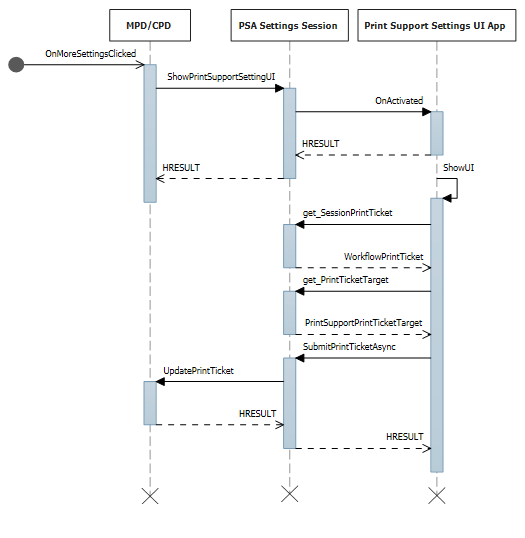

# Print support app design guide

This article provides guidance and examples for printer OEMs and IHVs to develop a print support app (PSA) that can enhance a Windows user's print experience in several ways.

> [!IMPORTANT]
> Starting with the release of Windows 11 SDK (22000.1), Print Support Apps (PSA) are the recommended method of developing UWP apps for printers. To develop a Print Support App for your print device, download and install the Windows 11 SDK for the Windows version you are targeting.

> [!IMPORTANT]
> This topic contains sections that describe PSA functionality that is available starting in Windows 11, version 22H2. Those sections contain a note indicating that it applies to that version.

Some printer features aren't presented in print dialogs shown by Windows as they're special features that need help from a manufacturer app to be configured correctly. They may also be features that aren't provided in the default capabilities of the printer.

Printer specific features can be grouped in a way that makes it easy for the user to pick an option and trust that all the features that are involved in that scenario are automatically set to the correct values. An example of this could be a choice between ink-saver, paper-saver and highest quality modes what could manipulate various print features automatically based on one selection from the user. Windows is unable to automatically group them as that requires understanding all the custom features of every printer model.

This need for showing custom print preferences is addressed by this API with an optional UWP extension contract that can be activated by the user from all Windows print dialogs and custom print dialogs that use API provided by Windows. Manufacturers are able to tailor their UI to provide the best print experience for the specific printer the user owns.

Another area where the printer manufacturers can improve and differentiate is print quality. Manufacturers can improve print quality after rendering by optimizing the content for the specific printer. They can also present a high-fidelity preview that better represents the final output as it could take printer specific features into consideration.


## Terminology

| Term | Definition |
|--|--|
| PSA | Print Support Application. A UWP app that uses the API described in this article. |
| MPD | Modern Print Dialog. This is shown to the user when an app is printing using Windows.Graphics.Printing API. |
| CPD | Common Print Dialog. This is shown to the user when app is printing using the Win32 API. Apps that need to show print preview don't trigger this dialog and implement a version of dialog themselves. Office apps are a prime example of this. |
| IPP | Internet Printing Protocol. Used from a client device to interact with the printer to retrieve and set printing preferences and to send the document to be printed. |
| Print Support Associated Printer | Printer that is linked to PSA. |
| IPP Printer | Printer that supports IPP protocol. |
| More Settings | Link that opens partner provided app UI in MPD. Defaults to opening built in print preferences UI when there's no PSA installed. |
| Printer Preferences UI | Dialog used to set default printer options that are applied at print time. For example: orientation, paper size, color, print on both sides, and so on. |
| PDL | Page Description Language. The format in which a document is sent to the printer. |
| Associated PSA Printer | Physical IPP printer associated with a PSA application. |
| PrintDeviceCapabilities | XML document format for defining printer capabilities. For more information, see [Print Ticket and Print Capabilities Technologies](../print/print-ticket-and-print-capabilities-technologies.md). |
| PrintTicket | Collection of various print related features and their values used to capture the user's intent for a given print job. |
| PrintSupportExtension | PSA background task responsible for providing printer constraint extension capabilities. |

## Print support namespace

These samples reference a **printsupport** namespace, which is defined as:

```xml
    xmlns:printsupport="http://schemas.microsoft.com/appx/manifest/printsupport/windows10"
```

## Print support settings UI

When a user is about to print a document, they often would like to set some preferences with which to print it. For example, they may choose to print a document in landscape orientation. They may also take advantage of a custom feature that their printer supports. Windows provides default UI to show custom preferences, but the user may not understand them as there are no appropriate icons or descriptions. Windows may also be using the wrong UI control to present it. Such a custom feature is best presented by an app that understands the feature completely. This is the motivation behind offering an API that lets the printer manufacturers create apps tailored to the various printer models they make.

A new UAP extension contract is created with a new category named windows.printSupportSettingsUI. Apps activated with this contract receive a new ActivationKind called PrintSupportSettingsUI. This contract doesn't require any new capability.

```xml
<Extensions>
    <printsupport:Extension Category="windows.printSupportSettingsUI" 
        EntryPoint="PsaSample.PsaSettingsUISample"/>
</Extensions>
```

This contract is invoked when the user selects **More Settings** in MPD or **Preferences** in CPD. This contract can also be invoked from **Printing Preferences** in the Settings app. When the contract is activated, the app receives a **PrintSupportSettingsUISession** object that can be used to get the current **PrintTicket** and **PrintDevice** objects. The **PrintDevice** object can be used for communicating with the printer to receive printer and job attributes. The app can then show UI with appropriate options of the printer to the user. When the user makes the choices and selects **OK**, the application may then modify the print ticket, validate it, and then submit back using **PrintSupportPrintTicketTarget** object. If the user chooses to cancel the preferences window, changes should be discarded, and the application should exit by completing the deferral taken from the **PrintSupportSettingsUISession** object.

The Print Support App is expected to handle multiple simultaneous activations for different print jobs, so such an app must support multiple instances using the **SupportsMultipleInstances** element in the package.appxmanifest file. Failure to do so might result in situations where confirming preferences of one print job might close other preferences windows that may be open. The user is required to open those preferences windows again.

The following sequence diagram represents the concept of Settings UI print ticket manipulation:



### Changing PrintTicket in the settings UI

C# sample code for activation of the Settings UI when launched from any print dialog (MPD/CPD or custom print dialog) or from system settings:

```csharp
namespace PsaSampleApp
{
    sealed partial class App : Application
    {
        Deferral settingsDeferral;
        protected override void OnActivated(IActivatedEventArgs args)
        {
            if (args.Kind == ActivationKind.PrintSupportSettingsUI)
           {
                // Get the activation arguments
                var settingsEventArgs = args as PrintSupportSettingsActivatedEventArgs;
                PrintSupportSettingsUISession settingsSession = settingsEventArgs.Session;
                // Take deferral
                this.settingsDeferral = settingsEventArgs.GetDeferral();

                // Create root frame
                var rootFrame = new Frame();
                
        // Choose the page to be shown based upon where the application is being launched from
                switch (settingsSession.LaunchKind)
                {
                    case SettingsLaunchKind.UserDefaultPrintTicket:
                    {
                        // Show settings page when launched for default printer settings
                        rootFrame.Navigate(typeof(DefaultSettingsView), settingsSession);
                    }
                    break;
                    case SettingsLaunchKind.JobPrintTicket:
                    {
               // Show settings page when launched from printing app
                       rootFrame.Navigate(typeof(JobSettingsView), settingsSession);
                    }
                    break;
                }
                
   
                Window.Current.Content = rootFrame; 
            }
        }

        internal void ExitSettings()
        {
            settingsDeferral.Complete();
        } 
    }
}
```

XAML for **DefaultSettingsView** class:

```xml
<Page
    x:Class="PsaSampleApp.DefaultSettingsView"
    xmlns="http://schemas.microsoft.com/winfx/2006/xaml/presentation"
    xmlns:x="http://schemas.microsoft.com/winfx/2006/xaml"
    xmlns:local="using:PsaSampleApp"
    Background="{ThemeResource ApplicationPageBackgroundThemeBrush}">

    <Grid>
        <Grid.RowDefinitions>
            <RowDefinition Height="*" />
            <RowDefinition Height="Auto" />
        </Grid.RowDefinitions>
        <StackPanel Grid.Row="0"  Orientation="Vertical" Margin="30,50,0,0">
           <ComboBox x:Name="OrientationOptions" ItemsSource="{x:Bind OrientationFeatureOptions}" SelectedItem="{x:Bind SelectedOrientationOption, Mode=TwoWay}" DisplayMemberPath="DisplayName" HorizontalAlignment="Left" Height="Auto" Width="Auto" VerticalAlignment="Top"/>
       </StackPanel>

        <StackPanel Grid.Row="1" Orientation="Horizontal">
            <Button x:Name="Ok" Content="Ok" HorizontalAlignment="Left" Margin="50,0,0,0" VerticalAlignment="Top" Click="OkClicked"/>
            <Button x:Name="Cancel" Content="Cancel" HorizontalAlignment="Left" Margin="20,0,0,0" VerticalAlignment="Top" Click="CancelClicked"/>
        </StackPanel>
    </Grid>
</Page>
```

C# sample code for showing UI and changing PrintTicket:

```csharp
namespace PsaSampleApp
{
    /// <summary>
    /// Class for showing print settings to the user and allow user to modify it
    /// </summary>
    public sealed partial class DefaultSettingsView: Page
    {
        private IppPrintDevice printer;
        private PrintSupportSettingsUISession uiSession;
        private WorkflowPrintTicket printTicket;
        private App application;
        // Bound to XAML combo box
        public ObservableCollection<PrintTicketOption> OrientationFeatureOptions { get; } = new ObservableCollection<PrintTicketOption>();
        public PrintTicketOption SelectedOrientationOption { get; set; }  

        public SettingsView()
        {
            this.InitializeComponent();
            this.application = Application.Current as App;
            this.orientationFeatureOptions = new ObservableCollection<PrintTicketOption>();
        }

        internal void OnNavigatedTo(NavigationEventArgs e)
        {
            this.uiSession = = e.Parameter as PrintSupportSettingsUISession;
            this.printer = session.SessionInfo.Printer;
            this.printTicket = session.SessionPrintTicket;
            
            PrintTicketCapabilities printTicketCapabilities = this.printTicket.GetCapabilities();

            // Read orientation feature from PrintTicket capabilities
            PrintTicketFeature feature = printTicketCapabilities.PageOrientationFeature;
            // Populate XAML combo box with orientation feature options
            this.PopulateOrientationOptionComboBox(feature.Options); 

            PrintTicketOption printTicketOrientationOption = printTicket.PageOrientationFeature.GetSelectedOption();
            // Update orientation option in XAML combo box
            this.SelectedOrientationOption = this.orientationFeatureOptions.Single((option)=> (option.Name == printTicketOrientationOption.Name && option.XmlNamespace == printTicketOrientationOption.XmlNamespace));
        }

        private async void OkClicked(object sender, RoutedEventArgs e)
        {
            // Disable Ok button while the print ticket is being submitted
            this.Ok.IsEnabled = false;

            // Set selected orientation option in the PrintTicket and submit it
            PrintTicketFeature orientationFeature = this.printTicket.PageOrientationFeature;
            orientationFeature.SetSelectedOption(this.SelectedOrientationOption);
            // Validate and submit PrintTicket
            WorkflowPrintTicketValidationResult result = await printTicket.ValidateAsync();
            if (result.Validated)
            {
                // PrintTicket validated successfully – submit and exit
                this.uiSession.UpdatePrintTicket(printTicket);
                this.application.ExitSettings();
            }
            else
            {
                this.Ok.IsEnabled = true;
                // PrintTicket is not valid – show error
                this.ShowInvalidPrintTicketError(result.ExtendedError);
            }
        }

        private void CancelClicked(object sender, RoutedEventArgs e)
        {
            this.application.ExitSettings();
        }
    }
}
```

### Get printer attributes from the printer device

WireShark response from an IPP printer to a get-printer-attributes query:


C# sample code for getting ink names and ink levels from the printer:

```csharp
namespace PsaSampleApp
{
    /// <summary>
    /// Class for showing print settings to the user
    /// </summary>
    public sealed partial class SettingsView : Page
    { 
       IList<string> inkNames;
       IList<int> inkLevels;
        
        private async void GetPrinterAttributes()
        {
            // Read ink names and levels, along with loaded media-sizes
            var attributes = new List<string>();
            attributes.Add("marker-names");
            attributes.Add("marker-levels");
            attributes.Add("media-col-ready");
            IDictionary<string, IppAttributeValue> printerAttributes = this.printer.GetPrinterAttributes(attributes);

            IppAttributeValue inkNamesValue = printerAttributes["marker-names"];
            CheckValueType(inkNamesValue, IppAttributeValueKind.Keyword);
            this.inkNames = inkNamesValue.GetKeywordArray();
            
            IppAttributeValue inkLevelsValue = printerAttributes["marker-levels"];
            CheckValueType(inkLevelsValue, IppAttributeValueKind.Integer);
            this.inkLevels = inkLevelsValue.GetIntegerArray();
    
            // Read loaded print media sizes
        IppAttributeValue mediaReadyCollectionsValue = printerAttributes["media-col-ready"];
            foreach (var mediaReadyCollection in mediaReadyCollectionsValue.GetCollectionArray())
            {
                IppAttributeValue mediaSizeCollection;
                if (mediaReadyCollection.TryGetValue("media-size", out mediaSizeCollection))
                {
                    var xDimensionValue = mediaSizeCollection.GetCollectionArray().First()["x-dimension"];
                    var yDimensionValue = mediaSizeCollection.GetCollectionArray().First()["y-dimension"];
                    CheckValueType(xDimensionValue, IppAttributeValueKind.Integer);
                    CheckValueType(yDimensionValue, IppAttributeValueKind.Integer);
                    int xDimension = xDimensionValue.GetIntegerArray().First();
                    int yDimension = yDimensionValue.GetIntegerArray().First();
                    this.AddMediaSize(xDimension, yDimension);
                }
            }
        }

        private void CheckValueType(IppAttributeValue value, IppAttributeValueKind expectedKind)
        {
            if (value.Kind != expectedKind)
            {
                throw new Exception(string.Format("Non conformant type found: {0}, expected: {1}", value.Kind, expectedKind));
            }
        }
    }
}
```

### Setting printer attributes on the printer

C# sample code for setting printer attributes:

```csharp
int defaultResolutionX = 1200;
int defaultResolutionY = 1200;
string pdlFormat = "image/pwg-raster";
private async void SetPrinterAttributes()
{
    var attributes = new Dictionary<string, IppAttributeValue>();
    attributes.Add("document-format-default", IppAttributeValue.CreateKeyword(this.pdlFormat));
    var resolution = new IppResolution(this.defaultResolutionX, this.defaultResolutionY, IppResolutionUnit.DotsPerInch);
    attributes.Add("printer-resolution-default", IppAttributeValue.CreateResolution(resolution));
            
    var result = this.printer.SetPrinterAttributes(attributes);
    if (!result.Succeeded)
    {
        foreach (var attributeError in result.AttributeErrors)
        {
            var attributeName = attributeError.Key;
            switch (attributeError.Value.Reason)
            {
            case IppAttributeErrorReason.AttributeValuesNotSupported:
                var values = attributeError.Value.GetUnsupportedValues().First();
                this.LogUnSupportedValues(attributeName, values);
                break;
            case IppAttributeErrorReason.AttributeNotSettable:
                this.LogAttributeNotSettable(attributeName);
                break;
            case IppAttributeErrorReason.AttributeNotSupported:
                this.LogAttributeNotSupported(attributeName);
                break;
            case IppAttributeErrorReason.RequestEntityTooLarge:
                this.LogAttributeNotEntityTooLarge(attributeName);
                break;
            case IppAttributeErrorReason. ConflictingAttributes:
                this.LogConflictingAttributes(attributeName);
                break;
            }
        }
    }
}
```

## Extending printer constraints

The Print Support App supports custom PrintTicket validation and defining the default PrintTicket. This section describes how we support these features.

To support printer extension constraints, a new background task type, PrintSupportExtension, has been implemented. The Package.appxmanifest has an extensibility entry for the Print Support Extension as shown here:

```xml
<Extensions>
    <printsupport:Extension Category="windows.printSupportExtension" 
        EntryPoint="PsaBackgroundTasks.PrintSupportExtension"/>
</Extensions>
```

This service can run at any point in a print job for the associated IPP printer. As the Print Support Extension is activated via the function Run(IBackgroundTaskInstance taskInstance), an instance of IBackgroundTaskInstance is given to PrintSupportExtension to provide access to the PrintSupportExtensionTriggerDetails runtime class, which internally provides PrintSupportExtensionSession as a property. The PrintSupportExtension background class can then use the session object to register for events that it wants to provide custom functionality.

1. `event Windows.Foundation.TypedEventHandler<PrintSupportExtensionSession, PrintSupportPrintTicketValidationRequestedEventArgs>; PrintTicketValidationRequested;`

    If the Print Support Extension provides its own PrintTicket validation mechanism, it can register for this event. Whenever a PrintTicket needs to be validated, the print system raises this event. PrintSupportExtension will then get the current PrintTicket that needs to be validated within the EventArgs. The PrintSupportExtension background class can then check the PrintTicket for validity and modify it to resolve any conflicts. The PrintSupportExtension background class should then set the result for validation using the function SetPrintTicketResult to indicate if the PrintTicket has been resolved, has conflicts, or is invalid. This event can be raised anytime during the lifetime of a print job. If the PrintSupportExtension class doesn't register for this event, the print system performs its own validation of the PrintTicket.

1. `event Windows.Foundation.TypedEventHandler<PrintSupportExtensionSession, PrintSupportPrintDeviceCapabilitiesChangedEventArgs>; PrintDeviceCapabilitiesChanged;`

    The event is raised after the print system updates the cached PrintDeviceCapabilities of the associated IPP printer. When this event is raised, the PrintSupportExtension background class can inspect the changed PrintDeviceCapabilities and modify it.

### Custom validation of print ticket

C# sample code for providing PrintTicket validation service:

```csharp
public void Run(IBackgroundTaskInstance taskInstance)
{
    // Take task deferral
    this.taskDeferral = taskInstance.GetDeferral();
    // Associate a cancellation handler with the background task
    taskInstance.Canceled += OnTaskCanceled;

    var psaTriggerDetails = taskInstance.TriggerDetails as PrintSupportExtensionTriggerDetails;

    var serviceSession = psaTriggerDetails.Session as PrintSupportExtensionSession;

    this.ippPrintDevice = serviceSession.Printer;
    serviceSession.PrintTicketValidationRequested += this.OnPrintTicketValidationRequested;
    serviceSession.PrinterDeviceCapabilitiesChanged += this.OnPdcChanged;
    serviceSession.Start();
}

private void OnTaskCanceled(IBackgroundTaskInstance sender, BackgroundTaskCancellationReason reason)
{
    // Complete the deferral
    this.taskDeferral.Complete();
}

private void OnPrintTicketValidationRequested(PrintSupportExtensionSession session, PrintSupportPrintTicketValidationRequestedEventArgs args)
{
    using (args.GetDeferral())
    {
        // Get PrintTicket that needs needs to be validated and resolved   
        var printTicket = args.PrintTicket;
                
        // Validate and resolve PrintTicket
        WorkflowPrintTicketValidationStatus validationStatus = this.ValidateAndResolvePrintTicket(printTicket);
        args.SetPrintTicketValidationStatus(validationStatus);
    }
}
```

### Updating PrintDeviceCapabilities

```csharp
private void OnPdcChanged(PrintSupportExtensionSession session, PrintSupportPrintDeviceCapabilitiesChangedEventArgs args)
{
    using (args.GetDeferral())
    {
        var pdc = args.GetCurrentPrintDeviceCapabilities();

        // Check current PDC and make changes according to printer device capabilites
        XmlDocument newPdc = this.CheckAndUpdatePrintDeviceCapabilities(pdc);
        args.UpdatePrintDeviceCapabilities(newPdc);
    }
}
```

## Enhancement of print quality

Once the user has committed to print by pressing the print button on print dialog, the document to be printed is sent to the print stack from the app that is printing. This document then undergoes transformation (rendering to PDL) to make it suitable for the target printer. Windows will determine what transformation to choose based on attributes queried from the printer. The transformed document is then sent to the printer. While this works well for most printers, there are cases where the quality of print could be improved by allowing a partner app to participate in the transformation. To facilitate this, the current printing Workflow API is extended to include calls to the app at additional points from the print stack. This API supports two new events which PSA app can register for. These are the only entry points into the PSA API surface:

1. **JobStarting**

    - This event is raised when a print job is started by any application. When the event is raised, a Print Support App can chose to skip system rendering by calling SetSkipSystemRendering on PrintWorkflowJobStartingEventArgs. If skip system rendering is chosen, the print system won't convert the XPS document into the PDL format that is required by the printer. Instead, the XPS generated by the printing application will be directly given to the PSA that is then responsible for converting XPS to PDL format.

1. **PdlModificationRequested**

    - This event is raised when Windows starts the conversion of the XPS stream to the PDL format indicated by the printer. Runtime class PrintWorkflowPdlModificationRequestedEventArgs is provided as an argument for this event. This event class provides PDL source and target objects for reading and writing the print job content. If the App determines that it needs user input, it can launch UI using PrintWorkflowUILauncher from the EventArgs. This API uses the Tester-Doer pattern. PrintWorkflowUILauncher won't be able to invoke the UI if the function IsUILaunchEnabled returns false. This function returns false if the PSA session is running in silent mode (headless or kiosk mode). The Print Support App shouldn't try to launch UI if the function returns false.

    An OutputStream is available as part of PrintWorkflowPdlTargetStream that is returned by the function GetStreamTargetAsync. Content written to the target OutputStream is passed along to the printer as document content.

Sequence diagram for the PDL modification event:


The PSA foreground application is launched when the PSA background task requests launching UI. The PSA can use the foreground contract to get user input and/or to show a preview print preview to the user.

### Print support workflow background task

A new **printSupportWorkflow** background task type has been defined. The Package.appxmanifest has the following extensibility entry for the **PrintSupportWorkflow** contract:

```xml
<Extensions>
    <printsupport:Extension Category="windows.printSupportWorkflow" 
        EntryPoint="PsaBackgroundTasks.PrintSupportWorkflowSample"/>
</Extensions>
```

On activation of the contract, **PrintWorkflowJobTriggerDetails** is given as **IBackgroundTaskInstance->TriggerDetails**. **PrintWorkflowJobTriggerDetails** internally provides **PrintWorkflowJobBackgroundSession** as part of its properties. The app can use **PrintWorkflowJobBackgroundSession** to register for events related to various injection points in the print job workflow. After the event registration is done, the app must call **PrintWorkflowJobBackgroundSession::Start** for the print system to start firing events related to various injection points.

### Print workflow job UI

A new **ActivationKind** called **PrintSupportJobUI** is defined. This doesn't require a new capability.

```xml
<Extensions>
    <printsupport:Extension Category="windows.printSupportJobUI" 
        EntryPoint="PsaSample.PrintSupportJobUISample"/>
</Extensions>
```

This is a UI contract that can be launched from either the Print Support Workflow background contract, or when the user selects a print job error toast. On activation, **PrintWorkflowJobActivatedEventArgs** is provided, which has a **PrintWorkflowJobUISession** object. Using **PrintWorkflowJobUISession**, the foreground application should register for the **PdlDataAvailable** event if it wants to access the PDL data. If the foreground application would like to show custom error messages for any errors that can occur during the job, it should register for the **JobNotification** event. Once the events are registered, the application should call the **PrintWorkflowJobUISession::Start** function in order for the print system to start firing events.

### Skipping system rendering

```csharp
namespace PsaBackground
{
    class PrintSupportWorkflowBackgroundTask : IBackgroundTask
    {
        BackgroundTaskDeferral taskDeferral;
        public void Run(IBackgroundTaskInstance taskInstance)
        {
            // Take Task Deferral            
            taskDeferral = taskInstance.GetDeferral();

            var jobTriggerDetails = taskInstance.TriggerDetails as PrintWorkflowJobTriggerDetails;

            var workflowBackgroundSession = jobTriggerDetails.PrintWorkflowJobSession as PrintWorkflowJobBackgroundSession;
            // Register for events
            workflowBackgroundSession.JobStarting += this.OnJobStarting;
            workflowBackgroundSession.PdlModificationRequested += this.OnPdlModificationRequested;
            // Start Firing events
            workflowBackgroundSession.Start();
        }
    
        private void OnJobStarting(PrintWorkflowJobBackgroundSession session, PrintWorkflowJobStartingEventArgs args)
        {
            using (args.GetDeferral())
            {
                // Call SetSkipSystemRendering to skip conversion for XPS to PDL, so that PSA can directly manipulate the XPS file.
                args.SetSkipSystemRendering();
            }
        }
     }
}
```

### PDL modification event

Sequence diagram for the PDL modification event:


C# sample code for Print Support Job Monitor reading and writing print job content:

```csharp
private void OnPdlModificationRequested(PrintWorkflowJobBackgroundSession session, PrintWorkflowPdlModificationRequestedEventArgs args)
{
    using (args.GetDeferral())
    {
        IInputStream pdlContent = args.SourceContent.GetInputStream();
        // Specify the Content type of stream that will be written to target that is passed to printer accordingly.
        PrintWorkflowPdlTargetStream streamTarget = args.CreateJobOnPrinter(args.SourceStream.ContentType);
        IOutputStream outputStream = streamTarget.GetOutputStream();

        using (var inputReader = new Windows.Storage.Streams.DataReader(pdlContent))
        {
            inputReader.InputStreamOptions = InputStreamOptions.Partial;
            using (var outputWriter = new Windows.Storage.Streams.DataWriter(outputStream))
            {
                // Write the updated Print stream from input stream to the output stream
                uint chunkSizeInBytes = 256 * 1024; // 256K chunks
                
                uint lastAllocSize = 0;
                byte[] contentData = new byte[chunkSize];
                while(this.ReadChunk(inputReader, ref contentData))
                {
                    
                    // Make any changes required to the input data
                    // ...                        
                    // Write out the modified content
                    outputWriter.WriteBytes(contentData);
                    await outputWriter.StoreAsync();
                }
            }
        }
        streamTarget.CompleteStreamSubmission(PrintWorkflowSubmittedStatus.Succeeded);
        this.taskDeferral.Complete();
        }
    }
}
```

### Launching UI from workflow background

C# sample code for launching the Print Support Job UI from PSA PDL modification requested event contract:

```csharp
private async void OnPdlModificationRequested(PrintWorkflowJobBackgroundSession session, PrintWorkflowPdlModificationRequestedEventArgs args)
{
    IInputStream pdlContent = args.SourceContent.GetInputStream();
    WorkflowPrintTicket printTicket = args.PrinterJob.GetJobPrintTicket();

    bool uiRequired = this.IsUIRequired(pdlContent, printTicket);
    if (!uiRequired)
    {
        // Specify the Content type of content that will be written to target that is passed to printer accordingly.
        PrintWorkflowPdlTargetStream streamTarget = args.CreateJobOnPrinter (args.SourceStream.ContentType);
        // Process content directly if UI is not required
        this.ProcessContent(pdlContent, streamTarget);
    }
    else if (args.UILauncher.IsUILaunchEnabled())
    {
        // LaunchAndCompleteUIAsync will launch the UI and wait for it to complete before returning 
        PrintWorkflowUICompletionStatus status = await args.UILauncher.LaunchAndCompleteUIAsync();
        if (status == PrintWorkflowUICompletionStatus.Completed)
        {
            PrintWorkflowPdlTargetStream streamTarget = args.CreateJobOnPrinter(args.SourceStream.ContentType);
            this.ProcessContent(pdlContent, streamTarget);
        }
        else
        {
            if (status == PrintWorkflowUICompletionStatus.UserCanceled)
            {
                // Log user cancellation and cleanup here.
                this.taskDeferral.Complete();
            }
            else
            {
                // UI launch failed, abort print job.
                args.Configuration.AbortPrintFlow(PrintWorkflowAbortReason.JobFailed);
                this.taskDeferral.Complete();
            }
        }
    }
    else
    {
        // PSA requires to show UI, but launching UI is not supported at this point because of user selection.
        args.Configuration.AbortPrintFlow(PrintWorkflowAbortReason.JobFailed);
        this.taskDeferral.Complete();
    }
}
```

### Workflow job UI activation for PDLDataAvailable event

Sequence diagram for print job UI activation for the **PdlDataAvailable** event:


C# sample code for the PSA job UI activation contract:

```csharp
namespace PsaSampleApp
{
    sealed partial class App : Application
    {
        protected override void OnActivated(IActivatedEventArgs args)
        {
            if (args.Kind == ActivationKind.PrintSupportJobUI)
            {
                var rootFrame = new Frame();
        
                rootFrame.Navigate(typeof(JobUIPage));
                Window.Current.Content = rootFrame;
        
                var jobUI = rootFrame.Content as JobUIPage;

                // Get the activation arguments
                var workflowJobUIEventArgs = args as PrintWorkflowJobActivatedEventArgs;

                PrintWorkflowJobUISession session = workflowJobUIEventArgs.Session;
                session.PdlDataAvailable += jobUI.OnPdlDataAvailable;
                session.JobNotification += jobUI.OnJobNotification;
                // Start firing events
                session.Start(); 
            }
        }
    }
}

namespace PsaSampleApp
{
    public sealed partial class JobUIPage : Page    
    {
        public JobUIPage()
        {
            this.InitializeComponent();
        }

        public string WorkflowHeadingLabel;

        public void OnPdlDataAvailable(PrintWorkflowJobUISession session, PrintWorkflowPdlDataAvailableEventArgs args)
        {
            using (args.GetDeferral())
            {
                string jobTitle = args.Configuration.JobTitle;
                string sourceApplicationName = args.Configuration.SourceAppDisplayName;            
                string printerName = args.Printer.PrinterName;
                this.WorkflowHeadingLabel = string.Format(this.formatHeading, jobTitle, sourceApplicationName, printerName);

                // Get pdl stream and content type
                IInputStream pdlContent = args.SourceContent.GetInputStream();
                string contentType = args.SourceContent.ContentType;
                this.ShowPrintPreview(pdlContent, contentType);
            }
        }
    }
}
```

### Get printer job attributes

C# sample code for getting job attributes for a print job:

```csharp
namespace PsaBackground
{
    class PrintSupportWorkflowBackgroundTask : IBackgroundTask
    {
        private async void OnPdlModificationRequested(PrintWorkflowJobBackgroundSession session, 
                             PrintWorkflowPdlModificationRequestedEventArgs args)
        {
            using (args.GetDeferral())
            {
                string colorMode = this.GetJobColorMode(args.PrinterJob);
                if (colorMode != "monochrome")
                {
                    this.SetJobColorModeToMonochrome(args.PrinterJob);
                } 
            }
        }

        private string GetJobColorMode(PrintWorkflowPrinterJob printerJob)
        {
            var attributes = new List<string>();
            attributes.Add("print-color-mode");
             // Gets the IPP attributes from the current print job
            IDictionary<string, IppAttributeValue> printerAttributes = printerJob.GetJobAttributes(attributes);

            var colorModeValue =  printerAttributes["print-color-mode"];
            this.CheckValueType(colorModeValue, IppAttributeValueKind.Keyword);

            return colorModeValue.GetKeywordArray().First();
        }
    }
} 
```

### Set printer job attributes

C# sample code, continuing from the *Get printer job attributes* section above, demonstrating setting job attributes:

```csharp
private async void SetJobColorModeToMonochrome(PrintWorkflowPrinterJob printerJob)
{
    var attributes = new Dictionary<string, IppAttributeValue>();
    attributes.Add("print-color-mode", IppAttributeValue.CreateKeyword("monochrome"));

    var result = PrinterJob.SetJobAttributes(attributes);
    if (!result.Succeeded)
    {
        this.LogSetAttributeError(result.AttributeErrors);
    }
}
```

Some IPP printers don't support getting/setting job attributes after the job is created. For those printers, **PrintJob** has the **JobId** property set to "0" and **GetJobAttributes**/**SetJobAttributes** will fail immediately with an exception.

### Providing storage file access to PDL content

Some PDL formats like PDF need a complete stream to be available to start processing. For that reason, a new method named **GetContentFileAsync** is provided on the **PrintWorkflowPdlSourceContent** class that returns a **StorageFile** of the source content.

```csharp
public sealed partial class JobUIPage : Page
{
    public async void OnPdlDataAvailable(PrintWorkflowJobUISession session, PrintWorkflowPdlDataAvailableEventArgs args)
    {
        using (args.GetDeferral())
        {
            if (String.Equals(args.SourceContent.ContentType, "application/pdf", StringComparison.OrdinalIgnoreCase))
            {
                // Wait for all PDL data to be available
                StorageFile sourceFile == await args.SourceContent.GetContentFileAsync();
                IRandomAccessStream sourceStream = await sourceFile.OpenReadAsync();

                PdfDocument pdfDocument = await PdfDocument.LoadFromStreamAsync(sourceStream);

                for (uint i = 0; i < pdfDocument.PageCount; i++)
                {
                    PdfPage page = pdfDocument.GetPage(i);
                    var pageImage = new InMemoryRandomAccessStream();
                    await page.RenderToStreamAsync(pageImage);
                    this.AddImageToPreviewImageList(pageImage);
                }
            }
        }
    }
}    
```

### PDL conversion of XPS to PDF

C# sample code showing PDL conversion of XPS to PDF:

```csharp
private async void OnPdlModificationRequested(PrintWorkflowJobBackgroundSession session, PrintWorkflowPdlModificationRequestedEventArgs args)
{
    using (args.GetDeferral())
    {
        if (String.Equals(args.SourceContent.ContentType, "application/oxps", StringComparison.OrdinalIgnoreCase))
        {
            var xpsContent = args.SourceContent.GetInputStream();

            var printTicket = args.PrinterJob.GetJobPrintTicket();
            PrintWorkflowPdlTargetStream streamTarget = args.CreateJobOnPrinter("application/pdf");

            // Modify XPS stream here to make the needed changes 
            // for example adding a watermark

            PrintWorkflowPdlConverter pdlConverter = args.GetPdlConverter(PrintWorkflowPdlConversionType.XpsToPdf);
            await pdlConverter.ConvertPdlAsync(printTicket, xpsContent, streamTarget.GetOutputStream());

            streamTarget.CompleteStreamSubmission(PrintWorkflowSubmittedStatus.Succeeded);
        }
        else
        {
            // We except source content to be XPS in this case, abort the session if it is not XPS.
            args.Configuration.AbortPrintFlow(PrintWorkflowAbortReason.JobFailed);
        }
    }
    this.taskDeferral.Complete();
}
```

### Job notification event

Sequence diagram for job notification event:


C# sample code, continuing from the workflow job UI activation for **PDLDataAvailable** event section above, to show error on job notification:

```csharp
public sealed partial class JobUIPage : Page    
{
    public void OnJobNotification(PrintWorkflowJobUISession session, PrintWorkflowJobNotificationEventArgs args)
    {
        using (args.GetDeferral())
        {
            PrintWorkflowPrinterJobStatus jobStatus = args.PrintJob.GetJobStatus();

            switch (jobStatus)
            {
                case PrintWorkflowPrinterJobStatus::Error:
                    // Show print job error to the user
                    Frame->Navigate(JobErrorPage::typeid, this);
                break;
                case PrintWorkflowPrinterJobStatus::Abort:
                    // Show message that print job has been aborted.
                    Frame->Navigate(JobAbortPage::typeid, this);
                break;
                case PrintWorkflowPrinterJobStatus::Completed:
                    // Show job successfully completed message to the user.
                    Frame->Navigate(JobCompletedPage::typeid, this);
                break;
            }
        }
    }    
}
```

### Create job with initial job attributes

Currently, some IPP printers don't support set-attribute operation. The **CreateJobOnPrinterWithAttributes** function and CreateJobOnPrinterWithAttributesBuffer function on **PrintWorkflowPdlDataAvailableEventArgs** are provided to mitigate this issue. Using these APIs, a PSA developer can provide job attributes that are passed to printer when job is created on the printer.

```csharp
public sealed partial class JobUIPage : Page
{
    public async void OnPdlDataAvailable(PrintWorkflowJobUISession session, PrintWorkflowPdlDataAvailableEventArgs args)
    {
       var attributes = new Dictionary<string, IppAttributeValue>();
       attributes.Add("print-color-mode", IppAttributeValue.CreateKeyword("monochrome"));
       // Create job on printer with initial job attributes
       PrintWorkflowPdlTargetStream streamTarget = args.CreateJobOnPrinterWithAttributes(attributes, "application/pdf");
        // Write data to target stream
    }
}

```

### Sequential XPS processing

C++/Winrt sample code for processing XPS sequentially before spooling is completed.

```cpp
namespace winrt
{
    struct WorkflowReceiver : public winrt::implements<WorkflowReceiver, IPrintWorkflowXpsReceiver2>
    {
        STDMETHODIMP SetDocumentSequencePrintTicket(_In_ IStream* documentSequencePrintTicket) noexcept override
        {
            // process document sequence print ticket
            return S_OK;
        }

        STDMETHODIMP SetDocumentSequenceUri(PCWSTR documentSequenceUri) noexcept override
        {
            // process document sequence URI
        }

        STDMETHODIMP AddDocumentData(UINT32 documentId, _In_ IStream* documentPrintTicket,
            PCWSTR documentUri) noexcept override
        {
            // process document URI and print ticket
            return S_OK;
        }

        STDMETHODIMP AddPage(UINT32 documentId, UINT32 pageId,
            _In_ IXpsOMPageReference* pageReference, PCWSTR pageUri)  noexcept override
        {
            // process XPS page
            return S_OK;
        }

        STDMETHODIMP Close() noexcept override
        {
            // XPS processing finished
            return S_OK;
        }

        STDMETHODIMP Failed(HRESULT XpsError) noexcept override
        {
            // XPS processing failed, log error and exit
            return S_OK;
        }
    };

    void PsaBackgroundTask::OnPdlModificationRequested(PrintWorkflowJobBackgroundSession session,
        PrintWorkflowPdlModificationRequestedEventArgs args)
    {
    auto contentType = args.SourceContent().ContentType();
        if (contentType == L"application/oxps")
        {
                    auto xpsContent = args.SourceContent().GetInputStream();
                    PrintWorkflowObjectModelSourceFileContent xpsContentObjectModel(xpsContent);
                    com_ptr<IPrintWorkflowObjectModelSourceFileContentNative> xpsContentObjectModelNative;
                    check_hresult(winrt::get_unknown(xpsContentObjectModel)->QueryInterface( 
                                                        IID_PPV_ARGS(xpsContentObjectModelNative.put())));
        
                    auto xpsreceiver = make_self<WorkflowReceiver>();
                    check_hresult(xpsContentObjectModelNative->StartXpsOMGeneration(xpsreceiver.get()));
        }
    }
}
```

## Display name localization and PDL Passthrough API integration

> [!IMPORTANT]
> This section describes PSA functionality available starting in Windows 11, version 22H2.

In this scenario, the PSA customizes the Print Device Capabilities (PDC) and provides Print Device Resources (PDR) for string localization.

The PSA also sets the supported PDL Passthrough API content types (PDL formats). If the PSA doesn't subscribe to the event or doesn't call **SetSupportedPdlPassthroughContentTypes** explicitly, the PDL Passthrough is disabled for the printers associated with this PSA app.

```csharp
// Event handler called every time PrintSystem updates PDC or BindPrinter is called
 private void OnPdcChanged(PrintSupportExtensionSession session, PrintSupportPrintDeviceCapabilitiesChangedEventArgs args)
{
    using (args.GetDeferral())
    {
        XmlDocument pdc = args.GetCurrentPrintDeviceCapabilities();
        XmlDocument pdr = args.GetCurrentPrintDeviceResources();
        
        // Check current PDC and make changes according to printer device capabilities 
        XmlDocument newPdc = this.CheckAndUpdatePrintDeviceCapabilities(pdc);
        // Get updated printer devices resources, corresponding to the new PDC 
        XmlDocument newPdr = this.GetPrintDeviceResourcesInfo(newPdc, pdr, args.ResourceLanguage);

        // Update supported PDL formats 
        args.SetSupportedPdlPassthroughContentTypes(GetSupportedPdlContentTypes());
        
        args.UpdatePrintDeviceCapabilities(newPdc);
        args.UpdatePrintDeviceResources(newPdr);
    }
}
```

## Page level feature support and operation attributes

> [!IMPORTANT]
> This section describes PSA functionality available starting in Windows 11, version 22H2.

The page level feature support and operation attributes scenarios are grouped because they're addressed by making changes in the same place in the sample code.

- **Page level feature support:** In this scenario, the PSA application specifies the page level attribute, which shouldn't be overridden by an IPP attribute parsed from the PrintTicket.

- **Separate collection for operation attributes support (PIN printing):** In this scenario, PSA application specifies custom IPP operation attributes (for example, PIN).

The following C# sample code shows required changes for **Page Level feature support** and **Separate collection for operation attributes** scenarios.

```csharp
private void OnPdlModificationRequested(PrintWorkflowJobBackgroundSession session, PrintWorkflowPdlModificationRequestedEventArgs args)
{
    using (args.GetDeferral())
    {
        IInputStream pdlContent = args.SourceContent.GetInputStream();
    
        // Custom job attributes to add to the printJob
        IDictionary<string, IppAttributeValue> jobAttributes = LocalStorageUtil.GetCustomIppJobAttributes();
        // Custom operation attributes to add to printJob
        IDictionary<string, IppAttributeValue> operationAttributes = LocalStorageUtil.GetCustomIppOperationAttributes();
        
        // PSA has an option to select preferred PDL format
        string documentFormat = GetDocumentFormat(args.PrinterJob.Printer);
    
        // Create PrintJob with specified PDL and custom attributes
        PrintWorkflowPdlTargetStream targetStream = args.CreateJobOnPrinterWithAttributes(jobAttributes, documentFormat  , operationAttributes,
           PrintWorkflowAttributesMergePolicy  .DoNotMergeWithPrintTicket /*jobAttributesMergePolicy*/, PrintWorkflowAttributesMergePolicy.MergePreferPsaOnConflict /*operationAttributesMergePolicy*/);
    
        // Adding a watermark to the output(targetStream) if source payload type is XPS
        this.ModifyPayloadIfNeeded(targetStream, args, documentFormat, deferral);
    
        // Marking the stream submission as Succeeded.
        targetStream.CompleteStreamSubmission(PrintWorkflowSubmittedStatus.Succeeded);
    
        this.taskDeferral.Complete();
    }
}
```

## Enhancing the print dialog with PSA

> [!IMPORTANT]
> This section describes PSA functionality available starting in Windows 11, version 22H2.

In this scenario, using the print dialog with PSA integration enables the following actions:

- Get a callback when selection is changed in the MPD to the printer associated with PSA

- Show one AdaptiveCard with a support of **openUrl** action

- Show custom features and parameters on the print dialog

- Modify the PrintTicket, thus changing the selection for feature options shown in the print dialog

- Get the **Windows.ApplicationModel.AppInfo** of the printing app, opening the print dialog

The following C# sample illustrates these print dialog enhancements:

```csharp
public BackgroundTaskDeferral TaskInstanceDeferral { get; set; }

public void Run(IBackgroundTaskInstance taskInstance)
{
    // Take task deferral 
    TaskInstanceDeferral   = taskInstance.GetDeferral();
    // Associate a cancellation handler with the background task 
    taskInstance.Canceled += OnTaskCanceled;

    if (taskInstance.TriggerDetails is PrintSupportExtensionTriggerDetails extensionDetails)
    {
         PrintSupportExtensionSession session = extensionDetails.Session;
         session.PrintTicketValidationRequested += OnSessionPrintTicketValidationRequested;
         session.PrintDeviceCapabilitiesChanged += OnSessionPrintDeviceCapabilitiesChanged;
         session.PrinterSelected += this.OnPrinterSelected;
    }
}

private void OnTaskInstanceCanceled(IBackgroundTaskInstance sender, BackgroundTaskCancellationReason reason)
{
    TaskInstanceDeferral.Complete();
}

// Event handler called when the PSA Associated printer is selected in Print Dialog
private void OnPrinterSelected(PrintSupportExtensionSession session, PrintSupportPrinterSelectedEventArgs args)
{
    using (args.GetDeferral())
    {
        // Show adaptive card in the Print Dialog (generated based on Printer and Printing App) 
        args.SetAdaptiveCard  (GetCustomAdaptiveCard(session.Printer, args.SourceAppInfo));

        // Request to show Features and Parameters in the Print Dialog if not shown already
        const string xmlNamespace = "\"http://schemas.microsoft.com/windows/2003/08/printing/printschemakeywords\"";
        var additionalFeatures= new List<PrintSupportPrintTicketElement> { new PrintSupportPrintTicketElement { LocalName = "PageMediaType", NamespaceUri = xmlNamespace } };                  
        var additionalParameters = new List<PrintSupportPrintTicketElement> { new PrintSupportPrintTicketElement { LocalName = "JobCopiesAllDocuments", NamespaceUri = xmlNamespace } };

        if ((featuresToShow.Count + parametersToShow.Count) <= args.AllowedCustomFeaturesAndParametersCount)
        {
            args.SetAdditionalFeatures(additionalFeatures);
            args.SetAdditionalParameter(additionalParameters);
        }
        else
        {
            // Cannot show that many additional features and parameters, consider reducing the number
            // of additional features and parameters by selecting only the most important ones
        }
    }
}

// Create simple AdaptiveCard to show in MPD
public IAdaptiveCard GetCustomAdaptiveCard(IppPrintDevice ippPrinter, AppInfo appInfo)
{
    return AdaptiveCardBuilder.CreateAdaptiveCardFromJson($@"
        {{""body"": [
                {{ 
                    ""type"": ""TextBlock"",
                    ""text"": ""Hello {appInfo.DisplayInfo.DisplayName} from {ippPrinter.PrinterName}!""
                }}
              ],
              ""$schema"": ""http://adaptivecards.io/schemas/adaptive-card.json"",
            ""type"": ""AdaptiveCard"",
            ""version"": ""1.0""
        }}");
}
```

## PDL conversion with host-based processing flags

> [!IMPORTANT]
> This section describes PSA functionality available starting in Windows 11, version 22H2.

The current PDL conversion API, **PrintWorkflowPdlConverter.ConvertPdlAsync**, does host-based processing by default. This means that the host/printing computer does the rotation, page order, and so on, so that printer doesn't need to perform these operations. However, printer IHVs may want PDL conversion without host-based processing as their printer can do this better. The **ConvertPdlAsync** function takes in host-based processing flags to address this requirement. The PSA can skip all host-based processing or a particular host-based processing operation using this flag.

```csharp
class HostBaseProcessingRequirements
{
    public bool CopiesNeedsHostBasedProcessing = false;
    public bool PageOrderingNeedsHostBasedProcessing = false;
    public bool PageRotationNeedsHostBasedProcessing = false;
    public bool BlankPageInsertionNeedsHostBasedProcessing = false;
}

private async void OnPdlModificationRequested(PrintWorkflowJobBackgroundSession sender, PrintWorkflowPdlModificationRequestedEventArgs args)
{
    using (args.GetDeferral())
    {
        var targetStream = args.CreateJobOnPrinter("application/pdf");
        var pdlConverter = args.GetPdlConverter(PrintWorkflowPdlConversionType.XpsToPdf);

        var hostBasedRequirements = this.ReadHostBasedProcessingRequirements(args.PrinterJob.Printer);
            
        PdlConversionHostBasedProcessingOperations hostBasedProcessing = PdlConversionHostBasedProcessingOperations.None;
        if (hostBasedRequirements.CopiesNeedsHostBasedProcessing)
        {
            hostBasedProcessing |= PdlConversionHostBasedProcessingOperations.Copies;
        }

        if (hostBasedRequirements.PageOrderingNeedsHostBasedProcessing)
        {
            hostBasedProcessing |= PdlConversionHostBasedProcessingOperations.PageOrdering;
        }

        if (hostBasedRequirements.PageRotationNeedsHostBasedProcessing)
        {
            hostBasedProcessing |= PdlConversionHostBasedProcessingOperations.PageRotation;
        }

        if (hostBasedRequirements.BlankPageInsertionNeedsHostBasedProcessing)
        {
            hostBasedProcessing |= PdlConversionHostBasedProcessingOperations.BlankPageInsertion;
        }

        await pdlConverter.ConvertPdlAsync(args.PrinterJob.GetJobPrintTicket(), args.SourceContent.GetInputStream(), targetStream.GetOutputStream(), hostBasedProcessing);
    }
}

private HostBaseProcessingRequirements ReadHostBasedProcessingRequirements(IppPrintDevice printDevice)
{
    // Read Host based processing requirements for the printer
}
```

## Set Print Device Capabilities (PDC) update policy

> [!IMPORTANT]
> This section describes PSA functionality available starting in Windows 11, version 22H2.

Printer IHVs may have different requirements on when Print Device Capabilities (PDC) needs to be updated. To address these requirements, **PrintSupportPrintDeviceCapabilitiesUpdatePolicy** can set an update policy for the PDC. PSA can set the PDC update policy based on time or the number of print jobs using this API.

### Set PDC update policy based on number of jobs

```csharp
// Event handler called every time PrintSystem updates PDC
private void OnPdcChanged(PrintSupportExtensionSession session, PrintSupportPrintDeviceCapabilitiesChangedEventArgs args)
{
    using (args.GetDeferral())
    {
        // Set update policy to update the PDC on bind printer of every print job.
        var updatePolicy = PrintSupportPrintDeviceCapabilitiesUpdatePolicy.CreatePrintJobRefresh(1);
        args.SetPrintDeviceCapabilitiesUpdatePolicy(updatePolicy);      
    }
}
```

### Set PDC update policy based on TimeOut

```csharp
// Event handler called every time PrintSystem updates PDC
private void OnPdcChanged(PrintSupportExtensionSession session, PrintSupportPrintDeviceCapabilitiesChangedEventArgs args)
{
    using (args.GetDeferral())
    {
        // Set update policy to update the PDC on bind printer of every print job.
        var updatePolicy = PrintSupportPrintDeviceCapabilitiesUpdatePolicy.CreatePrintJobRefresh(1);
        args.SetPrintDeviceCapabilitiesUpdatePolicy(updatePolicy);      
    }
}
```

## General print support app (PSA) design guidance

When designing a print support app, it's important to include these aspects in the design:

- Both foreground and background contracts should be marked as supporting multiple instances, for example, **SupportsMultipleInstance** should be present in the package manifest. This is to ensure that the lifetime of the contracts can be managed reliably for multiple simultaneous jobs.

- Treat launching UI for PDL modification as an optional step. Make a best effort to complete the print job successfully even if launching of UI wasn't allowed. Print jobs should only be aborted if there's no way to complete them successfully without user input during PDL modification. Consider sending the PDL unmodified in such cases.

- When launching UI for PDL modification, call **IsUILaunchEnabled** before calling **LaunchAndCompleteUIAsync**. This is to ensure that scenarios that can't show UI at the current time continue to print correctly. These scenarios could be on a headless device or a device that is currently in kiosk mode or don't disturb mode.

## Related articles

[Print support app association](./print-support-app-association.md)

[Windows.Devices.Printers](/uwp/api/windows.devices.printers?view=winrt-insider&preserve-view=true)

[Windows.Graphics.Printing.PrintSupport](/uwp/api/windows.graphics.printing.printsupport?view=winrt-insider&preserve-view=true)

[Windows.Graphics.Printing.Workflow](/uwp/api/windows.graphics.printing.workflow?view=winrt-insider&preserve-view=true)

[*Internet Printing Protocol (IPP) specification*](https://tools.ietf.org/html/rfc8011)
