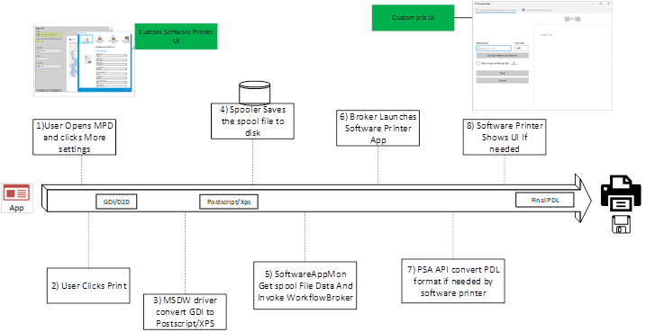
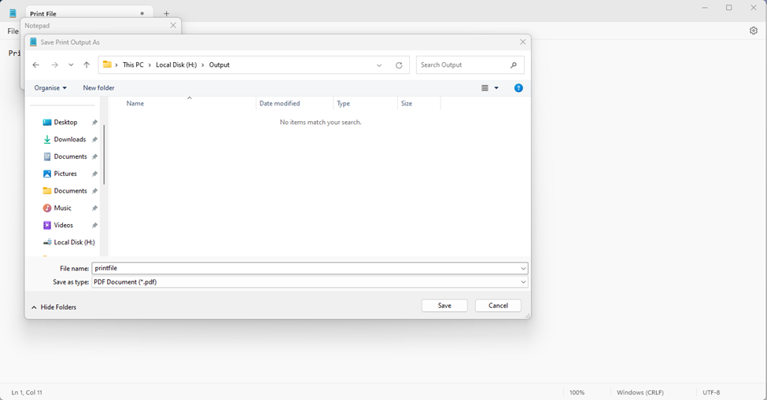

# Print Support App v4 API design guide

Print Support App v4 API supports a Virtual Printer Architecture to facilitate the implementation of Virtual Printers without legacy third-party drivers. Through this architecture, an Independent Software Vendor (ISV) is able to implement a Virtual Printer as an application implementing the features currently supported by legacy third-party V3/V4 drivers. The article describes how an application can register itself as a Virtual Printer and how to implement PDL conversion and UI elements required for implementation.

Print Support App (PSA) is the architecture that was introduced to help IHVs add customization to IPP printers without the use of legacy third-party drivers. To facilitate the ease of transition to the new Virtual Printer all the APIs are part of the Print Support App* API namespace, and reuses some of the PSA contracts that are applicable to Virtual Printer architecture.

For more information, see the following articles:

| Topic | Description |
|--|--|
| [Print Support App design guide](print-support-app-design-guide.md) | Provides guidance and examples for printer OEMs and IHVs that are implementing a print support app (PSA) for their device. |
| [Print Support App v3 API design guide](print-support-app-v3-design-guide.md) | Provides guidance and examples for printer OEMs and IHVs that are implementing a v3 Print Support App (PSA) for their device. |
| [MSIX Manifest Specification for Print Support Virtual Printer](msix-manifest-specification-print-support-virtual-printer.md) | Provides MSIX manifest guidance and examples for printer OEMs and IHVs that are implementing a Print Support Virtual Printer. |
| [Print support app association](print-support-app-association.md) | Provides guidance and examples for associating a print support app (PSA) with a printer. |

This article shows how PSA APIs are extended to support Software Endpoint and a few other PSA scenarios required by IHVs.

## Terminology

| Term | Definition |
|--|--|
| PSA | Print Support Application. UWP app that uses the API in this document. |
| MXDC | Microsoft XPS Document Converter |
| MPD | Modern Print Dialog. This dialog is shown to the user when an app is printing using Windows.Graphics.Printing API. |
| CPD | Common Print Dialog. This dialog is shown to the user when the app is printing using Win32 API. |
| IPP | Internet Printing Protocol. Used from a client device to interact with the printer to retrieve and set printing preferences and send the document to be printed. |
| Print Support Associated Printer | Physical IPP Printer that is linked to PSA. |
| IPP Printer | Printer which supports IPP protocol. |
| MSDW | Microsoft Document Writer |
| Printer Preferences UI | Dialog where the user can change the preferences related to a printer that would be applied at print time. Examples include orientation, paper size, color, print on both sides, and so on. |
| PDL | Page Description Language. The format in which a document is sent to printer. |
| Associated PSA Printer | Every PSA is associated with a Physical IPP Printer. |
| PDC | PrintDeviceCapabilities XML document format for defining printer capabilities. |
| SoftwareAppMon | Port monitor DLL for new Virtual Printer queue |
| PrintSupportExtension | PSA background task is responsible for providing printer constraint extension capabilities. |

## Print Support APIs reuse for Software Endpoint

- **Virtual Printer as IppPrintDevice** - [**IppPrintDevice**](/uwp/api/windows.devices.printers.ippprintdevice) is a Winrt class introduced as part of the PSA APIs. The Virtual Printer is added as an IPP printer device and [**IppPrinterDevice::IsIppPrinter**](/uwp/api/windows.devices.printers.ippprintdevice.isippprinter) returns true for newly added Virtual Printer. This is done so that PDL passthrough works seamlessly for both Virtual Printers and IPP printers, and to reuse much of PSA API surface that is already present. The **IppPrintDevice** class functions ([**GetPrinterAttributesAsBuffer**](/uwp/api/windows.devices.printers.ippprintdevice.getprinterattributesasbuffer), [**GetPrinterAttributes**](/uwp/api/windows.devices.printers.ippprintdevice.getprinterattributes), [**SetPrinterAttributesFromBuffer**](/uwp/api/windows.devices.printers.ippprintdevice.setprinterattributesfrombuffer), and [**SetPrinterAttributes**](/uwp/api/windows.devices.printers.ippprintdevice.setprinterattributes)) are changed accordingly for Virtual Printer. **GetPrinterAttributesAsBuffer** and **GetPrinterAttributes** always return not supported for any IPP attribute passed in and **SetPrinterAttributesFromBuffer** and **SetPrinterAttributes** always return error result with error set to access denied for Virtual Printers. This is because Virtual Printers only specify PDC in appx manifest and don't support any IPP printer attributes.  

- **windows.printSupportSettingsUI contract reuse for Virtual Printer** - **Windows.printSupportSettingsUI** is a UI contract introduced as part of PSA to show custom print preferences UI for the user for the IPP printer using PSA. The Print Support App v4 API samples in this article reuse the same contract to support custom print preferences for the UI for Virtual Printer without any changes.

- **windows.printSupportJobUI contract reuse for Virtual Printer** - **Windows.printSupportJobUI** is a UI contract introduced as part of PSA to show UI for the user in case where PSA wants user input or show the print preview to the user. This contract is reused for  Virtual Printer to show UI to the user for inputs or to show preview. For more information, see the [Software Endpoint UI sample](#software-endpoint-ui-sample) for the changes made to the APIs in the **Windows.printSupportJobUI** contract.

- **windows.printSupportExtension contract reuse for Virtual Printer** - **Windows.printSupportExtension** is a background contract introduced as part of PSA which can be used by PSA if they want customized Print Ticket validation and other features. Virtual Printers can also reuse this contract if the app wants to do custom validation of the print ticket or PDC regeneration.

## Print Support App v4 API samples

The following diagram describes the print workflow for a Virtual Printer.



This section describes how Virtual Printers are installed using appx manifest entries and how a Virtual Printer is invoked in various scenarios.

### windows.PrintSupportVirtualPrinterWorkflow contract

For an app to register itself as a Virtual Printer it needs to have XML manifest which is part of either UWP appx package or [MSIX installer](/windows/msix/desktop/desktop-to-uwp-manual-conversion).

The following sample is an Appx manifest for a Virtual Printer and the description of what each field refers to.

```xml
<Extensions>
    <printsupport2:Extension Category="windows.printSupportVirtualPrinterWorkflow" EntryPoint="Tasks.PrintSupportWorkflowBackgroundTask">
        <printsupport2:PrintSupportVirtualPrinter DisplayName="ms-resource://PRINTER_NAME1" PrinterUri="contoso-psa:printer1" PreferredInputFormat="application/postscript" OutputFileTypes="ps;pdf" PdcFile="Config\PRINTER_PDC1.xml" PdrFile="Config\PRINTER_PDR1.xml">
            <printsupport2:SupportedFormats>
                <printsupport2:SupportedFormat Type="application/postscript" />
                <printsupport2:SupportedFormat Type="application/pdf" MaxVersion="1.7" />
            </printsupport2:SupportedFormats>
        </printsupport2:PrintSupportVirtualPrinter>
    </printsupport2:Extension>
    <printsupport2:Extension Category="windows.printSupportVirtualPrinterWorkflow" EntryPoint="Tasks.PrintSupportWorkflowBackgroundTask">
        <printsupport2:PrintSupportVirtualPrinter DisplayName="ms-resource://PRINTER_NAME2" PrinterUri ="contoso-psa:printer2" PreferredInputFormat="application/oxps" OutputFileTypes="pwgr;pdf" PdcFile=" Config\PRINTER_PDC2.xml" PdrFile=" Config\PRINTER_PDR2.xml">
            <printsupport2:SupportedFormats>
                <printsupport2:SupportedFormat Type="application/pdf" MaxVersion="1.7" />
            </printsupport2:SupportedFormats>
        </printsupport2:PrintSupportVirtualPrinter>
    </printsupport2:Extension>
    <printsupport:Extension Category="windows.printSupportExtension" EntryPoint="Tasks.PrintSupportExtensionBackGroundTask"/>
    <printsupport:Extension Category="windows.printSupportSettingsUI" EntryPoint="PrintSupportApp.App"/>
    <printsupport:Extension Category="windows.printSupportJobUI" EntryPoint="PrintSupportApp.App"/>
</Extensions>
```

This is a contract used for installing the Virtual Printers Queue and can also act as a background endpoint for the installed Virtual Printer. A single appx manifest can install multiple print queues, which is associated with the same installed application. When a user prints onto the new Virtual Printer Queue, the Virtual Printer application is launched in the background and raises events with PrintWorkflowVirtualPrinterDataAvailableEventArgs runtime class as Event Args. The runtime class has APIs to read the PDL data, Launch UI for the application if needed, and so on.

- **PrintSupportVirtualPrinter** - Each entry specifies one Software endpoint print queue to be installed along with the application.

- **PreferredInputFormat** - This field indicates the Preferred input PDL format for the Virtual Printer. Windows Print System generates this format before giving PDL data to the Virtual Printer for all printing paths. The field can only be the following values: application/oxps or application/postscript. Installation fails if other formats are specified in this field. If the field isn't specified, application/oxps is set as the preferred input PDL format for the installed Virtual Printer.

- **OutputFileTypes** - When this field is specified in the appx manifest, the Windows Print System creates a printer queue that is marked as a file printer, and the Save As dialog is shown to the user when an application starts printing to the Virtual Printer. The values of this field should contain target file extensions such as pdf/pwgr/ps etc. These values are stored in driver data and are added to Save as Dialog as the allowed extensions. Windows Print System creates a [**StorageFile**](/uwp/api/windows.storage.storagefile) class for the user selected file and is given to the Virtual Printer App as part of the Event Args API. If a Virtual Printer doesn't want file print behavior (this includes Virtual Printers that store print data to the cloud or printers that send data to an application like OneNote), then this field shouldn't be added to the manifest.



- **Supported Formats** - Virtual Printer can use this field to specify all the PDL formats that it can process. This is used for passthrough printing applications like Microsoft Edge to identify the supported format like PDF and directly pass a PDF stream to the Virtual Printer without any changes being done in between by the Windows Print system. This field has SupportedFormat as the child field. SupportedFormat has field Type to specify the supported MIME type and field MaxVersion specifies the max version of that PDL format that Virtual Printer can receive. MaxVersion value must be in the format MajorVersion.MinorVersion. Windows print system fails printer installation if it is in any other format. MajorVersion and MinorVersion any only be numbers if any characters are present version field is invalidated and ignored.

- **PdcFile** - This field must point to a resource file within the application package. The file should contain contents in Print Device Capabilities xml format, which is used to define printer capabilities and should be used to define any custom features, options, or parameters. This is a mandatory field and printer installation fails if the value isn't present or if the file contents aren't in valid PDC format.

- **PdrFile** - If provided this field must point to a resource file within the application package. The file should contain Print Device Resources in an xml format. This field should be provided if the app wants to localize custom print preferences. This field is optional and resource localization for print preferences is done by the print system if this field isn't present.

- **DisplayName** - Specifies the name of the Virtual Printer Queue which is installed. Restrictions of this string as the same as restriction that you have for a windows printer name.

- **PrinterUri** - Specifies a unique URI that can be used by PSA applications to identify the printer. A single Virtual Printer app can specify multiple software endpoints which results in multiple printers to be installed.  PrinterUri field can be used to differentiate between these printers. This is given as output from [**IppPrintDevice::PrinterUri**](/uwp/api/windows.devices.printers.ippprintdevice.printeruri) API. If URI isn't specified, Windows assigns an arbitrary unique URI to the printer.

### Simple Software Endpoint sample for PDF and XPS printers

This sample shows a background task of a Software Endpoint App that has registered two endpoints: Print To PDF and Print To XPS. The sample registers for [**VirtualPrinterDataAvailable**](/uwp/api/windows.graphics.printing.workflow.printworkflowvirtualprintersession.virtualprinterdataavailable) event in the session and calls start. When the event is raised, Event Args contains PDL stream, target file, UI launcher, and PDL converter. The App converts the input PDL format to PDF or XPS based on the printer and writes the resultant content to target file output stream.

```csharp
public class VirtualPrinterBackgroundTask
{    
    private BackgroundTaskDeferral taskDeferral;
    private IppPrintDevice printDevice;

    public void Run(IBackgroundTaskInstance taskInstance)
    {
        var virtualPrinterDetails = taskInstance.TriggerDetails as PrintWorkflowVirtualPrinterTriggerDetails;
        taskDeferral = taskInstance.GetDeferral();

        PrintWorkflowVirtualPrinterSession session = virtualPrinterDetails.VirtualPrinterSession;
        session.VirtualPrinterDataAvailable += VirtualPrinterDataAvailable;
        // Get print device for the session
        printDevice = session.Printer;

        // Make sure to register all the event handlers before PrintWorkflowVirtualPrinterSession.Start is called.
        session.Start();
    }

    private async void VirtualPrinterDataAvailable(PrintWorkflowVirtualPrinterSession sender, PrintWorkflowVirtualPrinterDataAvailableEventArgs args)
    {
        PrintWorkflowSubmittedStatus jobStatus = PrintWorkflowSubmittedStatus.Failed;
        try
        {
            PrintWorkflowPdlSourceContent sourceContent = args.SourceContent;
            // This Software Print Support App always expect input as OXPS and to have target file to be present.
            if (sourceContent.ContentType != "application/oxps")
            {
                throw new InvalidDataException();
            }

                
            if (this.printDevice.PrinterUri.AbsolutePath == "print-to-pdf")
            {
                // For print-to-pdf endpoint converts OXPS to PDF and write the pdf contents to target file.

                // Get target file output stream.
                StorageFile targetFile = await args.GetTargetFileAsync();
                IRandomAccessStream outputStream = await targetFile.OpenAsync(FileAccessMode.ReadWrite);
                // Get XPS to PDF PDL converter.
                PrintWorkflowPdlConverter converter = args.GetPdlConverter(PrintWorkflowPdlConversionType.XpsToPdf);
                // Convert XPS to PDF and write contents to outputStream.
                await converter.ConvertPdlAsync(args.GetJobPrintTicket(), sourceContent.GetInputStream(), outputStream.GetOutputStreamAt(0));
                // Complete Endpoint print job.
                jobStatus = PrintWorkflowSubmittedStatus.Succeeded;
            }
            else if (this.printDevice.PrinterUri.AbsolutePath == "print-to-xps")
            {
                // For print-to-xps endpoint directly write input XPS file contents to target file.

                // Get target file output stream.
                StorageFile targetFile = await args.GetTargetFileAsync();
                IRandomAccessStream outputStream = await targetFile.OpenAsync(FileAccessMode.ReadWrite);
                // Copy XPS input stream to target file output stream.
                await RandomAccessStream.CopyAndCloseAsync(sourceContent.GetInputStream(), outputStream.GetOutputStreamAt(0));
                // Complete Endpoint print job.
                jobStatus = PrintWorkflowSubmittedStatus.Succeeded;

            }
            else
            {
                // This Print Support App only has print-to-pdf and print-to-xps printers, 
                throw new InvalidDataException();
            }
        }
        finally
        {
            args.CompleteJob(jobStatus);
            taskDeferral.Complete();
        }
    }
}
```

### Launching the UI from a Software Endpoint background task

The Print Support App v4 API provides capability for Software Endpoint background task to show UI to the user if it needs to. This uses the existing PSA API [**PrintWorkflowUILauncher**](/uwp/api/windows.graphics.printing.workflow.printworkflowuilauncher) Class. When the background task calls [**LaunchAndCompleteUIAsync**](/uwp/api/windows.graphics.printing.workflow.printworkflowuilauncher.launchandcompleteuiasync) function, the App is launched in UI context using existing PSA contract **Windows.printSupportJobUI**. For more information, see the [Software Endpoint UI sample](#software-endpoint-ui-sample).

```csharp
private async void Session_VirtualPrinterDataAvailable(PrintWorkflowVirtualPrinterSession sender, PrintWorkflowVirtualPrinterDataAvailableEventArgs args)
{
    PrintWorkflowSubmittedStatus jobStatus = PrintWorkflowSubmittedStatus.Failed;

    try
    {
        WorkflowPrintTicket printTicket = args.GetJobPrintTicket();

        bool uiRequired = this.IsUIRequired(printTicket);

        if (!uiRequired)
        {
            // Process content directly if UI is not required
            await this.ProcessContent(args);
           jobStatus = PrintWorkflowSubmittedStatus.Succeeded;
        }
        else if (args.UILauncher.IsUILaunchEnabled())
        {
            // LaunchAndCompleteUIAsync will launch the UI and wait for it to complete before returning 
            PrintWorkflowUICompletionStatus status = await args.UILauncher.LaunchAndCompleteUIAsync();

            if (status == PrintWorkflowUICompletionStatus.Completed)
            {
                await this.ProcessContent(args);
              jobStatus = PrintWorkflowSubmittedStatus.Succeeded;
            }
            else if (status == PrintWorkflowUICompletionStatus.UserCanceled)
            {
                // Log user cancellation and cleanup here.
              jobStatus = PrintWorkflowSubmittedStatus. Canceled;
            }
        }
    }
    finally
    {
        args.CompleteJob(jobStatus);
        taskDeferral.Complete();
    }
}

bool IsUIRequired(WorkflowPrintTicket printDevice)
{
    bool isUIRequired = false;
    // Determine UI needs to be shown to the user for this printer
    // Ex: Show UI to get credentials from the user for storing data onto the cloud
    return isUIRequired;
}

async Task ProcessContent(PrintWorkflowVirtualPrinterDataAvailableEventArgs args)
{
    // Process and write pdl contents to target file
    PrintWorkflowPdlSourceContent sourceContent = args.SourceContent;
    StorageFile targetFile = await args.GetTargetFileAsync();
    IRandomAccessStream outputStream = await targetFile.OpenAsync(FileAccessMode.ReadWrite);
    // Copy XPS input stream to target file output stream.
    await RandomAccessStream.CopyAndCloseAsync(sourceContent.GetInputStream(), outputStream.GetOutputStreamAt(0));
}
```

### Software Endpoint UI sample

This sample shows the PSA UI contract modified to support UI launch from the Software Endpoint background task. [**PrintWorkflowJobUISession**](/uwp/api/windows.graphics.printing.workflow.printworkflowjobuisession) Class is modified to have a new event [**VirtualPrinterUIDataAvailable**](/uwp/api/windows.graphics.printing.workflow.printworkflowjobuisession.virtualprinteruidataavailable). When UI is launched from Software Endpoint background task the new event is invoked. The application can show a preview to the user using PDL source context provided by the Event Args.

```csharp
namespace PsaSampleAppV4
{
    sealed partial class App : Application
    {
        protected override void OnActivated(IActivatedEventArgs args)
        {
            if (args.Kind == ActivationKind.PrintSupportJobUI)
            {
                var rootFrame = new Frame();

                rootFrame.Navigate(typeof(JobUIPage));
                Window.Current.Content = rootFrame;
        
                var jobUI = rootFrame.Content as JobUIPage;

                // Get the activation arguments
                var workflowJobUIEventArgs = args as PrintWorkflowJobActivatedEventArgs;

                PrintWorkflowJobUISession session = workflowJobUIEventArgs.Session;
               session.PdlDataAvailable += jobUI.OnPdlDataAvailable;
               session.JobNotification += jobUI.OnJobNotification;
               session.VirtualPrinterUIDataAvailable += jobUI.VirtualPrinterUIDataAvailable;
                // Start firing events
                session.Start(); 
            }
        }
    }
}

namespace PsaSampleAppV4
{
    public sealed partial class JobUIPage : Page
    {
        public JobUIPage()
        {
            this.InitializeComponent();
        }

        public void VirtualPrinterUIDataAvailable (PrintWorkflowJobUISession session, PrintWorkflowVirtualPrinterUIEventArgs args)
        {
            using (args.GetDeferral())
            {
                string jobTitle = args.Configuration.JobTitle;
                string sourceApplicationName = args.Configuration.SourceAppDisplayName;            
                string printerName = args.Printer.PrinterName;

                // Get pdl stream and content type
                IInputStream pdlContent = args.SourceContent.GetInputStream();
                string contentType = args.SourceContent.ContentType;
                this.ShowPrintPreview(jobTitle, pdlContent, contentType);
            }
        }

        private void ShowPrintPreview(string jobTitle, IInputStream pdlContent, string contentType)
        {
             // Show preview to the user
        }
    }
}
```

### Software Endpoint updating the printer configuration

Software Endpoints might want to change printer configuration when the user changes the settings. To facilitate this, the [**RefreshPrintDeviceCapabilities**](/uwp/api/windows.devices.printers.ippprintdevice.refreshprintdevicecapabilities) function is added in the [**IppPrintDevice**](/uwp/api/windows.devices.printers.ippprintdevice) WinRT class. When this function is called it invokes the [**PrintSupportExtensionSession.PrintDeviceCapabilitiesChanged**](/uwp/api/windows.graphics.printing.printsupport.printsupportextensionsession.printdevicecapabilitieschanged) Event, where the app can update the current Print Device Capabilities.

```csharp
private void UpdatePrintDeviceCapabilites(string printerName)
{
    IppPrintDevice printer = IppPrintDevice.FromPrinterName(printerName);
    // Call RefreshPrintDeviceCapabilities results in Print Device Capabilites Changed event to be raised
    printer.RefreshPrintDeviceCapabilities();
}
```

### Get and change default user print ticket

IHVs may want to show and modify the default print preferences when a PSA app is launched from the start menu. For this reason, the [**UserDefaultPrintTicket**](/uwp/api/windows.devices.printers.ippprintdevice.userdefaultprintticket) property is added to the [**IppPrintDevice**](/uwp/api/windows.devices.printers.ippprintdevice) WinRT class. Any application can get and set the user default print ticket with this property.

```csharp
// Returns false if the application is not allowed to modify the print ticket
private bool TryModifyDefaultPrintTicket(string printerName)
{
    IppPrintDevice printer = IppPrintDevice.FromPrinterName(printerName);
    WorkflowPrintTicket printTicket =  printer.UserDefaultPrintTicket;

    if (printer.CanModifyUserDefaultPrintTicket)
    {
        printer.UserDefaultPrintTicket = this.ShowPrintTicketOptions(printTicket);
        return true;
    }
    return false;
}

private WorkflowPrintTicket ShowPrintTicketOptions(WorkflowPrintTicket printTicket)
{
    // Show Print Tickets options to the user for modification

    // return Modified print ticket
    return printTicket;
}
```

### Making it easier to work with job attributes

It can be difficult to create the complete job attributes required to create a job on the printer in cases where an IHV may want to remove certain attributes before sending the created job request to the printer. A [**ConvertPrintTicketToJobAttributes**](/uwp/api/windows.graphics.printing.workflow.printworkflowprinterjob.convertprinttickettojobattributes) is added to the Winrt Class [**PrintWorkflowPrintJob**](/uwp/api/windows.graphics.printing.workflow.printworkflowprinterjob) to get the IPP attributes for a printer ticket. The following sample shows how a PSA can get IPP attributes from the Print Ticket and remove media-size attribute, which is then sent as part of the PDL contents sent to the printer.

```csharp
 private async void OnPdlModificationRequested(PrintWorkflowJobBackgroundSession sender, PrintWorkflowPdlModificationRequestedEventArgs args)
 {
     //....
     PrintWorkflowPrinterJob printjob = args.PrinterJob;
     string pdlFormat = this.GetPdlFormat(printjob.Printer);

     IDictionary<string, IppAttributeValue> attributes = printjob.ConvertPrintTicketToJobAttributes(printjob.GetJobPrintTicket(), pdlFormat);
     var operationalAttributes = new Dictionary<string, IppAttributeValue>();

     PrintWorkflowPdlTargetStream targetStream = args.CreateJobOnPrinterWithAttributes(this.RemoveMediaSize(attributes), pdlFormat,
         operationalAttributes, PrintWorkflowAttributesMergePolicy.DoNotMergeWithPrintTicket,
         PrintWorkflowAttributesMergePolicy.MergePreferPrintTicketOnConflict);

     //.....
 }

 // Remove Media size from attributes as media size will sent to the printer as part of the PDL header
 private IDictionary<string, IppAttributeValue> RemoveMediaSize(IDictionary<string, IppAttributeValue> attributes)
{
    IppAttributeValue mediaCol = null;

    if (attributes.TryGetValue("media-col", out mediaCol))
    {
        var newMediaCol = new Dictionary<string, IppAttributeValue>(mediaCol.GetCollectionArray()[0]);
        newMediaCol.Remove("media-size");
        attributes["media-col"] = IppAttributeValue.CreateCollection(newMediaCol);
    }

    return attributes;
}

 private string GetPdlFormat(IppPrintDevice printer)
 {
     string pdlFormat = "application/pdf";
     // Get preferred PDL format from printer
     return pdlFormat;
}
```

### Configuring image quality of MXDC based on page output quality

Current legacy third-party V4 print drivers can specify image quality produced by MXDC based on the page quality. For more information, see [V4 Driver Manifest](../print/v4-driver-manifest.md).

Moving forward to deprecating legacy third party V3/V4 drivers, there's a need to provide parity for this feature using PSA APIs. For this reason, the PSA v4 API provides a WinRT class for getting and setting image quality configuration.

```csharp
private void PrintDeviceCapabilitiesChanged(PrintSupportExtensionSession sender, PrintSupportPrintDeviceCapabilitiesChangedEventArgs args)
{
    //....
    this.SetImageQualityForPrinter(this.printDevice, args.MxdcImageQualityConfiguration);
    //....
}

private void SetImageQualityForPrinter(IppPrintDevice printDevice, PrintSupportMxdcImageQualityConfiguration mxdcImageQualityConfiguration)
{
    //....
    // Set image quality for large scale printer
    mxdcImageQualityConfiguration.TextOutputQuality = XpsImageQuality.JpegHighCompression;
    mxdcImageQualityConfiguration.DraftOutputQuality = XpsImageQuality.JpegMediumCompression;
    mxdcImageQualityConfiguration.NormalOutputQuality = XpsImageQuality.JpegLowCompression;
    mxdcImageQualityConfiguration.HighOutputQuality = XpsImageQuality.Png;
    mxdcImageQualityConfiguration.PhotographicOutputQuality = XpsImageQuality.Png;
    mxdcImageQualityConfiguration.AutomaticOutputQuality = XpsImageQuality.JpegMediumCompression;
    mxdcImageQualityConfiguration.FaxOutputQuality = XpsImageQuality.JpegMediumCompression;
}
```

### Implementing PrintSupportSettingUI Contract in App WinAppSdk

The Print Support App v4 API introduces a property in [**PrintSupportSettingsActivatedEventArgs**](/uwp/api/windows.graphics.printing.printsupport.printsupportsettingsactivatedeventargs) Winrt class called [**OwnerWindowId**](/uwp/api/windows.graphics.printing.printsupport.printsupportsettingsactivatedeventargs.ownerwindowid). The Windows App SDK application is responsible for creating its window as modal to the given **OwnerWindowId** window.

```csharp
protected override void OnLaunched(Microsoft.UI.Xaml.LaunchActivatedEventArgs a)
{
    AppActivationArguments args = Microsoft.Windows.AppLifecycle.AppInstance.GetCurrent().GetActivatedEventArgs();

    if (args.kind == ExtendedActivationKind.PrintSupportSettingsUI)
    {
        var settingsArgs = args.Data as PrintSupportSettingsActivatedEventArgs;
        Microsoft.UI.WindowId ownerWindowId;
        ownerWindowId.Value = settingsArgs.OwnerWindowId.Value;
        var ownerHwnd = Microsoft.UI.Win32Interop.GetWindowFromWindowId(ownerWindowId);
        this.CreateAppWindowAsModel(ownerHwnd);
    }
}
```

## Remarks

Samples in this article are built on top of the samples of the PSA v1, PSA v2 API, and PSA v3 APIs with the assumption that the developer is familiar with PSA API workflow.

This article contains the extensions for the existing public Print Support Application API described in Print Support App design guide and [**Windows.Graphics.Printing.PrintSupport**](/uwp/api/windows.graphics.printing.printsupport) Namespace. The PSA API enables printer manufacturers to develop UWP apps that can enhance a Windows users print experience while using inbox Microsoft IPP Class Driver, without the need of developing a custom driver.

Printing components are communicating to the PSA app through a PSA broker process.

## Related articles

[**ConvertPrintTicketToJobAttributes**](/uwp/api/windows.graphics.printing.workflow.printworkflowprinterjob.convertprinttickettojobattributes)

[End of servicing plan for third-party printer drivers on Windows](../print/end-of-servicing-plan-for-third-party-printer-drivers-on-windows.md)

[**GetPrinterAttributesAsBuffer**](/uwp/api/windows.devices.printers.ippprintdevice.getprinterattributesasbuffer)

[**GetPrinterAttributes**](/uwp/api/windows.devices.printers.ippprintdevice.getprinterattributes)

[**IppPrintDevice**](/uwp/api/windows.devices.printers.ippprintdevice)

[**IppPrinterDevice::IsIppPrinter**](/uwp/api/windows.devices.printers.ippprintdevice.isippprinter)

[**IppPrintDevice::PrinterUri**](/uwp/api/windows.devices.printers.ippprintdevice.printeruri)

[**LaunchAndCompleteUIAsync**](/uwp/api/windows.graphics.printing.workflow.printworkflowuilauncher.launchandcompleteuiasync)

[**OwnerWindowId**](/uwp/api/windows.graphics.printing.printsupport.printsupportsettingsactivatedeventargs.ownerwindowid)

[**PrintSupportExtensionSession.PrintDeviceCapabilitiesChanged**](/uwp/api/windows.graphics.printing.printsupport.printsupportextensionsession.printdevicecapabilitieschanged)

[**PrintSupportSettingsActivatedEventArgs**](/uwp/api/windows.graphics.printing.printsupport.printsupportsettingsactivatedeventargs)

[**PrintWorkflowJobUISession**](/uwp/api/windows.graphics.printing.workflow.printworkflowjobuisession)

[**PrintWorkflowPrintJob**](/uwp/api/windows.graphics.printing.workflow.printworkflowprinterjob)

[**PrintWorkflowUILauncher**](/uwp/api/windows.graphics.printing.workflow.printworkflowuilauncher)

[**RefreshPrintDeviceCapabilities**](/uwp/api/windows.devices.printers.ippprintdevice.refreshprintdevicecapabilities)

[**SetPrinterAttributes**](/uwp/api/windows.devices.printers.ippprintdevice.setprinterattributes)

[**SetPrinterAttributesFromBuffer**](/uwp/api/windows.devices.printers.ippprintdevice.setprinterattributesfrombuffer)

[Software Endpoint UI sample](#software-endpoint-ui-sample)

[**StorageFile**](/uwp/api/windows.storage.storagefile)

[**UserDefaultPrintTicket**](/uwp/api/windows.devices.printers.ippprintdevice.userdefaultprintticket)

[**VirtualPrinterDataAvailable**](/uwp/api/windows.graphics.printing.workflow.printworkflowvirtualprintersession.virtualprinterdataavailable)

[**VirtualPrinterUIDataAvailable**](/uwp/api/windows.graphics.printing.workflow.printworkflowjobuisession.virtualprinteruidataavailable)

[**Windows.Graphics.Printing.PrintSupport**](/uwp/api/windows.graphics.printing.printsupport)
