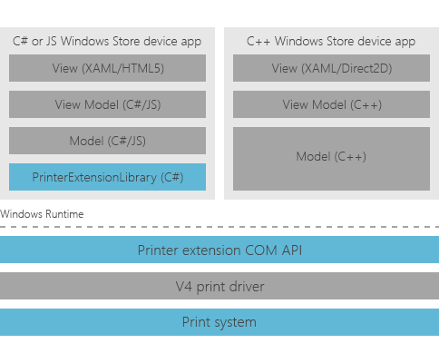

# Printer extension library overview for UWP device apps

This topic introduces the printer extension library, a library that helps device manufacturers write UWP device apps for their printer. The printer extension library is included with the [Print settings and print notifications](http://go.microsoft.com/fwlink/p/?LinkID=242862) sample, and also the [Job management and printer maintenance](http://go.microsoft.com/fwlink/p/?LinkID=299829) sample.

## Overview

A high level design goal for the [v4 printer driver](http://go.microsoft.com/fwlink/p/?LinkId=314231) architecture was to provide built-in support for the Microsoft Store app user interface. To provide access to the printer, the v4 print driver exposes COM-based [Printer Extension Interfaces](http://go.microsoft.com/fwlink/p/?LinkID=299887).

To access those interfaces from your UWP device app, you can use the printer extension library that is included with the Microsoft Store device app printer samples. The printer extension library wraps the COM implementation of the COM interface `PrinterExtensionLib`. This enables code sharing between printer extensions and your UWP device app.

## PrinterExtensionLibrary

Within the PrinterExtensionLibrary project that is included with the printer samples, there are two C# files. These files wrap the contents of PrinterExtensionLib. But additional classes could be added at this layer in order to enable code sharing between printer extensions and UWP device apps .

-   **PrinterExtensionTypes.cs** specifies a number of helpful enumerations, constants and interfaces that wrap the COM PrinterExtensionLib APIs.

-   **PrinterExtensionAdapters.cs** specifies all of the constructable classes used to wrap the COM PrinterExtensionLib APIs.

You can augment this project with any necessary C# files that describe common model layer code necessary to build your printer extension and/or UWP device app. However, we don't recommend updating the existing classes, as this will make it more difficult to incorporate any bug fixes that made available through updates to the samples.

## DeviceAppForPrintersLibrary

An additional project named DeviceAppForPrintersLibrary, provides helper classes and methods for C# apps that you can use to access printers from your UWP device app.

## PrinterExtensionHelperLibrary

In order to convert the C# interfaces, classes and methods to something supported in JavaScript, this project will create a WinMD file. WinMD files specify Windows Runtime APIs. Additionally, this library can be used to expose convenience objects that are specific to the Microsoft Store device apps, such as parsing out different activation contexts, or creating toast UI for notifications.

-   **PrintHelperClass.cs** includes the PrinterExtensionLibrary namespaces in order to expose them to JavaScript layers in the app. It also includes some convenience methods for PrintTicket and Bidi.

-   **PrinterNotificationHelper.cs** demonstrates how to show toast UI for notifications.

**Note**  The **Output type** for the PrinterExtensionHelperLibrary assembly is specified on **Application** page of the project properties window.

 

## Related topics

[Developing v4 print drivers](http://go.microsoft.com/fwlink/p/?LinkId=314231)

[Printer Extension Interfaces (v4 Print Driver)](http://go.microsoft.com/fwlink/p/?LinkID=299887)

[Job Management (v4 Printer Driver)](https://msdn.microsoft.com/library/windows/hardware/dn265419)

[Device Maintenance (v4 Printer Driver)](https://msdn.microsoft.com/library/windows/hardware/dn265274)

[Bidirectional Communications](http://go.microsoft.com/fwlink/p/?LinkId=317192)

[Getting started with UWP apps](getting-started.md)

[Create a UWP device app (step-by-step guide)](step-1--create-a-uwp-device-app.md)

[Create device metadata for a UWP device app (step-by-step guide)](step-2--create-device-metadata.md)

 

 

