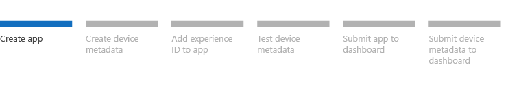

# Step 1: Create a UWP device app

This topic describes the basic process for creating a UWP device app by using Microsoft Visual Studio. Learn about the tasks that are common to all UWP device apps.

A UWP device app is a special kind of UWP app that device manufacturers create to serve as a companion to their internal or peripheral device. By using device metadata, device apps can run privileged operations and automatically install when a device is plugged in. For more info about UWP device apps, see [Meet UWP device apps](meet-uwp-device-apps.md).

**Note**  This topic is part of a step-by-step series. See [Build a UWP device app step-by-step](build-a-uwp-device-app-step-by-step.md) for the introduction.

 

## Before you begin

This step-by-step guide assumes that you've created a UWP app project and that any necessary device drivers already exist.

### Creating the Microsoft Store app project

Before you can begin, you need to have installed Visual Studio and created a UWP app project. If you haven't done that yet, you can [download the tools here](http://go.microsoft.com/fwlink/p/?LinkId=302196). To get started with Microsoft Visual Studio, see [Develop UWP apps using Visual Studio](http://go.microsoft.com/fwlink/p/?LinkID=267230).

### Device driver requirements

Some UWP device app and APIs require that your device supports a Microsoft-supplied driver or that your driver supports a specific driver model. This table lists the driver requirements for some device apps and APIs.

| Device app or API                      | Driver info                                                                                                                                                                                                                                                                                                                                                                                                                                                                                           |
|----------------------------------------|-------------------------------------------------------------------------------------------------------------------------------------------------------------------------------------------------------------------------------------------------------------------------------------------------------------------------------------------------------------------------------------------------------------------------------------------------------------------------------------------------------|
| UWP device apps for camera   | Your camera’s driver must use the AvStream driver model. For more info on the AvStream driver model, see the [AVStream Overview](http://go.microsoft.com/fwlink/p/?LinkId=273032) in the Windows Driver Kit. A an additional component, known as the Driver MFT (a media foundation transform), can be supplied with the driver installation package to provide custom effects for the camera. For more info, see [Windows store device apps for cameras](uwp-device-apps-for-webcams.md). |
| UWP device apps for printers | Printers must use the v4 Printer driver. See [Developing the v4 print driver](http://go.microsoft.com/fwlink/p/?LinkId=314231) for more info.                                                                                                                                                                                                                                                                                                                                                         |
| USB APIs                               | To use the Windows Runtime[Windows.Devices.Usb](http://go.microsoft.com/fwlink/p/?LinkId=306694)APIs, your device must be compatible with the Winusb.sys driver.                                                                                                                                                                                                                                                                                                                                      |
| Human Interface Device (HID) APIs      | The HID APIs are designed for use over USB, Bluetooth, Bluetooth Smart, and the I2C transports. To use the Windows Runtime[Windows.Devices.HumanInterfaceDevice](http://go.microsoft.com/fwlink/p/?LinkId=306697) APIs, your device must be compatible with the HIDClass.sys driver and the driver required by the transport. For more info, see [HID Architecture](https://msdn.microsoft.com/library/windows/hardware/jj126193).                                                                                                            |
| Bluetooth GATT APIs                    | To use the Windows Runtime Bluetooth GATT APIs, [Windows.Devices.Bluetooth.GenericAttributeProfile](http://go.microsoft.com/fwlink/p/?LinkId=306698), your device must be compatible with the BthLEEnum.sys driver.                                                                                                                                                                                                                                                                                   |
| Bluetooth RFCOMM APIs                  | To use the Windows Runtime Bluetooth RFCOMM APIs, [Windows.Devices.Bluetooth.Rfcomm](http://go.microsoft.com/fwlink/p/?LinkId=306699), your device must be compatible with the Rfcomm.sys and BthEnum.sys drivers.                                                                                                                                                                                                                                                                                    |

 

**Important**  Device access using custom drivers requires approval from Microsoft. OEMs and IHVs that want to implement device access for a specialized device using a custom driver should first contact their Microsoft contact to discuss their scenario with the Windows Ecosystem team. For more info, see the Custom Driver Access Model section in the [UWP device app design guide for specialized devices internal to the PC](http://go.microsoft.com/fwlink/p/?LinkId=306693).

 

## Create a Microsoft Store account

A developer account on the Microsoft Store is required. You’ll need the publisher name when you author the app manifest and the device metadata in later steps. You can also reserve a name for your app once you've created a store profile.

To create a Microsoft Store account, go to the [UWP apps sign up page](http://go.microsoft.com/fwlink/p/?LinkId=302197) and click **Sign up now**.

When you enter the **publisher display name**, enter the name under which your apps should be listed in the Microsoft Store. You won't be able to change this name until your account verification is complete. Pick the name carefully, as customers will see this name when browsing and will come to know your apps by this name.

## Associate your app with the Microsoft Store

After you've created a Microsoft Store account and selected a publisher name, associate your app with the Microsoft Store. Doing so will automatically download the following values to your local app package manifest file, named **Package.appxmanifest**.

-   Package display name

-   Package name

-   Publisher ID

-   Publisher display name

**Note**  
If you've already developed device metadata, after you associate the app with the Microsoft Store, you'll need to update the device metadata with the values from the app manifest.

 

**To associate your app with the Microsoft Store**

1.  In **Solution Explorer**, right-click your project and then select **Store &gt; Associate App with the Store**.

2.  In the **Associate Your App with the Microsoft Store** dialog box, click **Next**. You'll be prompted to sign in to the Microsoft Store.

3.  On the **Sign In** page, sign in to the Microsoft Store and then click **Next**.

4.  On the **Select an app name for this package** page, select the **App Name** you have reserved. You can also click **Reserve Name** to go to the Microsoft Store to reserve one.

5.  After an app name is selected, click **Next**.

6.  On the summary page, review the values that you have selected. If it looks good, click **Associate**. Otherwise, click **Previous** to go back and fix any errors. Clicking **Associate** automatically downloads the publisher display name and other values into the app package manifest.

## Review the app package manifest

After you associate your app with the Microsoft Store, review your app's package manifest to see that the publisher display name and other values were inserted as expected. Ensure that the app title and name demonstrate a strong connection to the device. Also note that only one app is allowed in the app package.

**To review the app package manifest**

1.  In **Solution Explorer**, double-click the **package.appxmanifest** file. This opens the Manifest Designer. The Manifest Designer is a graphical UI for the underlying XML file.

2.  After the file opens in Manifest Designer, click the **Packaging** tab to see the Package and Publisher information.

    **Note**  
    To see the same information in XML, right-click **package.appxmanifest** and select **Open With &gt; XML (Text) Editor**.

     

3.  Take note of your Package Name, Publisher Name, and App ID. You'll need them for the next step, [Step 2: Create device metadata](step-2--create-device-metadata.md).

## Choose a publisher certificate

While you're reviewing the app package manifest with the Manifest Designer, choose a publisher certificate that matches the **Publisher** name in the manifest. While the Manifest Designer is open on the **Packaging** tab, click **Choose Certificate** to select the appropriate certificate.

## Develop your UWP device app

As you begin developing your UWP device app, consider the following points.

### Device capabilities

To access your device, you might need to specify a device capability in the app package manifest. These are specified with the [DeviceCapability](http://go.microsoft.com/fwlink/p/?LinkId=306696) element of the Package.appxmanifest file in your app's project. Note that some device capabilities must be specified manually. For more info, see [How to specify device capabilities in the package manifest](http://go.microsoft.com/fwlink/p/?LinkID=306695).

### AutoPlay for UWP device apps

AutoPlay starts your app by default when your device is plugged in. To use this feature, you'll need to edit the app package manifest and the device metadata. For more info, see [AutoPlay for UWP device apps](autoplay-for-uwp-device-apps.md).

### Sync or update your device in the background

You can sync or update your device from a UWP device app by using device background tasks. To use this feature, you'll need to specify your app as a privileged app in the device metadata. For more info, see [Device sync and update for UWP device apps](device-sync-and-update-for-uwp-device-apps.md).

### Learn more

|                                                                                                         |                                                                                                                                                                |
|---------------------------------------------------------------------------------------------------------|----------------------------------------------------------------------------------------------------------------------------------------------------------------|
| [UWP device apps for printers](uwp-device-apps-for-printers.md)                    | Display printer status and extend the print settings experience. Starting in Windows 8.1, your app can also manage print jobs and perform printer maintenance. |
| [UWP device apps for cameras](uwp-device-apps-for-webcams.md)                      | Extend the camera options experience. Your app can also provide custom effects with a Driver MFT.                                                              |
| [Integrating devices](http://go.microsoft.com/fwlink/p/?LinkId=533279)                                  | Learn about Windows Runtime APIs for USB, HID, Bluetooth, Scanning, and more.                                                                                  |
| [UWP device apps for internal devices](uwp-device-apps-for-specialized-devices.md) | Lean how OEMs can write device apps for devices internal to the PC.                                                                                            |

 

## Use the Windows App Certification Kit

To give your app the best chance of getting certified, validate and test it on your computer before you submit it for certification and listing in the Microsoft Store. For more info, see [Windows App Certification Kit](http://go.microsoft.com/fwlink/p/?LinkId=273040).

## Next step

[Step 2: Create device metadata](step-2--create-device-metadata.md)

 

 

