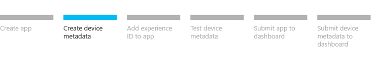

# Step 2: Create device metadata for your UWP device app

This topic describes how to use the **Device Metadata Authoring Wizard** to create new device metadata that associates your UWP device app with a device. The wizard can also create a **StoreManfest.xml** file that you may need to add to your app in the next step.

A UWP device app is a special kind of UWP app that device manufacturers create to serve as a companion to their internal or peripheral device. By using device metadata, device apps can run privileged operations and automatically install when a device is plugged in. For more info about UWP device apps, see [Meet UWP device apps](meet-uwp-device-apps.md).

**Note**  This topic is part of a step-by-step series. See [Build a UWP device app step-by-step](build-a-uwp-device-app-step-by-step.md) for the introduction.

## Before you begin

To use the **Device Metadata Authoring Wizard**, you must install Microsoft Visual Studio Professional, Microsoft Visual Studio Ultimate, or the [standalone SDK for Windows 8.1](http://go.microsoft.com/fwlink/p/?linkid=309209), before completing the steps in this topic. Installing Microsoft Visual Studio Express for Windows installs a version of the SDK that doesn't include the wizard.

## Create new device metadata

The **Device Metadata Authoring Wizard** is used to create new device metadata.

### To create new device metadata

1. Start the **Device Metadata Authoring Wizard** from *%ProgramFiles(x86)%*\\Windows Kits\\8.1\\bin\\x86, by double-clicking **DeviceMetadataWizard.exe**.

2. Click **New Device Metadata**.

3. On the **Select the metadata package type** page, click **UWP device app metadata**, and then click **Next**.

4. On the **Select the device categories** page, select the device categories that should be assigned to your device. A device can belong to multiple device categories, but only one primary category can be assigned. Click **Next**.

5. On the **Specify the locales** page, select at least one locale that should be associated with the device metadata package. You can also set a default locale that is used when a locale-specific package is not available on the computer. Click **Next**.

6. On the **Describe the device** page, enter the info that is shown to end users that plug in your device. A model name and manufacturer is required for a each locale.

7. On the **Specify the hardware information** page, add at least one hardware ID and one model ID. The hardware ID should include the vendor ID for your company. The model ID is a GUID and is the recommended way to associate device metadata with devices that support a model ID. Click **Next**.

8. On the **Specify UWP device app information** page:

   - If you want to enable [automatic installation](auto-install-for-uwp-device-apps.md) for your device app, or extend the [camera](uwp-device-apps-for-webcams.md) or [printer](uwp-device-apps-for-printers.md) experience (which requires automatic installation), enter the Microsoft Store app info in the **UWP device app** box. Click on **Import UWP app manifest file** to automatically enter the **Package name**, **Publisher name**, and **UWP app ID**.

     > [!Warning]
     > It's important to consider that the automatic installation feature does not provide a notification to the user when the app is installed. Some users may find this experience confusing and frustrating, and give your app a bad rating.

   - If your app is registering for printer notifications, fill out the **Notification handlers** box. In **Event ID**, enter the name of the print event handler. In **Event Asset**, enter the name of the file where that code resides.

   - If you want to specify your app as a privileged app, enter that information in the **Privileged application** box. The privileged app designation lets a UWP device app perform [device updates](device-sync-and-update-for-uwp-device-apps.md), such as firmware updates. It also lets OEMs and component suppliers develop apps for [internal devices](uwp-device-apps-for-specialized-devices.md).

9. When you are finished specifying any automatic installation and privileged app details, click **Next**

10. On the **Specify the Windows settings** page, you can configure if the device is shown in Device Manager when it's disconnected and how the device should respond to an AutoPlay activation.

    If you want to specify an app to be the default AutoPlay handler for your device, select **Use a UWP device app** in the **AutoPlay handler** box. You can select any UWP app or UWP device app, but that app must handle the AutoPlay activation for your device and specify the corresponding experience ID in the app package manifest (as described in [AutoPlay for UWP device apps](autoplay-for-uwp-device-apps.md)).

    - **Package name**: In the app package manifest, this is the Name attribute of the Identity element.

    - **Publisher name**: In the app package manifest, this is the Publisher attribute of the Identity element.

    - **App ID**: In the app package manifest, this is the ID attribute of the Application element.

    - **Verb**: This is the identifier for the AutoPlay activation. Your app will use it to determine if the activation came from your device. You can use any value for the Verb setting, except for **open**, which is reserved.

    - **AutoPlay event type**: Leave this as **Device**. In the device metadata, the wizard will automatically specify the experience ID associated with your UWP device app.

    If you want to let other apps act as AutoPlay handlers for your device, select **Enable AutoPlay for registered apps**.

    For more info about AutoPlay, see [AutoPlay for UWP device apps](autoplay-for-uwp-device-apps.md).

11. When you're ready to continue, click **Next**.

12. On the **Review the device metadata package** page, make sure that all of the settings are correct. If you want this device metadata package to be available in the local metadata store, select the **Copy the device metadata package to the metadata store on the local computer** check box, and then click **Save**.

13. When you're ready to submit your device metadata package, or if you need to edit it, you must use the .devicemanifest-ms file. The .devicemetadata-ms file should be used only to test device metadata locally.

## Next step

[Step 3: Add an experience ID to the app](step-3--add-an-experience-id-to-the-app.md)

## Related topics

[Building UWP device apps](the-workflow.md)

[Device sync and update for UWP device apps](device-sync-and-update-for-uwp-device-apps.md)

[UWP device apps for internal devices](uwp-device-apps-for-specialized-devices.md)
