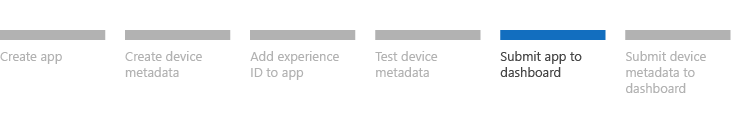

# Step 5: Submit the Microsoft Store device app

This topic describes how to submit your UWP device app to the Microsoft Store dashboard. Before submitting your app, review the submission sequence section in [Building UWP device apps](the-workflow.md). This topic is part of a step-by-step series. See [Build a UWP device app step-by-step](build-a-uwp-device-app-step-by-step.md) for the introduction.

**Note**  If your app is specified as a privileged app and it is not configured for automatic installation, you can submit your device metdata to the Windows Dev Center hardware dashboard before you submit your privileged app to the Microsoft Store. In this case, this step 5 can take place after [step 6](step-6--submit-device-metadata.md).

 

A UWP device app is a special kind of UWP app that device manufacturers create to serve as a companion to their internal or peripheral device. By using device metadata, device apps can run privileged operations, such as device update. For more info about UWP device apps, see [Meet UWP device apps](meet-uwp-device-apps.md).

## Before you begin

This topic assumes that you've finished developing your app and the device metadata is ready to go.

## Start app submission

Go to the [Microsoft Store dashboard](http://go.microsoft.com/fwlink/p/?LinkId=273050) and click **Submit a new app**.

## Add instructions for testers

In the **Instructions for testers**, make sure that you enter the text "This is a UWP device app." This indicates to the app submission testers that your app is a UWP device app.

## Review submission details

Check the following before you submit your app:

-   The description of the app should clearly state the hardware that the app requires.

-   You must include the StoreManifest.xml file in the app package for the Microsoft Store to recognize the app as a UWP device app.

-   When the app is launched, if the app requires that the device be connected before the app will work, it must clearly state something like "Please connect your &lt;*brand-specific device name*&gt;".

-   The **package name** should be the same as the one you specified when you created the app in [step 1](step-1--create-a-uwp-device-app.md). Note that the package name expires if the app is not submitted within one year.

-   The app must be fully compliant with all the [Microsoft Store Certification Requirements](http://go.microsoft.com/fwlink/p/?LinkId=273052).

-   The app must be suitable for all ages.

-   The app must be marked as free.

## Confirm selling details

During app submission, check the **Selling Details** item in the Store submission checklist, and ensure that you see this:

**Your app must be free because it is a UWP device app.**

**Your app will sell for Free and is schedued for release after it passes certification.**

The app submission UI is designed to look for StoreManifest.xml as the only means of checking whether the app is a UWP device app associated with a device. And once it makes that determination, it will explicitly override whatever you set in the selling details to make sure the app is set to be free with no trial (and disable the controls if you try to change those values in the **Selling Details** page). This is then reflected on the checklist page.

If you don't see **Your app must be free because it is a UWP device app** in the **Selling Details** page, check that you have correctly included StoreManifest.xml in the root folder of your app project, and not in the solution’s root folder.

## Submission results

Once the Microsoft Store receives your app, it will perform a suite of automated tests that are common to all UWP apps. It will also perform a series of tests that are specific to the app.

If your app passes the tests applied by the Microsoft Store, it will be added to the App Catalog in about 1-4 days. Once it's in the Catalog, it's available from the Microsoft Store as well. If submission fails, you’ll be notified as to the cause.

## Validation

The Microsoft Store dashboard validates the Microsoft Store device app package after it’s submitted to the Microsoft Store. Device metadata is submitted to and validated by the Windows Dev Center hardware dashboard. You should submit the metadata after the app is live on the Microsoft Store, because the validation process checks that the app specified in the metadata is in the Store. The hardware dashboard validates drivers separately, as part of a Logo submission.

## Next step

[Step 6: Submit device metadata](step-6--submit-device-metadata.md)

 

 

