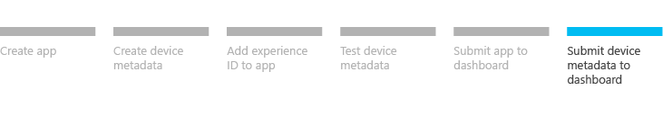

# Step 6: Submit device metadata for your UWP device app

This topic describes how to submit device metadata for your UWP device app to the Windows Dev Center hardware dashboard.

A UWP device app is a special kind of UWP app that device manufacturers create to serve as a companion to their internal or peripheral device. By using device metadata, device apps can run privileged operations and automatically install when a device is plugged in. For more info about UWP device apps, see [Meet UWP device apps](meet-uwp-device-apps.md).

**Note**  This topic is part of a step-by-step series. See [Build a UWP device app step-by-step](build-a-uwp-device-app-step-by-step.md) for the introduction.

 

## Before you begin

There are two ways to submit your device metadata packages to the hardware dashboard:

-   You can submit your .devicemanifest-ms files individually to the hardware dashboard.
-   You can package multiple .devicemanifest-ms files together and submit them to the hardware dashboard as a bulk submission package. You can create a bulk submission package by using the **Device Metadata Authoring Wizard**.

Both ways require that the files are signed before they are submitted to the hardware dashboard. You can do this by using the **Digital Signature Wizard**. To open the **Digital Signature Wizard** from the **Device Metadata Authoring Wizard**, click **Tools**, and then click **Signature Wizard**.

## Creating a bulk submission package

You can use the **Bulk Package Wizard** to create a bulk submission package that can submit more than one devicemanifest-ms file to the hardware dashboard at once. You use the **Device Metadata Authoring Wizard** to open the **Bulk Package Wizard**.

**To create a bulk submission package**

1.  In the **Device Metadata Authoring Wizard**, click **Tools**, and then click **Create a Bulk Package**.
2.  In the **Bulk Package Wizard**, for each .devicemanifest-ms file, do the following:
    -   Click **Add Metadata Package**.
    -   Browse to the .devicemanifest-ms file, and then click **OK**.

3.  Select the **Preview** check box next to each .devicemanifest-ms file that should be submitted in preview mode.
4.  After you've added all of the .devicemanifest-ms files, click **Next**.
5.  On the **Specify the device experience information** page, add the following:
    -   **Experience name** should be a name that is unique among the other experience names that have been submitted by your company.
    -   **Qualification** indicates if a hardware submission is associated with this submission. If there is an associated hardware submission, choose **This device has an associated hardware or unclassified submission**.
    -   **Logo Submission IDs** should include the hardware dashboard submission IDs.
    -   **Update experience** should be selected if the experience has been submitted before.

    **Note**  The device must be certified before submitting device metadata for your UWP device app.

     

6.  On the **Prepare bulk package for submission** page, click **Launch Signature Wizard** to start the **Digital Signature Wizard**, which is used to digitally sign your bulk submission package.

For more info on submitting a device metadata package to the hardware dashboard, see [Device Metadata](https://msdn.microsoft.com/library/windows/hardware/br230800.aspx).

 

 

