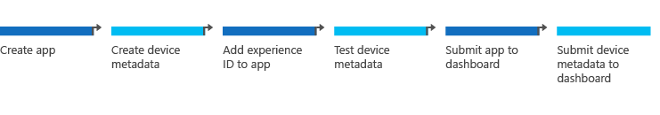

# Building UWP device apps

Device manufacturers can create a UWP device app that serves as a companion to their device. This topic describes the components of a UWP device app, the basic steps for building one, and the order in which you must submit your app and device metadata to the Microsoft Store dashboard and the Windows Dev Center hardware dashboard, respectively. For a more detailed look at each step, see [Build a UWP device app step-by-step](build-a-uwp-device-app-step-by-step.md).

## The building blocks

At the most basic level, a *UWP device app* is a UWP app that's associated with a specific device via device metadata. There are four components to a UWP device app: a device, an app, a device metadata package, and a device driver. You don't need to use device metadata to access a peripheral device using the device protocol APIs (USB, HID, Bluetooth GATT, and Bluetooth RFCOMM). But you do need to use device metadata to enable special features such as [automatic installation](auto-install-for-uwp-device-apps.md), [AutoPlay](autoplay-for-uwp-device-apps.md), and [device update](device-sync-and-update-for-uwp-device-apps.md).

<table>
<colgroup>
<col width="50%" />
<col width="50%" />
</colgroup>
<tbody>
<tr class="odd">
<td align="left"><strong>Device</strong></td>
<td align="left">This is the physical device. <em>Peripheral devices</em> are external to the PC enclosure. <em>Internal devices</em> are devices that reside inside or are integrated with the PC enclosure.</td>
</tr>
<tr class="even">
<td align="left"><strong>App</strong></td>
<td align="left">A UWP device app is a UWP app that provides a customized user experience for the device, enabling the user to access the device&#39;s unique features. A device app contains a file named <strong>StoreManifest.xml</strong> that specifies the experience ID. The <em>experience ID</em> is a GUID that uniquely identifies a device metadata package.</td>
</tr>
<tr class="odd">
<td align="left"><strong>Device metadata</strong></td>
<td align="left">This is an extended version of any device metadata package you might have already created for Windows 7. In Windows 8.1, device metadata creates a link between the device and the app. That link is identified in the experience ID. In addition to UI content for the PC (localizable model name, description, and photorealistic icons) the device metadata package specifies <a href="autoplay-for-uwp-device-apps.md" data-raw-source="[AutoPlay](autoplay-for-uwp-device-apps.md)">AutoPlay</a> configuration and which app has privilege to access the device. Windows automatically downloads device metadata from the Windows Metadata Internet Service (WMIS).</td>
</tr>
<tr class="even">
<td align="left"><strong>Driver</strong></td>
<td align="left">All UWP device apps use drivers, indirectly, to access devices. For example, the Windows Runtime device protocol APIs, introduced in Windows 8.1, use in-box drivers to let your app communicate over USB, HID, and Bluetooth. For more info about the drivers used by these APIs, see <a href="step-1--create-a-uwp-device-app.md" data-raw-source="[Step 1: Create a UWP device app](step-1--create-a-uwp-device-app.md)">Step 1: Create a UWP device app</a>.

<strong>Important</strong>  Device access using custom drivers requires approval from Microsoft. For more info, see <a href="http://go.microsoft.com/fwlink/p/?LinkId=306693" data-raw-source="[UWP device app Design Guide for Specialized Devices Internal to the PC](http://go.microsoft.com/fwlink/p/?LinkId=306693)">UWP device app Design Guide for Specialized Devices Internal to the PC</a>.

 

</td>
</tr>
</tbody>
</table>

 

## Development workflow

There are six steps to creating a UWP device app, assuming you've already created your device and submitted any necessary drivers to the Hardware Dashboard. Click the links for more details about each step.

[Step 1: Create the app](step-1--create-a-uwp-device-app.md). Associate your app with the Microsoft Store, develop the app, and test it.

[Step 2: Create the device metadata](step-2--create-device-metadata.md). Use the Device Metadata Authoring Wizard to associate your app with your device, create a device metadata package, and create a StoreManifest.xml file (which specifies the experience ID).

[Step 3: Add an experience ID to the app](step-3--add-an-experience-id-to-the-app.md). Incorporate the StoreManifest.xml file into your app.

**Note**  If your app is a privileged app and is not configured for automatic installation, step 3 is not required.

 

[Step 4: Test the device metadata (locally)](step-4--test-device-metadata.md). Use the Device Metadata Authoring Wizard to validate and deploy the device metadata to your local development workstation.

[Step 5: Submit the app to the Microsoft Store dashboard](step-5--submit-the-app.md). Use the dashboard to confirm selling details and indicate to testers that the app is a UWP device app.

**Note**  If your app is a privileged app and is not configured for automatic installation, you can submit your app to the Microsoft Store dashboard after step 6. For more info, see [Privileged app submission sequence](#priv-sequence).

 

[Step 6: Submit device metadata to the Windows Dev Center hardware dashboard](step-6--submit-device-metadata.md). Submit device metadata packages manually, or use the Device Metadata Authoring Wizard to create a bulk submission package that you can submit to the hardware dashboard.

## Standard submission sequence

The first time you submit your app and device metadata to the various dashboards, the events must occur in a specific sequence. The following table also shows when to submit a device driver, if applicable.

<table>
<colgroup>
<col width="33%" />
<col width="33%" />
<col width="33%" />
</colgroup>
<thead>
<tr class="header">
<th align="left">Sequence</th>
<th align="left">Description</th>
<th align="left">Before continuing...</th>
</tr>
</thead>
<tbody>
<tr class="odd">
<td align="left">1</td>
<td align="left"><strong>Submit the device driver</strong> to the hardware dashboard.</td>
<td align="left">Wait until the driver is available from Windows Update.</td>
</tr>
<tr class="even">
<td align="left">2</td>
<td align="left"><strong>Submit the app</strong> to the Microsoft Store dashboard.</td>
<td align="left">Wait for acceptance and until the app is live on the Microsoft Store.</td>
</tr>
<tr class="odd">
<td align="left">3</td>
<td align="left"><strong>Submit the device metadata</strong> to the hardware dashboard. The app needs to be in the Microsoft Store before the metadata can pass validation on the hardware dashboard.</td>
<td align="left">Wait 10 days for acceptance and distribution.</td>
</tr>
<tr class="even">
<td align="left">4</td>
<td align="left"><strong>Finish:</strong> Users can benefit from all features of the Microsoft Store device app. Note that device app features like <a href="auto-install-for-uwp-device-apps.md" data-raw-source="[automatic installation](auto-install-for-uwp-device-apps.md)">automatic installation</a>, <a href="autoplay-for-uwp-device-apps.md" data-raw-source="[AutoPlay](autoplay-for-uwp-device-apps.md)">AutoPlay</a>, and <a href="device-sync-and-update-for-uwp-device-apps.md" data-raw-source="[device update](device-sync-and-update-for-uwp-device-apps.md)">device update</a> won&#39;t work until the user has the device metadata and the app on the PC. If the app requires a driver that&#39;s not supplied by Microsoft, that driver will also need to be present for the app to work.</td>
<td align="left"></td>
</tr>
</tbody>
</table>

 

## Privileged app submission sequence

In some cases, UWP device apps do not need to be live in the Microsoft Store before you submit the device metadata. When your UWP device app:

-   Is specified as a privileged app
-   Is not configured for automatic installation

If this is true about your app, you can submit the device metadata to the hardware dashboard before you submit your UWP device app to the Microsoft Store dashboard. In such cases, you do not need to add the Experience ID to your app; specifying your app as a privileged app in the device metadata is sufficient for privileges to take effect.

**Note**  UWP device apps for printers and cameras automatically install. Therefore, these types of UWP device apps must follow the standard submission sequence and be submitted to the Microsoft Store before the device metadata is submitted.

 

## UWP device app limits

Device manufacturers are limited in the number of UWP apps that may be specified in device metadata for automatic installation and app privilege. For example, peripheral device manufacturers (IHVs) can submit up to one app that is configured for automatic installation and up to one app that is specified as a privileged app. An IHV can submit one app that meets both limitations or two apps, with each meeting just one of the limitations.

**Important**  There is no limit to the total number of UWP device apps that a device manufacturer can submit to the Microsoft Store; these limits apply only to a single device metadata package.

 

Mobile operators and OEMs have different limits on the number of apps that they can specify in device metadata. For more info, OEMs should contact their Microsoft OEM representative.

In each device metadata package, the following limits apply:

| Developer       | Automatic installation app limit | Privileged app limit |
|-----------------|----------------------------------|----------------------|
| IHV             | 1                                | 1                    |
| Mobile operator | 1                                | 8                    |
| OEM             | contact Microsoft                | contact Microsoft    |

 

## Related topics

[Build a UWP device app step-by-step](build-a-uwp-device-app-step-by-step.md)

[Automatic installation for UWP device apps](auto-install-for-uwp-device-apps.md)

[AutoPlay for UWP device apps](autoplay-for-uwp-device-apps.md)

[Device sync and update for UWP device apps](device-sync-and-update-for-uwp-device-apps.md)

[UWP device apps for internal devices](uwp-device-apps-for-specialized-devices.md)

 

 

