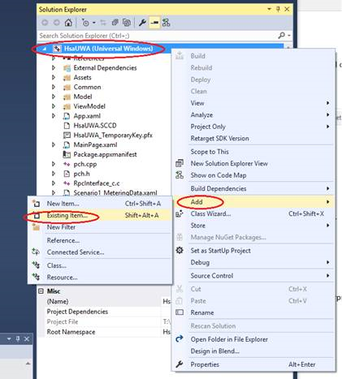

# Universal Windows Platform Apps with custom capabilities


## Overview


The extensibility of the Windows platform has led to the creation of a
diverse ecosystem of device builders where innovative differentiation is
key to success for these device manufacturers, which enables unique
hardware and software experiences. [Universal Windows Platform
(UWP)](https://docs.microsoft.com/en-us/windows/uwp/get-started/universal-application-platform-guide)
applications create a broad range of scenarios such as to control
hardware device settings and provide a diverse app platform available on
any device running Windows 10.

Device and System vendors often provide their users with applications
that allow them to have some control over the functionality of their
hardware; previously apps with such functionality were not made as UWP
apps as they were unable to get access to system software from the app
container. They would come pre-installed or become installed with a
driver by a Windows Update or as an installation downloaded from the
internet. A problem would be that these applications couldn’t update
outside of an updater app, often required a co-installer, and could very
easily get out of sync.

For more information about developing specific types of UWP apps, see
[Develop UWP
apps](https://developer.microsoft.com/en-us/windows/apps/develop)**.**

## Custom Capabilities 


Custom capabilities are a new capability class introduced to allow
developers to make better use of the UWP. They are similar to the
previously defined [restricted
capabilities](https://docs.microsoft.com/en-us/windows/uwp/packaging/app-capability-declarations#special-and-restricted-capabilities)
which give access to protected resources. However, there are some key
differences between the two. Unlike restricted resources, 3^rd^ party
partners can define or claim their own capabilities. Custom capabilities
also do not have to be built into Windows at compilation time. They are
different from previous [app
capabilities](https://docs.microsoft.com/en-us/windows/uwp/packaging/app-capability-declarations)
as they do not use the same authorization model and instead, app
authorization to use the capability verifies during the app installation
instead of when uploaded to the store.

For a developer to get access to a custom capability, they must have a
signed custom capability descriptor (SCCD) which allows the authorized
use of one or more custom capabilities. For more information on SCCD’s,
read the section on SCCD’s [here.](#signed-custom-capability-descriptors)

### UWP Apps Getting Access to System Software with Custom Capabilities


A [Universal Windows Platform
(UWP)](https://msdn.microsoft.com/50a5605e-3a91-41db-800a-9180717c1e86)
application can utilize Custom Capabilities to gain access to system
software.

There is a similar function in [Windows Store device apps
(WSDA)](https://msdn.microsoft.com/en-us/windows/hardware/drivers/devapps/index)
which were first introduced in Windows 8 to provide a way for to provide
hardware support services (HSS) for certain devices and peripherals.
However, they do not provide support for all services that HSS typically
need to communicate with, such as Win32 services, device-specific
registry values, and 3rd party APIs. WSDA’s are only available for the
Desktop device family and does not take advantage of the common app
platform offered by the UWP which targets the Universal device family.


*Learn more about device families*
[here](https://docs.microsoft.com/en-us/windows/uwp/get-started/universal-application-platform-guide#device-families)*.*

Unlike a WSDA, a UWP can install on a system for all its users either as
part of the imaging process of the OS when a new device or peripheral is
connected, or manually by the user.

A UWP Developer can deliver on-the-fly updates and new experiences
independent of driver updates. UWP servicing is handled through the
existing app servicing mechanisms and workflows for apps in the Windows
Store. Upon publishing an update, users will receive the update
immediately if an internet connection is available.

### Signed Custom Capability Descriptors

A signed custom capability descriptor (SCCD) contains the name of the
capability or capabilities the SCCD is authorizing, a list of Authorized
Entities that are authorized to use the Custom Capability, and the
catalog containing the signature of the SCCD file itself. An authorized
entity identifies an app by its Package Family Name and the Certificate
Signature Hash of the certificate that signs the app. The hash must be
SHA256 and match the hash of the signing certificate. The hash must
match the hash of the signing certificate. Below is an example of an
SCCD with the Catalog truncated.

**Note:** If the app isn't signed directly with
that certificate it's fine if the certificate specified lies somewhere
in the cert chain that signs the app.
```xml
<?xml version="1.0" encoding="utf-8"?>
<CustomCapabilityDescriptor xmlns="http://schemas.microsoft.com/appx/2016/sccd" xmlns:s="http://schemas.microsoft.com/appx/2016/sccd">
<CustomCapabilities>
    <CustomCapability Name="microsoft.hsaTestCustomCapability_q536wpkpf5cy2"></CustomCapability>
</CustomCapabilities>
<AuthorizedEntities>
    <AuthorizedEntity AppPackageFamilyName="MicrosoftHSATest.Microsoft.SDKSamples.Hsa.CPP_q536wpkpf5cy2" CertificateSignatureHash="ca9fc964db7e0c2938778f4559946833e7a8cfde0f3eaa07650766d4764e86c4"></AuthorizedEntity>
</AuthorizedEntities>
<Catalog>…</Catalog>
</CustomCapabilityDescriptor>
```


### Claiming a Custom Capability


The ability for a UWP to use custom capabilities is currently only
available to known, trusted hardware vendors. Apps should only talk to
the drivers, or software installed with a driver package, for which the
driver author has access granted.

For a capability owner to claim a custom capability, they must do the
following steps:

1.  Send a request to Microsoft Hardware Support Apps Review
    (<HSAReview@microsoft.com>) requesting a custom capability. The
    request should include the following information:
    -   Contact information for the PM

    -   Contact information for the developer

    -   The Company Name

    -   The name of the capability (The name of the capability must be
        unique and have some associated with the organization of the
        party that is claiming the capability)

    -   What resources does capability need to access?

    -   Any security or privacy concerns that drive the introduction of
        this capability

    -   Does your capability provide access to data that has privacy
        concerns?

    -   Include the Windows Store App Publisher ID. You can get this by
        creating a skeleton app entry on the Windows Store page. This
        [MSDN
        article](https://msdn.microsoft.com/en-us/windows/uwp/publish/create-your-app-by-reserving-a-name)
        walks you through the process of reserving your App PFN on the
        store page

Microsoft then validates the Capability Owner and the intention of the
custom capability.

Reply to confirm Custom capability addition request.

Once approved, the custom capability a unique custom capability string
name in the format **CompanyName.capabilityName\_PublisherID** is
recorded and emailed back to the Capability Owner


*Claiming a Custom Capability*

### Authoring and Signing an SCCD as a Capability Owner

After being given the information from an app developer from a request
for access to a custom capability, it is up to the Capability Owner
whether the app developer should get granted this Capability. A
Capability owner must make sure that the certificate hash provided by
app developer can be trusted.


*Getting an SCCD signed*

After the Capability owner completes the SCCD, it is sent to Microsoft
for signing and returned signed to the Capability Owner. The Capability
Owner then sends it back to the app developer.

#### Limiting an SCCD’s scope

It is also possible for the owner of a Custom capability to create a
scoped SCCD; for example, a Capability owner may not have completely
vetted an App Developer but would still like to let a developer develop
an UWP. To create such an SCCD, the Custom capability owner can limit
the scope of use of the SCCD by putting *“DeveloperModeOnly”* in the
SCCD file before getting it signed by Microsoft.  A scoped SCCD will
ONLY work on devices in Developer Mode.
```xml
<xs:complexType name="CT_CustomCapabilityDescriptor">
    <xs:sequence>
    <xs:element ref="CustomCapabilities" minOccurs="1" maxOccurs="1"/>
    <xs:element ref="AuthorizedEntities" minOccurs="1" maxOccurs="1"/>
    <xs:element ref="DeveloperModeOnly" minOccurs="0" maxOccurs="1"/>
    <xs:element ref="Catalog" minOccurs="1" maxOccurs="1"/>
    <xs:any minOccurs="0"/>
    </xs:sequence>
</xs:complexType>

<xs:element name="DeveloperModeOnly">
    <xs:complexType>
    <xs:attribute name="Value" type="xs:boolean" use="required"/>
    </xs:complexType>
</xs:element>
```


## Guide to Developing with Custom Capabilities

### Configure Machine

Before you can begin creating an UWP app, you need to install the latest
version of Visual Studio and creat~~e~~ an UWP app project. If you
haven't done that yet, you can [download the tools
here](http://go.microsoft.com/fwlink/p/?LinkId=302196). To get started
with Microsoft Visual Studio, see[ Develop Windows Store apps using
Visual
Studio](https://developer.microsoft.com/en-us/windows/apps/develop).

#### Create a Windows Store account

A developer account on the Windows Store is required. Hardware partners
will need a Windows Store account that will be different from their
Hardware partner account. You’ll need the publisher name when you author
the app manifest and the device metadata in later steps. You can also
reserve a name for your app once you've created a store profile.

To create a Windows Store account, go to the [Windows Store apps sign up
page](http://go.microsoft.com/fwlink/p/?LinkId=302197) and click Sign up
now. For more information on how to Create a Windows Store developer
account, see[ Opening a developer
account](accounthttps://docs.microsoft.com/en-us/windows/uwp/publish/opening-a-developer-account).

### Contacting the Custom Capability Owner

For an App Developer to develop UWP Apps with custom capabilities, they
must request access to a Custom capability from a Capability Owner. The
request should have the following:

-   App PFN acquired from the Windows Store
-   The name of the custom capability
-   Signature Hash of the app signing cert which can be generated from
    your .cer file using certutil.exe. The certificate must be SHA-256.

To generate the Signature Hash run:
```bat
C:\Windows\System32\certutil.exe -dump CertificateName.cer
```
Look for the signature hash near the bottom and ensure it’s SHA256. If
it’s not, you’ll need to use a SHA256 cert to sign your app. It should
look something like the following example hash below.
```text
Signature Hash:
ca9fc964db7e0c2938778f4559946833e7a8cfde0f3eaa07650766d4764e86c4
```
The Capability owner reviews the app developer request and chooses to
either approve the request or not. Once approved, the Capability Owner
generates a Signed Custom Capability Descriptor with the provided
information and signs it; it is returned to the app developer once
properly signed.

### Writing an SCCD as Developer

An app developer can continue developing their apps with Custom
capabilities in "developer mode" while waiting for the Capability owner
to approve their request. Ignore the following in the SCCD on a desktop
PC in developer mode:

-   Catalog entry. It’s set it to FFFF.

-   Certificate Signature Hash in the authorized entity. While it will
    neither enforced nor validated, please put a 64-char sequence.

### Granting Custom Capability Access to System Software

Currently, there are two types of system software that you can grant
access to using Custom Capabilities: RPC Endpoints (from within an NT
Service) and Drivers.


*Custom Capability Architecture Diagram*

### Granting custom capability access to an RPC Endpoint

When an UWP declares a custom capability in its app manifest, it will at
a later point contain the SID form of the Custom capability in its
process token at runtime. By default, RPC endpoints don’t allow UWP’s
(AppContainer processes) to connect to them so some security must be set
at the endpoint to allow access to UWP’s with the correct Custom
capabilities. The following steps are taken to do so:

1.  Convert the custom capability name to a SID

2.  Create a Security Descriptor to the SID of the Custom capability along
with all other needed SID. For more information on creating a Security
Descriptor follow the example[here](https://msdn.microsoft.com/en-us/library/windows/desktop/aa446595(v=vs.85).aspx).

3.  Create an RPC endpoint with the Security Descriptor from above.

#### Granting Custom Capability Access to a Driver 

To allow a UWP app to communicate with a custom driver, you must use
**Windows.Devices.Custom**. You’ll need to have the Driver itself (or
driver INF file) set the property
**DEVPKEY\_DeviceInterface\_UnrestrictedAppCapabilities** of type
*DEVPKEY\_STRING\_LIST* on the Device Interface to grant your custom
capability access. In this property, you can specify one or more custom
capabilities.

There are two methods for granting custom capability access to a driver
either via INF or with just the driver code as seen below.

<span style="font-variant:small-caps;">*INF Method*</span>
```
[WDMPNPB003_Device.NT.Interfaces] 
AddInterface= {B0823231-61F1-4685-85CA-8DF9DDDEBF6E},,AddInterfaceSection 
 
[AddInterfaceSection] 
AddProperty= AddInterfaceSection.AddProps 
 
[AddInterfaceSection.AddProps] 
; DEVPKEY_DeviceInterface_UnrestrictedAppCapabilities 
{026e516e-b814-414b-83cd-856d6fef4822}, 8, 0x2012,, “CompanyName.myCustomCapabilityNameTBD_YourStorePubId”
```
<span style="font-variant:small-caps;">*Driver Method*</span>
```c++
WDF_DEVICE_INTERFACE_PROPERTY_DATA PropertyData = {}; 
WCHAR customCapabilities[] = L”CompanyName.yourCustomCapabilityNameTBD_YourStorePubId\0”; 
 
WDF_DEVICE_INTERFACE_PROPERTY_DATA_INIT( 
   &PropertyData, 
   &m_VendorDefinedSubType, 
   &DEVPKEY_DeviceInterface_UnrestrictedAppCapabilities); 
 
Status = WdfDeviceAssignInterfaceProperty( 
    m_FxDevice, 
    &PropertyData, 
    DEVPROP_TYPE_STRING_LIST, 
    ARRAYSIZE(customCapabilities), 
    reinterpret_cast<PVOID>(customCapabilities)); 

```

### Adding a Custom capability to App Package Manifest

Capabilities must be declared in your Universal Windows Platform (UWP)
app's [package
manifest](https://msdn.microsoft.com/library/windows/apps/BR211474) to
access APIs or resources protected with capabilities. An app package
manifest is an XML document that contains information needed by the
system to deploy, display, and update a UWP. Inside an app package
manifest, an app must contain information such as package identity,
dependencies, required capabilities, visual elements, and extensibility
points. Every app package must include one package manifest.

The app developer must modify the app package manifest to include a
capabilities attribute that declares the custom capabilities in a
similar fashion to below.
```xml
<Capabilities>
	<uap4:CustomCapability Name=”CompanyName.customCapabilityName_Publisher ID” />
</Capabilities>

```
Afterward, the App developer includes the SCCD file from the previous
steps into the appx package. The signed custom capability descriptor
(SCCD) is a signed XML file that goes in the package root of the appx
package. It has the file extension of ".sccd." They can do this by
simply copying the SCCD file to the root of an app project folder. Once
located in the root, go through Visual Studio’s solution explorer,
right-click on “project-&gt; Add -&gt; Existing Item…” to add the SCCD
to your project; you may also use the shortcut (Shift + Alt + A).



*Adding an SCCD file into the appx package*

Now you can create your appx package using your preferred method. If
using VS, right-click the project, select Store, then Create App
Packages. At installation time, every capability declared in an app
manifest is checked if it also is defined the SCCD by the Operating
System.

### Deploying and debugging UWPs

Microsoft Visual Studio allows you to deploy and debug your apps on a
variety of Windows 10 devices.

You can enable a device for development, or just for sideloading.
*Windows Store apps* are the default setting. If you aren't development
apps or using special internal apps issued by your company, keep this
setting active.

-   *Developer mode* lets you sideload apps, and run apps from Visual
    Studio in debug mode.

-   *Sideloading* is installing and then running or testing an app that
    has not been certified by the Windows Store. For example, an app
    that is internal to your company only.

By default, you can only install Universal Windows Platform (UWP) apps
from the Windows Store. Changing these settings to use developer
features can change the level of security of your device. You should not
install apps from unverified sources.

#### Picking a deployment target

To pick a target, go to the debug target drop-down next to the **Start
Debugging** button and choose which target to deploy your app to. After
the target is selected, select **Start Debugging (F5)** to deploy and
debug on that target, or select **Ctrl+F5** to just deploy to that
target.


**Note**: At the current time there is no support
for UWP’s with Custom Capabilities on mobile platforms.

#### Sideload an UWP with Custom Capabilities

Typically, companies or schools that need to install custom apps on
managed devices without going through the Windows Store use the Sideload
apps setting. In this case, it's common for the organization to enforce
a policy that disables the *Windows Store apps* setting, as shown
previously in the image of the settings page. The organization also
provides the required certificate and install location to sideload apps.
For more info, see the TechNet articles [Sideload apps in Windows
10](https://technet.microsoft.com/library/mt269549.aspx) and [Get
started with app deployment in Microsoft
Intune](https://technet.microsoft.com/library/dn646955.aspx).

UWP Users will be able to side-load and install a properly signed UWP
onto on a system if it passes the Trust Model check at install time.

## FAQ

### How are custom capabilities different from other capabilities?

1)  3rd party Microsoft partners can define new capabilities.

2)  They don't have to be built-in to Windows at compile time.

3)  App authorization to use the capability verifies during the app
    installation instead of when uploaded to the store.

### What’s the difference between UWP’s with Custom Capabilities and DCA’s (Device Companion Apps)?


|                           | **DCA**                                                  |  **RPAL**                                                   | **UWP App with Custom Capabilities**|
|---------------------------|----------------------------------------------------------|-------------------------------------------------------------|-------------------------------------|
|Communication|Device Scenario APIS (image capture, scanning, etc.)<br>Device protocol APIs (USB, HID, etc.)<br>Customer driver access|  Blanket access to APIS, Drivers, Services|DCA support + NT Services            |                                                                              
|Trust Model|Defined at a “container” level<br>The system's OEM must submit apps for internal components|Defined at a system level<br>The system's OEM must submit apps for internal components|Defined at a component level<br>IHVs own the trust boundaries for their components|
|Automatic App Acquisition  |Available for peripherals                                  | Not available                                               |Available for all hardware          |
|Deployment Dependencies    |WU: Driver package<br>Store: App|N/A – preload only|WU: Driver package<br>Store: App                  |
                                                                                                                                                    
                                                                                                            
                                                                                                                                                    
                                                  

For more information on DCA’s, see [Getting started with Windows Store
device
apps](https://msdn.microsoft.com/windows/hardware/drivers/devapps/getting-started).

## Useful Links

-   [App
    capabilities](https://docs.microsoft.com/en-us/windows/uwp/packaging/app-capability-declarations)

-   [Desktop to Universal Windows Platform (UWP)
    Bridge](https://docs.microsoft.com/en-us/windows/uwp/porting/desktop-to-uwp-root)

-   [Develop Windows Store apps using Visual
    Studio](https://developer.microsoft.com/en-us/windows/apps/develop)

-   [Develop UWP
    apps](https://developer.microsoft.com/en-us/windows/apps/develop)

-   Custom Capability Sample App

-   [Sideload apps in Windows
    10](https://technet.microsoft.com/library/mt269549.aspx)

-   [Universal Windows
    Platform (UWP)](https://docs.microsoft.com/en-us/windows/uwp/get-started/universal-application-platform-guide)
