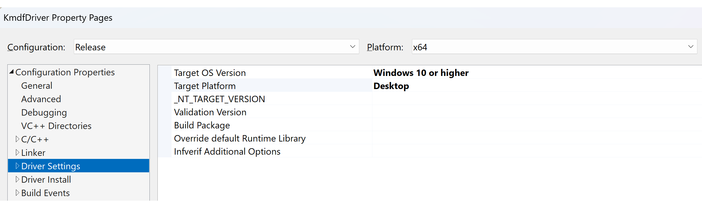

# Using Visual Studio or MSBuild to build a driver

This topic provides instructions on how to build a driver using the Visual Studio development environment, or from the command line using the Visual Studio Command Prompt window and the Microsoft Build Engine ([MSBuild](/visualstudio/msbuild/msbuild)).

To develop drivers for Windows, you'll need to install the SDK and WDK in Visual Studio and configure the driver settings. Ensure the SDK and WDK versions on your computer match.

## Build a driver using Visual Studio

You build a driver the same way you build any project or solution in Visual Studio. When you create a new driver project using a driver template, the template defines a default (active) project configuration and a default (active) solution build configuration.

For information about managing and editing build configurations, see [Building in Visual Studio](/previous-versions/visualstudio/visual-studio-2012/cyz1h6zd(v=vs.110)).

## KMDF driver settings

To configure driver settings in VS 2022, right click on the driver project, select properties, and navigate to **Properties** -> **Configuration Properties** -> **Driver Settings**.



### Target OS Version

The *Target OS Version* refers to the Windows version that the driver is being developed for.  Set the Target OS version to the lowest version your driver supports. For example, a driver for Windows 10 should support Windows 10 and all later versions.

Follow the guidance in these topics to ensure your [driver package](/windows-hardware/drivers/install/driver-packages) is properly written to support multiple versions of Windows.

- [Writing drivers for different versions of Windows](../gettingstarted/platforms-and-driver-versions.md)
- [Supporting multiple operating system versions](./support-multiple-os-versions.md)

### Target Platform

There are 3 classifications for the Windows target platform, *Universal Drivers*, *Desktop Drivers* and *Windows Drivers*.

1. *Universal Drivers* must:
    - Use no coinstallers.
    - Be compliant with DCH Design Principles. See [DCH Design Principles and Best Practices](./dch-principles-best-practices.md).
    - Pass `InfVerif /u`

2. *Desktop Drivers* must:
   - Meet all Universal Drivers requirements.
   - Be compliant with [Windows Hardware Compatibility Program (WHCP) requirements](/windows-hardware/design/compatibility/whcp-specifications-policies).
   - Pass `InfVerif /h`. For more info, see [InfVerif /h](../devtest/infverif_h.md).

    Drivers that meet the Desktop Driver criteria are Windows Logo Certified and can be added to the Windows Update program.

3. *Windows Drivers* must:
   - Meet all Desktop Drivers requirements.
   - Be fully compliant with [Driver Package Isolation](./driver-isolation.md) requirements.
   - Pass `InfVerif /w`
   - Windows Drivers is the most restrictive target platform selection and meets all reliability and serviceability requirements.

The following table summarizes the driver classifications.

| Feature                                | Universal Drivers | Desktop Drivers | Windows Drivers |
|----------------------------------------|-------------------|-----------------|-----------------|
| Infverif Switch                        | `InfVerif /u`     | `InfVerif /h`   | `InfVerif /w`   |
| Current WHCP Requirement               | No                | Yes             | No              |
| Supports all variants of Windows OS    | No                | No              | Yes             |
| X64/ARM64 Support                      | Yes               | Yes             | Yes             |
| APIVALIDATOR Compliance Required       | No                | No              | Yes             |
| Desktop OS Support (Target OS Version) | Yes               | Yes             | Yes             |
| GitHub Driver Samples Support          | Yes               | Yes             | No              |

### Driver configuration

When building drivers, ensure that the Platform Architecture and NT_TARGET_VERSION are properly set in Visual Studio with WDK or EWDK.
The default Solution build configuration for development is **Debug** and **Win64**.

1. Select and hold (or right-click) the solution in the **Solutions Explorer** and select **Configuration Manager**.
2. From the **Configuration Manager**, select the **Active solution configuration** (for example, **Debug** or **Release**) and the **Active solution platform** (for example, **Win64**) that correspond to the type of build you are interested in.
3. Select and hold (or right-click) the project and select **Properties**.  Navigate to **Driver Settings** -> **General**, and set **Target OS Version** and **Target Platform**.
4. Configure the project properties for your driver or driver package. You can set properties for deployment, driver signing, or other tasks. For more information, see [Configuring project properties for your driver and driver package](#configuring-project-properties-for-your-driver-and-driver-package).

### To build a driver

1. Open the driver project or solution in Visual Studio.
2. From the **Build** menu, select **Build Solution** (**Ctrl+Shift+B**).
3. View any compile time errors in the build output window.

## Building a Driver Using the Command Line (MSBuild)

You can build a driver from the command line using the **Visual Studio Command Prompt** window and the Microsoft Build Engine ([MSBuild](/visualstudio/msbuild/msbuild))

### To build a driver using the Visual Studio Command Prompt window

1. Open a **Developer Command Prompt for VS2022** window.

    From this window you can use MSBuild.exe to build any Visual Studio project by specifying the project (.vcxproj) or solutions (.sln) file.

2. Navigate to the project directory and enter the **MSBuild** command for your target.

    For example, to perform a clean build of a Visual Studio driver project called MyDriver.vcxproj using the default Platform and Configuration, navigate to the project directory and enter the following MSBuild command:

    ```cpp
    msbuild /t:clean /t:build .\MyDriver.vcxproj
    ```

    To specify a specific configuration and platform, use:

    ```cpp
    msbuild /t:clean /t:build ProjectFile /p:Configuration=<Debug|Release> /p:Platform=architecture /p:TargetPlatformVersion=a.b.c.d /p:TargetVersion=OS    
    ```

    The following command builds a driver for the "Debug" configuration, "Win32" platform, and for Windows 10.

    ```cpp
    msbuild /t:clean /t:build .\MyDriver.vcxproj /p:Configuration="Debug" /p:Platform=Win32 /p:TargetVersion="Windows10" /p:TargetPlatformVersion="10.0.10010.0"
    ```

    The **TargetPlatformVersion** setting is optional and specifies the kit version to build with. The default is the latest kit version.

## Configuring project properties for your driver and driver package

Use **property pages** to configure and set options for your driver and driver package. You can choose to configure your driver so that it is automatically signed when you build your solution, or automatically deployed to a remote test computer.

You can set properties for an individual driver or for an entire driver package. The following section shows some of the available properties that you can configure specifically for drivers and driver packages.

### Driver Project Properties

- [Driver Model Settings Properties for Driver Projects](driver-model-settings-properties-for-driver-projects.md)

- Signing properties for individual driver files - [Signing a Driver](signing-a-driver.md)

- [Deploying a Driver to a Test Computer](deploying-a-driver-to-a-test-computer.md)

- [Counters Manifest Preprocessor Properties for Driver Projects](counters-manifest-preprocessor-properties-for-driver-projects.md)

- [CTRPP](/windows/desktop/PerfCtrs/ctrpp)

- [Message Compiler Properties for Driver Projects](message-compiler-properties-for-driver-projects.md)

- [Stampinf Properties for Driver Projects](stampinf-properties-for-driver-projects.md)

- [WPP Preprocessor (WPP Tracing)](../devtest/wpp-preprocessor.md) 

### Driver Package Properties

- [Deployment Properties for Driver Package Projects](deployment-properties-for-driver-projects.md)

- Signing properties for driver packages - [Signing a Driver](signing-a-driver.md)

- [Driver Verifier Properties for Driver Package Projects](driver-verifier-properties-for--driver-projects.md)

- [KMDF Verifier Properties for Driver Package Projects](kmdf-verifier-properties-for-driver-package-projects.md) 

- [UMDF Verifier Properties for Driver Package Projects](umdf-verifier-properties-for-driver-package-projects.md)

- [Inf2Cat Properties for Driver Package Projects](inf2cat-properties-for-driver-package-projects.md) and [Inf2Cat](../devtest/inf2cat.md)

### WDK command line tool project integration

The WDK provides a number of command-line tools, such as [Stampinf](../devtest/stampinf.md) and [WPP Preprocessor (WPP Tracing)](../devtest/wpp-preprocessor.md), that are commonly included in the build process. These tools are not distributed with Visual Studio. To combine these tools with the Visual Studio build environment they are wrapped as [WDK tasks for MSBuild](../devtest/wdk-tasks-for-msbuild.md). If you use one of the driver templates or have an existing driver that you have converted, these property pages might already exist for your project. If not, the property pages are automatically added to your project as you add the related file types to the project or solution (for example, .mc or .man files for the message compiler). For more information, see [WDK and the Visual Studio build environment](../devtest/wdk-and-visual-studio-build-environment.md).

## Troubleshooting tip for building a driver

To help troubleshoot build issues, you can increase the verbosity of the build output in Visual Studio:

1. Select **Tools** -> **Options**.
2. Select the **Project and Solutions** folder and select **Build and Run**.
3. Change the options for the **MSBuild project build output verbosity** and **MSBuild project build log file verbosity**. By default, these are set to **Minimal**.

## Updating Windows 8 drivers

You can convert projects and solutions that you created with WDK 8 or Windows Driver Kit (WDK) 8.1 to work with Windows Driver Kit (WDK) 10 and Visual Studio. Before you open the projects or solutions, run the [ProjectUpgradeTool](../devtest/projectupgradetool.md). The ProjectUpgradeTool converts the projects and solutions so that they can be built using WDK 10.

Starting in Windows Driver Kit (WDK) 8, MSBuild replaced the Windows Build Utility (Build.exe). The WDK uses the same compiler and build tools that you use to build Visual Studio projects. Driver projects that were built with previous versions of the WDK must be converted to work in the Visual Studio environment. You can run a conversion utility from the command line, or you can convert an existing driver by creating a new Visual Studio project from existing sources. For more info, see [Creating a Driver From Existing Source Files](creating-a-driver-from-existing-source-files.md) and [WDK and the Visual Studio build environment](../devtest/wdk-and-visual-studio-build-environment.md).

## Related topics

- [Building in Visual Studio](/previous-versions/visualstudio/visual-studio-2012/cyz1h6zd(v=vs.110))
- [Building Drivers for Different Versions of Windows](building-drivers-for-different-versions-of-windows.md)
- [Using the Microsoft C Runtime with User-Mode Drivers and Desktop Apps](using-the-microsoft-c-runtime-with-user-mode-drivers-and-apps.md)
- [ProjectUpgradeTool](../devtest/projectupgradetool.md)
- [MSBuild](/visualstudio/msbuild/msbuild)
- [Creating a Driver From Existing Source Files](creating-a-driver-from-existing-source-files.md)
- [WDK and the Visual Studio build environment](../devtest/wdk-and-visual-studio-build-environment.md)
- [Signing a Driver](signing-a-driver.md)
- [Deploying a Driver to a Test Computer](deploying-a-driver-to-a-test-computer.md)
- [InfVerif /h](../devtest/infverif_h.md)
