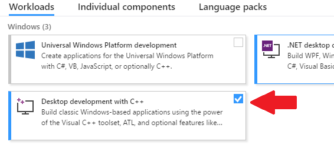
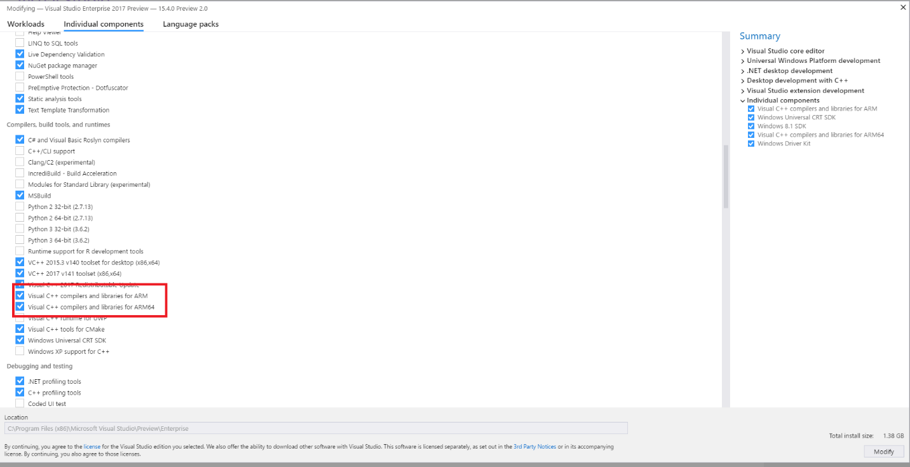
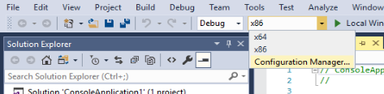
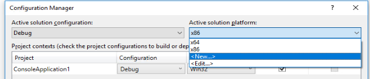
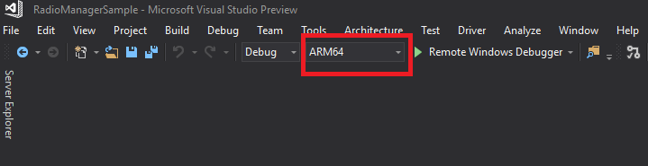

# Building ARM64 Drivers with the WDK

Starting with version 1709, Windows 10 Desktop (Pro and S editions) can run on machines that are powered by ARM64 processors.  However, because Windows 10 on ARM does not support x86 emulation of kernel-mode drivers, you must recompile kernel-mode drivers to ARM64 using the instructions below.

## Setup

1. Download [Visual Studio 2017 Preview](https://www.visualstudio.com/vs/preview/).  You'll need at minimum version 15.4.0 Preview 2.0.
2. On the Windows start menu, type **Visual Studio Installer**.  Then on the **Workloads** tab, select **Desktop development with C++**.  

2. On the **Individual Components** tab, select the following options:
    *  **Visual C++ compilers and libraries for ARM**
    *  **Visual C++ compilers and libraries for ARM64**  

3.	Install and restart Visual Studio.
4.  Download the [Windows SDK](https://developer.microsoft.com/windows/downloads/windows-10-sdk).  Ensure that you have SDK version 16299 (Windows 10, version 1709) or later.
5.	Download the [WDK](../download-the-wdk.md).  Ensure that you have WDK version 16299 or later.

## Building an ARM64 Driver with the WDK

1.	In Visual Studio, open a driver solution.  You can use your own, or one from the [Windows-driver-samples](https://github.com/Microsoft/Windows-driver-samples) repo.
2.	Click on Solutions platform and select **Configuration Manager**.  

  
3.	Under **Active Solution Platform**, select **New**.  

4.	From **Type or Select new Platform**, select **ARM64**.  Copy settings from **Win32**.  Click **OK** and **Close**.  

5.	Select **ARM64** as the target platform and rebuild.

## See Also

* [Debugging ARM64](../debugger/debugging-arm64.md)
* [Windows 10 on ARM](https://docs.microsoft.com/windows/uwp/porting/apps-on-arm)
* [HLK ARM64 Getting Started Guide](https://docs.microsoft.com/windows-hardware/test/hlk/getstarted/hlk-arm64-getting-started-guide)
