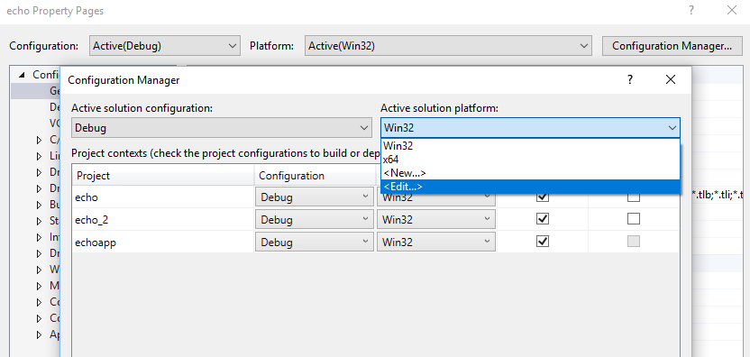

# Building Arm64 Drivers with the WDK

Starting with WDK version 10.0.26100.1 (released May 22, 2024), the WDK now supports development, testing, and deployment of drivers on Arm64 machines.  The WDK can be installed and run natively on Arm64 hardware, in addition to the previously supported emulation of x86 KMDF/UMDF2 drivers on Arm64 hardware.  There is also support for debugging and deployment of drivers to an Arm64 target machine from both Arm64 and x64 host machines.  The process of installing the WDK on Arm64 machines will automatically identify and install all the necessary dependencies including build tools, binaries, and libraries.

This page describes how to build an Arm64 driver with the WDK.

## Setup

1. Download [Visual Studio 2022](https://visualstudio.microsoft.com/downloads/).  You'll need at minimum version 17.0.0 or later.  Ensure that you have the following components installed:

    * MSVC v143 - VS 2022 C++ ARM64/ARM64EC Spectre-mitigated libs (Latest)
    * MSVC v143 - VS 2022 C++ x64/x86 Spectre-mitigated libs (Latest)
    * C++ ATL for latest v143 build tools with Spectre Mitigations (ARM64/ARM64EC)
    * C++ ATL for latest v143 build tools with Spectre Mitigations (x86 & x64)
    * C++ MFC for latest v143 build tools with Spectre Mitigations (ARM64/ARM64EC)
    * C++ MFC for latest v143 build tools with Spectre Mitigations (x86 & x64)

1.	Install and restart Visual Studio.
1.  Download the [Windows SDK](https://developer.microsoft.com/windows/downloads/windows-sdk).  Ensure that you have SDK version 16299 (Windows 10, version 1709) or later.
1.	Download the [WDK](../download-the-wdk.md).  Ensure that you have WDK version 16299 or later.

## Building an Arm64 Driver with the WDK

1.	In Visual Studio, open a driver solution.  You can use your own, or one from the [Windows-driver-samples](https://github.com/Microsoft/Windows-driver-samples) repo.
2.	Select Solutions platform and select **Configuration Manager**.  

  
3.	Under **Active Solution Platform**, select **New**.  

4.	From **Type or Select new Platform**, select **Arm64**.  Copy settings from **Win32**.  Select **OK** and **Close**.  

5.	Select **Arm64** as the target platform and rebuild.

## See Also

* [Debugging Arm64](../debugger/debugging-Arm64.md)
* [Windows on Arm](/windows/uwp/porting/apps-on-arm)
* [HLK Arm64 Getting Started Guide](/windows-hardware/test/hlk/getstarted/hlk-Arm64-getting-started-guide)
