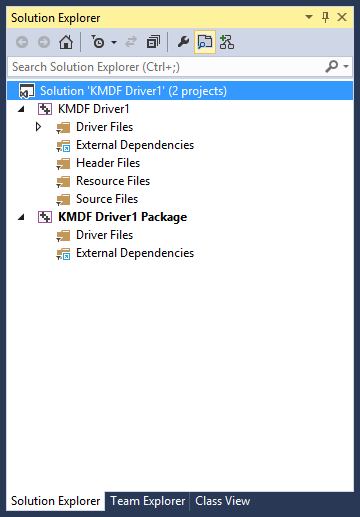
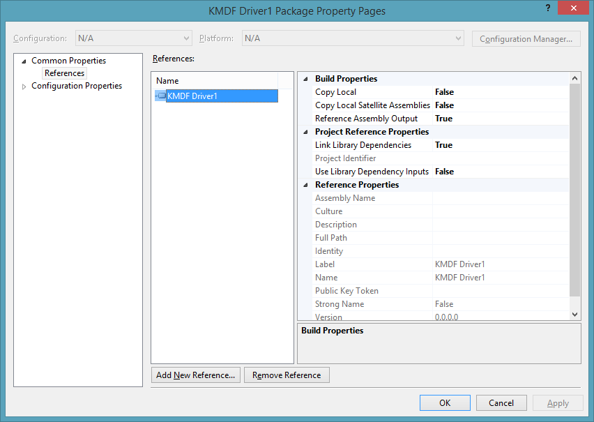
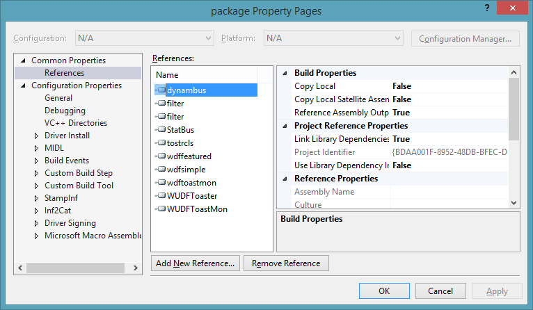

Creating a Driver Package
==============================================================================

Driver projects and packages
-------------------------------------------------------------------------------------------------------------------------------------------------------------------------

A driver *project* is the Microsoft Visual Studio project which produces a driver binary (such as a .sys file), and potentially the driver's INF file.

A driver *package* is the collection of files used to install a driver. The package includes an INF file, and files and binaries referred to by that INF. Visual Studio uses driver packages to automatically deploy and debug your driver to a remote target.

A driver package is a separate project which collects output from one or more projects, such as driver projects. The driver package's project, when built, then produces the driver package which Visual Studio uses to deploy the driver.

**Note**  

 

If you use a driver template to create a driver solution, then the template should automatically create a solution that contains two projects. One for the driver, and another for the driver package.
Manually creating a driver package
-------------------------------------------------------------------------------------------------------------------------------------------------------------------------------------------------

If your solution does not have a driver package, you can manually create one in Visual Studio by choosing **New &gt; Project** from the **File** menu. For examples of how to create a driver package, see [Writing Your First Driver](https://msdn.microsoft.com/en-us/Library/Windows/Hardware/Ff554811).

To manually create a new driver package for an existing solution that does not already have one, use the "Driver Install Package" template. Select **New &gt; Project** from the **File** menu. Then select **Windows Driver &gt; Package &gt; "Driver Install Package"** from the dialog. Visual Studio will associate the newly created driver package with all the driver projects that were present in the solution when the driver package is created.

Modifying an existing driver package
---------------------------------------------------------------------------------------------------------------------------------------------------------------------------------------------------------

If your solution already contains a driver package, you can modify it to reference other projects in the solution.

Right-click on the driver package and select **Properties...**. Expand **Common Properties** and select **References**.

You can add a reference to other projects in the solution by clicking **Add New Reference...** and selecting the project to reference.

To remove a reference to an existing project, first highlight the existing project you no longer want to reference, then click **Remove Reference**.

Multiple drivers in a solution
---------------------------------------------------------------------------------------------------------------------------------------------------------------------------------

You can add multiple drivers and their packages to your solution. Similar to "Modifying an existing driver package" you can create a new driver solution, or add a reference to an existing one. If your solution already contains a driver package, you can modify it to reference additional driver projects in the solution.

Right-click on the existing driver package and select **Properties...**. Expand **Common Properties** and select **References**.

You can add a reference to other projects in the solution by clicking **Add New Reference...** and selecting the project to reference.

To remove a reference to an existing project, first highlight the existing project you no longer want to reference, then click **Remove Reference**.

See the "Toaster Sample Driver" sample for an example of a single solution that contains multiple drivers:

Related topics
-----------------------------------------------

* [Signing a Driver](signing_a_driver.md)
 

 

[Send comments about this topic to Microsoft](mailto:wsddocfb@microsoft.com?subject=Documentation%20feedback%20[VsDriver\vsdriver]:%20Creating%20a%20Driver%20Package%20%20RELEASE:%20%289/30/2015%29&body=%0A%0APRIVACY%20STATEMENT%0A%0AWe%20use%20your%20feedback%20to%20improve%20the%20documentation.%20We%20don't%20use%20your%20email%20address%20for%20any%20other%20purpose,%20and%20we'll%20remove%20your%20email%20address%20from%20our%20system%20after%20the%20issue%20that%20you're%20reporting%20is%20fixed.%20While%20we're%20working%20to%20fix%20this%20issue,%20we%20might%20send%20you%20an%20email%20message%20to%20ask%20for%20more%20info.%20Later,%20we%20might%20also%20send%20you%20an%20email%20message%20to%20let%20you%20know%20that%20we've%20addressed%20your%20feedback.%0A%0AFor%20more%20info%20about%20Microsoft's%20privacy%20policy,%20see%20http://privacy.microsoft.com/en-us/default. "Send comments about this topic to Microsoft")

