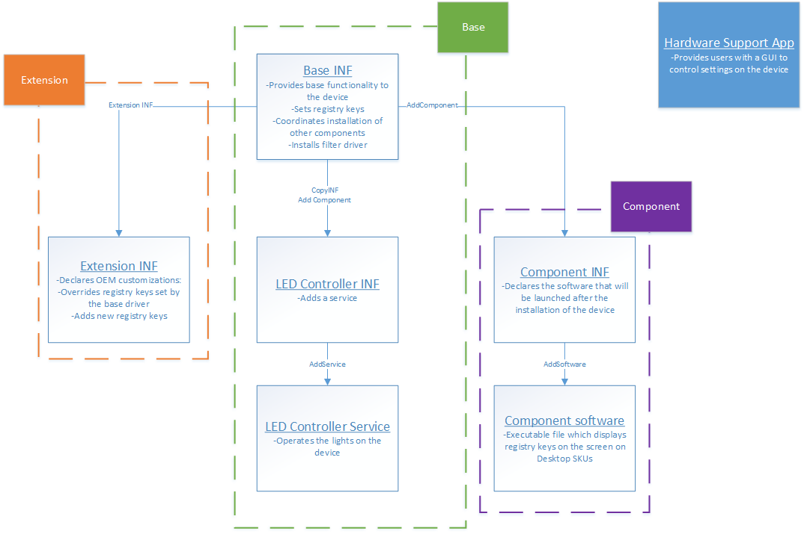

# DCH-Compliant Driver Package Example

This topic describes how the [DCHU driver sample](https://github.com/Microsoft/Windows-driver-samples/tree/master/general/DCHU) applies [DCH design principles](dch-principles-best-practices.md).  You can use it as a model to apply DCH design principles to your own driver package.  

If you would like a local copy of the sample repo, clone from [Windows-driver-samples](https://github.com/Microsoft/Windows-driver-samples).

Some portions of the sample may use directives and APIs that are only available on certain versions of Windows 10 and above.  Please refer to [Device and Driver Installation](../install/index.md) to see what OS version a given directive is supported on.

## Prerequisites

Before you read this section, you should become familiar with the [DCH Design Principles](dch-principles-best-practices.md).

## Overview

The sample provides example scenarios where two hardware partners, Contoso (a system builder, or OEM) and Fabrikam (a device manufacturer, or IHV) are working together to create a driver that is DCH-compliant for a device in Contoso's upcoming system.  The device in question is an [OSR USB FX2 learning kit](https://go.microsoft.com/fwlink/p/?linkid=2113717).  In the past, Fabrikam would write a legacy driver package that was customized to a specific Contoso product line, and then hand it to the OEM to handle servicing.  This resulted in significant maintenance overhead, so Fabrikam decided to refactor the code and create a DCH-compliant driver package instead.

## Use declarative sections/directives and properly isolate INF

First, Fabrikam reviews the [list of INF sections and directives](../install/using-a-universal-inf-file.md#which-inf-sections-are-invalid-in-a-universal-inf-file) that are invalid in DCH-compliant driver packages.  During this exercise, Fabrikam notices that they're using many of these sections and directives in their driver package.  

Their driver INF registers a co-installer that applies platform-dependent settings and files.  This means that the driver package is larger than it should be, and it is harder to service the driver when a bug affects only a subset of the OEM systems that ship the driver.  Also, most of the OEM-specific modifications are related to branding, so Fabrikam needs to update the driver package every time an OEM is added or when a minor issue affects a subset of OEM systems.

Fabrikam removes the non-declarative sections and directives and uses the [InfVerif](../devtest/infverif.md) tool to verify that the new driver package's INF file follows the declarative INF requirement.

## Use extension INFs to componentize a driver package

Next, Fabrikam separates customizations that are specific to OEM partners (such as Contoso) from the base driver package into an [extension INF](../install/using-an-extension-inf-file.md).

The following snippet, updated from [`osrfx2_DCHU_extension.inx`], specifies the `Extension` class and identifies Contoso as the provider since they will own the extension driver package:

```cpp
[Version]
Class       = Extension
ClassGuid   = {e2f84ce7-8efa-411c-aa69-97454ca4cb57}
Provider    = Contoso
ExtensionId = {zzzzzzzz-zzzz-zzzz-zzzz-zzzzzzzzzzzz} ; replace with your own GUID
```

In [`osrfx2_DCHU_base.inx`], Fabrikam specifies the following entries:

```cpp
[OsrFx2_AddReg]
HKR, OSR, "OperatingMode",, "Default" ; FLG_ADDREG_TYPE_SZ
HKR, OSR, "OperatingParams",, "None" ; FLG_ADDREG_TYPE_SZ
```

In [`osrfx2_DCHU_extension.inx`], Contoso overrides the **OperatingParams** registry value set by the base and adds **OperatingExceptions**:

```cpp
[OsrFx2Extension_AddReg]
HKR, OSR, "OperatingParams",, "-Extended"
HKR, OSR, "OperatingExceptions",, "x86"
```

Note that extensions are always processed after the base INF but in no definite order. If a base INF is updated to a newer version, then the extensions will still be re-applied after the new base INF is installed.

## Install a service from an INF file

Fabrikam uses a Win32 service to control the LEDs on the OSR board. They view this component as part of the core functionality of the device, so they include it as part of their base INF ([`osrfx2_DCHU_base.inx`]).  This user-mode service (usersvc) can be added and started declaratively by specifying the [**AddService**](../install/inf-addservice-directive.md) directive in the INF file:

```cpp
[OsrFx2_Install.NT]
CopyFiles = OsrFx2_CopyFiles

[OsrFx2_Install.NT.Services]
AddService = WUDFRd, 0x000001fa, WUDFRD_ServiceInstall    ; Flag 0x2 sets this as the service for the device
AddService = osrfx2_DCHU_usersvc,, UserSvc_ServiceInstall

[UserSvc_ServiceInstall]
DisplayName = %UserSvcDisplayName%
ServiceType = 0x10                                ; SERVICE_WIN32_OWN_PROCESS
StartType = 0x3                                   ; SERVICE_DEMAND_START
ErrorControl = 0x1                                ; SERVICE_ERROR_NORMAL
ServiceBinary = %13%\osrfx2_DCHU_usersvc.exe
AddTrigger = UserSvc_AddTrigger                   ; AddTrigger syntax is only available in Windows 10 Version 2004 and above

[UserSvc_AddTrigger]
TriggerType = 1                                   ; SERVICE_TRIGGER_TYPE_DEVICE_INTERFACE_ARRIVAL
Action = 1                                        ; SERVICE_TRIGGER_ACTION_SERVICE_START
SubType = %GUID_DEVINTERFACE_OSRFX2%              ; Interface GUID
DataItem = 2, "USB\VID_0547&PID_1002"             ; SERVICE_TRIGGER_DATA_TYPE_STRING

[OsrFx2_CopyFiles]
osrfx2_DCHU_base.dll
osrfx2_DCHU_filter.dll
osrfx2_DCHU_usersvc.exe
```

Note that such a service could also be installed in a component or extension INF, depending on the scenario.

## Use a component to install legacy software from a driver package

Fabrikam has an executable file `osrfx2_DCHU_componentsoftware.exe` that they previously installed using a co-installer.  This legacy software displays the registry keys set by the board and is required by the OEM.  This is a GUI-based executable that only runs on Windows for desktop editions.  To install it, Fabrikam creates a separate component driver package and adds it in their extension INF.

The following snippet from [`osrfx2_DCHU_extension.inx`] uses the [**AddComponent**](../install/inf-addcomponent-directive.md) directive to create a virtual child device:

```cpp
[OsrFx2Extension_Install.NT.Components]
AddComponent = osrfx2_DCHU_component,,OsrFx2Extension_ComponentInstall


[OsrFx2Extension_ComponentInstall]
ComponentIds=VID_045e&PID_94ab
```

Then, in the component INF [`osrfx2_DCHU_component.inx`], Fabrikam specifies the [**AddSoftware**](../install/inf-addsoftware-directive.md) directive to install the optional executable:

```cpp
[OsrFx2Component_Install.NT.Software]
AddSoftware = osrfx2_DCHU_componentsoftware,, OsrFx2Component_SoftwareInstall

[OsrFx2Component_SoftwareInstall]
SoftwareType = 1
SoftwareBinary = osrfx2_DCHU_componentsoftware.exe
SoftwareArguments = <<DeviceInstanceId>>
SoftwareVersion = 1.0.0.0

[OsrFx2Component_CopyFiles]
osrfx2_DCHU_componentsoftware.exe
```

The [source code for the Win32 app](https://github.com/Microsoft/Windows-driver-samples/tree/master/general/DCHU/osrfx2_DCHU_extension_loose/osrfx2_DCHU_componentsoftware) is included in the sample.

Note that the component driver package is only distributed on Desktop SKUs due to targeting set in the [Windows Hardware Dev Center dashboard](https://partner.microsoft.com/dashboard/Registration/Hardware).  For more info, see [Publish a driver to Windows Update](../dashboard/publish-a-driver-to-windows-update.md).

## Allow communication with a hardware support app

Fabrikam would like to provide a GUI-based companion app as part of the Windows Driver package.  Because Win32-based companion applications cannot be part of a Windows Driver package, they port their Win32 app to the Universal Windows Platform (UWP) and [pair the app with the device](../devapps/hardware-support-app--hsa--steps-for-driver-developers.md).

The following snippet from [`osrfx2_DCHU_base/device.c`](https://github.com/Microsoft/Windows-driver-samples/blob/master/general/DCHU/osrfx2_DCHU_base/osrfx2_DCHU_base/device.c) shows how the base driver package adds a custom capability to the device interface instance:

```cpp
    WDF_DEVICE_INTERFACE_PROPERTY_DATA PropertyData = { 0 };
    static const wchar_t customCapabilities[] = L"CompanyName.yourCustomCapabilityNameTBD_YourStorePubId\0";

    WDF_DEVICE_INTERFACE_PROPERTY_DATA_INIT(&PropertyData,
                                            &GUID_DEVINTERFACE_OSRUSBFX2,
                                            &DEVPKEY_DeviceInterface_UnrestrictedAppCapabilities);

    Status = WdfDeviceAssignInterfaceProperty(Device,
                                              &PropertyData,
                                              DEVPROP_TYPE_STRING_LIST,
                                              sizeof(customCapabilities),
                                              (PVOID)customCapabilities);
```

The new app (not included in the sample) is secure and can be updated easily in the Microsoft Store. With the UWP application ready, Contoso uses [DISM - Deployment Image Servicing and Management](/windows-hardware/manufacture/desktop/dism---deployment-image-servicing-and-management-technical-reference-for-windows) to pre-load the application on Windows Desktop edition images.

## Tightly coupling multiple INF files

Ideally, there should be strong versioning contracts between base, extensions, and components.  There are servicing advantages in having these three packages serviced independently (the "loosely coupled" scenario), but there are scenarios where they need to be bundled in a single driver package ("tightly coupled") due to poor versioning contracts.  The sample includes examples of both scenarios:

* [DCHU_Sample\osrfx2_DCHU_extension_loose](https://github.com/Microsoft/Windows-driver-samples/tree/master/general/DCHU/osrfx2_DCHU_extension_loose)
* [DCHU_Sample\osrfx2_DCHU_extension_tight](https://github.com/Microsoft/Windows-driver-samples/tree/master/general/DCHU/osrfx2_DCHU_extension_tight)

  When the extension and component are in the same driver package ("tightly coupled"), the extension INF specifies the [CopyINF directive](../install/inf-copyinf-directive.md) to cause the component INF to be copied to the target system.  This is demonstrated in [DCHU_Sample\osrfx2_DCHU_extension_tight\osrfx2_DCHU_extension\osrfx2_DCHU_extension.inx](https://github.com/Microsoft/Windows-driver-samples/blob/master/general/DCHU/osrfx2_DCHU_extension_tight/osrfx2_DCHU_extension/osrfx2_DCHU_extension.inx):

```cpp
[OsrFx2Extension_Install.NT]
CopyInf=osrfx2_DCHU_component.inf
```

This directive can also be used to coordinate installation of INF files in multifunction devices.  For more details, see [Copying INF files](../install/copying-inf-files.md).

> [!NOTE]
> While a base driver can payload an extension (and target the base driver in the shipping label), an extension bundled with another driver cannot be published to the extension hardware ID.

## Run from the driver store

To make it easier to update the driver, Fabrikam specifies the [Driver Store](../install/driver-store.md) as the destination to copy the driver files by using [**dirid 13**](../install/using-dirids.md) where possible.  Using a destination directory value of 13 can result in improved stability during the driver update process.  Here is an example from [`osrfx2_DCHU_base.inx`]:

```cpp
[DestinationDirs]
OsrFx2_CopyFiles = 13 ; copy to Driver Store
```

See the [driver package isolation](driver-isolation.md#run-from-driver-store) page for more details regarding how to dynamically find and load files from the Driver Store.  

## Summary

The following diagram shows the driver packages that Fabrikam and Contoso created for their DCH-compliant driver.  In the loosely coupled example, they will make three separate submissions on the [Windows Hardware Dev Center dashboard](https://partner.microsoft.com/dashboard/Registration/Hardware): one for the base, one for the extension, and one for the component.  In the tightly coupled example, they will make two submissions: base and extension/component.



Note that the component INF will match on the component hardware ID, whereas the base and extensions will match on the board's hardware ID.

## See also

[Getting Started with Windows Drivers](getting-started-with-windows-drivers.md)

[Using an Extension INF File](../install/using-an-extension-inf-file.md)

[`osrfx2_DCHU_base.inx`]: https://github.com/Microsoft/Windows-driver-samples/blob/master/general/DCHU/osrfx2_DCHU_base/osrfx2_DCHU_base/osrfx2_DCHU_base.inx

[`osrfx2_DCHU_usersvc.inx`]: https://github.com/Microsoft/Windows-driver-samples/blob/master/general/DCHU/osrfx2_DCHU_base/osrfx2_DCHU_usersvc/osrfx2_DCHU_usersvc.inx

[`osrfx2_DCHU_component.inx`]: https://github.com/Microsoft/Windows-driver-samples/blob/master/general/DCHU/osrfx2_DCHU_extension_loose/osrfx2_DCHU_component/osrfx2_DCHU_component.inx

[`osrfx2_DCHU_extension.inx`]: https://github.com/Microsoft/Windows-driver-samples/blob/master/general/DCHU/osrfx2_DCHU_extension_loose/osrfx2_DCHU_extension/osrfx2_DCHU_extension.inx
