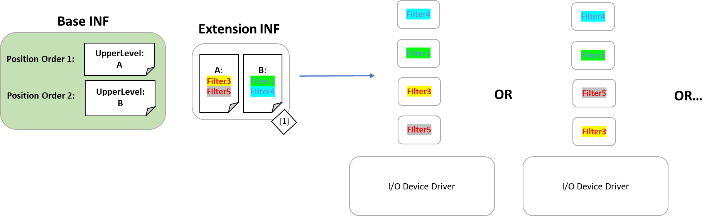

# Device filter driver ordering

Microsoft has developed a method of declaratively adding filters by expressing the intent of the filter, rather than the stack position, known as device filter driver ordering.

## The need for device filter driver ordering

Prior to Windows 10 version 1903, the only supported way to register a device filter driver was by addition of a registry entry (using the [AddReg directive](../install/inf-addreg-directive.md)). However, this method of registry manipulation does not provide the flexibility to specify at **exactly which position** to register a particular filter.

Filter registration using the AddReg directive simply appends the filter to the end of the filter list. This approach uses a list of values where order matters and determines where in the stack the filter is loaded.

Using a single list of ordered values is less than ideal, especially when [AddReg](../install/inf-addreg-directive.md) *only* *appends* *to the end,* because there are negative consequences when more than one driver is adding filters to the same device.

In the scenario where there is at least one [Extension INF](../install/using-an-extension-inf-file.md) involved, if the INFs improperly use **AddReg** (in other words don't use the append flag), they could wipe out a filter added by a different INF.

Additionally, multiple Extension INF's could be adding filters, and the relative ordering of those filters may be important; however, the Plug and Play (PnP) platform does not guarantee an installation order for the extensions. The result is that the order of the "appends" is not guaranteed.

## Implementing device filter driver ordering

In order to provide a flexible declarative method to register device filters, Microsoft has developed a method of declaratively adding filters by expressing the intent of the filter, rather than the stack position. The solution provides function driver authors the ability to express in their INF an **ordered set of positions (called levels)** that a filter may register itself against.

In addition to a specific level, a filter can declaratively register simply as an *upper* or *lower* level filter.

The infrastructure is based on a new filter registration method to determine what order drivers are to be included in the device stack. The new method does not break compatibility for the old way of adding filters. It does, however, enable new filters to move to a more robust and flexible registration mechanism.

The method is enabled by having the base INF define an ordered list of one or more "levels". Both the base INF and any extension INFs may register a declarative filter via a new INF directive that specifies the service name and level to which the filter belongs to. Upper and lower filters each are represented by their own respective ordered list of levels.

These upper and lower filter lists are created by sorting all filter drivers by their level. The order of the filters within each level should be considered *arbitrary*, where no dependency may be taken on the order of filters within a particular level. In scenarios where the relative order of two filters must be **guaranteed**, they should be registered to different levels.

Consider the following device driver example:



The device driver's base INF declares two upper filter levels, A and B (in that order). In the base INF's associated Extension INF, two filters are added into each of the two levels.

The result of the installation of the device driver is a device stack order that merges the lists of filter drivers while respecting the desired positioning and ordering. The resulting device stack order ensures that any filter placed in the "A" level comes before any filter in the "B" level. However, within each level, the order is arbitrary.

As shown in the example, Filter3 could come before Filter5 or it could come after Filter5. In any case, Filter3 and Filter5 will come before the filters at the next level, "B".

When designing the series of levels that filters can be registered against, rather than creating a series of levels for the sake of ordering, the levels should be  named and ordered such that they map to the intent of the filter. For instance, an I/O device may define the level *Encryption*, to which any encryption filter should be registered. This allows the intent of the filter to be easily understood and managed, and makes the stack more robust against breaking changes to the function driver.

> [!NOTE]
> Even without levels defined by the base INF, a declarative filter may register as simply upper or lower. When levels are not defined, this is logically equivalent to appending the filter to the end of the UpperFilters/LowerFilters registry value. When levels are defined, one of the levels must be marked as the default level in the base driver, and in this case the filter will be registered into that level.

## Scenarios

Consider an I/O device driver that encrypts the data that is coming through the stack. A typical implementation may use a lower filter driver immediately underneath the function driver to accomplish this. In order to ensure that the encryption filter is placed at the exact position the driver author desires, they may use declarative filters as shown below:


The Base INF establishes two levels of lower filters, \"Encryption\" and "Monitoring" (Default). "Monitoring" (Default) in this example are the rest of the lower filters that might exist for this particular device. By explicitly placing the "Encrypt" filter driver in the "Encryption" level, the driver ensures that the resulting device stack order will put the "Encrypt" filter driver before any other lower filters and immediately following the function driver.

Let's take the example one step further. Imagine a newer version of the driver comes out and the author has built in encryption to the function driver. This removes the need for a separate "Encrypt" filter driver. The author simply needs to remove the level that contained the "Encrypt" filter from the Base INF and when the driver updates, the stack is dynamically built again.

If a filter declares itself to be in an explicit level that does not exist, the filter does not end up in the device stack. In the example, the Base INF has been updated and even though the Extension INF remains the same, the resulting device stack excludes the "Encrypt" filter as it was not included in the Base INF's declaration of levels.


## Default filter level

To generate the final filter stack, all sources of filter information are merged into a single list. It is important to note that the merge logic is performed **when creating the device stack.** If a new filter is added by installing a new/updated base or extension driver, the devices will be restarted during installation and pick up a new filter list.

Some sources of filters lack any position information, namely filters added via the legacy UpperFilters/LowerFilters registry values, or through position-only declarative syntax (discussed below).

To support an effective merge when lacking position information, an additional piece of information must be defined by the Base INF: a default filter level. The default filter level is a position where filters, lacking level or position information, will be inserted.

For example, filter levels may be defined in the Base INF as:

```INF
Level Order: A, B, C
DefaultFilterLevel: C
```

Specifying the default level as the final level indicates that any filter that lacking position information will be **appended** to the filter list. Alternatively, the driver author may wish to have the stack always end with filters explicitly registered to level C:

```INF
Level Order: A, B, C
DefaultFilterLevel: B
```

Due to the default filter level being set to B, any additional filter without position information will be inserted between A's filters and C's filters.

## Syntax

### Registering filters

See the [**INF DDInstall.Filters section**](../install/inf-ddinstall-filters-section.md) and the [**AddFilter directive**](../install/inf-addfilter-directive.md) documentation for more information.

```INF
[DDInstall.Filters]
AddFilter = <FilterName>, [Flags], FilterSection
```

FilterLevel OR FilterPosition may be specified in one of two ways:

**Option 1:**

```INF
[FilterSection]
FilterLevel=<LevelName>
```

**Option 2:**

```INF
[FilterSection]
FilterPosition=Upper/Lower
```

This can be done in **both** Base and Extension INF's.

\[DDInstall.Filters\]

**FilterName** is the name of the service on the system.

**Flags** is currently unused and should be left empty or set to 0.

**FilterSection** is a section describing the filter.

\[Filter Section\]

A filter section must contain exactly one of the following two directives:  **FilterLevel** or **FilterPosition**.

A **FilterLevel** is a specific place to insert the device filter on the
stack, defined by the Base INF.  Within each level, the order of the
filters is arbitrary.

A **FilterPosition** is used in the case where the class has one
specific place for third-party filters to be inserted.

### Defining Filter Levels

```INF
[DDInstall.HW]
AddReg = FilterLevel_Definition

[FilterLevel_Definition]
HKR,,UpperFilterLevels,%REG_MULTI_SZ%,"LevelA","LevelB","LevelC"
HKR,,UpperFilterDefaultLevel,,"LevelC"

HKR,,LowerFilterLevels,%REG_MULTI_SZ%,"LevelD","LevelE","LevelF"
HKR,,LowerFilterDefaultLevel,,"LevelE"
```

This can only be done by a **base** driver.

The full declarative list of filters for a specific device can be retrieved by querying the following properties:

```INF
DEVPKEY_Device_CompoundUpperFilters
DEVPKEY_Device_CompoundLowerFilters
```

### Legacy-equivalent filter registration

Let's examine how to accomplish the legacy approach of trying to add an upper filter via INF:

```INF
[DDInstall.HW]
AddReg = Filters

[Filters]
HKR,,"UpperFilters", 0x00010008, "MyFilter"
```

This syntax will add "MyFilter" to the end of the list of upper filters.

With the new syntax that has been introduced, the above section is logically similar to:

```INF
[DDInstall.Filters]
AddFilter = MyFilter,,MyUpperFilterInstall

[MyUpperFilterInstall]
FilterPosition = Upper
```

This specifies that the filter "MyFilter" should be added to the list of upper filters. If the base INF has specified filter levels, using *FilterPosition* will register the filter in the default level for that position.

If filter levels are not specified, this filter will be registered as an upper filter in arbitrary order.

## See Also

[**INF DDInstall.Filters section**](../install/inf-ddinstall-filters-section.md)

[**AddFilter directive**](../install/inf-addfilter-directive.md)