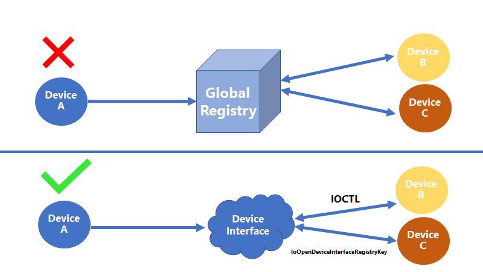

# Driver Package Isolation

## Driver Package Isolation Overview

Binaries in an isolated driver packagem store registry and file state using a handle to a relative location provided by OS API's as opposed to hardcoding global location paths.

Binaries in isolated driver packages interact with other components and their state through OS API's or interfaces exposed by those components. They do not use hardcoded paths to manually modify and interact with other drivers' state.  Additionally, all isolated driver packages are run from the driver store.

These principles enable an isolated driver package to be self-contained and sandboxed which makes it more robust to multiple versions existing or running on a system simultaneously. Additionally, this enables the OS to move driver packages to different locations based on new servicing or security features without risking driver package functionality.  Below is a diagram of the four main principles that isolated driver packages use:


## Benefits of Driver Package Isolation

Drivers that follow driver package isolation principles are more robust to servicing operations as they do not rely on implicit assumptions of global locations existing.  Instead, they use OS API's to get relative handles to locations.

Isolated driver packages have the added benefit of being more resilient to changes in the OS.  Additionally, because isolated driver packages leave all driver package files in the driver store, the likelihood of an issue arising during install of the driver is much lower.

By leveraging device interfaces, isolated driver packages are more robust to changes in other drivers as they do not take dependencies on other drivers modifying state in a global location.  Instead, an appropriately versioned interaction between drivers occurs using a device interface to communicate state between components. 
  
## Run From Driver Store

All isolated driver packages leave their driver package files in the driver store. This means that they leverage **DIRID 13** in their INF to specify the location for driver package files on install.

A WDM or KMDF driver that is running from the DriverStore and needs to access other files from its driver package could use [IoQueryFullDriverPath]() to find its path, get the directory path it was loaded from, and look for configuration files relative to that path.

Alternatively, on Windows 10 Verison 1803 and later, [IoGetDriverDirectory]() with *DriverDirectoryImage* as the directory type could be used to get the directory path that the driver was loaded from.

For a file payloaded by an INF, the *subdir* listed in the [SourceDisksFiles]() entry for the file in the INF must match the subdir listed in the [DestinationDirs]() entry for the file in the INF.

Additionally, a [CopyFiles]() directive cannot be used to rename a file. These restrictions are required so that the installation of an INF on a device does not result in the creation of new files in the DriverStore directory.

Since [SourceDisksFiles]() entries cannot have multiple entries with the same filename and CopyFiles cannot be used to rename a file, every file that an INF references must have a **unique file name**.

More information on how to find and load files from the driver store can be found in the [Universal Driver Scenarios](https://docs.microsoft.com/en-us/windows-hardware/drivers/develop/universal-driver-scenarios#dynamically-finding-and-loading-files-from-the-driver-store) page.

## Provisioning and Accessing Registry State

Access to various state should be done using OS API's that provide a caller with the location of the state and then the state is read/written relative to that location. Hardcoded absolute registry paths and file paths **should not be used**.
### PnP Device Registry State

There is a need for isolated driver packages and user mode components to read, and sometimes write, device state.  There are already two locations that can be used to store device state in the registry. They are called the **"hardware key"** (aka "device key") for the device and the **"software key"** (aka "driver key") for the device. These registry locations are already accessible via API's that give a caller a handle to the location.

The following API's should be used to ensure your driver is isolated:

* WDM:
  * [IoOpenDeviceRegistryKey]()
* WDF:
  * [WdfDeviceOpenRegistryKey]()
  * [WdfFdoInitOpenRegistryKey]()
* Other UserMode Code:
  * [CM_Open_DevNode_Key]()
* Provision Values via INF:
  * [INF AddReg]() directive using HKR *reg-root* entries in an *add-registry-section* referenced from an [INF DDInstall]() section or [DDInstall.HW]() section

Below is an example of an INF provisioning device registry state through its INF:

```
[ExampleDDInstall.HW]
AddReg = Example_DDInstall.AddReg

[Example_DDInstall.AddReg] 
HKR,,ExampleValue,,%13%\ExampleFile.dll
```

### Device Interface Registry State

When state needs to be shared between drivers, there should be a **single driver** that owns the shared state, and it should expose a way for other drivers to *read* and *modify* that state.

Typically, this would be accomplished by the driver that owns the state exposing a **device interface** in a custom device interface class and enabling that interface when the driver is ready for other drivers to have access to the state. Drivers that want access to this state can **register for [device interface arrival notifications]()**. To access the state, the custom device interface class can define one of two contracts:

* An *IO contract* can be associated with that device interface class that provides a mechanism for accessing the state. Other drivers can use the enabled device interface to send IO that conforms to that contract to the owning driver
* A *direct-call interface* that gets returned via a query interface. Other drivers could send [IRP_MN_QUERY_INTERFACE]() to retrieve function pointers from the driver to call.

Alternatively, If the driver that owns the state is robust to allowing direct access to the state, the other drivers could access state by using the OS API’s for programmatic access to device interface state.

These interfaces or state (depending on sharing method used) need to be **properly versioned** so the driver owning the state can be serviced independently of other drivers that want to access that state. Driver vendors cannot rely on both drivers being serviced at the same time and staying at the same version in lockstep.  

For simplicity, it may be tempting to have an application or driver get a list of enabled interfaces at a single point in time, such as during startup of the component, through functions such as [IoGetDeviceInterfaces](). However, this method is not advised as it leads to problems.

Devices and the drivers controlling interfaces can start up asynchronously of other devices and UserMode applications and may have their device stack torn down, such as when the device is disabled or restarted, leading to device interfaces exposed from that device being disabled.

The driver may also want to disable interfaces at any point in time for its own internal reasons. Without a registration for notifications of device interface arrival and removal, a component that would like to send IO to that device and driver would miss any device interfaces that are enabled after the request for the list of interfaces and would not know when one of the interfaces is disabled (meaning IO can no longer be sent to that interface).

The typical pattern is to **register for notifications** of device interface arrival/removal and then use an **API to get the list of existing enabled interfaces** on the machine.

You can find more information on device interfaces on the [Microsoft Docs page](https://docs.microsoft.com/en-us/windows-hardware/drivers/wdf/using-device-interfaces).   Information on how to register for device interface arrival and removal can be found [here](https://docs.microsoft.com/en-us/windows-hardware/drivers/install/registering-for-notification-of-device-interface-arrival-and-device-removal).  Additionally, information on registering for device interface change notifications can be found [here](https://docs.microsoft.com/en-us/windows-hardware/drivers/kernel/registering-for-device-interface-change-notification).

Isolated driver packages leverage device interfaces to share state with other drivers and components. Below is an example of how isolated driver packages should think about communicating with other drivers via device interfaces as opposed to hardcoding paths to global registry locations:



In order to read and write device interface registry state, use the following API's:

* WDM:
  * [IoOpenDeviceInterfaceRegistryKey]()
* Other UserMode Code:
  * [CM_Open_Device_Interface_Key]()
* Provision Values via INF:
  * [INF AddReg]() directive using HKR *reg-root* entries in an *add-registry-section* referenced from an [add-interface-section]() section.

### Service Registry State

Registry state for driver and Win32 services should be stored under the "Parameters" subkey of the service using an HKR line in an [AddReg]() section referenced by the service install section in the INF.  Below is an example:

```
[ExampleDDInstall.Services]
Addservice = ExampleService, 0x2, Example_Service_Inst

[Example_Service_Inst]
DisplayName    = %ExampleService.SvcDesc%
ServiceType    = 1
StartType      = 3
ErrorControl   = 1
ServiceBinary  = %13%\ExampleService.sys
AddReg=Example_Service_Inst.AddReg

[Example_Service_Inst.AddReg]
HKR, Parameters, ExampleValue, 0x00010001, 1
```

Use the appropriate API's to access this state:

* WDM 
  * [IoOpenDriverRegistryKey]()
* WDF
  * [WdfDriverOpenParamatersRegistryKey]()
* Win32 Services
  * [GetServiceRegistryStateKey]()

## Provisioning and Accessing File State

### Device File State

If files related to a device need to be written, those files should be stored relative to a handle provided via OS API’s. Some examples of these types of files include: configuration files specific to that device, log files of operations that have happened to the device, etc.

* WDM
  * [IoGetDeviceDirectory]()
* WDF
  * [WdfDeviceRetrieveDeviceDirectoryString]()

### Service File State

There is a need for services (both Win32 services and driver services) to read, and sometimes write, state about themselves. This is state that is owned by the service and accessed only by the service.

If that internal state of the service needs to be shared with other components, it should be done through a controlled, versioned, interface and not through direct registry or file reads of the internal service state.

The OS provides API’s for services to get storage locations for their internal state, but those storage locations are intended to be accessed only by the service itself. 

* WDM
  * [IoGetDriverDirectory]()
* WDF
  * KMDF Drivers
    * [IoGetDriverDirectory]()
  * UMDF Drivers
    * [WdfDriverRetrieveDriverDataDirectoryString]()
* Win32 Services
  * [GetServiceDirectory]()

