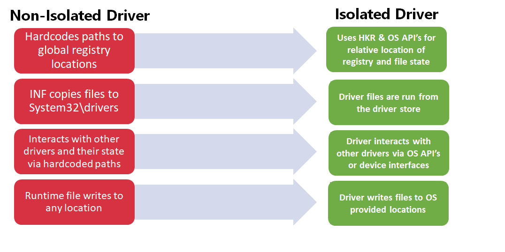

# Driver Isolation and Universal Drivers

## Driver Isolation Overview

An isolated driver is one that does not copy files and registry settings among OS state. All registry and file state is stored relative to a location provided by OS API’s and functionality.

Drivers should interact with other drivers and their state through OS API’s or interfaces exposed by the drivers and not through hardcoding paths to drivers or their state and manually modifying it through registry or file API’s.  Additionally, all isolated drivers are run from the driver store.

This enables a driver to be self-contained and sandboxed which makes it more robust to multiple versions existing or running on a system simultaneously. Additionally, this enables the OS to move drivers to different locations based on new servicing or security features without risking driver functionality.  Below is a diagram of the four main principles that isolated drivers use:

## Provisioning and Accessing State

Access to various state should be done using OS API’s that provide a caller with the location of the state and then the state is read/written relative to that location. Hardcoded absolute registry paths and file paths **should not be used** except for some limited exceptions noted in the File State and Registry Exceptions section.

## PnP Device State

There is a need for isolated drivers and user mode components to read, and sometimes write, device state.  There are already two locations that can be used to store device state in the registry. They are called the “hardware key” (aka “device key”) for the device and the “software key” (aka “driver key”) for the device. These registry locations are already accessible via API’s that give a caller a handle to the location.

The following API’s should be used to ensure your driver is isolated:

* WDM:
  * IoOpenDeviceRegistryKey
* WDF:
  * WdfDeviceOpenRegistryKey
  * WdfFdoInitOpenRegistryKey
* Other UserMode Code:
  * CM_Open_DevNode_Key
* Provision Values via INF:
  * INF AddReg directive using HKR reg-root entries in an add-registry-section referenced from an INF DDInstall section or DDInstall.HW section

