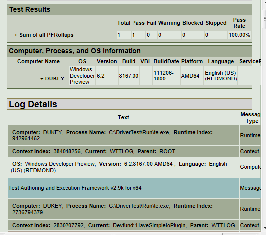

# How to read the driver test results log

From the **Driver Test Group Explorer**, you can display the results from driver tests, save the test results to a folder, or load the results from a folder.

### Open the test results

1. In the **Driver Test Group Explorer** window, click the Driver Test Group you are interested in.
2. Click the results from a specific test run.

   The results for the test group are shown as a folder titled **Results (**<em>computer</em> **-** <em>date</em>**:**<em>time</em>**)**

3. The results for the tests in that test run are listed. Click the name of the test to view the results log.

The results log provides a summary of the tests that were run, along with the details generated by the test cases. The information recorded included the time and date that each test was run, the name of the remote test computer that ran the test, and the test results (number of tests run, passed, failed).

### Save the test results to a folder

1.  In the **Driver Test Group Explorer** window, right-click the results from the test run that you are interested in.
2.  Click **Save** to open a dialog box to save the results to a folder.

 

 

