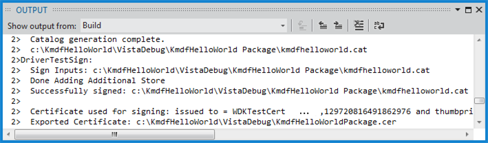

# Signing a Driver During Development and Testing

Before you install a driver on a computer running a 64-bit version of Windows, you must sign the driver package. For testing purposes, you can test sign the driver package, which is a more relaxed form of signing than signing for public release.

In Microsoft Visual Studio, test signing is enabled by default. Suppose you have created a KMDF driver solution as described in [Writing a KMDF driver based on a template](https://msdn.microsoft.com/Library/Windows/Hardware/Hh439654). When you build the solution, you can see in the **Output** window that the driver package has been test signed.

## Enabling test signing manually

To manually enable test signing, follow these steps.

1.  In Visual Studio, open a solution that has a driver package project. Right-click the driver package project, and choose **Properties**.

2.  In the property pages for the package, navigate to **Configuation Properties &gt; Driver Signing &gt; General**. In the **Sign Mode** drop-down list, select **Test Sign**.

3.  In the property pages for the package, navigate to **Configuation Properties &gt; Inf2Cat &gt; General**. In the **Run Inf2Cat** drop-down list, select **Yes**.

## Viewing the signed driver package

After you build your solution, navigate in File Explorer to the folder that contains your driver package. One of the files in the package is a catalog file. The catalog file contains the digital signature for the package. For an example of viewing the files in a signed package, see [Writing a KMDF driver based on a template](https://msdn.microsoft.com/Library/Windows/Hardware/Hh439654).

## Sharing a signing certificate

When you test sign a driver package, Visual Studio creates a signing certificate (PFX file) and imports it into a certificate store on your host computer. When you deploy your test-signed driver package to a test computer, Visual Studio copies a verification certificate (CER file) to the test computer. If you want to share the certificate with developers who are building drivers on other host computers, you must share the signing certificate, not the verification certificate.

To share the signing certificate, follow these steps.

-   In Visual Studio, in the Solution Explorer window, right-click your driver package project, and choose **Properties**.
-   In the property pages for the package, navigate to **Configuation Properties &gt; Driver Signing &gt; General**. In the **Test Certificate** field, choose **Select From Store**.

-   In the Select Certificate dialog box, locate your test-signing certificate. The name of the certificate will be similar to WDKTestCert *yourName*. Select your test-signing certificate, and click **Properties**. In the **Details** tab, click **Copy to File**.
-   Follow the instructions in the Certificate Export Wizard to export a PFX file. When you are asked whether you want to export the private key, select **Yes, export the private key**.
-   Share the exported PFX file with the other developers.

## Related topics

* [Writing Your First Driver](https://msdn.microsoft.com/Library/Windows/Hardware/Ff554811)
* [Building a Driver](building-a-driver.md)
* [Developing, Testing, and Deploying Drivers](index.md)
 

 

