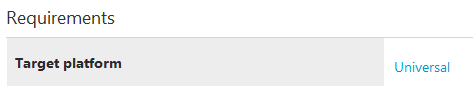

# Target platform on driver reference pages

In the Requirements block at the bottom of Microsoft driver reference pages, you'll see an entry called **Target Platform**. This line lists editions of Windows to which the page applies.

Here's an example of such an entry:

The values specified in **Target Platform** map to the values you can use in Visual Studio, in the **Target Platform** property under **Configuration Properties->Driver Settings->General**.  **Windows Drivers** can use any DDI that specifies **Universal** as the Target Platform.

Here are the values you might see for **Target Platform**, and what they mean:

|Term|Description|
|--- |--- |
|Universal|A driver binary in a Windows Driver can call this device driver interface (DDI). For more info, see [Getting Started with Windows drivers](getting-started-with-windows-drivers.md).|
|Desktop|A driver binary for Windows 10 for desktop editions or Windows Server 2016 can call this DDI.|

A Windows Driver runs on the following Universal Windows Platform (UWP)-based editions of Windows 10:

*   Windows 10 for desktop editions (Home, Pro, and Enterprise)
*   Windows 10 in S-Mode
*   Windows 10 IoT Core
*   Windows Server 2016

