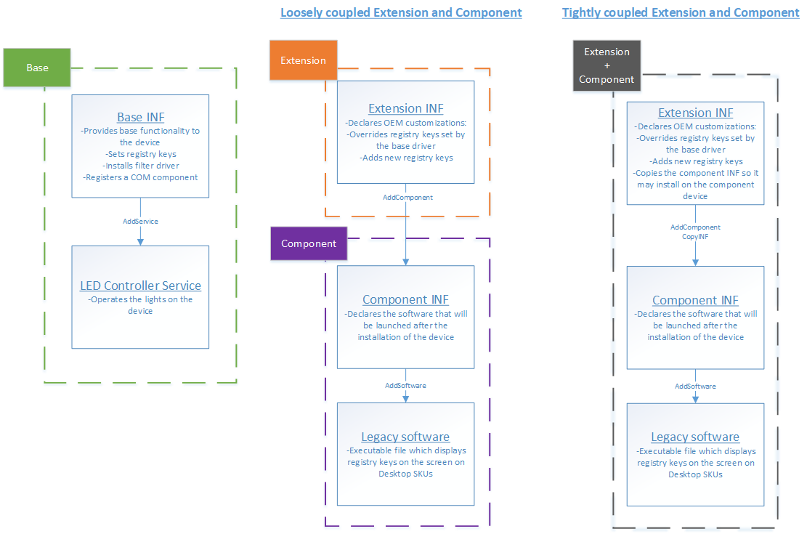

# Universal Driver Scenarios

This page shows you examples of universal driver installation scenarios.

## What you will need

The scenarios on this page show snippets from the [DCHU sample](https://github.com/Microsoft/Windows-driver-samples/tree/master/general/DCHU).  If you would like a local copy of the sample repo, clone from [Windows-driver-samples](https://github.com/Microsoft/Windows-driver-samples).

## Overview

The DCHU sample provides example scenarios where two hardware partners, Contoso (OEM) and Fabrikam (IHV) are working together to create a Universal Windows Driver for a device in Contoso's upcoming system.  The device in question is an [OSR USB FX2 learning kit](https://store.osr.com/product/osr-usb-fx2-learning-kit-v2/).  In the past, Fabrikam would write a non-universal driver package that was customized to a specific Contoso product line, and then hand it to the OEM to handle servicing.  The scenarios on this page demonstrate how they've worked together to create a Universal Windows Driver package compliant with the DCHU design principles.

## Use extension INFs to componentize a driver package

First, Fabrikam reviews the [list of INF sections and directives](../install/using-a-universal-inf-file.md#which-inf-sections-are-invalid-in-a-universal-inf-file) that are invalid in universal drivers.  During this exercise, Fabrikam notices that they're using many of these sections and directives in their driver package.  The biggest amount of incompliant code resides in their co-installer, which applies settings and files that depend on the target platform.

This means that the driver package is larger than it could be, and it's harder to service the driver when a bug affects only a subset of the OEM systems that ship the driver.  Also, most of the OEM-specific code is related to branding, so Fabrikam needs to update the driver package every time an OEM is added or a minor issue affects a subset of OEM systems.

To simplify, Fabrikam separates customizations that are specific to OEM partners (such as Contoso) from the primary INF into an [extension INF](../install/using-an-extension-inf-file.md).

The following snippet, updated from [`osrfx2_DCHU_extension.inx`], specifies the `Extension` class and identifies Contoso as the provider since they will own the extension driver package:

```
[Version]
Class       = Extension
ClassGuid   = {e2f84ce7-8efa-411c-aa69-97454ca4cb57}
Provider    = Contoso
ExtensionId = {3846ad8c-dd27-433d-ab89-453654cd542a}
```

In [`osrfx2_DCHU_base.inx`], Fabrikam specifies the following entries:

```
[OsrUsbFx2_AddReg]
HKR, OSR, "OperatingMode",, "Default" ; FLG_ADDREG_TYPE_SZ
HKR, OSR, "OperatingParams",, "None" ; FLG_ADDREG_TYPE_SZ
```

In [`osrfx2_DCHU_extension.inx`], Contoso overrides the `OperatingParams` registry key and adds `OperatingExceptions`:

```
[OsrUsbFx2Extension_AddReg]
HKR, OSR, "OperatingParams",, "-Extended"
HKR, OSR, "OperatingExceptions",, "x86"	
```

For more detailed information, see:

*  [Using a Universal INF File](../install/using-a-universal-inf-file.md)
*  [Using an Extension INF File](../install/using-an-extension-inf-file.md)

## Use a component to install a service in a driver package

Fabrikam requires the LEDs on the OSR board to be treated as a child device of the main board.  They control these lights using a Win32 service.

To accomplish this, they encapsulate the LED device in a component and provide a separate LED controller INF [`osrfx2_DCHU_usersvc.inx`] in the base driver package to install the service.

The following snippet from [`osrfx2_DCHU_base.inx`] specifies the [**AddComponent**](../install/inf-addcomponent-directive.md) directive to make the LED lights a child device to the main board and a [**CopyINF**](../install/inf-copyinf-directive.md) directive to copy the LED INF to the system:

```
[OsrFx2_Install.NT.Components]
AddComponent = osrfx2_DCHU_usersvc,, OsrFx2_ComponentInstall_UserSvc 

[OsrFx2_ComponentInstall_UserSvc]
ComponentIds = VID_045e&PID_94ac  ; Matches with SWC\VID_045e&PID_94ac 

[OsrFx2_Install.NT]
CopyInf = osrfx2_DCHU_usersvc.inf
```

Use the [**CopyINF**](../install/inf-copyinf-directive.md) directive for multifunction devices when both INFs are owned by the same organization.  Use extension INFs when different hardware partners own the code.

Then, in the LED controller's INF file [`osrfx2_DCHU_usersvc.inx`], Fabrikam specifies the [**AddService**](../install/inf-addservice-directive.md) directive to add and start the service:

```
[OsrFx2UserSvc_Install.NT.Services]
AddService = , 0x00000002
AddService = osrfx2_DCHU_usersvc, 0x00000800, OsrFx2UserSvc_ServiceInstall
	
[OsrFx2UserSvc_ServiceInstall]
DisplayName = %OsrFx2UserSvcDisplayName%
ServiceType = 0x00000010
StartType = 3
ErrorControl = 1
ServiceBinary = %13%\osrfx2_DCHU_usersvc.exe 

[OsrFx2UserSvc_CopyFiles]
osrfx2_DCHU_usersvc.exe
```

## Use a component to install software in a driver package

Fabrikam has an executable file `osrfx2_DCHU_componentsoftware.exe` that they previously installed using a co-installer.  This legacy software displays the registry keys set by the board and is required by the OEM.  This is a GUI-based executable that only runs on Windows for desktop editions.  To install it, Fabrikam creates a separate component driver package.

The following snippet from [`osrfx2_DCHU_base.inx`] uses the [**AddComponent**](../install/inf-addcomponent-directive.md) directive to create a virtual child device:

```
[OsrFx2_Install.NT.Components]
AddComponent = osrfx2_DCHU_component,, OsrFx2_ComponentInstall 

[OsrFx2_ComponentInstall]
ComponentIds = VID_045e&PID_94ab; Matches with SWC\VID_045e&PID_94ab
```

Then, in the component INF [`osrfx2_DCHU_component.inx`], Fabrikam specifies the [**AddSoftware**](../install/inf-addsoftware-directive.md) directive to install the optional executable:

```
[OsrFx2Component_Install.NT.Software]
AddSoftware = osrfx2_DCHU_componentsoftware,, OsrFx2Component_SoftwareInstall
	
[OsrFx2Component_SoftwareInstall]
SoftwareType = 1
SoftwareBinary = osrfx2_DCHU_componentsoftware.exe
SoftwareArguments = <<DeviceInstanceId>>
SoftwareVersion = 1.0.0.0 

[OsrFx2Component_CopyFiles]
osrfx2_DCHU_componentsoftware.exe
```

Note that the component INF is only installed on Desktop SKUs due to targeting set in the Windows Hardware Dev Center dashboard.  For more info, see [Publish a driver to Windows Update](https://docs.microsoft.com/windows-hardware/drivers/dashboard/publish-a-driver-to-windows-update).

## Add a GUI-based companion app

Fabrikam would like to provide a GUI-based companion app as part of the universal driver package, but Win32-based companion applications cannot be part of a universal driver package.  So they port their Win32 app to the Universal Windows Platform (UWP) and [pair the app with the device](https://docs.microsoft.com/windows-hardware/drivers/devapps/hardware-access-for-universal-windows-platform-apps).  

The new app is secure and can be updated easily in the Windows Store.   With the `componentsoftware.exe` application ready, Contoso uses [DISM - Deployment Image Servicing and Management](https://docs.microsoft.com/windows-hardware/manufacture/desktop/dism---deployment-image-servicing-and-management-technical-reference-for-windows) to pre-load the application on Windows desktop edition images.

## Run from the driver store

When possible, use the [**INF DestinationDirs Section**](../install/inf-destinationdirs-section.md) section to make the driver run from the Driver Store by using a `DefaultDestDir` of 13.  This will not work for some devices.

The following snippet is from the [`osrfx2_DCHU_component.inx`] file:

```
[DestinationDirs]
DefaultDestDir = 13 ; copy to driverstore
```

## Summary

The following diagram shows the three driver packages that Fabrikam and Contoso created to create a Universal Windows Driver.



## See also

[Getting Started with Universal Windows drivers](getting-started-with-universal-drivers.md)

[`osrfx2_DCHU_base.inx`]: https://github.com/Microsoft/Windows-driver-samples/blob/master/general/DCHU/osrfx2_DCHU_base/osrfx2_DCHU_base/osrfx2_DCHU_base.inx
[`osrfx2_DCHU_usersvc.inx`]: https://github.com/Microsoft/Windows-driver-samples/blob/master/general/DCHU/osrfx2_DCHU_base/osrfx2_DCHU_usersvc/osrfx2_DCHU_usersvc.inx
[`osrfx2_DCHU_component.inx`]: https://github.com/Microsoft/Windows-driver-samples/blob/master/general/DCHU/osrfx2_DCHU_component/osrfx2_DCHU_component/osrfx2_DCHU_component.inx
[`osrfx2_DCHU_extension.inx`]: https://github.com/Microsoft/Windows-driver-samples/blob/master/general/DCHU/osrfx2_DCHU_extension/osrfx2_DCHU_extension/osrfx2_DCHU_extension.inx
