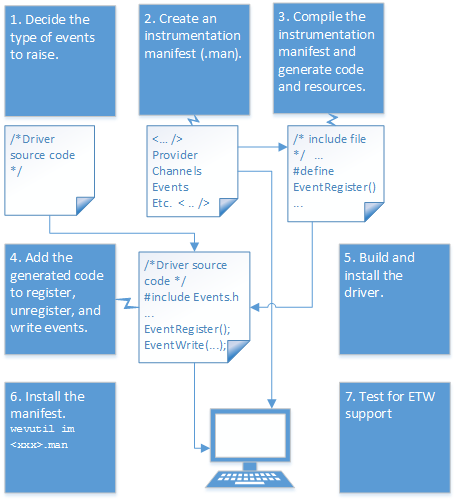

# Adding Event Tracing to Kernel-Mode Drivers

This section describes how to use the Event Tracing for Windows (ETW) kernel-mode API to add event tracing to kernel-mode drivers. The ETW kernel-mode API was introduced with Windows Vista and is not supported in earlier operating systems. Use [WPP Software Tracing](wpp-software-tracing.md) or [WMI Event Tracing](https://msdn.microsoft.com/library/windows/hardware/ff566350) if your driver needs to support trace capability in Windows 2000 and later.

> [!TIP]
> To view sample code that shows how to implement ETW using the Windows Driver Kit (WDK) 8.1 and Visual Studio, see the [Eventdrv sample](http://go.microsoft.com/fwlink/p/?linkid=256109).

In this section:

- [Workflow - Adding Event Tracing to Kernel-Mode Drivers](#workflow---adding-event-tracing-to-kernel-mode-drivers)

- [1. Decide the type of events to raise and where to publish them](#1-decide-the-type-of-events-to-raise-and-where-to-publish-them)

- [2. Create an instrumentation manifest that defines the provider, the events, and channels](#2-create-an-instrumentation-manifest-that-defines-the-provider-the-events-and-channels)

- [3. Compile the instrumentation manifest by using the message compiler (Mc.exe)](#3-compile-the-instrumentation-manifest-by-using-the-message-compiler-mcexe)

- [4. Add the generated code to raise (publish) the events (register, unregister, and write events)](#4-add-the-generated-code-to-raise-publish-the-events-register-unregister-and-write-events)

- [5. Build the driver](#5-build-the-driver)

- [6. Install the manifest](#6-install-the-manifest)

- [7. Test the driver to verify ETW support](#7-test-the-driver-to-verify-etw-support)

## Workflow - Adding Event Tracing to Kernel-Mode Drivers



## 1. Decide the type of events to raise and where to publish them

Before you begin coding, you must decide what type of events you want the driver to log through Event Tracing for Windows (ETW). For example, you might want to log events that can help you diagnose problems after your driver is distributed, or events that might help you as you are developing your driver. The types of events are identified with channels. A *channel* is a named stream of events of type Admin, Operational, Analytical, or Debug directed toward a specific audience, similar to a television channel. A channel delivers the events from the event provider to the event logs and event consumers. For information about channels and event types, see [Event Logs and Channels in Windows Event log](http://go.microsoft.com/fwlink/p/?linkid=62587).

During development, you are most likely interested in tracing events that help you debug your code. This same channel could be used in the production code to help troubleshoot problems that might appear after the driver is deployed. You might also want to trace events that could be used to measure performance; these events can help IT professionals fine tune server performance and can help identify network bottlenecks.

## 2. Create an instrumentation manifest that defines the provider, the events, and channels

The instrumentation manifest is an XML file that provides a formal description of the events a provider will raise. The instrumentation manifest identifies the event provider, specifies the channel or channels (up to eight), and describes the events, and templates the events use. Additionally, the instrumentation manifest allows for string localization, so you can localize the trace messages. The event system and event consumers can make use of the structured XML data provided in the manifest to perform queries and analysis.

For information about the instrumentation manifest, see [Writing an Instrumentation Manifest (Windows)](https://docs.microsoft.com/windows/desktop/WES/writing-an-instrumentation-manifest) and [Using Windows Event Log (Windows)](https://docs.microsoft.com/windows/desktop/WES/using-windows-event-log).

> [!NOTE]
> Although you can author an instrumentation manifest manually, you should consider using the ECManGen.exe tool that is included in the %WindowsSdkDir%\\bin\\x64%WindowsSdkDir%\\bin\\x86\\ folder when you install the WDK and Visual Studio. The %WindowsSdkDir% represents the path to the Windows kits directory where this version of the WDK is installed, for example, C:\\Program Files (x86)\\Windows Kits\\8.1. The ECManGen.exe is an application that guides you through creating a manifest from scratch without ever having to use XML tags. Having knowledge of the information in the [Writing an Instrumentation Manifest (Windows)](https://docs.microsoft.com/windows/desktop/WES/writing-an-instrumentation-manifest) section and in the [EventManifest Schema (Windows)](https://docs.microsoft.com/windows/desktop/WES/eventmanifestschema-schema) section will help when using the tool.

The following instrumentation manifest shows an event provider that uses the name "Sample Driver." Note that this name doesn't have to be the same as the name of the driver binary. The manifest also specifies a GUID for the provider and the paths to the message and resource files. The message and resource files let ETW know where to locate the resources needed to decode and report the events. These paths point to the location of the driver (.sys) file. The driver must be installed in the specified directory on the target computer.

The example uses the named channel **System**, a channel for events of type **Admin**. This channel is defined in the Winmeta.xml file that is provided with the Windows Driver Kit (WDK) in the%WindowsSdkDir%\\include\\um directory. The **System** channel is secured to applications running under system service accounts. The manifest includes the event templates that describes the types of data supplied with the events when they are published, along with their static and dynamic content. This example manifest defines three events: `StartEvent`, `SampleEventA`, and `UnloadEvent`.

In addition to channels, you can associate events with levels and keywords. Keywords and levels provide a way to enable events and provide a mechanism for filtering events when they are published. Keywords can be used to group logically related events together. A level can be used to indicate the severity or verbosity of an event, for example, critical, error, warning, or informational. The Winmeta.xml file contains predefined values for event attributes.

When you create a template for the event payload (event message, and data), you must specify the input and output types. The supported types are described in the Remarks section of [**InputType Complex Type (Windows)**](https://docs.microsoft.com/windows/desktop/WES/eventmanifestschema-inputtype-complextype).

```XML
<?xml version=&#39;1.0&#39; encoding=&#39;utf-8&#39; standalone=&#39;yes&#39;?>
<instrumentationManifest
    xmlns="http://schemas.microsoft.com/win/2004/08/events"
    xmlns:win="http://manifests.microsoft.com/win/2004/08/windows/events"
    xmlns:xs="http://www.w3.org/2001/XMLSchema"
    xmlns:xsi="http://www.w3.org/2001/XMLSchema-instance"
    xsi:schemaLocation="http://schemas.microsoft.com/win/2004/08/events eventman.xsd"
    >
  <instrumentation>
    <events>
      <provider
          guid="{b5a0bda9-50fe-4d0e-a83d-bae3f58c94d6}"
          messageFileName="%SystemDrive%\ETWDriverSample\Eventdrv.sys"
          name="Sample Driver"
          resourceFileName="%SystemDrive%\ETWDriverSample\Eventdrv.sys"
          symbol="DriverControlGuid"
          >
        <channels>
          <importChannel
              chid="SYSTEM"
              name="System"
              />
        </channels>
        <templates>
          <template tid="tid_load_template">
            <data
                inType="win:UInt16"
                name="DeviceNameLength"
                outType="xs:unsignedShort"
                />
            <data
                inType="win:UnicodeString"
                name="name"
                outType="xs:string"
                />
            <data
                inType="win:UInt32"
                name="Status"
                outType="xs:unsignedInt"
                />
          </template>
          <template tid="tid_unload_template">
            <data
                inType="win:Pointer"
                name="DeviceObjPtr"
                outType="win:HexInt64"
                />
          </template>
        </templates>
        <events>
          <event
              channel="SYSTEM"
              level="win:Informational"
              message="$(string.StartEvent.EventMessage)"
              opcode="win:Start"
              symbol="StartEvent"
              template="tid_load_template"
              value="1"
              />
          <event
              channel="SYSTEM"
              level="win:Informational"
              message="$(string.SampleEventA.EventMessage)"
              opcode="win:Info"
              symbol="SampleEventA"
              value="2"
              />
          <event
              channel="SYSTEM"
              level="win:Informational"
              message="$(string.UnloadEvent.EventMessage)"
              opcode="win:Stop"
              symbol="UnloadEvent"
              template="tid_unload_template"
              value="3"
              />
        </events>
      </provider>
    </events>
  </instrumentation>
  <localization xmlns="http://schemas.microsoft.com/win/2004/08/events">
    <resources culture="en-US">
      <stringTable>
        <string
            id="StartEvent.EventMessage"
            value="Driver Loaded"
            />
        <string
            id="SampleEventA.EventMessage"
            value="IRP A Occurred"
            />
        <string
            id="UnloadEvent.EventMessage"
            value="Driver Unloaded"
            />
      </stringTable>
    </resources>
  </localization>
</instrumentationManifest>
```

## 3. Compile the instrumentation manifest by using the message compiler (Mc.exe)

The [message compiler (Mc.exe)](https://docs.microsoft.com/windows/desktop/WES/message-compiler--mc-exe-) must be run before you compile your source code. The message compiler is included in the Windows Driver Kit (WDK). The message compiler creates a header file that contains definitions for the event provider, event attributes, channels, and events. You must include this header file in your source code. The message compiler also places the generated resource compiler script (\*.rc) and the generated .bin files (binary resources) that the resource compiler script includes.

You can include this step as part of your build process in a couple of ways:

- Adding the message compiler task to the driver project file (as shown in the [Eventdrv sample](http://go.microsoft.com/fwlink/p/?linkid=256109)).

- Using Visual Studio to add the instrumentation manifest and to configure the Message Compiler properties.

**Adding a message compiler task to the project file** For an example of how you can include the message compiler in the build process, look at the project file for the [Eventdrv sample](http://go.microsoft.com/fwlink/p/?linkid=256109). In the Eventdrv.vcxproj file, there is a **&lt;MessageCompile&gt;** section that calls the message compiler. The message compiler uses the manifest file (evntdrv.xml) as input to generate the header file evntdrvEvents.h. This section also specifies the paths for the generated RC files and enables the kernel mode logging macros. You can copy this section and add it to your driver project file (.vcxproj).

```XML

    <MessageCompile Include="evntdrv.xml">
      <GenerateKernelModeLoggingMacros>true</GenerateKernelModeLoggingMacros>
      <HeaderFilePath>.\$(IntDir)</HeaderFilePath>
      <GeneratedHeaderPath>true</GeneratedHeaderPath>
      <WinmetaPath>"$(SDK_INC_PATH)\winmeta.xml"</WinmetaPath>
      <RCFilePath>.\$(IntDir)</RCFilePath>
      <GeneratedRCAndMessagesPath>true</GeneratedRCAndMessagesPath>
      <GeneratedFilesBaseName>evntdrvEvents</GeneratedFilesBaseName>
      <UseBaseNameOfInput>true</UseBaseNameOfInput>
    </MessageCompile>
```

When you build the Eventdrv.sys sample, Visual Studio creates the necessary files for event tracing. It also adds the evntdrv.xml manifest to the list of Resources Files for the driver project. You can right click the manifest to view the Message Compiler property pages.

### Using Visual Studio to add the instrumentation manifest

You can add the instrumentation manifest to the driver project and then configure the message compiler properties to build the necessary resource and header files.

### To add the instrumentation manifest to the project using Visual Studio

1. In the Solution Explorer, add the manifest file to the driver project. Right click **Resource Files &gt; Add &gt; Existing Item** (for example, evntdrv.xml or mydriver.man).

2. Right click the file you just added and use the property pages to change the item type to **MessageCompile** and click **Apply**.

3. The Message Compiler properties appear. Under the **General** settings, set the following options and then click **Apply**.

    | General                                 | Setting       |
    |-----------------------------------------|---------------|
    | **Generate Kernel Mode Logging Macros** | **Yes (-km)** |
    | **Use Base Name of Input**              | **Yes (-b)**  |

4. Under **File Options**, set the following options and then click **Apply**.

    | File Options                                    | Setting         |
    |-------------------------------------------------|-----------------|
    | **Generate header file for containing counter** | **Yes**         |
    | **Header File Path**                            | **$(IntDir)**   |
    | **Generated RC and Binary Message Files Path**  | **Yes**         |
    | **RC File Path**                                | **$(IntDir)**   |
    | **Generated Files Base Name**                   | **$(Filename)** |

By default, the message compiler uses the base name of the input file as the base name of the files that it generates. To specify a base name, set the **Generated Files Base Name** (-z) field. In the Eventdr.sys sample, the base name is set to *evntdrvEvents* so that it matches the name of the header file evntdrvEvents.h, which is included in evntdrv.c.

> [!NOTE]
> If you do not include the generated .rc file in your Visual Studio project, you may get error messages about resources not found when you install the manifest file.

## 4. Add the generated code to raise (publish) the events (register, unregister, and write events)

In the instrumentation manifest, you defined the names of the event provider and the event descriptors. When you compile the instrumentation manifest with the message compiler, the message compiler generates a header file that describes the resources and also defines macros for the events. Now, you must add the generated code to your driver to raise these events.

1. In your source file, include the event header file that is produced by the message compiler (MC.exe). For example, in the [Eventdrv sample](http://go.microsoft.com/fwlink/p/?linkid=256109), the Evntdrv.c source file includes the header file (evntdrvEvents.h) that was generated in the previous step:

   ```c++
   #include "evntdrvEvents.h"  
   ```

2. Add the macros that register and unregister the driver as an event provider. For example, in the header file for the [Eventdrv sample](http://go.microsoft.com/fwlink/p/?linkid=256109) (evntdrvEvents.h), the message compiler creates macros based upon the name of the provider. In the manifest, the [Eventdrv sample](http://go.microsoft.com/fwlink/p/?linkid=256109) uses the name "Sample Driver" as the name of the provider. The message compiler combines the name of the provider with the event macro to register the provider, in this case, **EventRegisterSample\_Driver**.

   ```ManagedCPlusPlus
   //  This is the generated header file envtdrvEvents.h
   //
   //  ...
   //
   //
   // Register with ETW Vista +
   //
   #ifndef EventRegisterSample_Driver
   #define EventRegisterSample_Driver() McGenEventRegister(&DriverControlGuid, McGenControlCallbackV2, &DriverControlGuid_Context, &Sample_DriverHandle)
   #endif
   ```

   Add the **EventRegister\<*provider*\>** macro to your [*DriverEntry*](https://docs.microsoft.com/windows-hardware/drivers/ddi/content/wdm/nc-wdm-driver_initialize) function. Add this function after the code that creates and initializes the device object. Note that you must match the call to the **EventRegister\<*provider*\>** function with a call to **EventUnregister\<*provider*\>**. You can unregister the driver in your driver's [</em>*Unload**](<https://msdn.microsoft.com/library/windows/hardware/ff564886>) routine.

   ```ManagedCPlusPlus
      // DriverEntry function
      // ...


       // Register with ETW
       //
       EventRegisterSample_Driver();
    ```

3. Add the generated code to your driver's source files to write (raise) the events you specified in the manifest. The header file you compiled from the manifest contains the generated code for the driver. Use the **EventWrite\<*event*\>** functions defined in the header file to publish trace messages to ETW. For example, the following code shows the macros for events defined in evntdrvEvents.h for the [Eventdrv sample](http://go.microsoft.com/fwlink/p/?linkid=256109).

   The macros to write these events are called: `EventWriteStartEvent`, `EventWriteSampleEventA`, and `EventWriteUnloadEvent`. As you can see in the definition of these macros, the macro definition automatically includes an **EventEnabled\<*event*\>** macro that checks if the event is enabled. The check eliminate the need to build the payload if the event is not enabled.

   ```ManagedCPlusPlus

   ///
   // This is the generated header file envtdrvEvents.h
   //
   //  ...
   //
   // Enablement check macro for StartEvent
   //

   #define EventEnabledStartEvent() ((Sample_DriverEnableBits[0] & 0x00000001) != 0)

   //
   // Event Macro for StartEvent
   //
   #define EventWriteStartEvent(Activity, DeviceNameLength, name, Status)\
           EventEnabledStartEvent() ?\
           Template_hzq(Sample_DriverHandle, &StartEvent, Activity, DeviceNameLength, name, Status)\
           : STATUS_SUCCESS\

   //
   // Enablement check macro for SampleEventA
   //

   #define EventEnabledSampleEventA() ((Sample_DriverEnableBits[0] & 0x00000001) != 0)

   //
   // Event Macro for SampleEventA
   //
   #define EventWriteSampleEventA(Activity)\
           EventEnabledSampleEventA() ?\
           TemplateEventDescriptor(Sample_DriverHandle, &SampleEventA, Activity)\
           : STATUS_SUCCESS\

   //
   // Enablement check macro for UnloadEvent
   //

   #define EventEnabledUnloadEvent() ((Sample_DriverEnableBits[0] & 0x00000001) != 0)

   //
   // Event Macro for UnloadEvent
   //
   #define EventWriteUnloadEvent(Activity, DeviceObjPtr)\
           EventEnabledUnloadEvent() ?\
           Template_p(Sample_DriverHandle, &UnloadEvent, Activity, DeviceObjPtr)\
           : STATUS_SUCCESS\
  
    ```

   Add the **EventWrite\<*event*\>** macros into your source code for the events you are raising. For example, the following code snippet shows the [*DriverEntry*](https://msdn.microsoft.com/library/windows/hardware/ff544113) routine from the [Eventdrv sample](http://go.microsoft.com/fwlink/p/?linkid=256109). The *DriverEntry* includes the macros to register the driver with ETW (*EventRegisterSample\_Driver*) and the macro to write the driver event to ETW (*EventWriteStartEvent*).

   ```ManagedCPlusPlus
   NTSTATUS
   DriverEntry(
       IN PDRIVER_OBJECT DriverObject,
       IN PUNICODE_STRING RegistryPath
       )
   /*++

   Routine Description:

       Installable driver initialization entry point.
       This entry point is called directly by the I/O system.

   Arguments:

       DriverObject - pointer to the driver object

       RegistryPath - pointer to a unicode string representing the path
           to driver-specific key in the registry

   Return Value:

      STATUS_SUCCESS if successful
      STATUS_UNSUCCESSFUL  otherwise

   --*/
   {
       NTSTATUS Status = STATUS_SUCCESS;
       UNICODE_STRING DeviceName;
       UNICODE_STRING LinkName;
       PDEVICE_OBJECT EventDrvDeviceObject;
       WCHAR DeviceNameString[128];
       ULONG LengthToCopy = 128 * sizeof(WCHAR);
       UNREFERENCED_PARAMETER (RegistryPath);

       KdPrint(("EventDrv: DriverEntry\n"));

       //
       // Create Dispatch Entry Points.  
       //
       DriverObject->DriverUnload = EventDrvDriverUnload;
       DriverObject->MajorFunction[ IRP_MJ_CREATE ] = EventDrvDispatchOpenClose;
       DriverObject->MajorFunction[ IRP_MJ_CLOSE ] = EventDrvDispatchOpenClose;
       DriverObject->MajorFunction[ IRP_MJ_DEVICE_CONTROL ] = EventDrvDispatchDeviceControl;

       RtlInitUnicodeString( &DeviceName, EventDrv_NT_DEVICE_NAME );

       //
       // Create the Device object
       //
       Status = IoCreateDevice(
                              DriverObject,
                              0,
                              &DeviceName,
                              FILE_DEVICE_UNKNOWN,
                              0,
                              FALSE,
                              &EventDrvDeviceObject);

       if (!NT_SUCCESS(Status)) {
           return Status;
       }

       RtlInitUnicodeString( &LinkName, EventDrv_WIN32_DEVICE_NAME );
       Status = IoCreateSymbolicLink( &LinkName, &DeviceName );

       if ( !NT_SUCCESS( Status )) {
           IoDeleteDevice( EventDrvDeviceObject );
           return Status;
       }

    //
    // Choose a buffering mechanism
    //
    EventDrvDeviceObject->Flags |= DO_BUFFERED_IO;

    //
    // Register with ETW
    //
    EventRegisterSample_Driver();

    //
    // Log an Event with :  DeviceNameLength
    //                      DeviceName
    //                      Status
    //

    // Copy the device name into the WCHAR local buffer in order
    // to place a NULL character at the end, since this field is
    // defined in the manifest as a NULL-terminated string

    if (DeviceName.Length <= 128 * sizeof(WCHAR)) {

        LengthToCopy = DeviceName.Length;

    }

    RtlCopyMemory(DeviceNameString,
                  DeviceName.Buffer,
                  LengthToCopy);

    DeviceNameString[LengthToCopy/sizeof(WCHAR)] = L&#39;\0&#39;;

    EventWriteStartEvent(NULL, DeviceName.Length, DeviceNameString, Status);

    return STATUS_SUCCESS;
   }
   ```

Add the all of **EventWrite\<*event*\>** macros into your source code for the events you are raising. You can examine the [Eventdrv sample](http://go.microsoft.com/fwlink/p/?linkid=256109) to see how the other two macros are called for the events in the driver source code.

4. Unregister the driver as an event provider using the **EventUnregister\<*provider*\>** macro from the generated header file.

   Place this function call in your driver unload routine. No tracing calls should be made after the **EventUnregister\<*provider*\>** macro is called. Failure to unregister the event provider can cause errors when the process is unloaded because any callback functions associated with the process are no longer valid.

   ```ManagedCPlusPlus
       // DriverUnload function
       // ...
       //

       //  Unregister the driver as an ETW provider
       //
       EventUnregisterSample_Driver();
   ```

## 5. Build the driver

If you have added the instrument manifest to the project and have configured the message compiler (MC.exe) properties, you can build the driver project or solution using Visual Studio and MSBuild.

1. Open the driver solution in Visual Studio.

2. Build the sample from the Build menu by selecting **Build Solution**. For more information about building solutions, see [Building a Driver](https://docs.microsoft.com/windows-hardware/drivers/develop/building-a-driver).

## 6. Install the manifest

You must install the manifest on the target system so that event consumers (for example, the Event Log) can find the location of the binary that contains the event metadata. If you added the message compiler task to the driver project in Step 3, the instrumentation manifest was compiled and the resource files were generated when you built the driver. Use the Windows Event Command-line Utility (Wevtutil.exe) to install the manifest. The syntax to install the manifest is as follows:

**wevtutil.exe im** *drivermanifest*

For example, to install the manifest for the Evntdrv.sys sample driver, open a Command Prompt windows with elevated privileges (**Run as administrator**) navigate to the directory where the evntdrv.xml file is located and enter the following command:

```c++
Wevtutil.exe im evntdrv.xml
```

When your trace session is complete, uninstall the manifest using the following syntax.

**wevtutil.exe um** *drivermanifest*

For example, to uninstall the manifest for the [Eventdrv sample](http://go.microsoft.com/fwlink/p/?linkid=256109):

```c++
Wevtutil.exe um evntdrv.xml
```

## 7. Test the driver to verify ETW support

Install the driver. Exercise the driver to generate trace activity. View the results in the Event Viewer. You can also run [Tracelog](tracelog.md), and then run [Tracerpt](https://docs.microsoft.com/windows-server/administration/windows-commands/tracerpt_1), a tool for processing event trace logs, to control, collect, and view the event trace logs.
