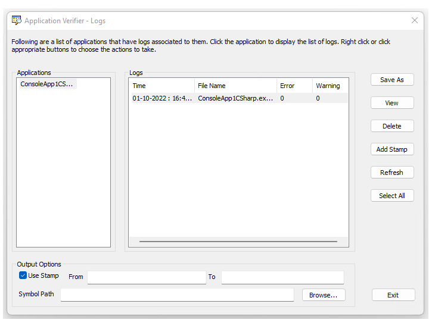
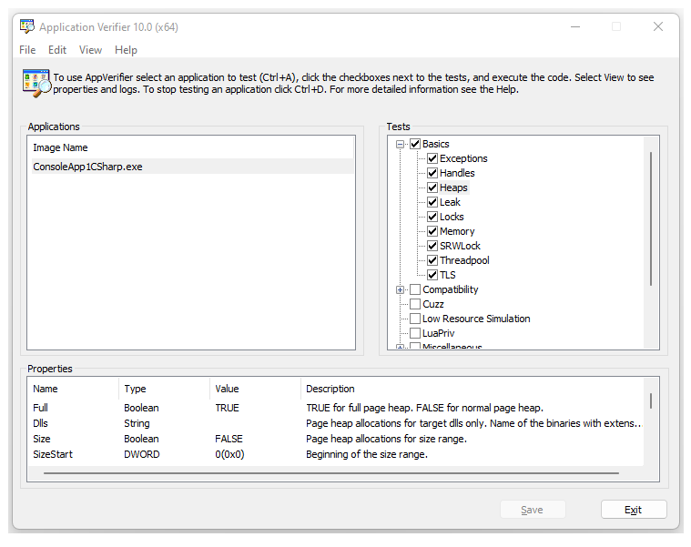

# Application Verifier - Features

## Accessibility Features

Microsoft is committed to making its products and services easier for everyone to use. The features within Application Verifier that make it more accessible such as keyboard shortcuts, text reader, and ability to alter the fonts and themes.

### Using keyboard shortcuts 

By using keyboard shortcuts in Application Verifier, you can quickly accomplish the following common tasks.

| To do this                 | Use this keyboard shortcut |
|----------------------------|----------------------------|
| Add an application to test | Ctrl + A                   |
| Remove an application      | Ctrl + D                   |
| Enable all tests           | Ctrl + E                   |
| Disable all tests          | Ctrl + I                   |
| Restore the test defaults  | Ctrl + R                   |
| Save changes               | Ctrl + S                   |
| Exit Application Verifier  | Atl + E                    |
| Open the property window   | Ctrl + P                   |
| Open the log screen        | Ctrl + L                   |

## Logs

A log is generated when a verifier stop occurs during verification of an application. 

### Accessing Logs

Application Verifier displays a Logs window that contains the applications that have been run previously and the logs associated with them. To access the log window, on the View menu, select Logs.  To view the details of a log, select name of the application.

### Saving/Exporting Logs to XML

If you export a log to XML, you can open the log file in external tools such as Microsoft Excel. To export a log to XML, select the application and then the log you wish to export. Click Save As and enter the name you want to give the file and its location, and then click Save. 

### Filtering Logs

You may want to filter log information on items such as severity, to see warnings only, or to trace where you can define a custom filter to display only items that contain your application. To filter a log, one approach si to use a spreadsheet, such as Excel. 

1. Save the log to XML and open it in Excel. 
2. In Excel, highlight the first row (containing the column headers).
3. On the Data menu, clicking Filter, and then clicking AutoFilter. 

### Deleting Logs

Application Verifier enables either to delete a log individually or to remove an application and delete all logs associated with it.

To delete a log individually, select the log and click Delete or right-click the log and select Delete.

To remove an application and delete all logs associated it, right-click the application name and then select Delete. 

To delete all logs:

1. Open the main Application Verifier window.

2. On the File menu, select **Clear All Logs**.

### Adding Stamps

When a process is running, you can add a stamp into its associated log file. The stamp information can be an arbitrary string, such as current time. Later you can use this information as a filter to retrieve the log of interest.  

To add a stamp into a log file:

1. Select the log file, and then click **Add Stamp**. 

2. Enter a string as the stamp information. 

### Output Options

By default, the logs for services/apps running under user accounts are stored under: `%USERPROFILE%\serviceprofiles\AppVerifierLogs`.

For services/apps running under local service accounts, the log files are written under: `%windir%\serviceprofiles\LocalService\AppVerifierLogs`

For services/apps running under a system account, the log files are stored under: `%windir%\system32\config\systemprofile\AppVerifierLogs` for native services, and `%windir%\syswow64\config\systemprofile\AppVerifierLogs` for wow64 services/apps. 

For services/apps running under a network service account, log files are stored under: `%windir%\serviceprofiles\NetworkService\AppVerifierLogs`.

If the application doesn’t have permissions to write/create the log file in the default log file path, it will fail with the error 0xC0000022.

Setting the VERIFIER_LOG_PATH environmental variable overrides the default log file creation. This can be useful if you want all your log files stored in a single location.

Protected processes don’t have access to environmental variables and hence cannot create log files. To work around this, the protected process log path can be set using the AppVerif.EXE command-line: `appverif.exe –sppath <drive:>\<path>` to set the protected log path. 

The command line; `appverif.exe –cppath` clears the protected log path.

Symbol path – the symbol path will be used to resolve the stack trace in the log file. If you don’t specify a symbol path, Application Verifier will automatically look at _NT_SYMBOL_PATH to see if any symbol path is specified there. 

From, to – You can specify the starting stamp and ending stamp. You will only see the log content, which is recorded after the From stamp is inserted and before the end stamp is inserted. If you do not provide a From or To stamp, Application Verifier will display the log from the very beginning of the file to the end of file respectively.

### Protected Process Logging

Application Verifier log file creation depends on environment variables such as VERIFIER_LOG_PATH and %USERPROFILE%. If a process such as protected (secure) process cannot access these environment variables, it fails to create the log files. The following command line options can be used to set/clear the protected process log path. This log path is used only if the process cannot create log files under VERIFIER_LOG_PATH or %USERPROFILE%.

To set the protected process log path:

`appverif –sppath [PROTECTED_PROCESS_LOG_PATH]`

For ex: The following command line sets the protected process log path to “c:\My Logs\Verifier Logs”.

`appverif –sppath c:\My Logs\Verifier Logs`

Note: Make sure that “c:\My Logs” exists, and the protected process has permission to create files in this path.

The following command line shows the existing protected process log path.

`appverif –sppath`

To show the existing protected process log path and clear it, use the following command line:

`appverif -cppath`

Note that the “Application Verifier –Logs” window shows the log files in %USERPROFILE% of the logged on user. If you want the protected process logs to show up in this UI, you need to manually copy them to %USERPROFILE%\AppVerifierLogs.
 
## Property Window 
 
The Property window provides access to the various settings for each of the verification layers and checks.

Accessing the Property Window - The property window displays its information in the lower half of the screen.

To view the Property window - On the View menu, select Property Window. A check mark while appear next to the Property Window selection.

Closing the Property Window - If desired, you can remove the property window from your view.

To close the property window - On the View menu, select Property Window . The check mark next to the Property Window selection will be cleared.

## Setting Properties

Each verification layer has its own set of properties to set and change. To set a property for a verification layer, select the layer within the test area (for example, Basics). This step will display the properties of the selected test.

### Setting Properties 
 
There are two sets of properties within Application Verifier. One is based on the checks within a given verification layer, whereas the other is based on the image (solution or project). These properties are accessed from the Property Window.

Application Verifier displays the following information for each of the properties that are allowed to be edited: 

**Name** - Unique name for each of the properties

**Type** - Boolean, DWORD, String, MultipleString

**Value** - The element that can be changed and varies based on type

**Description** - The description explains what the property is.

### Editing Properties for images

For each image being tested within Application Verifier, you are able to edit the following.

Propagate - Propagate verifier settings from parent process to child process. Not all tests can be propagated. If this property is enabled (box checked), settings are propagated. Otherwise, settings are not propagated.

AutoClr - After specified image starts to run, the verified image will clear the settings for itself. If this property is enabled (box checked), the verified image will clear the settings. Otherwise it will not clear the settings. 

AutoDisableStop - Verifier will only complain once for the same issue found. If Verifier finds the same issue again, it will not generate an error. If this property is enabled (box checked), Verifier will generate only one error for a given issue. Otherwise Verifier will generate an error each time the issue occurs.

LoggingOnLocksHeld - The dll load/unload event will be logged. Verifier is doing I/O when the loader lock is held. This can cause the application to hang. If this property is enabled (box checked), the event is logged. Otherwise, the event is not logged.

ExceptionOnStop – For each verifier stop, exception will be raised instead of debug break. If this property enabled (box checked), each stop reported by Verifier raises an exception. Otherwise, each stop reported by Verifier breaks into the debugger.

MinimumMemoryOverhead – Reduce memory overhead by disabling some of the features used just for debugging. If this property is enabled (box checked), some features are disabled to reduce memory overhead. Otherwise, features are not disabled.

>[!NOTE]
> Do not enable the MinimumMemoryOverhead property unless it is absolutely necessary to reduce memory overhead. When this property is enabled, debugging information is missing, and it is more difficult to diagnose errors.
 

### Setting/Editing Properties for checks

The properties are associated to the checks, so please refer to those topics for detailed field information. To edit the properties you can take one of two approaches: 

Individually - Within the property window, double click the property you wish to edit. This will display a dialog that will allow you to edit the item as well as set it back to the default. Change the entry and click OK. 

Group - From the Test area, click the test or verification layer you need to edit. Use your right click options to display a screen of all the properties. Change the properties or reset back to the default and click OK. 

## See Also

[Application Verifier - Overview](application-verifier.md)

[Application Verifier - Testing Applications](application-verifier-testing-applications.md)
 
[Application Verifier - Tests within Application Verifier](application-verifier-tests-within-application-verifier.md)

[Application Verifier - Stop Codes and Definitions](application-verifier-stop-codes-and-definitions.md)

[Application Verifier - Debugging Application Verifier Stops](application-verifier-debugging-application-verifier-stops.md)

[Application Verifier - Frequently Asked Questions](application-verifier-faqs.md)