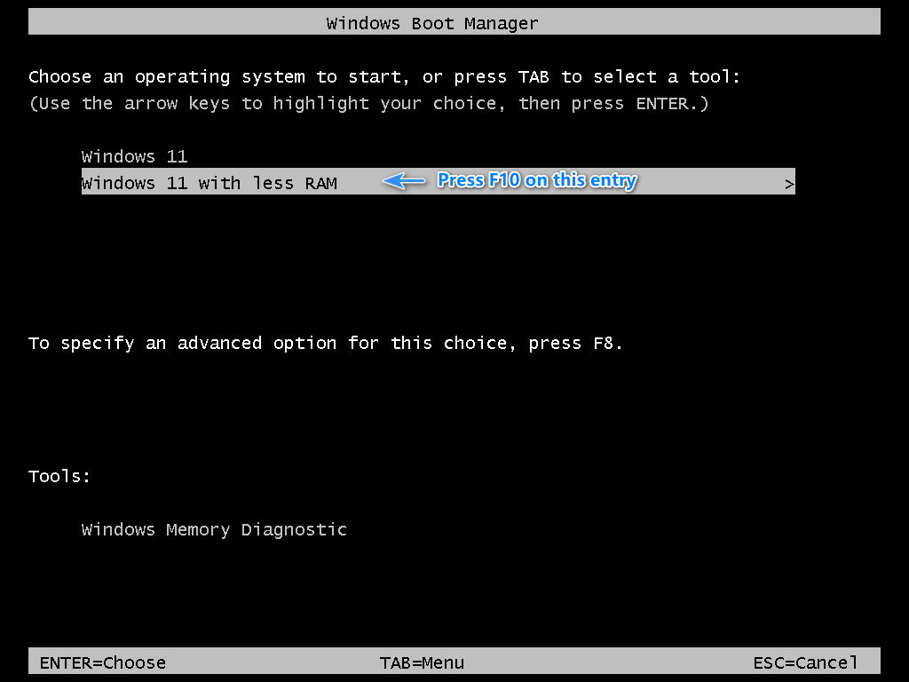
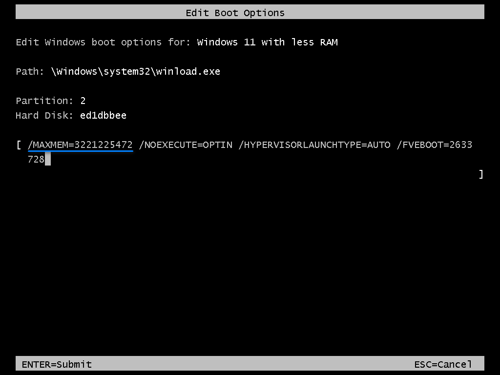
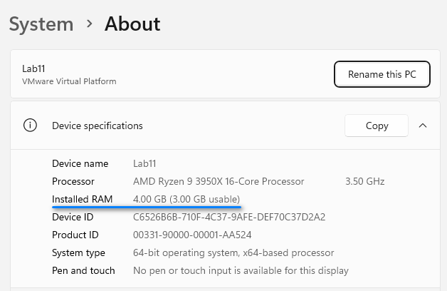

# Boot Parameters to Manipulate Memory


## <span id="ddk_boot_parameters_to_manipulate_memory_tools"></span><span id="DDK_BOOT_PARAMETERS_TO_MANIPULATE_MEMORY_TOOLS"></span>


You can simulate a low-memory environment for testing without changing the amount of physical memory on the computer. Instead, you can limit the memory available to the operating system by using **truncatememory** or **removememory** options with the [**BCDedit /set**](./bcdedit--set.md) command.

The **truncatememory** or **removememory** options are available in Windows 7 and later. The **truncatememory** option disregards all memory at or above the specified physical address. The **removememory** option reduces memory available to Windows by the specified amount (measured in MB). Both options reduce memory, but the **removememory** option is better at restricting the operating system to use the specified memory while accounting for memory gaps.

### <span id="boot_parameters_to_test_in_a_low_memory_environment_in_windows_vista_a"></span><span id="BOOT_PARAMETERS_TO_TEST_IN_A_LOW_MEMORY_ENVIRONMENT_IN_WINDOWS_VISTA_A"></span>Boot Parameters to Test in a Low-memory Environment in Windows

To simulate a low-memory environment, use the [**BCDedit /set**](./bcdedit--set.md) command and the **removememory** option to modify a boot entry. Set the value of **removememory** to the amount of physical memory on the system minus the desired memory size for this test.

For example, to limit the memory of a computer with 2 GB of physical memory to a maximum of 512 MB of available memory, set the value of the **removememory** parameter to 1536 (2 GB (2048 MB) - 512 MB = 1536 MB).

The following example shows a BCDEdit command used to remove 1536 MB of memory from the total available to the system for the specified boot entry.

```
bcdedit /set {18b123cd-2bf6-11db-bfae-00e018e2b8db} removememory 1536
```

You can also use the **truncatememory** option with the **bcdedit /set** command to achieve the same result. When you use this option, Windows ignores all memory at or above the specified physical address. Specify the *address* in bytes. For example, the following command sets the physical address limit at 3.0 GB for the specified boot entry. You can specify the address in decimal (3221225472) or hexadecimal (0xC0000000).

```
bcdedit /set {18b123cd-2bf6-11db-bfae-00e018e2b8db} truncatememory 0xC0000000
```

Because the **removememory** option makes more efficient use of system memory, its use is recommended instead of **truncatememory**.

When you are finished testing, you can remove the **removememory** and **truncatememory** boot entry options using the [**BCDEdit /deletevalue**](./bcdedit--deletevalue.md) command.

### Verify the effect of `truncatememory`

We take a Windows 11 machine(call it Lab11) for example. Lab11 has 4GB physical RAM, and we want to limit the OS to use only 3GB RAM.
	
First, we make a new BCD entry for this experimental purpose:
	
```
bcdedit /copy {current} /d "Windows 11 with less RAM"
```

Second, we enable legacy(text-mode) bootmgr menu, so that we can verify our modified boot options easily.
	
```
bcdedit /set {bootmgr} displaybootmenu yes
```

Third, reboot Lab11, until it reaches the text-mode boot-menu. 



Press F10 on our new entry, and we will see boot options for this entry:



We see that, the value for bcdedit **truncatememory** option is represented as `/MAXMEM` here.

Finally, we boot into that new entry, press `Win+Break` to show System -> About info page, and see Windows 11 reports that:
	
	Installed RAM 4.00GB (3.00GB usable)


