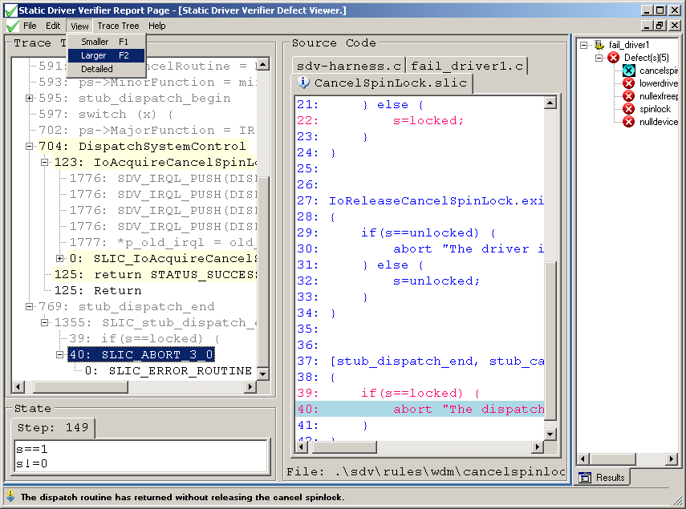

# Changing the Text Size in the Defect Viewer

To change the size of the text in the Defect Viewer windows, from the **View** menu, select **Smaller** or **Larger**, or press the F1 (smaller) or F2 (larger) keys. You can press them repeatedly to increase or decrease the text size until it reaches its minimum or maximum size.

This feature affects only the Defect Viewer. It does not change the size of the text in the Results Pane.

The following screen shot shows how to change text size in the Defect Viewer window.

 

 

