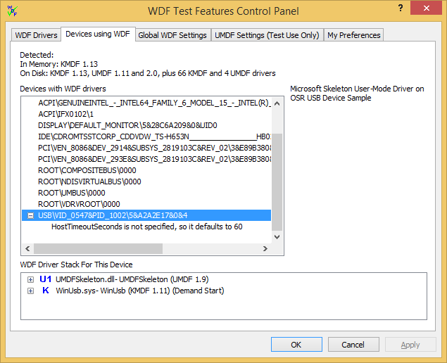

# Devices Using WDF Tab

This topic discusses WDF Verifier's **Devices using WDF** page. This page lists all devices that are using WDF drivers. When you highlight a device, you see the WDF driver stack for the highlighted device. You can also change verification settings from this screen.

At the top of this page, you'll find a summary of installed runtimes and drivers. Below is a list of device instances that are associated with WDF drivers.

In the **Devices with WDF drivers** box, devices that have WDF-related settings are preceded by a +. To change settings, right-click the device ID or the individual settings within the node.

When you select a device or individual setting, the device's friendly name appears to the right of the box.

In addition, all of the WDF drivers for that device are shown in the **WDF Driver Stack For This Device** box, in stack order from top to bottom. For example, upper filters appear at the top, followed by the function driver and then lower filters.

If UMDF drivers are used, they are also shown in stack order at the correct location in the kernel device stack.

Similarly, you can click the + in the driver stack to open the node, and then right-click to change values for each driver.

If you make changes on the **Devices using WDF** page, you'll see those changes reflected on the **WDF Drivers** page.

 

 

