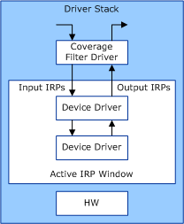
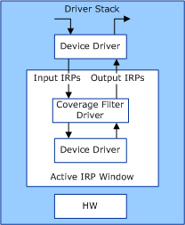

# Driver Coverage Filter Driver

**Note**  The Driver Coverage Toolkit is no longer needed in Windows 10 and the installer is no longer included in the WDK. To perform tasks described here in Windows 10, instead use [Driver Verifier](driver-verifier.md) and [IRP Logging](irp-logging.md).

 

The Driver Coverage filter driver (Drvcov.sys) monitors the I/O request packets (IRPs) that enter or leave the driver stack of specified devices. You specify the devices that the Driver Coverage filter driver monitors by using the *DQ* parameter when you run the **Enable IRP Coverage data collection** tool. See [How to select and configure the Device Fundamentals tests](https://msdn.microsoft.com/windows-drivers/develop/how_to_select_and_configure_the_device_fundamental_tests) and [Device Fundamentals Test Parameters](https://msdn.microsoft.com/windows-drivers/develop/how_to_select_and_configure_the_device_fundamental_tests).

**UpperFilter = TRUE**  
This option installs the Driver Coverage filter driver as an upper filter to the device driver for the specified device. This configuration monitors all IRP traffic into or out of the device driver within the device's driver stack, regardless of whether the driver processed the IRP or passed it through to lower device drivers.

**UpperFilter = FALSE**  
This option installs the Driver Coverage filter driver as a lower filter to the device driver for the specified device. This configuration monitors all IRP traffic into or out of the device driver from lower drivers within the device's driver stack.

The following figure shows a driver stack and IRP monitoring window for a device where the Driver Coverage filter driver is installed as an upper filter. In this configuration, the filter driver tracks all IRPs that enter or leave the driver for the specified device.

The following figure shows a driver stack and IRP monitoring window for a device where the Driver Coverage filter driver is installed as a lower filter. In this configuration, the filter driver tracks all IRPs that enter or leave the device driver for the specified device's driver stack.

.

###  Installing the Driver Coverage filter driver

The following rules define the best way to install the Driver Coverage filter driver to monitor IRPs:

-   If you want coverage data for IRP traffic between a specific device and user-mode applications or services, install the filter driver as an upper filter to the driver for the device.

-   If you want coverage data for IRP traffic between the specified device and devices lower in the driver stack, such as the bus driver for the device, install the filter driver as a lower filter to the driver for the device.

**Note**   How you install the Driver Coverage filter driver for optimal IRP coverage depends on the topology of the driver stack and requires that you understand the relationship and order of the drivers within the stack.

 

 

 

