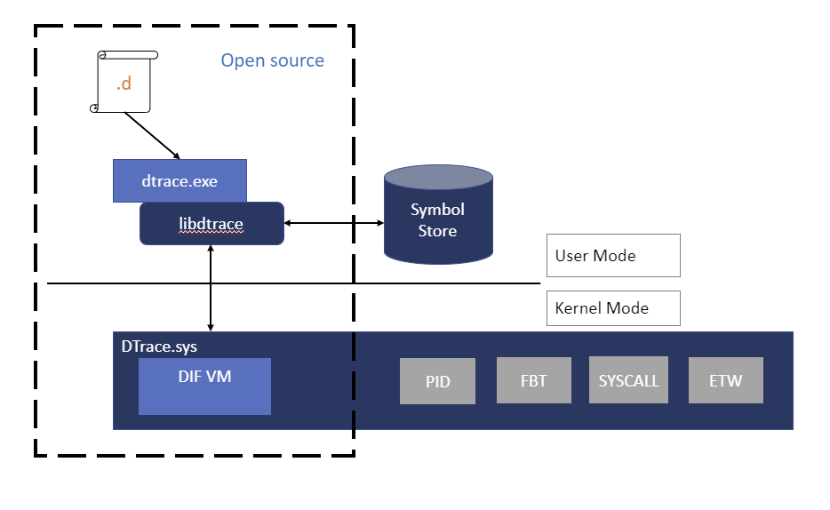

# DTrace on Windows

DTrace (DTrace.exe) is a command-line tool that displays system information and events. DTrace is an open source tracing platform ported to windows. DTrace was originally developed for the Solaris operating system.  It provides dynamic instrumentation of both user/kernel functions, the ability to script using the D-language, speculative tracing. In addition, DTrace has Windows OS specific extensions like ETW instrumentation, ETW event generation, system call probes and live dump capture capabilities.  

> [!NOTE]
> DTrace is supported in the Insider builds of Windows after version 18980 and Windows Server Insider Preview Build 18975.

The DTrace on Windows Github site is located here:

[https://github.com/microsoft/DTrace-on-Windows](https://github.com/microsoft/DTrace-on-Windows)

## Open DTrace Information
  
For detailed information about DTrace see the [OpenDTrace Specification version 1.0](https://www.cl.cam.ac.uk/techreports/UCAM-CL-TR-924.pdf) at the University Of Cambridge.

The primary GitHub site is located at [https://github.com/opendtrace/](https://github.com/opendtrace/).

A set of useful scripts is available at [https://github.com/opendtrace/toolkit](https://github.com/opendtrace/toolkit).

A number of DTrace books are available, such as:

*DTrace: Dynamic Tracing in Oracle Solaris, Mac OS X and FreeBSD* by Brendan Gregg and Jim Mauro

*Solaris Performance and Tools: DTrace and MDB Techniques for Solaris 10 and OpenSolaris*
by Richard McDougall, Jim Mauro and Brendan Gregg

## Providing feedback on Windows DTrace

Use the feedback hub to request new features or to report any problems or bugs with Windows DTrace.

1. Launch the feedback hub. Go to search, enter the word *feedback*, and then select **Feedback Hub**.
2. Select either *Suggest a feature* or *Report a problem*.
3. Provide a detailed, specific description of the issue or suggestion.

## DTrace Windows Extensions

The following are some of the providers available on Windows and what they instrument.

- syscall – NTOS system calls

- fbt (Function Boundary Tracing) – Kernel function entry and returns

- pid (Process ID) – User-mode process tracing. Like kernel-mode FBT, but also allowing the instrumentation of arbitrary function offsets.

- etw (Event Tracing for Windows) – Allows probes to be defined for ETW This provider helps to leverage existing operating system instrumentation in DTrace.

### SYSCALL

SYSCALL provides a pair of probes for each system call: an entry probe that fires before the system call is entered, and a return probe that fires after the system call has completed but before control has transferred back to user-level. For all SYSCALL probes, the function name is set to be the name of the instrumented system call and the module name is the module in which the function exists. The names of the system calls as provided by the SYSCALL provider may be found by typing the command `dtrace.exe -l -P syscall` from the command prompt. Note that the probe name is lower case syscall. The command `dtrace -ln syscall:::` will also list all the probes and their parameters available from the syscall provider.

```dtrace
C:\> dtrace -ln syscall:::
  ID   PROVIDER            MODULE                          FUNCTION NAME
    6    syscall                                 NtWaitHighEventPair entry
    7    syscall                                 NtWaitHighEventPair return
    8    syscall                       NtRegisterThreadTerminatePort entry
    9    syscall                       NtRegisterThreadTerminatePort return
...
```

Note that not all screen output is shown in these examples. "..." is used to represent truncated output.

To scroll through the output, pipe out to the *more* command like this:

`dtrace -ln syscall:::|more`

Add the v option to display more information about the available syscall probes.

```dtrace
C:\> dtrace -lvn syscall:::
...

  942    syscall                                    NtSaveMergedKeys entry

        Probe Description Attributes
                Identifier Names: Private
                Data Semantics:   Private
                Dependency Class: ISA

        Argument Attributes
                Identifier Names: Private
                Data Semantics:   Private
                Dependency Class: ISA

        Argument Types
                args[0]: HANDLE
                args[1]: HANDLE
                args[2]: HANDLE
...
```

### ETW

 DTrace includes support for existing manifested/tracelogged ETW probes. You can instrument, filter and parse ETW events synchronously at the time of event firing. In addition, DTrace can be used to combine various events/system states to provide a consolidated output stream to help debug complex error situations.  

The command `dtrace -ln etw:::` will list all the probes and their parameters available from the syscall provider.

```dtrace
  C:\> dtrace -ln etw:::
  ID   PROVIDER            MODULE                          FUNCTION NAME
  944        etw 048dc470-37c1-52a8-565a-54cb27be37ec           0xff_0xffffffffffffffff generic_event
  945        etw aab97afe-deaf-5882-1e3b-d7210f059dc1           0xff_0xffffffffffffffff generic_event
  946        etw b0f40491-9ea6-5fd5-ccb1-0ec63be8b674           0xff_0xffffffffffffffff generic_event
  947        etw 4ee869fa-9954-4b90-9a62-308c74f99d32           0xff_0xffffffffffffffff generic_event
  ...
  ```

For more information, see [DTrace ETW](dtrace-etw.md).

### Function Boundary Tracing (FBT)

The Function Boundary Tracing (FBT) provider provides probes associated with the entry to and return from most functions in the Windows kernel. The function is the fundamental unit of program text. Similar to other DTrace providers, FBT has no probe effect when it is not explicitly enabled. When enabled, FBT only induces a probe effect in probed functions. FBT has been implemented on x86 and x64 platforms.

For each instruction set, there are a small number of functions that do not call other functions and are highly optimized by the compiler (so-called leaf functions) that cannot be instrumented by FBT. Probes for these functions are not present in DTrace.

The command `dtrace -ln fbt:nt::` will list all the probes and their parameters available for the nt module. Use the debugger [lm (List Loaded Modules)](../debugger/lm--list-loaded-modules-.md) command to list all available modules.

```dtrace
C:\>dtrace -ln "fbt:nt::"
   ID   PROVIDER            MODULE                          FUNCTION NAME
 3336        fbt                nt                PiDqActionDataFree entry
 3337        fbt                nt                PiDqActionDataFree return
 3338        fbt                nt PiDqActionDataGetRequestedProperties entry
 3339        fbt                nt PiDqActionDataGetRequestedProperties return
 3340        fbt                nt _CmGetMatchingFilteredDeviceInterfaceList entry
...
```

> [!NOTE]
> As there are thousands of calls available in nt, it would not be a good idea to leave the function name empty when running a DTrace command that logs data. The recommended approach to avoid a possible performance impact is to specify at least part of the function name, such as `fbt:nt:*Timer*:entry`.

### PID

The DTrace PID provider allows you to trace the internal execution of user-mode processes such as a web browser or a database. You can also attach DTrace at the time of process launch so as to debug process start-up issues. As part of the PID definition, you specify the functions defined in the process and specific offsets (or all offset using wildcard *) within the function. PID provider requires the binary to be launched or running at the time of script execution.

This example command displays information about a specific call in the PID associated with notepad.exe. Use the debugger [lm (List Loaded Modules)](../debugger/lm--list-loaded-modules-.md) command to list all available modules.

```dtrace
C:\Windows\system32>dtrace -ln "pid$target:ntdll:RtlAllocateHeap:entry" -c notepad.exe
   ID   PROVIDER            MODULE                          FUNCTION NAME
 5102    pid6100             ntdll                   RtlAllocateHeap entry
```

## DTrace Windows architecture

Users interact with DTrace through the DTrace command, which serves as a front-end to the DTrace engine. D scripts get compiled to an intermediate format (DIF) in user-space and sent to the DTrace kernel component for execution, sometimes called as the DIF Virtual Machine. This runs in the dtrace.sys driver.

Traceext.sys (trace extension) is a Windows kernel extension driver, which allows Windows to expose functionality that DTrace relies on to provide tracing. The Windows kernel provides callouts during stackwalk or memory accesses which are then implemented by the trace extension.



## Installing DTrace under Windows

1. Check that you are running a supported version of Windows. The current download of DTrace is supported in the Insider builds of 20H1 Windows after version 18980 and Windows Server Insider Preview Build 18975. *Installing this version of DTrace on older versions of Windows can lead to system instability and is not recommended.*

   The archived version of DTrace for 19H1 is available at [Archived Download DTrace on Windows](https://www.microsoft.com/download/58091). Note that this version of DTrace is no longer supported.

2. Download the MSI installation file ([Download DTrace on Windows](https://www.microsoft.com/download/details.aspx?id=100441)) from the Microsoft Download Center.

3. Select the Complete install.

    > [!IMPORTANT]
    > Before using bcdedit to change boot information you may need to temporarily suspend Windows security features such as Patchguard, BitLocker and Secure Boot on the test PC.
    > Re-enable these security features when testing is complete and appropriately manage the test PC, when the security features are disabled.

4. Enable DTrace on the machine using the bcdedit command.  

```cmd
bcdedit /set dtrace ON
```

When you update to a new Windows Insider build you will need to set the dtrace bcdedit option again.

> [!NOTE]
> If you are using BitLocker, disable it when making changes to the boot values. If you do not do this you may be prompted for the BitLocker recovery key. One way to recover from this situation is to boot to the recovery console and restore the bcdedit value, `bcdedit /set {default} dtrace on`. If an OS update has removed the value and you added it in, to recover the OS use bcdedit to remove the value, `bcdedit /deletevalue {default} dtrace`. Then disable BitLocker and re-enable dtrace, `bcdedit /set dtrace ON`.

Configure VSM (Virtual Secure Mode) on the machine for enabling kernel function boundary tracing (FBT) by setting "HKEY_LOCAL_MACHINE\SYSTEM\CurrentControlSet\Control\DeviceGuard\EnableVirtualizationBasedSecurity" set to 1 to enable VSM and the Secure Kernel.

To do this, use the REG Add command, like this:

```cmd
REG ADD HKEY_LOCAL_MACHINE\SYSTEM\CurrentControlSet\Control\DeviceGuard\ /v EnableVirtualizationBasedSecurity /t REG_DWORD /d 1
```

Some DTrace command use Windows symbols. To use Windows symbols create a symbols directory and set the symbols path:  

```cmd
mkdir c:\symbols
set _NT_SYMBOL_PATH=srv*C:\symbols*https://msdl.microsoft.com/download/symbols
```

For more information about symbols paths, see [Symbol path for Windows debuggers](../debugger/symbol-path.md).

### Using DTrace inside of a Virtual Machine

If running DTrace on a VM, turn on nested Virtualization on the machine supporting the VM, when the VM is stopped, using the following PowerShell command. Provide the `<VMName>` for the VM that you are running DTrace in. Open a PowerShell Windows as an Administrator.

```powershell
Set-VMProcessor -VMName <VMName> -ExposeVirtualizationExtensions $true
```

Reboot the PC supporting the VM.

### Validating the DTrace installation

Use the -l option to list the active probes. If DTrace is active many probes should be listed for etw and system events.

Open a Windows command prompt as an administrator to enter DTrace commands.

```dtrace
C:\> dtrace -l

...

  179    syscall                                 NtLockVirtualMemory return
  180    syscall                               NtDeviceIoControlFile entry
  181    syscall                               NtDeviceIoControlFile return
  182    syscall                                 NtCreateUserProcess entry
  183    syscall                                 NtCreateUserProcess return
  184    syscall                                      NtQuerySection entry
  185    syscall                                      NtQuerySection return

...

 3161        etw 222962ab-6180-4b88-a825-346b75f2a24a           0xff_0xffffffffffffffff generic_event
 3162        etw 3ac66736-cc59-4cff-8115-8df50e39816b           0xff_0xffffffffffffffff generic_event
 3163        etw 42695762-ea50-497a-9068-5cbbb35e0b95           0xff_0xffffffffffffffff generic_event
 3164        etw 3beef58a-6e0f-445d-b2a4-37ab737bd47e           0xff_0xffffffffffffffff generic_event

...

```

If only these three probes are listed, there is an issue with the DTrace.sys driver being loaded.

```dtrace
C:\>  dtrace -l
   ID   PROVIDER            MODULE                          FUNCTION NAME
    1     dtrace                                                     BEGIN
    2     dtrace                                                     END
    3     dtrace                                                     ERROR
```

## Getting started with DTrace - One line commands

Get started by running these commands from an administrator command prompt.

This command displays a syscall summary by program for 5 seconds. The tick-5sec parameter specifies the time period. The exit(0); causes the command to exit upon completion back to the command prompt. The output is specified using `[pid,execname] = count();` This displays the Process ID (PID), the executable name and a count for the last 5 seconds.

``` dtrace
C:\> dtrace -Fn "tick-5sec {exit(0);} syscall:::entry{ @num[pid,execname] = count();} "  
dtrace: description 'tick-5sec ' matched 471 probes
CPU FUNCTION
  0 | :tick-5sec

     1792  svchost.exe                                                       4
     4684  explorer.exe                                                      4
     4916  dllhost.exe                                                       4
     6192  svchost.exe                                                       4
     6644  SecurityHealth                                                    4
       92  TrustedInstall                                                    5
      504  csrss.exe                                                         5
      696  svchost.exe                                                       6
...
```

This command summarizes timer set/cancel calls for 3 seconds:  

``` dtrace
C:\> dtrace -Fn "tick-3sec {exit(0);} syscall::Nt*Timer*:entry { @[probefunc, execname, pid] = count();}"
dtrace: description 'tick-3sec ' matched 14 probes
CPU FUNCTION
  0 | :tick-3sec

  NtCreateTimer                                       WmiPrvSE.exe                                            948                1
  NtCreateTimer                                       svchost.exe                                             564                1
  NtCreateTimer                                       svchost.exe                                            1276                1
  NtSetTimer2                                         svchost.exe                                            1076                1
  NtSetTimer2                                         svchost.exe                                            7080                1
  NtSetTimerEx                                        WmiPrvSE.exe                                            948                1
...  
```

### One line commands that use symbols

These command take advantage of Windows symbols and require that the symbol path is set as discussed in the installation section.
As mentioned earlier in installation, create a directory and set the symbol path using these commands.

```cmd
C:\> mkdir c:\symbols
C:\> set _NT_SYMBOL_PATH=srv*C:\symbols*https://msdl.microsoft.com/download/symbols
```

This example command displays the top NT functions.

```dtrace
C:\> dtrace -n "fbt:nt:*Timer*:entry { @k[probefunc] = count(); } tick-5s { trunc(@k, 10);printa(@k); exit(0); }"
dtrace: description 'fbt:nt:*Timer*:entry ' matched 340 probes
CPU     ID                    FUNCTION:NAME
  0  22362                         :tick-5s
  KeCancelTimer                                                   712
  KeSetTimer2                                                     714
  HalpTimerClearProblem                                           908
  ExpSetTimerObject                                               935
  NtSetTimerEx                                                    935
  KeSetTimer                                                     1139
  KeSetCoalescableTimer                                          3159
  KeResumeClockTimerFromIdle                                    11767
  xHalTimerOnlyClockInterruptPending                            22819
  xHalTimerQueryAndResetRtcErrors                               22819
```

This command dumps the SystemProcess kernel structure.

```dtrace
C:\> dtrace -n "BEGIN {print(*(struct nt`_EPROCESS *) nt`PsInitialSystemProcess);exit(0);}"

...

   uint64_t ParentSecurityDomain = 0
    void *CoverageSamplerContext = 0
    void *MmHotPatchContext = 0
    union _PS_PROCESS_CONCURRENCY_COUNT ExpectedConcurrencyCount = {
         Fraction :20 = 0
         Count :12 = 0
        uint32_t AllFields = 0
    }
    struct _KAFFINITY_EX IdealProcessorSets = {
        uint16_t Count = 0x1
        uint16_t Size = 0x20
        uint32_t Reserved = 0
        uint64_t [32] Bitmap = [ 0x1, 0, 0, 0, 0, 0, 0, 0, 0, 0, 0, 0, 0, 0, 0, 0, 0, 0, 0, 0, 0, 0, 0, 0, 0, 0, 0, 0, 0, 0, 0, 0 ]
    }
}
```

This command displays the top kernel stack for the past 10 seconds.

``` dtrace
C:\> dtrace -qn "profile-997hz { @[stack()] = count(); } tick-10sec { trunc(@,5); printa(@); exit(0);}"

              nt`KiDispatchInterruptContinue
              nt`KiDpcInterrupt+0x318
              nt`KiSwapThread+0x1054
              nt`KiCommitThreadWait+0x153
              nt`KeRemoveQueueEx+0x263
              nt`IoRemoveIoCompletion+0x54
              nt`NtWaitForWorkViaWorkerFactory+0x284
              nt`KiSystemServiceCopyEnd+0x35
               14

              nt`KiDispatchInterruptContinue
              nt`KiDpcInterrupt+0x318
...
```

This command displays the top modules invoked by notepad.exe during launch. The -c option runs specified command (notepad.exe) and exits upon its completion.

``` dtrace
C:\> dtrace -qn "pid$target:::entry { @k[probemod] = count();} tick-10s{printa(@k); exit(0);}" -c notepad.exe

  gdi32full                                                         5
  msvcp_win                                                         6
  combase                                                           7
  notepad                                                           9
  ADVAPI32                                                         10
  GDI32                                                            11
  SHELL32                                                          11
  USER32                                                           21
  win32u                                                          345
  KERNELBASE                                                     3727
  msvcrt                                                         7749
  KERNEL32                                                       9883
  RPCRT4                                                        11710
  ntdll                                                        383445

```

## See also

[DTrace Windows Programming](dtrace-programming.md)

[DTrace ETW](dtrace-etw.md)

[DTrace Live Dump](dtrace-live-dump.md)

[DTrace Windows Code Samples](dtrace-code-samples.md)
