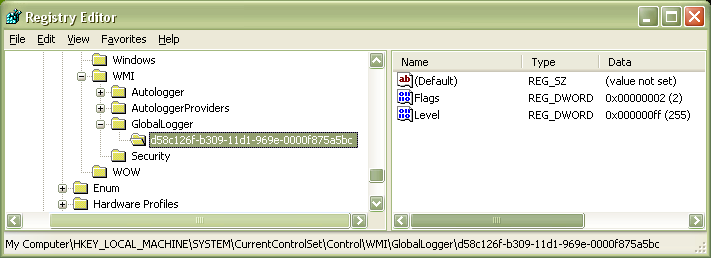

# Example: Global Logger Provider

The following screen shot shows the **GlobalLogger** subkey, which contains entries that configure the [Global Logger trace session](global-logger-trace-session.md). Under the **GlobalLogger** subkey is a **ControlGUID** subkey that represents a trace provider that logs to the Global Logger trace session. The **ControlGUID** subkey is selected, and the entries in the subkey appear in the right pane.

In this example, the **ControlGUID** subkey represents the TraceDrv sample driver. The subkey is named for the Tracedrv [control GUID](control-guid.md), d58c126f-b309-11d1-969e-0000f875a5bc. Because the trace session is running on Windows XP, the GUID is not enclosed in braces.

The [TraceDrv](http://go.microsoft.com/fwlink/p/?LinkId=617726) sample driver is available in the [Windows driver samples](http://go.microsoft.com/fwlink/p/?LinkId=616507) repository available on GitHub.

This **ControlGUID** subkey contains a **Flags** entry and a **Level** entry. These entries are optional and their value is defined by the provider.

 

 

