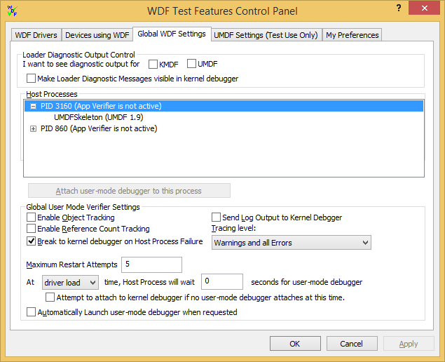

# Global WDF Settings Tab

This topic provides detailed information about WDF Verifier's **Global WDF Settings** page. This page presents global (system-wide) WDF verification options, and shows UMDF host processes with hosted drivers.

At the top, you'll see the **Loader Diagnostic Output Control** box. Here, you can specify whether you want to see diagnostic messages from the KMDF and UMDF 2.0 loaders. These are global options that set the diagnostic (DbgPrint enable) flags for the respective loaders.

You can also choose if you want to see loader diagnostic messages in the kernel debugger.

For instance, if you debug UMDF drivers with a user-mode debugger, enable the loader output for UMDF. If you are debugging a UMDF driver using a kernel debugger, also select **Make Loader Diagnostic Messages visible in kernel debugger**.

The **Host Processes** box shows all host processes and their Process IDs, as well as whether Application Verifier is active for each process. You can expand or collapse the list of drivers hosted in each process. If you have specified a user mode debugger on the [My Preferences](my-preferences-tab.md) page, you can also highlight a driver or process and then click the **Attach user-mode debugger to this process** button.

Finally, the **Global User Mode Verifier Settings** box contains debug options that affect all UMDF drivers on the system. For more info on these settings, see [Using UMDF Verifier](https://msdn.microsoft.com/library/windows/hardware/dn265597).

When you make changes to the UMDF Verifier settings, these changes affect subsequently loaded devices. If your device is already running, you must disable and re-enable it. WDF Verifier disables and re-enables the device for you if you change the UMDF trace level or select the **Send Log Output to Kernel Debugger** option. This option does not work if you select **Take no action...** in the **When the machine must be rebooted...** dropdown list on the [My Preferences](my-preferences-tab.md) page.

**To set up automatic launching of the user-mode debugger**

1.  Ensure that you have specified a user-mode debugger on the [My Preferences](my-preferences-tab.md) page.
2.  Specify a delay at driver load or start time for new host processes. Your delay should be a minimum of two seconds.
3.  Select **Automatically launch user-mode debugger when requested**, and click **Apply**.
4.  Leave WDF Verifier running. When a new host process starts, WDF Verifier attaches your preferred debugger to the process.
5.  If your driver is already running, change the tracing level or select **Send Log Output to Kernel Debugger** and click **Apply**. Doing so stops and restarts all UMDF processes unless you have turned off the auto-restart feature (you can restore it on the [My Preferences](my-preferences-tab.md) page).

 

 

