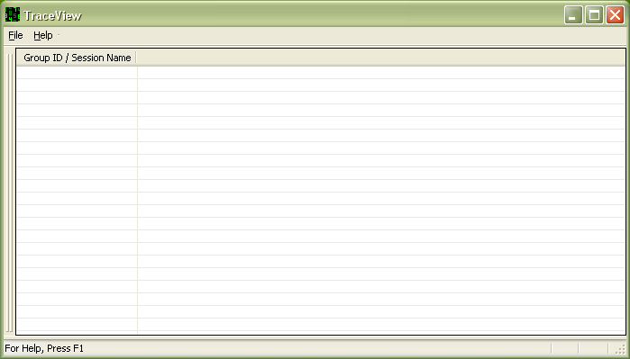

# Initial View

When you open the TraceView window, the [Trace Session List](trace-session-list.md) appears, but it is empty. The following screen shot shows an empty TraceView window.

When you see this view, you can right-click in any row or use the **File** menu to [create a new trace session](creating-a-trace-session.md), [display a trace log](displaying-a-trace-log.md), [open a workspace](opening-a-workspace.md), or [delete a workspace](deleting-a-workspace.md).

 

 

