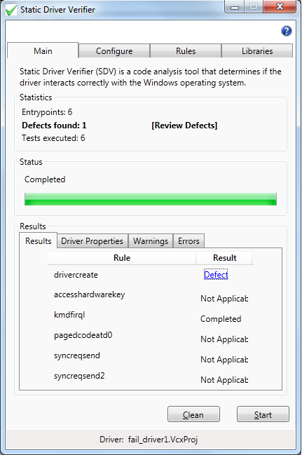

# Interpreting Static Driver Verifier Results

When you launch Static Driver Verifier from Visual Studio and run an analysis of your driver, the results appear in the **Results** summary on the Main tab.

### Statistics

**Entrypoints** Reports the number of entry points found in the driver source code. Entry points are the driver-supplied callback or dispatch routines. You define the entry points using function role type declarations. To perform analysis, SDV must fiind at least one entry point. For more information see, [Using Function Role Type Declarations](using-function-role-type-declarations.md).

**Defects found** Reports the number of defects found during the analysis. A defect is a violation of a DDI Compliance Rule.

**Tests executed** Reports the number of rules that were tested during the analysis. These are the rules you select on the **Rules** tab.

### Status

Reports the status of the analysis. When completed, you can review results found.

### Results

**Completed (Rule)**  
SDV tested the driver for violation of the rule but it could not prove any violation of the rule.

This result does not mean that the driver is error free. It means only that SDV could not prove that it violated the rule in the verification pass.

**Defect**  
If SDV reported one or more defects, click the **Defect** link to [use the Static Driver Verifier Report](using-the-static-driver-verifier-report.md) to view the trace of the error.

**Not Applicable**  
SDV tested the driver for violation of the rule, but the driver did not support the entry point that is required for the analysis or the driver did not call the function that the rule monitors.

If the rule monitors a particular argument in a function call (typically, a pointer to a resource) and the driver does not call the function or does not reference that argument, the rule does not apply to the driver.

If the driver does specify the entry points and it does call the functions that the rule monitors, this result might indicate that SDV did not find or did not correctly interpret the entry point. To confirm that this situation occurred, examine and, if necessary, correct the [Sdv-map.h](sdv-map-h.md) file. For information about this procedure, see [Scanning the Driver](scanning-the-driver.md).

For more information about each rule, see the [Static Driver Verifier Rules](https://msdn.microsoft.com/library/windows/hardware/ff551714) reference.

To examine the driver further, run a verification using different rules.

**Timeouts**  
SDV stopped verifying the rule because it exceeded its time limit for verifying each rule. The time limit is set in the [Static Driver Verifier Options File](static-driver-verifier-options-file.md), or in the Maximum time field on the **Configuration** tab.

A timeout is considered to be an inconclusive result. It does not indicate a driver error. If SDV reports a timeout, extend the time permitted for the verification (the **SDV\_SlamConfig\_Timeout** value in the sdv-default.xmlfile) and run the verification again.

**Completed (Property)**  
SDV ran the driver property rule for the specified driver. A driver property rule checks for driver capabilities or supported features and is a prelude for further analysis. For example, the driver property rule, **CancelRoutine**, checks to see if the WDM driver has registered a [*Cancel*](https://msdn.microsoft.com/library/windows/hardware/ff540742) routine. If a *Cancel* routine is not detected, specific WDM rules do not apply. This means that the driver property was not satisfied.

**Satisfied (Property)**  
SDV ran the driver property rule for the specified driver. A driver property rule checks for driver capabilities or supported features and is a prelude for further analysis. For example, the driver property rule, **CancelRoutine**, checks to see if the WDM driver has registered a [*Cancel*](https://msdn.microsoft.com/library/windows/hardware/ff540742) routine. If a *Cancel* routine is detected, specific WDM rules apply. This means that the driver property was satisfied

**Spaceouts**  
The number of rules that SDV stopped verifying because it exceeded the memory limit for verifying the rule. The memory limit is set in the [Static Driver Verifier Options File](static-driver-verifier-options-file.md), sdv-default.xml.

A spaceout is considered to be an inconclusive result. If SDV reports a spaceout, extend the space allotted for the verification (the **SDV\_SlamConfig\_Spaceout** value in the sdv-default.xml file) and run the verification again.

**Other**  

The number of times that SDV encountered an internal error from which it could not recover.  See the [Static Driver Verifier Error Messages](https://docs.microsoft.com/windows-hardware/drivers/devtest/static-driver-verifier-error-messages) page for more information on errors and debugging.

 

 

