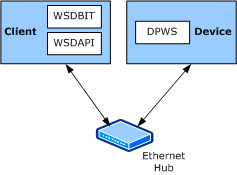

# Introduction to WSDBIT

The Web Services for Devices (WSD) API (WSDAPI) enables the following types of message exchanges:

-   Discovering a DPWS device.

-   Describing a DPWS device. This is referred to as a *metadata exchange*.

-   Sending service-specific messages, along with binary attachments, to and from a DPWS service.

-   Subscribing to and receiving events from a DPWS service.

As shown in the following figure, the WSDAPI Basic Interoperability Tool (WSDBIT) uses WSDAPI to send and receive DPWS messages. WSDBIT can be used to test the interoperability between WSDAPI running in a client and a DPWS stack running in a device.

The [interoperability scenarios](client-scenarios-for-wsdbit.md) are intended to verify the message format along with the protocols that are used in the preceding message exchanges. The scenarios are defined from the client perspective and are organized into the following categories:

-   *Device and Service inspection* tests and verifies DPWS device discovery and metadata exchange.

-   *Simple and Advanced Control* tests and verifies service-specific messages.

-   *Attachments* tests and verifies message attachments, as defined in the [SOAP Message Transmission Optimization Mechanism (MTOM)](http://go.microsoft.com/fwlink/p/?linkid=81254) specification.

-   *Eventing* tests and verifies [Web Services Eventing](http://go.microsoft.com/fwlink/p/?linkid=81245).

-   *Secure communication* includes elements of all the preceding scenarios.

Depending on the specific needs of the interoperability testing, you can implement the device, client, or both.

You can also selectively implement sections of the test cases. For example, you can implement only the [Device and Service inspection](device-and-service-inspection-scenarios.md) and the [Simple and Advanced Control](device-control-scenarios.md) interoperability test cases.

**Note**   At a minimum, you must implement the Device and Service inspection interoperability test cases because other test cases require it.

 

 

 

