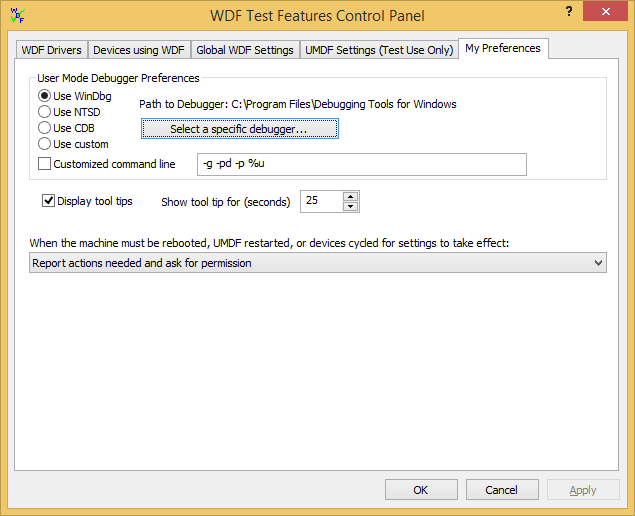
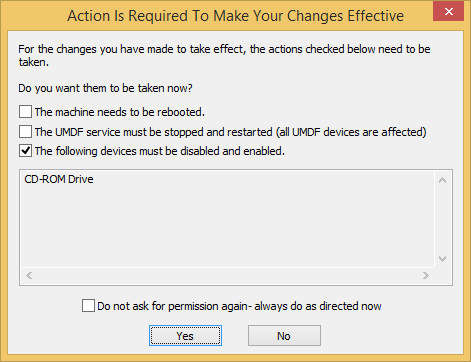

# My Preferences Tab


This topic describes WDF Verifier's **My Preferences** page. On this page, you can set preferences for some of the control panel’s features.

At the top of the **My Preferences** tab, you'll find the **User Mode Debugger Preferences** box.



The debuggers listed on this page are part of the **Debugging Tools for Windows**. To download this package, select the **Debugging Tools for Windows** box when you install the [Windows SDK for Windows 8.1](https://go.microsoft.com/fwlink/p/?LinkId=733744). Alternatively, choose a custom (non-Microsoft) debugger by selecting **Use custom**.

Start by clicking the **Select a specific debugger** button and browsing to the user mode debugger you want to use. The **Debugging Tools for Windows** installs by default to C:\\Program Files (x86)\\Windows Kits\\8.1\\Debuggers\\*&lt;x86 | x64&gt;*. The list of debuggers is grayed out if **Path to Debugger** does not specify a valid path.

Your debugger preference is used in two cases:

-   WDF Verifier automatically attempts to connect the user-mode debugger when a new driver host process starts if you have selected the **Automatically launch user-mode debugger when requested** box on the [Global WDF Settings](global-wdf-settings-tab.md) page.
-   When you click the **Attach user mode debugger to this process** button (also on the [Global WDF Settings](global-wdf-settings-tab.md) tab), WDF Verifier attempts to connect the user-mode debugger to the specified host process.

If you select the **Customized command line** box, WDF Verifier passes the specified string to whatever debugger you have chosen.

The default command line for the Debugging Tools for Windows debuggers bypasses the initial break, attaches to a specific PID, and instructs the debugger to detach from the process and leave it running when you close the debugger. For a complete list of command line options for Microsoft-provided debuggers, see [Command-Line Options](https://msdn.microsoft.com/library/windows/hardware/ff539174).

You can also change the default settings. For example:

```
-g -pd -server npipe:pipe=wudf_%u -p %u
```

The above command line generates a unique server name for each host instance based on the PID of the host process. You could then use the server name for remote user-mode debugging.

If you specify a custom debugger (one not in the Debugging Tools for Windows package), you must provide a custom command line for it.

On this screen, you can also select if you want tool tips displayed and if so, for how long.

Finally, you can choose what you want WDF Verifier to do when the machine must be rebooted, UMDF host process(es) restarted, or devices cycled for settings to take effect.

If intervention is needed, and you have selected **Report actions needed and ask for permission**, the following dialog box appears:



The selected items are actions required to make all changes effective. You cannot toggle the selections.

The selections are shown as a guide in case you want to click **No** and perform the steps manually. The order in which the actions appear is the order in which you should perform them.

If you select the **Do not ask for permission again...** box, your choice persists unless you change the reboot setting on the My Preferences tab.

 

 


