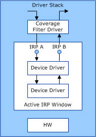

# Overview of the Driver Coverage Toolkit


**Note**  The Driver Coverage Toolkit is no longer needed in Windows 10 and the installer is no longer included in the WDK. To perform tasks described here in Windows 10, instead use [Driver Verifier](driver-verifier.md) and [IRP Logging](irp-logging.md).

 

The Driver Coverage toolkit monitor and report on the I/O request packets (IRPs) that enter or leave the driver stack for one or more specified devices. The coverage data is collected by the [Driver Coverage filter driver](driver-coverage-filter-driver.md) for these devices. The Driver Coverage tool is used to enable or disable IRP coverage on specified devices, as well as produce reports from the coverage data.

The Driver Coverage toolkit collects and reports IRP coverage data based on three metrics:

<span id="Major__MJ__IRP_Function_Codes"></span><span id="major__mj__irp_function_codes"></span><span id="MAJOR__MJ__IRP_FUNCTION_CODES"></span>Major (MJ) IRP Function Codes  
The count of the MJ function codes of IRPs that were active within a driver stack for a device. The Driver Coverage toolkit collects data for 12 MJ function codes. For more information about these function codes, see [IRP Major Function Codes](https://msdn.microsoft.com/library/windows/hardware/ff550710).

<span id="Major__MJ__and_Minor__MN__IRP_Function_Codes"></span><span id="major__mj__and_minor__mn__irp_function_codes"></span><span id="MAJOR__MJ__AND_MINOR__MN__IRP_FUNCTION_CODES"></span>Major (MJ) and Minor (MN) IRP Function Codes  
The count of the MJ IRP function codes, along with their subordinate MN function codes, of IRPs that were active within a driver stack for a device. The Driver Coverage toolkit collects data for 52 MJ and MN function codes.

<span id="IRP_Pairs"></span><span id="irp_pairs"></span><span id="IRP_PAIRS"></span>IRP Pairs  
The count of the MJ and MJ/MN IRP function codes that were concurrently active within a driver stack for a device. This count reflects the number of times separate IRPs entered or left the driver stack at the same time. The Driver Coverage toolkit collects data for 1099 MJ and MN function code pairs.

For more information about the IRP function codes, see [IRP Function Codes](https://msdn.microsoft.com/library/windows/hardware/ff550706).

### <span id="irp_coverage_data"></span><span id="IRP_COVERAGE_DATA"></span>IRP Coverage Data

Whenever an IRP enters or leaves the driver stack for a device that is monitored by the [Driver Coverage filter driver](driver-coverage-filter-driver.md), the filter driver increments its counters that are related to the IRP. The Driver Coverage filter driver monitors active IRPs within the driver stack, regardless of how the IRPs originated. As a result, the monitoring window for the filter driver's IRP covers all drivers in the stack that are layered immediately below the filter driver.

The [Driver Coverage filter driver](driver-coverage-filter-driver.md) increments its IRP counters when it first monitors the IRP within the driver stack. If the IRP originated outside of the driver stack, the Driver Coverage filter driver increments its counters for the IRP at the time the IRP entered the stack. If the IRP originated from a driver within the driver stack, the filter driver increments its counters when the IRP leaves the driver stack.

The following figure shows an example of IRP traffic within a driver stack for a device.



In this example, the [Driver Coverage filter driver](driver-coverage-filter-driver.md) monitors the following IRPs:

-   IRP A, which has just entered the driver stack.

-   IRP B, which is about to leave the driver stack.

The Driver Coverage filter driver increments its MN and MN/MJ function code counters for both IRPs. Also, because both IRPs A and B are active within the driver stack, the Driver Coverage filter driver increments its IRP pair counter for the tuple {IRP A, IRP B}.

### <span id="irp_pair_coverage_data"></span><span id="IRP_PAIR_COVERAGE_DATA"></span>IRP Pair Coverage Data

IRP pair coverage data is based on IRP concurrency, in which multiple IRPs are active within the driver stack at the same time. This data can help identify test coverage holes during driver verification, and helps you to improve your tests to address driver concurrency issues.

The Driver Coverage toolkit monitors and reports on 1099 MJ and MN function code pairs.

### <span id="sample_irp_coverage_report"></span><span id="SAMPLE_IRP_COVERAGE_REPORT"></span>Sample IRP Coverage Report

The following command can produce an IRP coverage report similar to the next example:

```
Getting coverage data
 Data source
 Source Type:  Driver
 Source Name:  \\.\DrvcovControl1
 Device
   Friendly Name : USB Mass Storage Device 
   Class Name    : USB 
   Device ID     : USB\VID_04E8&PID_0100\2151151132436 
   Device #      : 1 
 Devnode #     : 5088 

|--------------------------------------------------------|
| MJ & MN Device irp coverage                            |
|--------------------------------------------------------|
| IRPS covered     19                      |  # of times |
|--------------------------------------------------------|
| Unknown                                  |           5 | 
| PNP\QUERY_RESOURCE_REQUIREMENTS          |           3 | 
| PNP\FILTER_RESOURCE_REQUIREMENTS         |           3 | 
| PNP\START_DEVICE                         |           8 | 
| DEVICE_CONTROL                           |         293 | 
| READ                                     |        2543 | 
| PNP\QUERY_CAPABILITIES                   |           3 | 
| PNP\QUERY_PNP_DEVICE_STATE               |           7 | 
| CREATE                                   |          44 | 
| CLEANUP                                  |          45 | 
| CLOSE                                    |          43 | 
| WRITE                                    |        2488 | 
| WMI\REGINFO_EX                           |           5 | 
| WMI\REGINFO                              |           5 | 
| FLUSH_BUFFERS                            |        1491 | 
| PNP\QUERY_DEVICE_RELATIONS\Target        |          23 | 
| WMI\QUERY_ALL_DATA                       |           6 | 
| POWER\QUERY_POWER\SYSTEM                 |           2 | 
| SHUTDOWN                                 |           2 | 
|--------------------------------------------------------|
| IRPS NOT covered     33                  |             |
|--------------------------------------------------------|
| INTERNAL_DEVICE_CONTROL                  |             | 
| POWER\WAIT_WAKE                          |             | 
| POWER\SET_POWER\SYSTEM                   |             | 
| POWER\SET_POWER\DEVICE                   |             | 
| POWER\QUERY_POWER\DEVICE                 |             | 
| WMI\QUERY_SINGLE_INSTANCE                |             | 
| WMI\CHANGE_SINGLE_INSTANCE               |             | 
| WMI\CHANGE_SINGLE_ITEM                   |             | 
| WMI\ENABLE_EVENTS                        |             | 
| WMI\DISABLE_EVENTS                       |             | 
| WMI\ENABLE_COLLECTION                    |             | 
| WMI\DISABLE_COLLECTION                   |             | 
| WMI\EXECUTE_METHOD                       |             | 
| PNP\QUERY_REMOVE_DEVICE                  |             | 
| PNP\REMOVE_DEVICE                        |             | 
| PNP\CANCEL_REMOVE_DEVICE                 |             | 
| PNP\STOP_DEVICE                          |             | 
| PNP\QUERY_STOP_DEVICE                    |             | 
| PNP\CANCEL_STOP_DEVICE                   |             | 
| PNP\QUERY_DEVICE_RELATIONS\Bus           |             | 
| PNP\QUERY_DEVICE_RELATIONS\Eject         |             | 
| PNP\QUERY_DEVICE_RELATIONS\Removal       |             | 
| PNP\QUERY_INTERFACE                      |             | 
| PNP\QUERY_RESOURCES                      |             | 
| PNP\QUERY_DEVICE_TEXT                    |             | 
| PNP\READ_CONFIG                          |             | 
| PNP\WRITE_CONFIG                         |             | 
| PNP\EJECT                                |             | 
| PNP\SET_LOCK                             |             | 
| PNP\QUERY_ID                             |             | 
| PNP\QUERY_BUS_INFORMATION                |             | 
| PNP\DEVICE_USAGE_NOTIFICATION            |             | 
| PNP\SURPRISE_REMOVAL                     |             | 
|--------------------------------------------------------|
| Stats                                                  |
|--------------------------------------------------------|
| Total IRP count        :     52                        |
| Covered IRP count      :     19                        |
| NOT Covered IRP count  :     33                        |
| Covered IRP %          :     36.54%                    |
| NOT Covered IRP %      :     63.46%                    |
|--------------------------------------------------------|

|--------------------------------------------------------|
| MJ Device irp coverage                                 |
|--------------------------------------------------------|
| IRPS covered     12                      |  # of times |
|--------------------------------------------------------|
| IRP_MJ_UNKNOWN                           |           1 | 
| IRP_MJ_PNP                               |           6 | 
| IRP_MJ_DEVICE_CONTROL                    |           1 | 
| IRP_MJ_READ                              |           1 | 
| IRP_MJ_CREATE                            |           1 | 
| IRP_MJ_CLEANUP                           |           1 | 
| IRP_MJ_CLOSE                             |           1 | 
| IRP_MJ_WRITE                             |           1 | 
| IRP_MJ_SYSTEM_CONTROL                    |           3 | 
| IRP_MJ_FLUSH_BUFFERS                     |           1 | 
| IRP_MJ_POWER                             |           1 | 
| IRP_MJ_SHUTDOWN                          |           1 | 
|--------------------------------------------------------|
| IRPS NOT covered      1                  |             |
|--------------------------------------------------------|
| IRP_MJ_INTERNAL_DEVICE_CONTROL           |             | 
|--------------------------------------------------------|
| Stats                                                  |
|--------------------------------------------------------|
| Total IRP count        :     13                        |
| Covered IRP count      :     12                        |
| NOT Covered IRP count  :      1                        |
| Covered IRP %          :     92.31%                    |
| NOT Covered IRP %      :      7.69%                    |
|--------------------------------------------------------|


|--------------------------------------------------------|
| MJ & MN Device IRP Concurrency pairs.                  |
|--------------------------------------------------------|
| IRP Pairs covered                     25 |  # of times |
|--------------------------------------------------------|
| CREATE                                   |             | 
| READ                                     |          10 | 
|--------------------------------------------------------|
| CREATE                                   |             | 
| WRITE                                    |           5 | 
|--------------------------------------------------------|
| CREATE                                   |             | 
| DEVICE_CONTROL                           |           4 | 
|--------------------------------------------------------|
| CLOSE                                    |             | 
| READ                                     |          10 | 
|--------------------------------------------------------|
| CLOSE                                    |             | 
| WRITE                                    |           4 | 
|--------------------------------------------------------|
| CLOSE                                    |             | 
| DEVICE_CONTROL                           |           4 | 
|--------------------------------------------------------|
| READ                                     |             | 
| READ                                     |        1513 | 
|--------------------------------------------------------|
| READ                                     |             | 
| WRITE                                    |        1498 | 
|--------------------------------------------------------|
| READ                                     |             | 
| FLUSH_BUFFERS                            |         929 | 
|--------------------------------------------------------|
| READ                                     |             | 
| DEVICE_CONTROL                           |          68 | 
|--------------------------------------------------------|
| READ                                     |             | 
| CLEANUP                                  |          11 | 
|--------------------------------------------------------|
| READ                                     |             | 
| POWER\QUERY_POWER\SYSTEM                 |           1 | 
|--------------------------------------------------------|
| READ                                     |             | 
| WMI\QUERY_ALL_DATA                       |           2 | 
|--------------------------------------------------------|
| READ                                     |             | 
| PNP\QUERY_DEVICE_RELATIONS\Target        |           7 | 
|--------------------------------------------------------|
| READ                                     |             | 
| PNP\QUERY_PNP_DEVICE_STATE               |           1 | 
|--------------------------------------------------------|
| WRITE                                    |             | 
| WRITE                                    |        1448 | 
|--------------------------------------------------------|
| WRITE                                    |             | 
| FLUSH_BUFFERS                            |         852 | 
|--------------------------------------------------------|
| WRITE                                    |             | 
| DEVICE_CONTROL                           |           8 | 
|--------------------------------------------------------|
| WRITE                                    |             | 
| CLEANUP                                  |           4 | 
|--------------------------------------------------------|
| WRITE                                    |             | 
| PNP\QUERY_DEVICE_RELATIONS\Target        |           1 | 
|--------------------------------------------------------|
| WRITE                                    |             | 
| PNP\QUERY_PNP_DEVICE_STATE               |           2 | 
|--------------------------------------------------------|
| FLUSH_BUFFERS                            |             | 
| FLUSH_BUFFERS                            |          27 | 
|--------------------------------------------------------|
| FLUSH_BUFFERS                            |             | 
| DEVICE_CONTROL                           |           1 | 
|--------------------------------------------------------|
| DEVICE_CONTROL                           |             | 
| CLEANUP                                  |           7 | 
|--------------------------------------------------------|
| DEVICE_CONTROL                           |             | 
| PNP\START_DEVICE                         |           2 | 
|--------------------------------------------------------|
|--------------------------------------------------------|
| Stats                                                  |
|--------------------------------------------------------|
| Total IRP pairs                 :        1099          |
| Covered IRP pairs               :          25          |
| NOT Covered IRP pairs           :        1074          |
| Covered IRP pairs %             :           2.27%      |
| NOT Covered IRP pairs %         :          97.73%      |
|--------------------------------------------------------|
```

 

 


